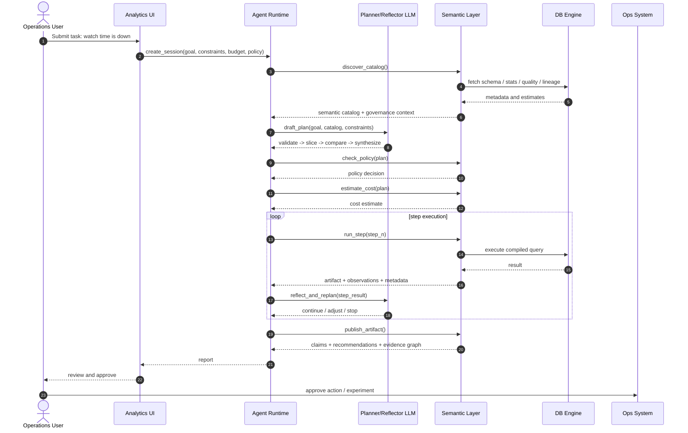

# OmniDB 设计文档

## 1. 执行摘要

OmniDB 是一个面向 Agentic Analytics（代理式数据分析）的系统设计，目前仓库中提供了一个基于 DuckDB 的 MVP，用于验证如何从传统的 `natural language -> SQL -> rows` 交互模式演进出来。

核心判断是：当前很多 LLM 与数据库的集成效果不佳，并不是因为模型“不会写 SQL”，而是因为外围系统没有向模型暴露足够的结构化能力，使其无法稳定地进行规划、反思、工具编排、治理约束感知以及基于证据的推理。在多数系统中，模型只能看到零碎 schema、生成 SQL、拿到原始 rows，然后在缺少语义、质量、成本与可追溯证据的前提下尝试总结结论。

OmniDB 试图提供一种不同的接口：

- 用**有状态的分析会话**替代一次性查询
- 用**语义发现**替代 schema 猜测
- 用**类型化分析步骤**替代任意 prompt-to-SQL
- 用**确定性的证据打包**替代无结构的结果解读
- 通过 **MCP** 对外暴露工具能力，使本地编码 Agent 可以直接调用系统

当前仓库中的 DuckDB MVP 使用一个具体业务场景验证了这套架构：某视频网站最近播放时长下降，需要定位原因并给出策略建议。

本文档同时描述两部分内容：

1. 来自前序讨论的 **目标系统设计**
2. 当前仓库中的 **MVP 实现形态**

目标是为后续扩展 OmniDB 的工程师提供一份完整的技术蓝图，使其能将 OmniDB 从本地设计探针逐步演进为更完整的语义层与 Agent Runtime 平台。

## 2. 问题定义

### 2.1 当前 LLM + 数据库交互模式的问题

大多数 LLM 驱动的数据分析系统仍然依赖一个很窄的执行闭环：

1. 提供 schema 或表文档
2. 让模型生成 SQL
3. 执行 SQL
4. 返回 rows
5. 让模型总结结果

这套方式在简单查询上有效，但一旦进入真正的数据分析场景就会出现明显问题：

- **业务语义是隐式的**：模型必须自行判断哪个指标定义才是正确口径
- **分析过程不是有状态的**：中间结果、假设、计划都不是一等对象
- **治理信息暴露不足**：权限、脱敏、预算、策略边界通常不在模型可见接口内
- **质量信号缺失**：freshness、异常、血缘、上游变更往往不可见或零散暴露
- **不支持反思**：模型缺少可以直接推理的显式 evidence graph
- **工具编排粗糙**：数据库被当成一个字符串型查询工具，而不是一个类型化分析运行时

### 2.2 为什么只有 SQL 不够

SQL 作为声明式查询语言非常强大，但它并不是一个完整的 Agentic 分析接口。

它并不天然表达：

- 规划与重规划
- 会话状态与检查点
- 证据支持与反证
- 成本感知的步骤选择
- 策略约束下的改写与执行
- 推荐动作的证据回溯
- 可复现元数据

更合理的做法是：将数据库视为执行底座，而在其上方暴露更丰富的语义层与编排层接口。

## 3. 愿景

OmniDB 的目标是成为一个让 LLM 或 Agent 可以通过**高于原始 SQL 的契约**来分析数据的系统。

在完整形态下，OmniDB 应该提供：

- 一个暴露实体、指标、维度与业务定义的语义层
- 一个面向 Agent 的运行时，支持会话、计划、步骤、检查点与证据
- 一组确定性分析器，将数据输出转换为机器可消费的 observations
- 面向治理的接口，用于策略、成本、血缘和质量感知
- 一层通过 MCP 暴露出来的工具集成接口
- 可迁移到 DuckDB、PostgreSQL、Spark、Snowflake 等多种执行引擎之上

简而言之，OmniDB 试图成为 **LLM Agent 与数据执行引擎之间的分析操作层（analysis operating layer）**。

## 4. 目标与非目标

### 4.1 目标

- 验证一种比 text-to-SQL 更丰富的交互模型。
- 让语义对象、分析步骤与证据成为一等对象。
- 通过可运行 MVP 展示确定性 evidence packaging 的价值。
- 保持服务有状态、可被工具调用。
- 为本地 Agent 工具链提供 MCP 接入。
- 为未来的多引擎系统建立演进路径。

### 4.2 非目标

- 在 MVP 阶段构建完整的生产级元数据平台。
- 在当前阶段实现真正的、由 LLM 驱动的全自动规划控制器。
- 把任意用户自写 SQL 作为主接口暴露出去。
- 完整解决因果推断问题。
- 直接替代企业现有 BI 平台或治理平台。

## 5. 目标读者

本文面向需要扩展 OmniDB 的工程师。

读者阅读后应能够：

- 理解 OmniDB 的架构动机
- 理解当前 DuckDB MVP 的实现方式
- 理解目标语义层与 API 设计方向
- 理解 evidence packaging 的工作机制
- 理解 MCP 在系统中的定位
- 明确下一阶段应如何扩展实现

## 6. 术语表

- **Session（会话）**：分析的顶层单元；保存 `goal`、`policy`、`constraints` 等 API 字段以及所有输出。
- **Semantic object（语义对象）**：比物理表更高层的业务对象，例如 entity、metric、dimension、asset。
- **Asset（资产）**：物理数据源，例如一张表。
- **Step（步骤）**：类型化分析动作，例如 `compare_watch_time`。
- **Artifact（产物）**：某个步骤持久化后的结果载荷。
- **Observation（观察）**：从步骤结果中提取出的类型化事实。
- **Claim（结论）**：由一个或多个 observation 支持或反驳的综合性判断。
- **Evidence edge（证据边）**：例如 `supports`、`contradicts`、`justifies` 之类的关系。
- **Recommendation（建议）**：从被支持的 claim 导出的行动建议。
- **Semantic Layer / SL（语义层）**：位于物理数据库之上，向 Agent 暴露业务语义、治理、执行规划和证据能力的层。

## 7. 架构原则

### 7.1 用会话替代一次性查询

分析必须是有状态的。每次调查都应属于某个 session，而 session 需要拥有：

- goal
- constraints
- budget
- policy
- step outputs
- evidence graph
- recommendations

### 7.2 用语义替代 schema 猜测

Agent 应该操作 metrics、entities、dimensions 和 policies，而不是直接猜表名与列名。

### 7.3 用类型化步骤替代 SQL 字符串

对外契约应该以步骤和任务为中心，而不是以字符串为中心。SQL 可以作为内部编译目标，但不应成为主要交互接口。

### 7.4 用确定性逻辑提取事实

事实层应尽可能由确定性逻辑提取。LLM 可以参与解释和语言组织，但不应成为唯一的事实来源。

### 7.5 协议适配层应尽量薄

HTTP 和 MCP 层都应只做干净的协议暴露，不承载业务逻辑。

### 7.6 做引擎抽象，但不能掩盖引擎差异

长期来看 OmniDB 应该支持多引擎，但 PostgreSQL、Spark、Snowflake、DuckDB 的能力和运行特征并不相同。系统应通过成本、能力和执行元数据把这些差异显式暴露出来，而不是假装它们完全可互换。

## 8. 目标系统架构

完整形态的 OmniDB 可以被划分为六个逻辑层：

```text
+----------------------------------------------------------+
| User / Agent / LLM Client                                |
+-----------------------------+----------------------------+
                              |
                              v
+----------------------------------------------------------+
| Interaction Layer                                         |
| UI, HTTP API, MCP tools                                   |
+-----------------------------+----------------------------+
                              |
                              v
+----------------------------------------------------------+
| Agent Runtime / Session Layer                             |
| sessions, plans, checkpoints, step orchestration          |
+-----------------------------+----------------------------+
                              |
                              v
+----------------------------------------------------------+
| Semantic Layer                                            |
| catalog, metric definitions, policy, quality, lineage,    |
| stats, plan validation, compilation, evidence packaging   |
+-----------------------------+----------------------------+
                              |
                              v
+----------------------------------------------------------+
| Execution Layer                                           |
| DuckDB / PostgreSQL / Spark / Snowflake adapters          |
+-----------------------------+----------------------------+
                              |
                              v
+----------------------------------------------------------+
| Data Assets                                                |
| warehouse tables, event logs, metadata, quality rules     |
+----------------------------------------------------------+
```

### 8.1 主要运行时角色

- **User**：定义业务目标，并对最终动作进行审核批准。
- **Agent runtime**：管理 session 状态、步骤执行与产物持久化。
- **LLM**：负责草拟计划、基于证据反思，并生成面向人的总结性表达。
- **Semantic layer**：提供业务语义、治理上下文与步骤编译能力。
- **Database / engine**：真正执行分析计算。
- **Ops systems**：消费 recommendations，并执行实验或运营动作。

## 9. 端到端示例流程

经典示例场景是：

> 某视频网站最近播放时长下降，运营团队希望识别主要原因并制定恢复策略。

### 9.1 概念时序



### 9.2 在这个流程里系统必须暴露什么

为了支撑上述流程，OmniDB 必须暴露的不应只是 rows，还应包括：

- 语义指标，例如 watch time、retention
- 治理边界与访问限制
- 血缘与质量状态
- 当前 vs 基线的对比结果
- 带有支持关系与反证关系的证据对象
- 可复现与成本上下文
- 与证据绑定的建议动作

## 10. 语义层设计

语义层是 OmniDB 中最核心的概念组件。

它不能被简单理解为一个 BI 指标注册中心，而应被视为一个 **面向 LLM / Agent 的语义、治理、统计与执行门面层**。

### 10.1 语义层职责

语义层应至少承担六类职责：

1. **语义映射**
   - 将业务语言映射为 entities、metrics、dimensions、segments
2. **上下文供给**
   - 提供 schema、定义、joins、质量、freshness、血缘与变更信息
3. **治理控制**
   - 执行或显式暴露权限、脱敏、策略边界与预算限制
4. **执行编译**
   - 将类型化分析步骤编译为物理执行计划
5. **证据打包**
   - 将执行结果转换为 observations、claims、edges 与 recommendations
6. **反思支持**
   - 暴露足够结构，使 planner 或 LLM 能基于中间证据进行反思和重规划

### 10.2 核心语义对象类型

未来完整实现至少应支持：

- **entities**：user、session、video、device
- **metrics**：watch_time、retention_30s、first_frame_time_p95、preroll_timeout_rate、recommendation_ctr
- **dimensions**：platform、app_version、country、network_type、content_type
- **segments**：派生的人群切片
- **assets**：物理表或视图
- **policies**：脱敏、聚合限制、访问策略
- **quality rules**：freshness、null-rate、anomaly checks
- **lineage links**：上下游依赖关系

## 11. 目标 API 设计

前序讨论提出，应从 `text_to_sql(query) -> rows` 演进到一个有状态的分析运行时。

### 11.1 顶层运行时 API

目标顶层 API 形态包括：

- `create_session(goal, constraints, budget, policy)`
- `discover_catalog()`
- `draft_plan()`
- `approve_or_patch_plan()`
- `run_step()`
- `checkpoint()`
- `reflect_and_replan()`
- `publish_artifact()`

### 11.2 面向能力的 API 分类

系统最终应暴露按能力组织的接口。

#### 读能力

- `scan`
- `sample`
- `profile`
- `query`
- `explain`
- `get_stats`

#### 写 / 变换能力

- `transform`
- `materialize`
- `merge`
- `upsert`

#### 治理能力

- `check_policy`
- `check_quality`
- `get_lineage`
- `get_provenance`
- `request_approval`

#### 编排能力

- `spawn_tool`
- `wait_job`
- `cancel_job`
- `retry_from_checkpoint`

#### 记忆 / 上下文能力

- `store_fact`
- `store_artifact`
- `load_context`

### 11.3 统一响应信封

讨论中建议使用一个标准化响应结构：

```json
{
  "result": {},
  "evidence": [],
  "assumptions": [],
  "uncertainty": {},
  "cost": {},
  "latency": {},
  "affected_assets": [],
  "reproducibility_token": ""
}
```

这样每个操作都比单纯返回 rows 更适合用于后续规划与反思。

### 11.4 Session 与 Step 生命周期

长期来看，运行时需要显式表达生命周期状态。

#### Session 状态

- `open`：会话已创建，可进入规划或执行
- `running`：一个或多个步骤执行中
- `waiting_approval`：等待策略或人工审批
- `completed`：分析流程成功完成
- `failed`：发生终态错误
- `cancelled`：会话被主动终止

#### Step 状态

- `pending`
- `validated`
- `running`
- `succeeded`
- `failed`
- `skipped`
- `cancelled`

#### 生命周期规则预期

- 每个 step 必须且只能属于一个 session
- 同一个 checkpoint / input snapshot 下，step 应尽可能幂等
- 失败信息应记录为 step-level artifact，而不仅仅是协议层错误
- 重试时应保留此前失败元数据，以支持审计
- checkpoint 应引用 semantic version、data snapshot、policy version 与 plan hash

## 12. 目标语义层 API 面

讨论中提出，语义层 API 可以按领域进行组织。

### 12.1 Catalog / discovery

- `discover_catalog`
- `search_semantics`
- `get_semantic_object`

目标：

- 发现可用语义对象
- 查看 metric / entity 定义
- 用语义搜索替代 schema 猜测

### 12.2 Profiling / statistics

- `get_profile`
- `sample_rows`
- `get_change_log`

目标：

- 暴露 row count、分布、分位数、top values 以及最近变更

### 12.3 Governance / policy

- `check_policy`
- `estimate_cost`
- `get_quality_status`
- `get_lineage`

目标：

- 让执行过程具备安全性、可审计性与预算感知

### 12.4 Planning / compilation

- `validate_step`
- `compile_step`
- `explain_step`

目标：

- 将分析建模为类型化步骤，而不是原始 SQL 文本

### 12.5 Execution / job

- `run_step`
- `get_job`
- `cancel_job`
- `retry_job`
- `resume_from_checkpoint`

目标：

- 支持异步、有状态、可恢复的执行

### 12.6 Reflection / recommendation

- `suggest_next_steps`
- `evaluate_evidence`

目标：

- 支持基于部分进展与证据强度的推理

## 13. Evidence Packaging 设计

Evidence packaging 是 OmniDB 最关键的设计点。

### 13.1 为什么需要 evidence packaging

Rows 不是一个适合高层推理的接口，因为它们不会显式表达：

- 什么最重要
- 哪些发现支持某个结论
- 哪些发现反驳某个结论
- 数据质量是否足够支撑结论
- 当前应该有多大信心

Evidence packaging 的目标就是把步骤输出变成一个结构化 evidence graph。

### 13.2 证据对象模型

OmniDB 在概念上使用五类输出对象。

#### Raw artifact

例如：

- 排序后的切片对比结果
- 聚合结果表
- 图表载荷
- 临时表引用

#### Observation

从 artifact 中提取出的类型化事实。

例如：

- Android 8.3.1 / 4g / short-video 流量的 watch time 下降 14.2%
- 同一切片的 first-frame time 上升 18%
- preroll timeout rate 升高
- recommendation CTR 并未明显崩塌

#### Claim

由 observations 支持或反驳的综合性结论。

例如：

- 播放时长下降集中在 Android 8.3.1 弱网短视频流量中
- 播放体验恶化比推荐质量下滑更像主要原因

#### Evidence edge

类型化关系，例如：

- `supports`
- `contradicts`
- `justifies`
- 未来还可扩展为 `derived_from`、`related_to`、`caused_by_candidate`

#### Recommendation

由 claims 支撑的行动建议。

例如：

- 优先修复 Android 播放问题
- 为弱网用户降低 preroll 负担
- 为受影响人群运行恢复实验

### 13.2.1 规范证据对象示例

#### Observation 示例

```json
{
  "observation_id": "obs_123",
  "type": "metric_change",
  "subject": {
    "metric": "watch_time",
    "slice": {
      "platform": "android",
      "app_version": "8.3.1",
      "network_type": "4g",
      "content_type": "short"
    }
  },
  "payload": {
    "current_value": 82.4,
    "baseline_value": 96.1,
    "delta_pct": -14.2,
    "current_sessions": 280,
    "baseline_sessions": 285
  },
  "significance": {
    "sample_size": 280,
    "practical_significance": true
  },
  "quality": {
    "freshness_ok": true,
    "sample_size_ok": true
  }
}
```

#### Claim 示例

```json
{
  "claim_id": "claim_456",
  "type": "root_cause_candidate",
  "text": "播放时长下降集中在 Android 8.3.1 弱网短视频流量中，且播放体验退化是最主要驱动因素。",
  "scope": {
    "platform": "android",
    "app_version": "8.3.1",
    "network_type": "4g",
    "content_type": "short"
  },
  "confidence": 0.91,
  "supporting_observations": ["obs_123", "obs_789"],
  "contradicting_observations": [],
  "status": "supported"
}
```

#### Recommendation 示例

```json
{
  "rec_id": "rec_789",
  "claim_id": "claim_456",
  "priority": "P0",
  "action_text": "优先发布 Android 8.3.1 播放热修复，重点降低弱网场景下的首帧时延。",
  "expected_impact": "恢复受影响人群的 30 秒留存与 watch time。",
  "risk": "需要分阶段发布与持续监控。",
  "validation_metric": {
    "primary_metric": "watch_time",
    "secondary_metric": "retention_30s"
  }
}
```

### 13.3 核心原则：事实靠代码，语言靠模型

长期原则应该是：

- **事实应尽量由确定性逻辑提取**
- **语言表达可以由 LLM 优化**

系统应避免让 LLM 成为唯一的证据抽取器。

### 13.4 示例提取流水线

一次 step 执行理想上应遵循如下过程：

1. 执行 query 或 step
2. 存储 artifact
3. 从 artifact 中提取 observations
4. 计算 significance 与 quality 元数据
5. 生成或更新 claims
6. 连接 evidence edges
7. 在条件满足时产出 recommendations

### 13.5 置信度打分

当前 MVP 使用一个确定性的打分方式，基于以下因子：

- effect strength
- consistency across signals
- sample size proxy
- quality proxy
- contradiction penalty

当前公式为：

```text
confidence =
  0.30 * effect_strength
  + 0.25 * consistency
  + 0.20 * sample_score
  + 0.25 * data_quality_score
  - contradiction_penalty
```

这个公式很简单，但结构上很重要，因为 confidence 是可持久化、可审查的，而不是纯 narrative。

### 13.6 支持与反证

未来更健壮的实现必须同时建模：

- 强化 claim 的证据
- 削弱或推翻 claim 的证据

只有这样，系统才不至于基于单边证据生成过度自信的结论。

### 13.7 Recommendation 生成阈值

当前 MVP 中 recommendation 生成逻辑仍然偏手工，但未来系统应显式定义门槛。

建议最低条件包括：

- 至少存在一个超过配置置信度阈值的 root-cause claim
- 不存在超过严重度阈值的未解决 contradiction
- 证据作用域必须被限制在某个明确 scope 内，而不是泛化叙述
- 每条 recommendation 必须绑定 validation metric
- 每条 recommendation 必须携带 risk 描述

在未来版本中，任何会改变用户行为或消耗预算的 recommendation 都应该接入审批机制。

## 14. 当前仓库架构

代码库已从单一 DuckDB MVP 演进为双后端语义层平台，支持可插拔的元数据存储、分析引擎与外部 catalog 适配器。

### 14.1 当前运行时层次

```text
CLI Agent / User / Browser
  -> MCP Wrapper (optional, 11 tools)
  -> FastAPI service
  -> Optional Web UI (app/static/index.html — 配置开关控制的管理界面)
  -> SemanticLayerService / SourceService / SemanticService / CatalogQueryService
  -> MetadataStore (SQLite)     +     AnalyticsEngine (DuckDB)
  -> SQLite database (元数据)         DuckDB database (分析数据)
```

原先的单一 DuckDB 存储已拆分为两个可插拔后端：

- **MetadataStore** — 抽象接口（`app/storage/metadata.py`），负责控制面表（sessions、steps、evidence、语义对象、source 注册等）。当前实现：`SQLiteMetadataStore`。
- **AnalyticsEngine** — 抽象接口（`app/storage/analytics.py`），负责分析查询执行。当前实现：`DuckDBAnalyticsEngine`。

这种分离使得未来可以在不修改业务逻辑的前提下替换后端（例如使用 PostgreSQL 存储元数据、Trino/Spark 执行分析）。

### 14.2 为什么选择 DuckDB 和 SQLite

DuckDB 继续作为分析引擎，原因包括：

- 本地分析执行速度快
- 不需要额外外部基础设施
- 易于打包与测试
- SQL 能力足以支撑当前示例流程

SQLite 被选为元数据存储，原因包括：

- 零基础设施本地测试
- DDL 语法可移植到 MySQL/PostgreSQL
- 满足单进程开发需求

### 14.3 当前仓库实现映射

```text
app/
  main.py                    # FastAPI 应用工厂 + 全部端点（40+）
  models.py                  # Pydantic 请求/响应模型
  config.py                  # YAML 配置加载（sources、engines、bindings、ui）
  service.py                 # Session/step/workflow/evidence 编排
  semantic.py                # 语义实体/指标/映射 CRUD
  sources.py                 # Source 注册中心 + adapter 工厂
  engines.py                 # Engine 注册中心 + 分析引擎工厂
  bindings.py                # Source-engine 绑定 CRUD
  routing.py                 # QueryRouter：表名 → source → binding → engine
  sync.py                    # 外部 catalog 同步引擎
  catalog_query.py           # 搜索、解析、planner-context、图遍历
  evidence.py                # Observation/claim/confidence 评分
  mcp_server.py              # 11 个 MCP tools
  mcp_client.py              # 全端点异步 HTTP 客户端
  storage/
    __init__.py
    metadata.py              # MetadataStore ABC
    analytics.py             # AnalyticsEngine ABC
    schema.py                # DDL 定义（13 张表）
    sqlite_metadata.py       # SQLite 实现
    duckdb_analytics.py      # DuckDB 实现 + demo 数据种子
    pg_metadata.py           # PostgreSQL 桩实现
    trino_analytics.py       # Trino 分析引擎适配器
  static/
    index.html               # 自包含管理 Web UI（纯 JS，无构建工具）
  adapters/
    __init__.py
    base.py                  # CatalogAdapter ABC + 数据类
    local_adapter.py         # Mock/本地适配器
    hive_adapter.py          # Hive Metastore 适配器
tests/
  test_mvp.py                # 原始 workflow + MCP 测试（5 个）
  test_storage.py            # MetadataStore + AnalyticsEngine 单元测试（9 个）
  test_sources.py            # Source 注册 + 同步测试（5 个）
  test_semantic.py           # 语义 CRUD 测试（11 个）
  test_catalog_query.py      # 搜索/解析/图遍历测试（9 个）
  test_config.py             # 配置加载 + 启动 + UI 配置测试（10 个）
  test_engines.py            # Engine 服务、API、配置、Trino 测试（19 个）
  test_bindings.py           # Binding 服务、查询路由、API、配置测试（24 个）
  test_ui.py                 # Web UI 端点可用性 + 配置开关测试（4 个）
```

## 15. 当前数据模型

存储分布在两个数据库中。所有 DDL 定义在 `app/storage/schema.py` 中，使用方言中立的 SQL（TEXT 时间戳，无 DuckDB 特有类型）。

### 15.1 分析表（DuckDB）

- `watch_events`
- `player_qoe`
- `ad_events`
- `recommendation_events`

这些表编码了示例场景中的关键维度：

- period：baseline vs current
- platform：android、ios、web
- app version
- network type：wifi、4g
- content type：short、long

### 15.2 控制面与证据表（SQLite 元数据存储）

- `sessions`
- `steps`
- `artifacts`
- `observations`
- `claims`
- `evidence_edges`
- `recommendations`

### 15.3 Source 注册表（SQLite 元数据存储）

- `sources` — 已注册的外部 catalog 来源（local、Hive Metastore 等）
- `source_objects` — 从外部来源同步的物理 catalog 对象（schema、table、column）
- `sync_jobs` — 同步任务跟踪（full_sync、incremental_sync）

### 15.4 语义层表（SQLite 元数据存储）

- `semantic_entities` — 业务实体，带 draft/published 生命周期与版本跟踪
- `semantic_metrics` — 指标定义，带 SQL 表达式、维度与生命周期
- `semantic_mappings` — 语义对象与物理 source 对象之间的映射

### 15.5 关系模型

- 一个 session 有多个 steps
- 一个 step 可以产出多个 artifacts
- 一个 step 可以产出多个 observations
- 一个 session 有多个 claims
- 一个 session 有多个 recommendations
- edges 用于连接 observations、claims 与 recommendations
- 一个 source 有多个 source_objects（带父子层级）
- 一个 source 有多个 sync_jobs
- 语义实体/指标通过 semantic_mappings 链接到 source_objects

外键约束通过 `PRAGMA foreign_keys=ON` 在 SQLite 中启用。source_objects 与 semantic_mappings 表使用了显式 `REFERENCES` 子句。

## 16. 当前服务契约

### 16.1 FastAPI endpoints

#### 管理 UI（配置开关控制）

- `GET /ui` — 管理 Web 界面（仅当配置中 `ui.enabled: true` 时可用）
- `/static/` — 静态资源挂载（同上条件）

#### 核心 session 与 workflow 端点

- `GET /health`
- `POST /sessions`
- `GET /catalog`
- `POST /sessions/{session_id}/steps/{step_type}`
- `POST /sessions/{session_id}/workflow/watch-time-drop`
- `GET /sessions/{session_id}/evidence`
- `GET /sessions/{session_id}/planner-context`

#### Source 注册端点

- `POST /sources` — 注册新的 catalog 来源
- `GET /sources` — 列出已注册来源
- `GET /sources/{source_id}` — 获取来源详情
- `POST /sources/{source_id}/sync` — 触发 catalog 同步
- `GET /sources/{source_id}/sync/{job_id}` — 获取同步任务状态
- `GET /sources/{source_id}/objects` — 浏览已同步对象（支持 `?type=table&schema=...` 过滤）

#### 语义 CRUD 端点

- `POST /semantic/entities` — 创建实体
- `GET /semantic/entities` — 列出实体（支持 `?status=published` 过滤）
- `GET /semantic/entities/{id}` — 获取实体
- `PUT /semantic/entities/{id}` — 更新实体
- `POST /semantic/entities/{id}/publish` — 发布实体（draft -> published，revision++）
- `POST /semantic/metrics` — 创建指标
- `GET /semantic/metrics` — 列出指标
- `GET /semantic/metrics/{id}` — 获取指标
- `PUT /semantic/metrics/{id}` — 更新指标
- `POST /semantic/metrics/{id}/publish` — 发布指标
- `POST /semantic/mappings` — 创建映射（语义对象 <-> 物理资产）
- `GET /semantic/mappings` — 列出映射
- `DELETE /semantic/mappings/{id}` — 删除映射

#### Catalog 查询端点

- `GET /catalog/search?q=...&type=...` — 全文搜索实体、指标、资产
- `GET /semantic/resolve/{name}` — 将业务术语解析为语义对象 + 物理资产
- `GET /catalog/graph?root=...&depth=...` — 对象图遍历

### 16.2 当前 step 类型

- `compare_watch_time`
- `analyze_qoe`
- `analyze_ads`
- `analyze_recommendation`
- `synthesize_findings`

### 16.3 当前 semantic catalog

`GET /catalog` 端点仍返回硬编码的 catalog 结构以保持向后兼容。但系统现在支持完整的 metadata-driven 语义层：

- **实体** 可通过 `POST/PUT /semantic/entities` 创建、更新和发布
- **指标** 可通过 `POST/PUT /semantic/metrics` 创建，带 SQL 定义、维度和实体绑定
- **映射** 将语义对象链接到从外部 catalog 同步的物理 source 对象
- **搜索与解析** 允许 Agent 发现并解析业务术语到其物理来源

语义对象遵循 **draft/published/deprecated 生命周期**，带版本跟踪。发布操作会递增 revision 号。

### 16.4 当前请求 / 响应示例

以下 JSON 仅为接口示例，示例中的英文文本表示可能的字面输入或输出内容。

#### 创建 session 请求

```json
{
  "goal": "Investigate why watch time dropped recently.",
  "constraints": {},
  "budget": {
    "max_scan_bytes": 500000000000,
    "max_latency_sec": 120
  },
  "policy": {
    "aggregate_only": true,
    "min_group_size": 100
  }
}
```

#### 创建 session 响应

```json
{
  "session_id": "sess_abcd1234",
  "goal": "Investigate why watch time dropped recently.",
  "status": "open",
  "constraints": {},
  "budget": {
    "max_scan_bytes": 500000000000,
    "max_latency_sec": 120
  },
  "policy": {
    "aggregate_only": true,
    "min_group_size": 100
  }
}
```

#### Workflow 响应形态

```json
{
  "session_id": "sess_abcd1234",
  "workflow": "watch_time_drop",
  "steps": [],
  "final_summary": "Watch-time decline is concentrated in Android 8.3.1 weak-network short-video traffic.",
  "claims": [],
  "recommendations": []
}
```

## 17. 当前 MVP 的 Evidence Packaging 逻辑

当前 MVP 已经将 evidence packaging 具体实现出来。

### 17.1 Observation 类型

- `metric_change`
- `qoe_regression`
- `ad_regression`
- `recommendation_signal`

### 17.2 按步骤的行为

#### `compare_watch_time`

- 按 slice 比较 current vs baseline 的 watch time
- 对下降最明显的切片排序
- 产出 watch-time observations

#### `analyze_qoe`

- 按 slice 比较 current vs baseline 的 first-frame time
- 对退化最明显的切片排序
- 产出 QoE observations

#### `analyze_ads`

- 按 slice 比较 current vs baseline 的 preroll timeout rate
- 对退化最明显的切片排序
- 产出 ad observations

#### `analyze_recommendation`

- 按 slice 比较 current vs baseline 的 CTR
- 检查 recommendation quality 是否出现明显崩塌
- 产出 recommendation observations

#### `synthesize_findings`

- 选取 watch-time 下降最强的 slice 作为主要受影响切片
- 在同一 slice 上寻找 QoE 和广告信号支持
- 将 recommendation signal 解释为 counter-hypothesis 支持或 contradiction
- 生成 claims 与 recommendations
- 持久化 observation、claim、recommendation 之间的 edges

### 17.3 预期结论模式

对于当前种子数据，预期输出模式是：

- watch-time 最大下降出现在 Android 8.3.1 / 4g / short-video 流量中
- 同一切片上存在 QoE 退化
- 同一切片上广告超时压力上升
- recommendation CTR 并未全面崩塌
- 因此推荐质量更不可能是主因

### 17.4 当前 recommendations

当前 recommendations 一般包括：

- 优先修复 Android 播放问题
- 为弱网流量降低 preroll 负担
- 为受影响用户分群运行恢复实验

## 18. MCP 集成设计

MCP 包装器的存在，是为了让本地编码 Agent（例如 Claude Code 或 Copilot 风格工具）能够把 OmniDB 当作一个工具服务器来调用。

### 18.1 MCP 设计原则

- wrapper 要尽量薄
- 业务逻辑保留在 FastAPI 服务中
- 使用类型化的 Pydantic 输入
- 提供可执行、可操作的错误信息
- 同时支持 JSON 与 markdown 输出形态
- 本地使用默认采用 stdio transport

### 18.2 当前 MCP tools

#### 核心工具（原有）

- `omnidb_get_health`
- `omnidb_get_catalog`
- `omnidb_create_session`
- `omnidb_run_step`
- `omnidb_run_watch_time_workflow`
- `omnidb_get_evidence`

#### 语义层工具（新增）

- `omnidb_list_sources` — 列出已注册的 catalog 来源
- `omnidb_search_catalog` — 按关键词搜索实体、指标和资产
- `omnidb_resolve_term` — 将业务术语解析为语义定义和物理资产
- `omnidb_get_planner_context` — 获取 session 的完整 planner 上下文包

### 18.3 Tool 与 endpoint 映射

| MCP tool | FastAPI endpoint |
|---|---|
| `omnidb_get_health` | `GET /health` |
| `omnidb_get_catalog` | `GET /catalog` |
| `omnidb_create_session` | `POST /sessions` |
| `omnidb_run_step` | `POST /sessions/{session_id}/steps/{step_type}` |
| `omnidb_run_watch_time_workflow` | `POST /sessions/{session_id}/workflow/watch-time-drop` |
| `omnidb_get_evidence` | `GET /sessions/{session_id}/evidence` |
| `omnidb_list_sources` | `GET /sources` |
| `omnidb_search_catalog` | `GET /catalog/search?q=...&type=...` |
| `omnidb_resolve_term` | `GET /semantic/resolve/{name}` |
| `omnidb_get_planner_context` | `GET /sessions/{session_id}/planner-context` |

### 18.4 为什么这里 MCP 很重要

MCP 让 Agent 能以正确的抽象层调用 OmniDB：

- 创建 session
- 查看 catalog
- 运行 workflow
- 查看 evidence

而不需要自己管理原始 HTTP，更不需要生成 SQL。

## 19. 测试与验证

项目拥有完整的测试套件，**9 个测试模块共 120 个测试**：

- `tests/test_mvp.py`（5 个测试）— catalog、workflow、evidence、MCP client、markdown 格式化
- `tests/test_storage.py`（9 个测试）— SQLiteMetadataStore 和 DuckDBAnalyticsEngine 单元测试
- `tests/test_sources.py`（12 个测试）— source 注册、同步模式、选择 CRUD 测试
- `tests/test_semantic.py`（11 个测试）— entity/metric/mapping CRUD、发布生命周期、状态过滤
- `tests/test_catalog_query.py`（9 个测试）— 搜索、解析、planner-context、图遍历
- `tests/test_config.py`（10 个测试）— YAML 配置加载、启动自动注册、幂等性、UI 配置
- `tests/test_engines.py`（19 个测试）— engine 服务 CRUD、API 端点、配置驱动启动、Trino 适配器
- `tests/test_bindings.py`（24 个测试）— binding 服务 CRUD、查询路由解析、API 端点、配置驱动启动
- `tests/test_ui.py`（4 个测试）— Web UI 端点可用性（启用/禁用）、静态文件服务

执行命令：

```bash
python3 -m unittest discover -s tests -v
```

所有测试均使用 `SQLiteMetadataStore` 作为元数据后端、`DuckDBAnalyticsEngine` 作为分析后端，端到端验证了双后端架构。

## 20. 运行方式

### 20.1 启动本地 FastAPI 服务

```bash
uvicorn app.main:app --reload
```

### 20.2 启动本地 MCP 服务

```bash
source .venv/bin/activate
omnidb-mcp
```

### 20.3 重要环境变量

- `DUCKDB_MVP_DB`
- `OMNIDB_API_BASE_URL`
- `OMNIDB_API_TIMEOUT`
- `OMNIDB_MCP_TRANSPORT`

## 21. 安全、治理与可靠性

### 21.1 在设计方向中已经明确的重要问题

尽管 MVP 很小，但更大的设计讨论已经明确将下列能力视为一等问题：

- 权限控制
- 脱敏与“仅允许聚合结果访问”策略
- 成本与扫描预算感知
- 质量状态与 freshness
- 血缘与 provenance
- 可复现性
- support 与 contradiction 跟踪

### 21.2 当前 MVP 已体现的部分

- catalog notes 中声明“仅允许聚合结果访问”策略
- evidence 以及支持 / 反证关系被持久化
- evidence extraction 是确定性的
- wrapper 具备可操作的错误提示
- session 级别状态可持久化

### 21.3 当前尚未实现

- 真实的 auth 与 RBAC/ABAC
- 字段级脱敏执行
- 行级策略控制
- 成本估算与预算执行
- freshness 与质量检查
- lineage graph
- approval workflow
- 异步 job 与可恢复执行能力
- 多用户隔离

## 22. DuckDB 之外的引擎考量

更大的设计讨论对不同数据库引擎在 agentic analytics 场景下的特点做了对比。

### PostgreSQL

优势：

- 强事务支持
- 适合低延迟业务场景与中等规模分析工作负载

对 agentic analytics 的挑战：

- 面对超大扫描时扩展性不如分布式系统
- 事务语义和扩展能力增加了理解复杂度
- 锁和可变状态对简单 agent 来说更难推理

### Spark

优势：

- 大规模分布式分析执行
- 适合海量事件数据

挑战：

- 惰性求值（lazy evaluation）
- shuffle 成本与 skew
- async job 行为
- 在迭代式 agent loop 中延迟较高且执行不透明

### Snowflake

优势：

- 强大的云数仓执行能力
- 弹性计算与丰富 SQL 支持

挑战：

- warehouse 选择与成本治理
- 异步执行与排队问题
- 在 naive 集成下，模型通常感知不到成本与上下文

### DuckDB

优势：

- 本地部署简单
- 开发体验很好
- 非常适合做 MVP 与原型验证

挑战：

- 不是分布式生产引擎
- 单节点假设限制了扩展性

## 23. 适配器契约

OmniDB 现在有三种具体的适配器契约：一种用于分析引擎，一种用于元数据存储，一种用于外部 catalog。

### 23.1 AnalyticsEngine 契约（已实现）

定义在 `app/storage/analytics.py`。每个分析引擎必须实现：

- `initialize()` — 创建表并种子数据
- `query_rows(sql, params)` — 执行 SQL 并以 dict 列表返回
- `table_exists(table_name)` — 检查表是否存在
- `table_row_count(table_name)` — 返回行数

当前实现：`DuckDBAnalyticsEngine`。未来：Trino、Spark。

### 23.2 MetadataStore 契约（已实现）

定义在 `app/storage/metadata.py`。每个元数据存储必须实现：

- `initialize()` — 创建所有 DDL 表
- `connect()` — 上下文管理器，提供原始连接
- `execute(sql, params)` — 执行写语句
- `execute_many(sql, rows)` — 批量插入
- `query_rows(sql, params)` — 以 dict 列表返回所有匹配行
- `query_one(sql, params)` — 返回第一个匹配行或 None

当前实现：`SQLiteMetadataStore`。桩实现：`PostgresMetadataStore`。未来：MySQL。

### 23.3 CatalogAdapter 契约（已实现）

定义在 `app/adapters/base.py`。每个外部 catalog 适配器必须实现：

- `source_type()` — 标识字符串（如 `'local'`、`'hive_metastore'`）
- `capabilities()` — `CatalogCapabilities` 数据类（schemas、partitions、lineage 等）
- `test_connection()` — 验证连通性
- `list_schemas(catalog_name)` — 返回 schema 级 `PhysicalObject`
- `list_tables(schema_name)` — 返回 table 级 `PhysicalObject`
- `get_table_detail(schema_name, table_name)` — 返回详细表信息
- `list_columns(schema_name, table_name)` — 返回 column 级 `PhysicalObject`

可选方法（默认抛出 `NotImplementedError`）：

- `get_table_stats(schema_name, table_name)`
- `list_partitions(schema_name, table_name)`

当前实现：`LocalCatalogAdapter`（mock）、`HiveMetastoreAdapter`（需要 `hmsclient`）。该契约设计为未来支持 Unity Catalog、Polaris 和 Glue 适配器。

### 23.4 为什么这些契约重要

如果没有稳定的适配器边界，semantic layer 就会把引擎特有与 catalog 特有的假设泄漏到 planning 与 evidence packaging 中。三个契约确保：

- `service.py` 中的业务逻辑永远不直接接触 SQLite 或 DuckDB
- 外部 catalog 元数据被标准化为统一的 `PhysicalObject` 模型
- 新增后端无需修改现有代码

## 24. 当前局限性

原始 MVP 的多项局限已被解决。剩余局限包括：

- 只有一个硬编码业务场景（watch-time demo 数据）
- step 集合固定（5 种 step 类型）
- evidence synthesis 仍然是启发式的（确定性，非模型辅助）
- 没有 planner 或 plan representation
- 没有由真实 LLM 驱动的 reflection loop
- 没有显式 cost model
- 没有 async execution framework
- 没有生产级治理能力（auth、RBAC、脱敏）
- 分析引擎限于 DuckDB（适配器契约已为 Trino/Spark 就绪）
- 元数据存储限于 SQLite（适配器契约已为 PostgreSQL/MySQL 就绪）

**自原始 MVP 以来已解决的问题：**

- ~~静态 semantic catalog~~ — 现在是 metadata-driven，支持 entity/metric CRUD 和 draft/published 生命周期
- ~~没有 metadata ingestion~~ — source 注册中心 + 同步引擎可从 local 和 Hive Metastore catalog 导入
- ~~没有多引擎支持~~ — 可插拔的 `AnalyticsEngine` 和 `MetadataStore` 契约，带具体实现
- ~~没有语义搜索或解析~~ — 全文搜索、术语解析和图遍历 API
- ~~有限的 MCP tools~~ — 从 6 个扩展到 11 个，覆盖 sources、search、resolution 和 planner context
- ~~没有可视化界面~~ — 可选的管理 Web UI，可在浏览器中浏览和管理所有对象

## 25. Roadmap

### 已完成：语义层平台基础

以下基础工作已实现：

- **存储拆分**：将元数据（SQLite）与分析（DuckDB）分离，带可插拔抽象接口
- **Source 注册中心**：注册外部 catalog 来源、触发同步、浏览已同步对象
- **Catalog 适配器**：`CatalogAdapter` 契约，带 local mock 和 Hive Metastore 实现
- **语义 CRUD**：实体和指标创作，带 draft/published 生命周期与版本跟踪
- **语义映射**：将语义对象链接到物理 source 对象
- **Catalog 查询**：全文搜索、业务术语解析、planner-context 包、图遍历
- **MCP 扩展**：11 个 MCP tools，覆盖完整语义层表面
- **Engine 注册中心**：`EngineService` 带 CRUD API，DuckDB 和 Trino 适配器，YAML 驱动自动注册
- **Source-engine 绑定**：`BindingService` 将 source 与 engine 关联，带优先级选择，YAML 驱动自动注册
- **查询路由**：`QueryRouter` 解析表名 → source → binding → engine，多 source 查询时取公共引擎交集
- **YAML 配置**：`omnidb.yaml` 声明式配置 sources、engines 和 bindings 的启动自动注册
- **管理 Web UI**：可选的浏览器管理界面（`app/static/index.html`），用于管理 sources、engines、bindings、entities 和 metrics — 通过 `ui.enabled` 配置开关控制，单一自包含 HTML 文件无构建工具

### Phase next-1：更多 catalog 适配器

- 实现 Unity Catalog 适配器（REST API）
- 实现 Polaris Catalog 适配器（Iceberg REST API）
- 实现 AWS Glue 适配器（boto3）
- 实现 PostgreSQL 元数据存储

### Phase next-2：加入类型化 planning

- 引入 plan / step IR
- 在执行前支持 validate 与 explain
- 增加 dry-run 与 cost estimate
- 支持 plan patching 与 re-planning

### Phase next-3：增强 evidence packaging

- 支持更多 observation types
- 支持 funnel 与 contribution analysis
- 持久化 provenance 与 reproducibility tokens
- 支持超出当前场景的 claim-level APIs
- 将 workflow steps 迁移为从语义层解析 metrics/tables

### Phase next-4：支持多引擎执行

- 保持 semantic contract 与 evidence contract 不变
- 增加 Trino 和 Spark 分析引擎适配器
- 增加引擎选择与编译逻辑

### Phase next-5：生产化

- auth 与 multi-tenancy
- 治理执行能力
- job orchestration 与 checkpoints
- observability 与 tracing
- approval 与 experiment integration

## 26. 备选方案对比

### 26.1 只做 text-to-SQL

被否决，因为它不能充分支持 sessions、evidence graphs、contradiction handling 和 planning。

### 26.2 只做 MCP，不保留 HTTP 服务

被否决，因为这会把业务逻辑与协议适配层耦合在一起，降低复用性。

### 26.3 在确定性证据层之前先做 planner

被否决，因为这会在事实层尚不可靠时就过早投入编排系统建设。

## 27. 开放问题

- ~~语义对象应该如何外部化：YAML、数据库元数据，还是两者结合？~~ **已解决**：使用数据库元数据 + CRUD API。YAML 导入可以作为便捷层后续添加。
- 类型化 step IR 应该长什么样？
- 哪些 evidence-extraction 规则应保持确定性，哪些可以引入模型辅助？
- quality 与 lineage 应如何暴露给 planner？（planner-context 端点提供了起点。）
- 跨引擎成本感知路由应如何工作？
- semantic layer 与 agent runtime 的边界应如何定义？
- recommendation 在什么条件下必须接入 approval hooks？
- 同步引擎如何处理增量同步与漂移检测？
- workflow steps 是否应在执行时从 `semantic_metrics` 解析指标定义，还是继续使用硬编码 SQL？

## 28. 决策总结

OmniDB 背后的核心决策包括：

- 使用有状态 session 模型
- 暴露 semantic objects，而不仅是 schema
- 用类型化步骤表示分析过程
- 将输出打包为结构化 evidence
- 在可能的地方用确定性逻辑处理执行与证据层
- 同时通过 HTTP 与 MCP 暴露服务
- **将元数据存储（SQLite/PostgreSQL）与分析引擎（DuckDB/Trino）分离**
- **为元数据存储、分析引擎和外部 catalog 使用可插拔适配器契约**
- **将语义对象（实体、指标、映射）存储在元数据数据库中，带 draft/published 生命周期**
- **通过基于同步快照的模型集成外部 catalog（首先是 Hive Metastore），OmniDB 存储同步副本但外部 catalog 保持权威性**
- **暴露语义搜索、解析和图遍历供 Agent 消费**

## 29. 附录：读者应记住的一句话

如果读者只记住一件事，那应该是：

> OmniDB 不是在尝试构建一个“更会写 SQL 的提示词”，而是在构建一个“Agent 与数据系统之间更好的契约”。

这个 DuckDB MVP 已经证明：即使只是一个狭窄的本地系统，只要引入 sessions、semantics、typed steps 和 evidence packaging，系统行为就会比传统的 text-to-SQL 交互更适合 Agentic 数据分析。下一阶段的重点，是在不丢失确定性、可审计性和可用性的前提下，把这些思想泛化为更完整的平台。
