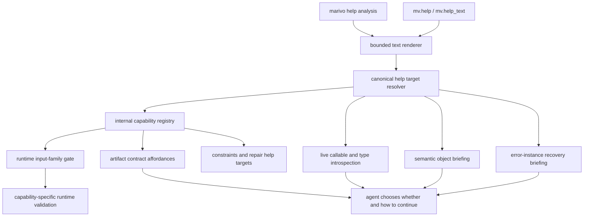

# Marivo Analysis Live Interface Surface Design

Status: follow-up review revisions integrated; pending written-spec re-review

Date: 2026-07-13

## Summary

Redesign the public `marivo.analysis` guidance surface as a live capability and
contract kernel for general-purpose coding agents.

The analysis operators and artifact algebra are already broadly aligned with
Marivo's intended responsibility: Marivo performs typed, reproducible,
recoverable computations while the agent plans the investigation and makes
judgments. The missing piece is the control and discovery plane that lets an
agent reliably discover those capabilities without learning a prescribed
analysis workflow from the packaged skill or from a linear help runbook.

The redesigned surface will:

- replace the ordered `workflow` runbook with a compact, teaching-ordered
  capability index that does not prescribe an execution path;
- make the installed version, interpreter, and package path visible at the
  live-help entry so authority is environment-verifiable rather than assumed;
- resolve public help targets consistently across names, callables, types,
  runtime objects, semantic objects, and structured errors;
- derive static help and dynamic artifact affordances from one internal
  capability registry;
- render producer, artifact-family, and consumer relationships as static type
  algebra before the first artifact exists;
- connect every artifact affordance and error repair to a canonical live help
  target;
- expose terminal exit, governed re-entry, and recovery mechanics without
  recommending when the agent should use them;
- remove internal fields, duplicate exits, and arbitrary `advanced` taxonomy
  from the default agent-facing surface;
- make the CLI and Python help adapters render the same installed contract;
- keep a focused help target self-contained and verify that a cold agent can
  reach its first correct `observe()` within a fixed help-round-trip budget.

This is an atomic breaking public-surface redesign. It provides no deprecation
period, compatibility aliases, shims, dual-read path, or user migration
workflow. It does not change analysis computations, operator algorithms,
artifact persistence, semantic object behavior, evidence extraction, or
quality algorithms.

## Relationship To The Boundary Kernel

This design is the library-side companion to
[`2026-07-13-marivo-analysis-boundary-kernel-design.md`](2026-07-13-marivo-analysis-boundary-kernel-design.md).

The boundary-kernel skill design depends on Marivo satisfying this interface
contract before the packaged skill attachments are removed:

```text
marivo-analysis skill
    owns hard boundaries, handoff triggers, evidence continuity, closeout obligations

Marivo live interface surface
    owns capability discovery, static contracts, runtime facts, recovery mechanics

agent
    owns exploration path, method choice, hypotheses, stop criteria, conclusions
```

The breaking release must not contain information available only from deleted
skill files or any live help/error/contract path that points to those files.

This design supersedes the following parts of
[`2026-07-08-agent-analysis-surface-design.md`](2026-07-08-agent-analysis-surface-design.md):

- `mv.help("workflow")` as a complete runbook;
- question-to-first-operator routing in the library;
- the `advanced` versus default workflow taxonomy;
- the statement that the skill owns analytical workflow or methodology;
- skill references as sources for error, constraint, or example detail.

## Problem

The existing runtime has the right building blocks but the public guidance
surface does not form a closed, coherent contract.

### The workflow topic prescribes an analysis path

`mv.help("workflow")` currently renders an ordered list from import through
catalog browsing, readiness, `observe`, artifact reads, quality checks, and
recovery. It also maps natural-language question categories to a first
operator and labels some legal typed operations as advanced or non-default.

That conflicts with the core ownership boundary:

- Marivo may state which typed capabilities exist and whether they are
  mechanically compatible;
- Marivo must not decide which capability the agent should use next;
- Marivo must not turn a convenient example into a required analysis plan;
- Marivo must not define reporting, quality review, or stopping as one ordered
  universal sequence.

Adding a disclaimer that the workflow is optional would not remove the implied
ranking and sequence.

### Help target resolution is incomplete and unpredictable

Current help behavior depends on a mix of fixed topic names, manual aliases,
single-level class reflection, and special cases. Some examples of the
inconsistency are:

- `Session.observe` resolves, while `session.frame_summaries` does not;
- the `discover` topic teaches `session.discover.point_anomalies`, while that
  path cannot be queried directly;
- `MetricFrame.transform.topk` and nested evidence namespace methods cannot be
  queried directly;
- error classes are reachable by bare class-name strings but not by error
  instances or module-qualified paths;
- runtime accepts `CatalogObject` even though the public annotation and
  docstring do not declare it;
- passing a registered public callable or public type object does not resolve
  through the same surface.

The agent therefore has to memorize help spelling rules that are unrelated to
the API it is actually invoking.

### Static capability facts have multiple owners

Operator identity, inputs, outputs, constraints, and downstream compatibility
are repeated across:

- help topics and summaries;
- `Session` method docstrings;
- `_NEXT_INTENTS` on artifact classes;
- output-family lookup tables;
- discover and transform compatibility matrices;
- constraint `applies_to` lists;
- artifact affordance construction;
- tests that pin hand-authored help content.

These copies can drift while individual tests remain green. A public API
change should update one live capability definition and its callable contract,
not require several unrelated prose tables to be synchronized manually.

### Dynamic artifacts do not close the discovery loop

`artifact.contract().affordances` correctly represents mechanical
compatibility rather than recommendations, but an affordance currently lacks
a canonical public entrypoint and live help target. An agent can learn that an
artifact admits `discover` or `transform` without being able to mechanically
follow that affordance to the exact callable contract it needs.

The terminal exit is also described only through general help prose. The
artifact contract does not explicitly mark that `to_pandas()` crosses out of
typed Marivo continuity.

### Error repair still depends on packaged skill files

Analysis constraints and error templates currently contain paths into
`marivo/skills/marivo-analysis/references/` and occasionally instruct the
agent to consult `SKILL.md`. Those paths become invalid under the boundary
kernel's single-file package shape and make the installed runtime subordinate
to cached guidance.

### Type help exposes internal construction details

Frame descriptors currently reflect dataclass fields and methods too broadly.
They expose private implementation fields such as `_df`, `_NEXT_INTENTS`, and
`_GATED_INTENTS`, even though agents receive frames from operators and must not
construct them directly.

They also present `frame.describe()` and `frame.plot()` as parallel data exits,
despite the intended contract that terminal pandas work crosses through
`frame.to_pandas()`.

### The CLI entry is indirect

`marivo --help` currently prints a `python -c` command and asks the caller to
select the interpreter where Marivo is installed. This is discoverable but not
self-contained: the already-correct `marivo` executable delegates help to a
potentially different `python` executable.

### Live authority is not environment authority

Calling a live help surface does not prove that it belongs to the environment
that will execute the analysis. A `marivo` found through `PATH` may come from
pipx, Conda, a system installation, or another virtual environment while the
analysis script runs with the project interpreter. In that state the agent can
read version A's apparently authoritative contract and execute version B.

This failure is more dangerous than stale skill text because the output looks
current. The entry surface must therefore identify its version, interpreter,
and package location, and the boundary skill must require an environment-bound
invocation rather than a bare executable lookup.

### Progressive disclosure has a process cost

For a coding agent, each focused disclosure commonly means writing or invoking
a command, starting Python, importing Marivo, and reading stdout. In this
checkout, three fresh-process measurements of importing `marivo.analysis`
ranged from approximately 1.66 to 2.35 seconds; rendering root or focused help
did not materially change that cost. Progressive disclosure is therefore not
free even when each individual page is concise.

A root-to-topic-to-subtopic browsing tree would encourage agents under time or
token pressure to skip help and guess. The design must bound help round trips,
make one focused target sufficient to invoke the capability, and measure cold
agent convergence before atomic cutover.

### Composition facts are not workflow recommendations

Removing question-to-operator routing is correct, but accepted input and output
relationships are library facts rather than agent judgment. If those facts are
only visible from `artifact.contract()` after execution, a cold agent must plan
the first composition using model priors for Marivo-specific concepts such as
governed entry, alignment policy, and cumulative gates.

The root surface must expose the static producer-to-artifact-to-consumer graph
without saying which branch is appropriate for the user's question.

## Decision

Adopt an **analysis interface capability kernel**.

The kernel is an internal registry and resolver that describes the installed
public analysis capabilities. It drives the CLI help adapter, Python help
adapter, artifact affordances, constraint links, and error recovery links.

It is not:

- an analysis workflow;
- a natural-language question router;
- an analysis DAG planner;
- a task-specific recommendation or default-selection system;
- a methodology, quality-governance, or report engine;
- a public registry mutation API.

## Breaking Cutover Contract

The target state ships atomically. Development may use an isolated branch and
candidate package, but no intermediate public state is supported.

The cutover:

- replaces the old root, `workflow`, and `advanced` surfaces in one release;
- replaces `ArtifactAffordance.operator` with `capability_id` directly;
- removes `BaseFrame.describe()` and `BaseFrame.plot()` directly;
- deletes packaged analysis-skill attachments and all active references to
  them in the same release;
- updates CLI, SDK help, errors, constraints, active docs, skill, examples, and
  tests as one contract change.

It does not provide:

- old-to-new help-topic aliases or redirects;
- deprecated fields, duplicate DTO fields, fallback readers, or serialized
  state converters;
- `__getattr__` bridges for removed frame methods;
- compatibility copies, tombstones, or an old/new behavior flag;
- a user-facing migration guide or staged rollout mode.

Calls to removed names fail normally. In particular, `frame.describe()` and
`frame.plot()` produce ordinary `AttributeError`; the new public contract
teaches the explicit `frame.to_pandas()` boundary but does not recognize
retired spellings at runtime.

The target release's new English and Chinese release-note entries name every
public break above, including the `ArtifactAffordance.operator` to
`capability_id` field rename. Release notes make the break visible; they do not
add compatibility behavior or become a migration guide. Existing historical
release notes remain unchanged.

## Alternatives Considered

### Patch the current workflow and aliases

Keep `workflow`, add stronger non-binding language, register missing aliases,
and redirect deleted skill links.

This has the lowest implementation cost, but it preserves hand-authored
capability duplication, keeps a sequence-oriented root, and does not guarantee
that future namespace methods or artifact affordances join a closed discovery
graph.

### Capability kernel — selected

Replace the workflow root with a capability-oriented index, introduce one
internal registry, make target resolution object-aware and namespace-aware,
and link runtime contracts/errors back to canonical help targets.

This keeps the operator surface small, preserves agent freedom, and lets an API
change remain local to its callable plus one capability definition.

### Marivo analysis planner

Accept a user question or artifact and return an ordered or ranked analysis
plan. This might reduce agent work in narrow cases, but it would give Marivo
ownership over hypothesis formation, operator choice, and stopping. It is
incompatible with the computation-versus-judgment boundary and is rejected.

### Public structured `mv.describe(...)`

Promote the internal descriptor model to a public structured introspection API
alongside `mv.help()`.

This was considered because machine-readable descriptors simplify automated
contract inspection. It is not selected in this design:

- it introduces a second public discovery path for the same capability;
- the current internal descriptor includes generic content shapes that are not
  suitable as a precise public type contract;
- coding agents can consume deterministic bounded text for static help;
- actual dynamic state already has typed result and artifact-contract APIs;
- a future connector or tooling requirement for structured static metadata
  should receive its own cross-surface design rather than leaking an internal
  DTO now.

`mv.help()` and `mv.help_text()` remain the only public static introspection
entries. They share the same internal descriptor and resolver.

This deferral has an explicit cost: text layout is convenient for agents but
is not a machine-readable contract. Harnesses and third-party tools may be
tempted to parse it, so the implementation must state that prose and layout are
not stable APIs and must not create golden snapshots that accidentally freeze
them. The private registry keeps a later typed static-metadata API feasible.
That decision remains reversible and should be revisited only when a concrete
external consumer can define the required schema and compatibility policy.

## Ownership Model

| Layer | Owns | Must not own |
| --- | --- | --- |
| Internal capability kernel | Canonical capability ids, public entrypoints, runtime-validated accepted/returned families, static constraint links, canonical help targets, teaching order | Task-specific recommendations, default method selection |
| `mv.help()` / `mv.help_text()` | Bounded static discovery and contract rendering | Current artifact facts, business conclusions, workflow planning |
| Semantic catalog and object details | Business definitions, units, composition, additivity, guardrails, provenance, scoped readiness | Analysis-path selection |
| Artifact `show()` / metadata | Bounded current facts, lineage, quality, blockers, confidence | API manuals, recommendations |
| Artifact `contract()` | Mechanical compatibility, deterministic/judgment parameter slots, boundary ports | Ranked next actions or stop decisions |
| Structured errors | Actual failure context, expected/received values, live candidates, concrete repair, canonical help target | Skill-file references or guessed workarounds |
| Boundary skill | Hard boundaries, handoff triggers, evidence continuity, closeout obligations | API signatures, operator inventory, examples, workflow |
| Agent | Question interpretation, hypotheses, exploration path, method choice, stop criteria, conclusions | Redefining semantic truth or hiding material blockers |

## Design Goals

### Capability completeness

Every documented public analysis capability has one canonical id, one public
entrypoint, one live help target, and one declared input/output contract.

### Non-prescriptive discovery

The root surface uses an intentional teaching order so high-frequency entry and
contract concepts are visible before specialized capabilities. Non-prescription
does not mean pretending presentation order has no effect. It means the root
does not map questions to operators, label a legal path default or advanced,
gate one capability behind another, or present the order as an execution
sequence.

### One source of static truth

Help, artifact affordances, constraints, and error repair links refer to the
same capability ids. Callable signatures and docstrings remain sourced from
the live objects rather than copied into registry prose.

`accepted_inputs` is also the runtime source for capability-level family
acceptance. An operator may perform additional shape, semantic, or policy
validation after that shared family gate, but it must not maintain another
family compatibility matrix.

### Object-near progressive disclosure

An agent can ask for help using the public object or callable already in hand.
It does not have to reverse-engineer a separate help spelling.

### Round-trip efficiency

Root help plus one focused target must be sufficient for a cold agent to write
the first valid `observe()` call. A focused target includes the live signature,
one runnable minimal example, invocation-critical constraints, accepted input
families, output family, and direct producer/consumer relationships in one
render. Optional related topics may be linked, but invoking the capability must
not require another help hop.

### Static composability

The root renders the complete producer-to-artifact-to-consumer type graph from
the registry. This graph communicates mechanical composition only; it neither
selects a branch nor interprets a business question.

### Live recovery

Every repair instruction points to current state or current public help. No
runtime error or constraint points into a packaged skill attachment.

### Bounded cognitive load

The root is capability-oriented and short. Detailed signatures, examples,
constraints, namespace methods, and type methods appear only after the agent
selects a narrower target.

### Version resilience

An ordinary API signature or artifact-family change updates the callable and
capability kernel without requiring a packaged skill change.

Every root help render also identifies the current Marivo version, resolved
Python executable, and resolved package location. A caller can verify that the
contract and subsequent execution use the same environment.

## Non-Goals

This design does not:

- add, remove, or rename analysis operators except for discovery-only topic and
  duplicate frame-exit cleanup described here;
- change operator algorithms or result calculations;
- change artifact persistence, identity, lineage, or evidence extraction;
- change semantic authoring or datasource contracts;
- define a general analytical methodology;
- generate a report, notebook, dashboard, slide deck, or publication;
- produce a recommended or ranked next action;
- expose the internal capability registry for user mutation;
- expose JSON or a public structured static-help DTO;
- redesign semantic authoring's genuinely ordered state transitions;
- rewrite historical site versions or release notes.

## Cross-Track Coexistence

The non-prescriptive analysis surface does not imply that every Marivo track
must be an unordered capability graph. Semantic authoring has a real policy
order: datasource evidence precedes evidence-backed authoring; dependency
objects precede dependents; the skill requires static verification before
runtime preview; and readiness precedes analysis handoff. The
`marivo-semantic` skill owns that routing discipline while `md.help(...)` and
`ms.help(...)` own version-sensitive API contracts and mechanically observable
requirements. Analysis
starts from ready semantic objects and exposes multiple mechanically legal
branches, so its skill must not choose the next operator.

Cross-track consistency still matters. A missing analysis semantic object
produces a typed `AnalysisToSemanticHandoff`, activates `marivo-semantic`, and
returns only through the query-free `boundary.semantic_handoff` validator with
a typed `SemanticToAnalysisHandoff`. The shared handoff schemas and analysis
consumer land in this analysis cutover before the semantic producer; the later
semantic live-surface cutover activates the producer atomically with its
state-router skill. That work must preserve the authoring policy order rather
than flatten it into an analysis-style graph.

The tracks share one object-near mechanical-reading convention:
`.show()` renders the result or evidence content, while `.contract()` renders
and returns mechanically available continuations. Analysis artifacts retain
their existing contract path; the datasource/semantic cutover adds the same
path to state-bearing objects instead of inventing a second protocol. The
coordinated `agent-guide.md` update states this as a cross-surface rule.

The separately specified
[`business semantic object model`](2026-07-13-business-semantic-object-model-design.md)
will extend this capability kernel when its atomic cutover adds event and
lifecycle analysis. Those capabilities use canonical ids such as
`events.sequence`, `events.funnel`, `events.time_to_event`, and
`lifecycle.dwell`, hosted by the symmetric `session.events.*` and
`session.lifecycle.*` namespaces. It does not add a flat
`session.time_to_event` alias. This future registry extension belongs to the
business-model cutover and therefore does not change this interface-only
release's non-goal of adding operators; that cutover must update registry,
help, affordances, and coverage tests together.

The CLI change in this design is additive at the product root:
`marivo --help` must retain discoverable semantic-authoring entry instructions
while adding `marivo help analysis`. Implementing the analysis adapter must not
remove or hide `md.help("authoring")`, `ms.help("authoring")`, or their future
canonical semantic CLI successor.

The current semantic help cross-link points to `mv.help("workflow")`, which this
analysis cutover removes. Therefore the analysis release itself must retarget
that active semantic cross-link to the registered analysis root, even if the
full datasource/semantic live-surface cutover ships later. No candidate may
release with an active link to the removed analysis target.

## Architecture



The registry supplies stable identity and relationships. Live Python objects
supply signatures, docstrings, and concrete runtime facts. The renderer never
reconstructs those facts from cached prose.

## Internal Capability Model

The capability registry is private to `marivo.analysis`. It is a closed,
kind-dispatched union rather than one optional-field mega-class.

### Shared identity

Every capability variant carries:

```text
id                  canonical stable id
public_entrypoint   exact public invocation shape
help_target         canonical target accepted by mv.help(...)
summary             one bounded factual sentence
root_group          exactly one teaching-order group
root_visibility     direct or grouped
constraint_ids      links into the live constraint catalog
```

The registry does not copy callable signatures, parameter tables, examples, or
long-form docs. Those are derived from the registered callable. Search tokens
are derived from `id`, `public_entrypoint`, `summary`, and public type/error
names; there is no alias table or second hand-authored keyword catalog.

### Operator capability

Represents an artifact-producing operation:

```text
kind = operator
receiver            session, artifact namespace, or frame namespace
accepted_inputs     public parameter -> closed artifact/semantic families
output_family       one canonical artifact family
```

Examples include:

- `observe`
- `compare`
- `attribute`
- `discover.point_anomalies`
- `discover.driver_axes`
- `transform.topk`
- `correlate`
- `hypothesis_test`
- `forecast`
- `assess_quality`

Each concrete discover objective and transform operation has its own
capability id. `discover` and `transform` remain grouping topics, not generic
runtime operators.

### Constructor capability

Represents a public value, policy, or governed-query builder:

```text
kind = constructor
output_type         one precise public value type
```

Examples include alignment constructors such as `window_bucket` and
`dow_aligned`, time/window values, and governed-entry builders such as
`ibis_query`, `metric_columns`, `time_column`, and `dimension_column`.

Constructors are not analysis steps and do not produce artifacts. They are
discoverable because an operator signature or constraint requires their typed
values. Their consumer lists are reverse edges derived from invokable
capabilities' `accepted_inputs`; the constructor descriptor does not store a
second `consumed_by` truth source.

### Read capability

Represents a bounded, non-mutating read:

```text
kind = read
receiver_family
result_kind         terminal text, immutable metadata, or defensive data copy
read_bound          bounded or terminal
```

Examples include artifact `show()`, `contract()`, session summaries, semantic
details, and catalog collections.

### Recovery capability

Represents restoration of persisted state:

```text
kind = recovery
identity_input      session name, job id, frame ref, or artifact id
restored_family
query_behavior      none or explicit
```

Examples include `session.frame_summaries`, `session.recent_jobs`,
`session.job`, and `session.get_frame`.

### Boundary capability

Represents a typed-flow boundary:

```text
kind = boundary
direction           terminal_exit or governed_entry
accepted_inputs     public parameter/receiver -> closed source families
output_family       one target family, including external terminal types
preserves           guarantees retained across the boundary
does_not_preserve   guarantees the caller must not assume
```

The initial boundary capabilities are:

- `boundary.to_pandas`: terminal defensive-copy exit from a typed artifact;
- `boundary.derive_metric_frame`: governed Ibis result entry into a typed
  `MetricFrame`;
- `boundary.semantic_handoff`: query-free governed re-entry from a semantic
  readiness handoff into the current analysis session.

At registry finalization, `boundary.to_pandas.accepted_inputs["receiver"]` is
materialized as the closed set of all registered artifact families, and its
external `output_family` is `pandas.DataFrame`. Registry validation requires
every artifact family to expose the public `to_pandas()` boundary. Runtime
validation, focused help, and type algebra read the materialized set; the
renderer does not rediscover families through reflection or a hand-authored
list.

`Session.derive_metric_frame(...)` has exactly one descriptor and one
capability id: `boundary.derive_metric_frame`. It is not also registered as an
operator. Consequently `mv.help(session.derive_metric_frame)` and
`mv.help(mv.Session.derive_metric_frame)` both resolve to that boundary
descriptor.

`Session.validate_semantic_handoff(handoff)` is the sole public receiver for
`boundary.semantic_handoff`. It accepts the shared private
`SemanticToAnalysisHandoff` value produced by semantic readiness and returns a
consumed-not-constructed `SemanticHandoffReceipt`. It performs no datasource
query, opens no connection, mutates no project/session state, and chooses no
analysis operator. It validates, against the current session and loaded
catalog:

- exact environment identity;
- project and catalog fingerprints;
- existence and kind of every ready ref;
- current readiness of the handed-off refs;
- consistency of readiness status, warning ids, and caveats;
- freshness and ownership of every required preview-evidence id.

An environment mismatch emits environment repair. A stale project, catalog,
ref, readiness, or preview-evidence fact emits a new
`AnalysisToSemanticHandoff` through typed semantic repair. Success returns:

```python
class SemanticHandoffReceipt(BaseModel):
    ready_refs: tuple[SemanticRef, ...]
    project_fingerprint: str
    catalog_fingerprint: str
    environment_fingerprint: EnvironmentFingerprint
    readiness_status: Literal["ready", "ready_with_warnings"]
    warning_ids: tuple[str, ...] = ()
    preview_evidence_ids: tuple[str, ...] = ()
    caveats: tuple[str, ...] = ()
```

The receipt proves only that those mechanical facts were current at validation
time. It does not record warning acceptance, recommend an operator, or claim
that the original analysis branch must resume unchanged. The full receipt is
in-memory only and the boundary does not persist it. Later analysis artifacts
record the semantic refs and evidence they actually consume through existing
lineage; they never inherit or persist the receipt's raw interpreter or package
paths.

The registry states boundary mechanics only. The skill owns when a task must
cross one of these boundaries.

### Private surface limits

All numeric interface and evaluation limits live in one private immutable
kernel value, `SURFACE_LIMITS`. Renderers, validators, repository tests, and
the cold-agent scorer import this value instead of repeating literals. Public
help and the boundary skill describe bounded behavior without publishing a
second copy of these numbers.

The target value is:

| Field | Value |
| --- | ---: |
| `root_help_max_lines` | 80 |
| `root_help_max_codepoints` | 8,000 |
| `focused_help_max_lines` | 120 |
| `focused_help_max_codepoints` | 12,000 |
| `object_contract_max_subjects` | 8 |
| `object_contract_render_max_lines` | 120 |
| `object_contract_render_max_codepoints` | 12,000 |
| `help_suggestion_limit` | 5 |
| `cold_agent_trials_per_case` | 3 |
| `cold_agent_min_qualifying_trials` | 2 |
| `cold_agent_max_help_calls_before_observe` | 2 |
| `cold_agent_max_invalid_api_errors_before_observe` | 1 |

This table is the single normative design declaration. Elsewhere the design
refers to the corresponding `SURFACE_LIMITS` field by name. Changing a value
requires one kernel-value change and one design decision; test and evaluator
call sites must not embed the replacement literal.

## Root Help Information Architecture

`mv.help()` becomes the complete bounded capability index. There is no separate
`capabilities` topic because the root itself owns capability discovery.

The root groups capabilities by role, not by Python suffix or presumed level:

1. **Session and state** — create/resume, identity, persisted job/frame reads.
2. **Semantic inputs** — catalog collections, object details, scoped readiness.
3. **Policies and builders** — alignment values, windows, and governed-entry
   builders required by operator contracts.
4. **Artifact production** — `observe`.
5. **Typed analysis** — compare, attribute, discover objectives, correlate,
   hypothesis test, forecast, quality assessment.
6. **Family-preserving operations** — frame transforms and candidate selection.
7. **Artifact inspection** — `show`, `contract`, metadata, bounded properties.
8. **Recovery** — jobs, summaries, and frame restoration.
9. **Boundaries** — terminal exit and governed entry, including
   `boundary.derive_metric_frame` and `boundary.semantic_handoff`.

Groups are deterministic and deliberately teaching-ordered. Session,
semantic-input, and policy concepts appear before artifact production because
they explain the nouns required by operator signatures; recovery and boundary
concepts appear later because they are normally consulted from an object or
failure already in hand. This is presentation priority, not an execution
sequence, prerequisite gate, operator recommendation, or default path.

Detailed discover objectives, transform operations, concrete result types,
policy types, and error types may be grouped only when their registered
`root_visibility` says `grouped`. Every grouped member remains directly
queryable. The renderer never decides to group a member because output became
long, and it never rewrites a registered summary.

The rendered root must satisfy `SURFACE_LIMITS.root_help_max_lines` and
`SURFACE_LIMITS.root_help_max_codepoints`, including the environment
fingerprint and type-algebra section. Tests count normalized `\n`-separated
lines and Python `len(text)`, not terminal display width. Budget overflow is a
build failure. A maintainer must deliberately shorten a registry summary or
change a capability's registered root visibility/grouping; the renderer must
not silently compact, fold, omit, or exceed.

The root must not contain:

- a natural-language question router;
- `first operator`, `default operator`, or `advanced` labels;
- an ordered analysis loop;
- a universal quality or reporting gate;
- a recommendation or stop condition;
- a full parameter table;
- internal DTOs or constructor-only types.

## Static Type Algebra

The root includes a compact, generated composition block. For every public
artifact family it shows its registered producers and consumers; for every
public constructor it shows the value type and capabilities that consume it:

```text
producer capability -> ArtifactFamily -> consumer capabilities
constructor capability -> ValueType -> consumer capabilities
```

Representative rows are:

```text
observe / boundary.derive_metric_frame -> MetricFrame -> compare, correlate,
  hypothesis_test, forecast, assess_quality, discover (group), transform (group)
compare -> DeltaFrame -> attribute, transform (group)
discover (group) -> CandidateSet -> CandidateSet.select
window_bucket / dow_aligned / holiday_aligned /
  holiday_and_dow_aligned -> AlignmentPolicy -> compare, hypothesis_test,
  attribute
all registered artifact families -> boundary.to_pandas -> pandas.DataFrame
  (terminal)
semantic readiness -> SemanticToAnalysisHandoff ->
  boundary.semantic_handoff -> SemanticHandoffReceipt
```

`discover` and `transform` in this block are canonical grouping-topic targets,
not wildcard capability ids or invokable producers. The `(group)` marker means
that every registered member contributing the displayed edge is available from
that canonical topic. Focused help renders concrete member ids. The renderer
must not emit non-canonical spellings such as `discover.*` or `transform.*`.

`boundary.to_pandas` renders exactly once as the aggregate terminal row above.
`all registered artifact families` and `pandas.DataFrame` are generated type
labels, not help targets. The source label expands to every registered artifact
family. The renderer does not repeat `boundary.to_pandas` in every
producer/consumer row. Registry validation fails if any artifact family is
absent from the aggregate set or the boundary row is missing or duplicated.

The exact rows come from `accepted_inputs`, `output_family`, and registered
result-method relationships. Constructor consumers are reverse-indexed from
`accepted_inputs`; they are not copied into renderer prose or inferred from
`_NEXT_INTENTS` at render time. Registry
validation fails if a producer or consumer names an unregistered artifact
family or if a public capability is missing from both sides of the graph where
its typed contract requires a relationship.

The block communicates only type compatibility. It contains no business
question labels, probability of usefulness, first/default operator, or stop
condition. A cold agent can therefore see, before execution, facts such as
`attribute` consuming a `DeltaFrame`, governed entry producing a
`MetricFrame`, and cumulative or alignment policy types being consumed by
specific capabilities without Marivo choosing an analysis path.

## Runtime Family Validation

The registry closes the loop between rendered type algebra and public runtime
behavior. Every invokable operator or governed-entry boundary calls one shared
family gate before capability-specific validation. The gate reads that
descriptor's `accepted_inputs` mapping, classifies each registered
input-bearing public argument, and either returns the normalized family match
or raises a typed `AnalysisError` carrying expected families, received family,
public parameter location, repair action, and the same capability help target.

Passing the family gate means only that the input family is mechanically
accepted. Shape, arity, semantic identity, alignment, cumulative-policy, and
other capability-specific preconditions may still reject the invocation after
the shared gate. Those later checks remain in their owning runtime modules and
link to registered constraints; they must not recreate a family-acceptance
matrix.

The public callable and focused help therefore consume the same descriptor in
the same release:

```text
registry accepted_inputs
    -> generated static type algebra and artifact affordances
    -> shared runtime family gate
    -> capability-specific validation
```

For every registered capability and every public input family, property-style
tests assert that registered families pass the shared gate and non-registered
families fail at that gate with the canonical help target. Separate public-call
integration tests prove that each invokable entrypoint actually invokes the
shared gate; testing the private predicate alone is insufficient.

## Removal Of `workflow` And `advanced`

The public `workflow` topic is removed. The active boundary skill enters
through an environment-bound `python -m marivo help analysis` or matching
console script. Active docs and tests use `mv.help()` and focused canonical
capability targets.

`workflow` is an ordinary unknown target. It has no special-case error,
redirect, alias, or hidden runbook.

The public `advanced` topic is also removed:

- valid transforms and candidate selectors join the normal capability graph;
- specialized result methods remain discoverable from their public result
  type or runtime object;
- internal DTOs and implementation modules do not appear in public help;
- a capability is either public and discoverable or internal and absent. It is
  not made public through an ambiguous expert bucket.

## Public Help Target Contract

The two public static-help entries remain:

```python
mv.help(target=None) -> None
mv.help_text(target=None) -> str
```

They accept the same target family and use the same resolver. `help()` prints
the bounded text returned by the renderer; `help_text()` returns it without
stdout.

Their public annotations must use concrete unions of the accepted target
families. They must not use `Any` or accept arbitrary objects and silently
reflect them. Callable and type inputs are accepted only when their identity is
registered as public; all other values raise `HelpTargetError`.

### Accepted target kinds

The target contract supports:

1. `None` — render the root capability index.
2. A canonical string target — capability, grouping topic, public type, public
   method, public error, recovery path, or boundary path.
3. A registered public callable or bound method — resolve to its canonical
   capability or method target.
4. A registered public type — render its public consumption contract.
5. A public runtime analysis object — render the static contract for its
   concrete public type.
6. `CatalogObject` or `SemanticRef` — render the bounded live semantic
   consumption briefing.
7. `AnalysisError` instance or registered error type — render the matching
   error contract; an instance also includes its concrete repair context.

Unsupported objects fail with a typed `HelpTargetError`. The error states the
received type, accepted target kinds, and close canonical targets when
available. It never falls through to a generic reflection `TypeError`.

Suggestion search is part of the public recovery contract. It uses a
deterministic bounded index over canonical ids, `public_entrypoint`, summary
tokens, and public type/error names. Exact token
and normalized substring matches rank before fuzzy string distance, and at
most `SURFACE_LIMITS.help_suggestion_limit` canonical targets are returned.
Consequently concept queries such as
`anomaly` or `seasonality` can find a matching capability when those words
occur in its summary even when they are absent from the canonical id. The
search does not use artifact state, user-question classification, or operator
popularity, so suggestions remain lexical discovery rather than analysis
recommendations.

### Canonical target grammar

Canonical string targets mirror public invocation shapes without an `mv.`
prefix:

```text
observe
compare
discover.point_anomalies
discover.driver_axes
transform.topk
session.get_frame
session.recent_jobs
MetricFrame.contract
CandidateSet.select
errors.SemanticKindMismatchError
boundary.to_pandas
boundary.derive_metric_frame
boundary.semantic_handoff
```

Only canonical targets appear in root help, `see also`, artifact affordances,
constraints, and errors.

Cross-track links use the shared private target value rather than an
unqualified string:

```python
HelpSurface = Literal["analysis", "datasource", "semantic"]

class LiveHelpTarget(BaseModel):
    surface: HelpSurface
    canonical_id: str | None = None
```

`canonical_id=None` selects the registered root for the named surface. The type
is consumed through repair and handoff fields and is not a top-level public
constructor or root-help member. Analysis-local targets use
`surface="analysis"`; a semantic-authoring handoff uses the semantic root.

Operator ids are global verbs even when the callable is hosted by `Session`:
there is one public receiver and the operation's semantic identity is
`observe`, `compare`, or another verb. Recovery ids retain `session.` because
they read or restore session-addressed state. Boundary ids retain `boundary.`
because crossing the typed-flow boundary is the identity being disclosed;
result methods retain `Type.method` when the receiver family disambiguates the
contract.

String targets must use the canonical grammar. Alternative spellings such as
`Session.observe`, `session.observe`, or `mv.Session.observe` are not aliases;
they raise `HelpTargetError` and may receive the canonical `observe` target as
a lexical suggestion. Object-near discovery remains forgiving through the
registered callable or bound method itself, for example
`mv.help(mv.Session.observe)`, without expanding the string grammar.

### Nested namespace resolution

Nested paths are registered explicitly by capability id. The resolver does not
walk arbitrary attributes or private objects.

This makes the following paths queryable without exposing general reflection:

```text
discover.point_anomalies
discover.driver_axes
transform.normalize
transform.window
session.evidence.findings
session.evidence.propositions
```

If a public namespace gains or loses a method, its registry coverage test must
change with the callable.

### Runtime object behavior

Help over a runtime object remains static unless the object family explicitly
owns current contract data:

- `mv.help(session)` describes the public `Session` surface; it does not read
  persisted jobs or execute diagnostics.
- `mv.help(frame)` describes the frame family's public consumption contract and
  points to `frame.show()` / `frame.contract()` for current facts.
- `mv.help(error)` includes the error's concrete expected/received/repair data
  because the error instance owns that current failure state.
- `mv.help(metric)` may read the loaded semantic object because semantic object
  help is explicitly a live consumption briefing.

The live-enrichment allowlist is closed to two families:

1. `CatalogObject` / `SemanticRef`, using an explicit or inferable semantic
   project;
2. `AnalysisError` instances, using only state already stored on the error.

All session, artifact, result, callable, and type targets remain static and
side-effect free. Adding another live-enriched family requires a public
contract change and a resolver test; it cannot happen through arbitrary
reflection.

## Focused Help Content Contract

Every invokable capability target is self-contained for one correct minimal
invocation. One render includes, in this order:

1. canonical target, factual summary, and exact public entrypoint;
2. signature derived from the live callable;
3. accepted input families and output family;
4. one runnable minimal example with no ellipsis placeholders;
5. every constraint required to make that example valid;
6. direct producer and consumer relationships from the type algebra;
7. optional related targets for non-required exploration.

An invocation-critical fact must not exist only behind a `see also` link. A
focused render must satisfy `SURFACE_LIMITS.focused_help_max_lines` and
`SURFACE_LIMITS.focused_help_max_codepoints`; overflow fails the build instead
of causing automatic prose compression or omission. Longer background
explanation moves to current site documentation, but the runnable example and
invocation-critical constraints stay live.

## CLI Help Adapter

Add a help-only CLI path backed by the same resolver and renderer:

```text
marivo help analysis
marivo help analysis observe
marivo help analysis discover.point_anomalies
marivo help analysis recovery
python -m marivo help analysis
```

`marivo --help` routes agents to `marivo help analysis`, preserves the existing
semantic-authoring entry pointers, and keeps `doctor` diagnostics separately
visible. The analysis subcommand does not replace the product-level semantic
entry.

The CLI adapter:

- imports the installed `marivo.analysis` package from the same environment as
  the `marivo` executable;
- supports `python -m marivo` so an agent can bind discovery to the exact
  interpreter that will execute its analysis;
- does not execute analysis or access a datasource;
- renders the same text and unknown-target behavior as `mv.help_text(...)`;
- accepts string targets only; object-near help remains a Python API feature;
- does not maintain a separate CLI help catalog.

This is not a `marivo analyze` or query CLI. It only closes the installed
discovery path.

### Environment fingerprint

Root help rendered through either CLI or Python starts with a compact,
machine-comparable fingerprint:

```text
Marivo: <marivo.__version__>
Python: <Path(sys.executable).resolve()>
Package: <Path(marivo.__file__).resolve()>
```

The shared private representation is:

```python
class EnvironmentFingerprint(BaseModel):
    marivo_version: str
    python_executable: str
    package_path: str
```

It is consumed by help, handoffs, and evaluator events and is not a top-level
public constructor.

The CLI fingerprint describes the process that resolved the command. The SDK
fingerprint describes the importing process. Privacy has three explicit layers:

1. **In-memory structured value.** `EnvironmentFingerprint` retains resolved
   absolute paths so live equality and repair can be exact. Handoff and receipt
   fields may carry that value in memory.
2. **Rendering.** Only explicit environment-authority views—root help and an
   environment-mismatch diagnostic—show raw paths. Ordinary object/result,
   contract, handoff, receipt, error, and report renders show Marivo version
   plus a deterministic opaque fingerprint id and mask both path fields.
   Programmatic in-process field access remains exact.
3. **Persistence.** Raw fingerprint paths are never written to analysis
   artifacts, session records, datasource snapshots, semantic/preview project
   state, reports, or deliverables. Internal diagnostic logs and pinned
   evaluator transcripts may retain them outside those user/project artifacts.

The opaque id is derived from canonical fingerprint serialization and is for
equality/correlation, not environment reconstruction. Tests run two
intentionally different environment fixtures and verify that their fingerprints
and opaque ids differ rather than silently claiming equivalence.

The boundary skill requires the same project interpreter for discovery and
execution. It may use `<analysis-python> -m marivo help analysis` or the
corresponding `<venv>/bin/marivo help analysis`; a bare `marivo` command is
valid only after its fingerprint matches the analysis interpreter and package.

## Public Type And Result Help

### Result types are consumed, not constructed

Help for public frame/result types must not render constructor signatures or
private storage fields. It renders:

- the result family and semantic shapes;
- the operator or method that produces it;
- bounded public properties;
- public read methods;
- specialized public methods;
- relevant constraints;
- canonical `see also` help targets.

Fields beginning with `_`, dataclass implementation defaults, Pydantic private
attributes, and internal registry fields never appear.

### Properties and methods are separate

Type help lists public properties separately from callable methods. This makes
paths such as `frame.meta`, `frame.semantic_shape`, `frame.metrics`, and
`session.catalog` discoverable without misrepresenting them as calls.

### Remove duplicate pandas exits

`BaseFrame.describe()` and `BaseFrame.plot()` are removed from the public
analysis wrapper. They are alternative pandas operations and weaken the single
terminal-exit boundary.

The replacement is explicit:

```python
df = frame.to_pandas()
df.describe()
df.plot()
```

`frame.to_pandas()` remains a defensive copy. Removing the convenience methods
does not change artifact data or persistence.

Read-only bounded properties such as `columns` and `shape` remain public.
Existing direct column reads are not expanded or promoted in help by this
design.

No retired-name bridge is installed. Calls to `describe()` or `plot()` fail
with ordinary `AttributeError`, exactly like any other absent attribute.

## Native Reflection Convergence

Python-native discovery remains available but is not the bounded contract.
`builtins.help(mv)`, `dir(frame)`, and IPython `?` may expose Python structure
that the capability renderer intentionally folds. They must nevertheless point
an agent toward the canonical surface instead of teaching a competing route:

- the first line of the `marivo.analysis` module docstring says to call
  `mv.help()` for bounded agent help;
- the first line of every public analysis session, artifact, result, policy,
  and error class docstring says to call `mv.help(<type-or-object>)` for its
  public consumption contract;
- `mv.__all__` and module `__dir__` remain pinned to intended public exports;
- native docstrings must not claim a workflow, default operator, or constructor
  contract that contradicts the capability kernel.

Tests assert the routing first line and export hygiene, not the complete pydoc
or `dir()` output.

## Artifact Contract Integration

`artifact.contract()` remains the dynamic mechanical contract. It does not
recommend, rank, or plan.

This is the repository-wide object-near convention, not an analysis-only
special case: `.show()` owns current result/evidence content and `.contract()`
owns mechanical continuations. The datasource/semantic follow-up reuses the
same private render limits and target grammar. Neither side requires an agent
to translate a runtime object back into a help string.

### Typed affordances

Each `ArtifactAffordance` links directly to the capability kernel:

```text
capability_id          canonical registry id
public_entrypoint      exact public invocation shape
help_target            canonical mv.help target
required_inputs        mechanically required input families
preconditions          pass/fail facts with reasons
param_template         deterministic slots plus judgment slots
expected_output_family one fixed output family
```

The current ambiguous `operator` field is replaced by `capability_id`; the
registry supplies `public_entrypoint`, `help_target`, `required_inputs`, and
expected output from the same parameter-to-family mapping used by the runtime
family gate.

An affordance exists only when its capability is registered and the current
artifact family has a mechanically defined input relationship to it.

`ArtifactPrecondition` adds `repair: AnalysisRepair | None`. Visibility is
mechanical:

- a passing precondition remains visible iff `reason` is present and
  `reason.strip()` is non-empty;
- a failed precondition remains visible iff `repair` is present and
  `repair.action.strip()` is non-empty;
- a failed precondition without such repair suppresses the affordance because
  the artifact cannot teach a legal continuation.

This replaces the ambiguous phrase "when the failure teaches a concrete
repair" with a testable field rule. The renderer never parses prose to decide
visibility.

### Boundary ports

`ArtifactContract` adds a separate closed `boundary_ports` collection. Boundary
ports are not mixed with typed downstream affordances.

The initial artifact boundary port is:

```text
kind = terminal_exit
capability_id = boundary.to_pandas
public_entrypoint = artifact.to_pandas()
help_target = boundary.to_pandas
preserves = defensive data copy
does_not_preserve = typed artifact identity, automatic lineage for custom work
```

Governed entry is not an artifact-local next action and therefore does not
appear as a port on every artifact. It remains discoverable through the root
boundary group as `boundary.derive_metric_frame` or
`boundary.semantic_handoff`, depending on the accepted input family.

## Static Constraints And Examples

Constraints remain the reusable static rule catalog, but their external links
change:

- add an optional canonical `help_target` to the shared `Constraint` model;
- remove analysis-skill paths from `docs_ref`; durable current site/spec links
  may remain when they are genuine documentation rather than live repair;
- keep constraint ids stable when the underlying rule is unchanged;
- attach a constraint to capability ids rather than free-form topic names;
- source callable examples from live docstrings or inline constraint examples;
- move long-form examples to current site documentation or test fixtures, not
  packaged skill references;
- require every referenced help target to resolve.

Help may render a bounded constraint summary and a minimal runnable example.
It must not copy a complete error catalog or full site guide into one topic.

## Structured Error, Repair, And Handoff Contract

`AnalysisError` remains the common exception base. Add a precise repair model
rather than encoding recovery only in rendered strings or a generic details
dictionary:

```python
RepairKind = Literal["retry", "inspect", "semantic_handoff", "environment"]

class AnalysisToSemanticHandoff(BaseModel):
    required_kind: SemanticKind | None
    requirement: str
    affected_capability_id: str
    environment_fingerprint: EnvironmentFingerprint
    semantic_context_refs: tuple[str, ...] = ()
    artifact_refs: tuple[str, ...] = ()
    evidence_refs: tuple[str, ...] = ()
    project_fingerprint: str | None = None

class SemanticToAnalysisHandoff(BaseModel):
    help_target: LiveHelpTarget
    ready_refs: tuple[SemanticRef, ...]
    project_fingerprint: str
    catalog_fingerprint: str
    environment_fingerprint: EnvironmentFingerprint
    readiness_status: Literal["ready", "ready_with_warnings"]
    warning_ids: tuple[str, ...] = ()
    preview_evidence_ids: tuple[str, ...] = ()
    caveats: tuple[str, ...] = ()

class AnalysisRepair(BaseModel):
    kind: RepairKind
    action: str
    help_target: LiveHelpTarget
    snippet: str | None = None
    candidates: tuple[str, ...] = ()
    semantic_handoff: AnalysisToSemanticHandoff | None = None
```

`AnalysisRepair`, `AnalysisToSemanticHandoff`, `SemanticToAnalysisHandoff`, and
`SemanticHandoffReceipt` use the shared private surface/handoff foundation.
They are public field or method input/output types but are not top-level
`mv.__all__` entries or root-help members. `SemanticKind` in the handoff is the
public catalog enum from `marivo.semantic`, not an analysis artifact-family
alias.

`RepairKind` is intentionally closed. Adding a new literal requires renderer
and exhaustive-match test updates. Implementations must not emit an
unregistered free-form kind as a shortcut.

`semantic_handoff` is required exactly when `kind == "semantic_handoff"` and is
`None` for every other kind. Its `help_target` is the registered semantic root.
The payload carries only identifiers, fingerprints, and lineage refs already
owned by the failed analysis context; it does not embed artifact data or infer a
replacement business object. `affected_capability_id` must resolve through the
analysis capability registry.

Every `SemanticToAnalysisHandoff.help_target` resolves exactly to
`LiveHelpTarget(surface="analysis",
canonical_id="boundary.semantic_handoff")`; the validator rejects any other
target rather than guessing a receiver.

The stable public fields on `AnalysisError` are:

```text
message      human-readable failure summary
expected     precise expected contract, when applicable
received     precise received value/type/shape, when applicable
location     public call or parameter where the failure occurred
repair       AnalysisRepair or None
```

Subtype-specific values may remain private only when the runtime needs them to
derive the public fields above. They have no compatibility guarantee and are
not retained solely because an older error exposed them through `details`.

Each actionable error exposes:

- what was expected;
- what was received;
- where the failure occurred;
- a repair object when repair is known;
- current candidates when the runtime can derive them;
- the complete `AnalysisToSemanticHandoff` when a required business object truly
  does not exist.

`str(error)` renders those fields in the existing teachable template style.
`mv.help(error)` renders the error-family contract plus the concrete instance
repair. `mv.help("errors.<ErrorType>")` renders the static error contract only.

`HelpTargetError` subclasses `AnalysisError`. It is constructed without calling
the help resolver recursively and carries canonical suggestions derived from
the registry. Its suggestion set follows the lexical index contract above;
summary-keyword matches are evaluated before id-only edit distance.

No error contains:

- a packaged skill path;
- a reference to `SKILL.md` as an API manual;
- a cached workaround that bypasses the current public API;
- hardcoded candidates when live state is available.

### Semantic-not-found distinction

Metric and dimension resolution errors distinguish three cases:

1. **Invalid spelling with live candidates** — inspect or retry using the
   returned candidates.
2. **Catalog or project unavailable** — repair the environment or load state.
3. **Required semantic object absent** — stop the affected branch and emit a
   typed semantic-authoring handoff containing the exact requirement,
   capability, current semantic context, artifact/evidence lineage, project
   identity when available, and authoritative environment fingerprint.

The analysis runtime does not synthesize a raw-field substitute.

## Information Flow

```text
agent enters through the analysis interpreter's CLI or import marivo.analysis
    -> version/interpreter/package fingerprint establishes environment identity
    -> root capability index discloses available families
    -> agent selects any relevant legal capability
    -> focused help renders the live callable contract
    -> runtime returns a typed artifact or structured error
    -> artifact show/contract or error repair discloses current state
    -> agent revises, stops, or crosses an explicit boundary
```

This describes information ownership. It is not a required operator sequence.

## Implementation And Atomic Cutover

Implementation has parallel workstreams, not public migration phases. None may
ship independently.

### Kernel workstream

- Introduce the closed capability registry variants.
- Register the complete target public analysis surface.
- Add canonical target resolution and nested namespace resolution.
- Add registry-to-callable and registry-to-public-export drift checks.
- Build the lexical suggestion index and generated type algebra from the same
  registry.
- Make registry `accepted_inputs` the source for the shared runtime family gate
  and add public-entry integration checks around it.
- Define the one private `SURFACE_LIMITS` value consumed by renderers, tests,
  and evaluation tooling.

### Public-surface workstream

- Replace the root information architecture directly.
- Delete `workflow`, `advanced`, their tests, and every string alias.
- Retarget every active datasource/semantic link to `mv.help("workflow")` to the
  registered analysis root in the same release; do not defer this cleanup to
  the later semantic live-surface cutover.
- Add `boundaries`, focused recovery, self-contained focused help, numeric
  budgets, `python -m marivo`, environment fingerprints, and native-reflection
  routing docstrings.
- Delete `BaseFrame.describe()` and `BaseFrame.plot()` without a bridge.
- Replace `ArtifactAffordance.operator` directly and add boundary ports.
- Replace string-only recovery hints with the target typed repair fields.
- Add `LiveHelpTarget`, `EnvironmentFingerprint`, and the shared directional
  handoff schemas. Semantic-missing repair must carry a complete
  `AnalysisToSemanticHandoff`; `Session.validate_semantic_handoff(...)` must
  validate `SemanticToAnalysisHandoff` and return `SemanticHandoffReceipt`.

### Skill and guidance workstream

- Replace the packaged analysis skill with the one-file boundary kernel.
- Delete all attachments, examples, attachment runners, and active links to
  them.
- Add any still-valid Marivo contract fact directly to its target live owner;
  delete generic methodology and duplicate prose.
- Update `agent-guide.md`, active analysis specs, latest English and Chinese
  site documentation, current introspection metadata, and affected tests.
- Update the guide's analysis-only `.show()` / `.contract()` wording into the
  shared object-near rule that the datasource/semantic follow-up consumes.
- Add the target release's English and Chinese release-note entries naming the
  public removals and field renames without adding migration instructions.

Historical versioned site content and release notes remain unchanged as
historical records; they are not supported entrypoints and receive no redirect.

### Verification workstream

Build a candidate package containing only the target state and run all
mechanical, repository, site, and cold-agent checks against it. The candidate
must not package or expose the deleted help topics, fields, methods, skill
attachments, or compatibility code.

If verification fails, fix the target branch and rebuild the candidate. Do not
restore legacy paths to make the gate pass. Merge and release the coordinated
change only after every workstream and the cold-agent gate pass.

## Cold-Agent Evaluation Gate

Mechanical consistency cannot prove that a cold coding agent will use the
surface rather than guess. Before the atomic cutover is merged or released,
run a repeatable behavior evaluation against the target-only candidate
package. This is a deliberately small convergence and boundary **smoke test**,
not a statistically powered estimate of agent success. Passing it rejects
obvious interface failures; it does not establish a population success rate or
separate all model prior knowledge from interface quality.

The harness reads one checked-in evaluation manifest. The manifest pins an
immutable provider/model snapshot id, agent/client version, **high** reasoning
or effort tier, tool policy, prompt template hash, and sampling/seed settings
when supported; unsupported settings are marked explicitly. Floating aliases
such as `latest` are forbidden. Changing the model snapshot, reasoning tier,
client, prompt, tool policy, fixture, or oracle creates a new evaluation
profile and requires the full gate to be rerun; results from different
profiles are not pooled.

The pinned high reasoning/effort tier makes this a capable-agent surface test,
not a lower-tier robustness test. Its result must not be extrapolated to a
provider's default, medium, low, or otherwise less capable reasoning tier;
those require separate pinned profiles and independently reported runs.

### Evaluation isolation

Each trial starts a fresh agent context in a temporary project containing:

- the candidate Marivo wheel in one explicit virtual environment;
- fixed local semantic/data fixtures and checked-in case prompts;
- the candidate one-file boundary `SKILL.md`;
- no Marivo source checkout, site docs, skill references/examples, prior
  transcript, or general web/browsing tool;
- sandbox-tool network egress blocked except fixture-local loopback traffic.

The model inference/control-plane connection is explicitly exempt from the
sandbox-tool network restriction. “Network disabled” never means disabling the
remote model call itself.

The gate has two checked-in cases:

1. **Clean convergence.** A fixed business question requires at least one
   correct `observe()` and one typed composition whose final artifact family
   and semantic inputs have a deterministic fixture oracle.
2. **Environment-skew stop.** The harness deliberately exposes a help
   fingerprint from one environment and an execution fingerprint from another,
   and prevents a matching authoritative fingerprint from being established
   during the case. The oracle is an explicit environment-repair stop with no
   analysis API invocation in the trial.

Additional checked-in cases may extend coverage later, but they do not replace
or silently modify either initial case. The convergence harness scores the
artifact, not a prose conclusion; the skew harness scores the stop event and
absence of any analysis call, not a stated intention to stop.

### Recorded evidence

Each run records a machine-readable event log and full transcript containing:

- model id, agent/client version, decoding/seed settings when supported, prompt
  hash, case id, and wall-clock timestamps;
- Marivo version, `sys.executable`, package path, and the first help fingerprint;
- every help invocation and subprocess start;
- invalid API attempts, structured errors, and whether each repair succeeded;
- first correct `observe()` event, produced artifact refs/families, and final
  oracle result;
- fingerprint comparison, mismatch-detection event, stop/repair event, and any
  analysis call attempted in the skew trial;
- retired-name `AttributeError` events caused by `describe` or `plot` access on
  a Marivo artifact, including the receiver family and whether they occurred
  before or after the first correct `observe()`.

The scorer derives counts from events, not from agent self-report.

### Help and error counting

A help invocation is counted, before target resolution, for each call to:

- `mv.help(...)` or `mv.help_text(...)`;
- `marivo --help` or `python -m marivo --help`;
- `marivo help analysis [target]` or
  `python -m marivo help analysis [target]`.

Root, focused, successful, and failed requests all count. One subprocess that
invokes help twice contributes two help invocations; subprocess startup itself
does not add another help count.

An unsupported target that raises `HelpTargetError` increments both the help
invocation count and the invalid-API error count. Retrying another target adds
another help invocation. This strict total is intentional: a root request plus
a failed alias plus focused help is non-qualifying, while a failed alias plus
canonical focused help can still fit both budgets if every other condition
passes. Help calls after the first correct `observe()` remain in the event log
but do not affect the before-observe budget. Native reflection used for Marivo
contract discovery is outside the allowed live-help surface and makes the trial
non-qualifying rather than receiving a discounted count.

### Gate thresholds

Run `SURFACE_LIMITS.cold_agent_trials_per_case` independent trials for each
case. A **qualifying convergence trial** is one that simultaneously:

- produces the oracle-expected final artifact;
- reaches its first correct `observe()` within
  `SURFACE_LIMITS.cold_agent_max_help_calls_before_observe` help invocations and
  `SURFACE_LIMITS.cold_agent_max_invalid_api_errors_before_observe` invalid-API
  errors;
- establishes a matching help/runtime fingerprint before analysis; and
- uses only the allowed live help, semantic, artifact, and structured-error
  surfaces for Marivo contract discovery.

A slower successful artifact is non-qualifying, exactly like any other trial
that misses a gate condition; it is not reclassified as a “passing trial” whose
success paradoxically makes the whole gate fail.

A **qualifying skew trial** detects the deliberate fingerprint mismatch before
any analysis call, records the environment-repair stop, and makes no Marivo
analysis API call in the trial.

The candidate passes only when:

- the number of qualifying convergence trials is at least
  `SURFACE_LIMITS.cold_agent_min_qualifying_trials`;
- every environment-skew trial qualifies;
- the median help-invocation count and error count are reported even when the
  thresholds pass;
- retired-name `AttributeError` counts are reported per trial and in aggregate.

Retired-name `AttributeError` is a diagnostic metric, not a qualifying-trial
condition in this design. Recording it makes the cost of the deliberate bare
failure measurable without silently changing the approved breaking contract.

If the gate fails, do not cut over. Diagnose the transcript and revise the new
interface before repeating the same case. Do not reintroduce the old skill
attachments, and do not weaken the oracle or thresholds in the same change
that is being evaluated.

The deterministic fixture builder, event schema, and scorer run under pytest.
The model-backed trials are an explicit pre-cutover/release evaluation command,
not part of `make test`; treating a nondeterministic remote agent call as an
ordinary unit test would make the repository gate unreliable.

Because the trial count and cases are intentionally small, release decisions
must describe this result as a smoke-test outcome. They must not attach a
confidence interval, claim a general agent success rate, or tune the fixed
question, oracle, model profile, or thresholds to make the candidate pass.

## Verification Strategy

### Mechanical registry checks

- Every capability id is unique.
- Every registered public callable identity maps to exactly one capability
  descriptor; `Session.derive_metric_frame` maps only to
  `boundary.derive_metric_frame`.
- Every public entrypoint resolves to a registered live callable or public read
  path.
- Every help target resolves to exactly one canonical descriptor.
- Every capability has exactly one registered root group and an explicit
  direct/grouped root visibility; the renderer never infers folding.
- Every registered callable's rendered signature matches `inspect.signature`.
- Every invokable capability has a runnable example and all
  invocation-critical constraints in the same focused descriptor.
- Every public analysis callable in scope has one capability id.
- Every public namespace method is registered or explicitly internal.
- Every artifact affordance capability id exists in the registry.
- Every affordance public entrypoint, required input families, and output family
  match the registry.
- Every constraint and repair help target resolves through its declared
  `LiveHelpTarget.surface`.
- Every `semantic_handoff` repair has a complete
  `AnalysisToSemanticHandoff`; all other repair kinds reject that payload.
- `boundary.semantic_handoff` accepts only `SemanticToAnalysisHandoff`, performs
  no datasource read, connection, or mutation; validates every environment,
  project, catalog, ref, readiness, and preview-evidence fact; and returns
  `SemanticHandoffReceipt` only on success.
- Every type-algebra producer/consumer edge is registry-backed and every typed
  capability is represented in the graph.
- Every aggregated type-algebra label resolves to one canonical grouping-topic
  descriptor and expands only to registered members; wildcard spellings never
  render.
- `boundary.to_pandas` renders exactly once as the aggregate terminal edge over
  every registered artifact family.
- For every capability/input-family pair, the shared runtime family gate accepts
  exactly the registered families, rejects all other public families with the
  canonical repair target, and is invoked by the public entrypoint.
- Every lexical suggestion is canonical, deterministic, and drawn from the
  registered searchable fields.
- Renderers, repository tests, and the cold-agent scorer read numeric limits
  from `SURFACE_LIMITS`; test and evaluator call sites contain no duplicated
  literals.
- No active source, current doc, metadata, test, or package file points to a
  deleted skill attachment.
- No active datasource or semantic help, error, result, or current doc points
  to removed `workflow` or `advanced` analysis targets.

### Help target matrix

Test equivalent resolution for:

- canonical string targets;
- registered callables and bound methods;
- public types and runtime objects;
- semantic objects and refs;
- error types and error instances;
- nested discover, transform, evidence, and recovery paths;
- invalid targets with bounded canonical suggestions;
- summary-keyword searches such as `anomaly` and `seasonality` that do not rely
  on canonical-id edit distance.

### Surface hygiene checks

- Root and focused help satisfy their corresponding `SURFACE_LIMITS` fields;
  overflow fails the build without renderer-driven summary rewriting, folding,
  or omission.
- Object-near contracts satisfy the shared subject/render limit fields. They
  never silently omit affordances or transitions: multi-subject contracts
  require narrower scope, and registry validation rejects a single-subject
  worst case that cannot fit.
- Type help does not render private fields or constructor-only state.
- Root help's teaching order is deterministic and documented. It contains no
  question-to-operator routing, default/advanced classification, prerequisite
  gate, task-specific recommendation, or reporting sequence.
- `mv.__all__`, `dir(mv)`, and the root capability index partition the intended
  public surface consistently without forcing every public type into the root.
- Native module/class docstring first lines point to bounded `mv.help(...)`.
- `help()` and `help_text()` render the same content for the same target.
- CLI and Python adapters render equivalent content and errors.

### Text contract testing policy

Rendered text has semantic invariants but no stable prose or layout schema.
Tests may pin:

- canonical target resolution and section presence;
- signature equality with `inspect.signature`;
- required example executability and constraint coverage;
- type-algebra edges, suggestion behavior, and `SURFACE_LIMITS` enforcement;
- normalized equivalence between CLI and SDK adapters.

Tests must not pin complete help output, paragraph wording, spacing, wrapping,
or a full golden snapshot. External consumers that need structured static
metadata must not parse the text as an undocumented API; they trigger the
deferred typed-metadata design instead.

### Environment identity checks

- Root SDK and CLI help each render version, resolved interpreter, and resolved
  package path.
- `python -m marivo help analysis` and the matching environment's console
  script render equal normalized fingerprints.
- Deliberately different environment fixtures render different fingerprints.
- Root help and explicit environment-mismatch diagnostics render resolved raw
  paths; ordinary `ReadinessReport`, handoff, `SemanticHandoffReceipt`,
  contract, error, artifact, and report renders mask those paths and show only
  version plus opaque fingerprint id.
- Persistence fixtures prove that neither raw fingerprint path appears in
  analysis session/artifact state, datasource snapshot state, semantic preview
  checks, reports, or deliverables.
- The clean boundary-skill case uses the same fingerprint for discovery and
  execution before analysis.
- The deliberately skewed boundary-skill case verifies the agent stop event and
  absence of analysis API calls in the trial.

### Scenario review

Review at least these independent legal paths:

1. Observe one metric and exit terminally through `to_pandas()`.
2. Observe, apply a typed transform, and inspect the transformed artifact.
3. Observe two frames and correlate them without passing through compare.
4. Observe two frames, compare, and attribute over a chosen semantic axis.
5. Recover a persisted artifact in a later script and continue from its
   contract.
6. Encounter a missing metric and receive a semantic-authoring handoff rather
   than a raw-field workaround.
7. Return from scoped semantic readiness through
   `boundary.semantic_handoff`, reject one stale-fingerprint fixture, and
   continue from the validated receipt without choosing an operator for the
   agent.
8. Encounter an invalid shape or parameter and repair it from the structured
   error plus live help.
9. Use governed Ibis entry to produce a typed `MetricFrame`.
10. Invoke help through the wrong executable and detect the environment
    mismatch before analysis.

The scenario review succeeds when each path is discoverable without consulting
deleted skill attachments and no path is treated as the universal default.

### Repository verification

The implementation plan must choose the narrowest relevant checks first and
then cover shared surface risk. Expected gates include:

```text
make test
make typecheck
make lint
make examples-check
```

It must also run current site content/link checks for the touched latest docs
and verify that historical versioned docs have no diff.

## Acceptance Criteria

### Root and workflow removal

- `marivo --help` leads to `marivo help analysis` and retains discoverable
  semantic-authoring entry instructions.
- `<analysis-python> -m marivo help analysis` is supported and the corresponding
  console script renders the same installed capability index.
- Root help identifies Marivo version, resolved Python executable, and package
  location.
- `workflow` and `advanced` are not public help topics or aliases.
- The current datasource/semantic surface contains no cross-link to either
  removed target and routes analysis handoff to the registered analysis root.
- The root contains no question-to-operator routing or ordered analysis plan.
- The root's intentional teaching order is documented without presenting a
  default, prerequisite, or recommended operator path.
- Root output satisfies the root `SURFACE_LIMITS` fields; overflow fails the
  build.

### Help completeness

- Every public analysis capability has one canonical help target.
- Agents can request help using canonical strings, registered callables, bound
  methods, public types, runtime objects, semantic refs/objects, and errors.
- Nested discover, transform, evidence, and recovery methods are queryable.
- Unsupported targets raise a typed, actionable `HelpTargetError`.
- Unknown-target suggestions search summaries and public names as well as
  canonical ids and obey `SURFACE_LIMITS.help_suggestion_limit`.
- Each invokable focused topic is sufficient for a minimal correct invocation
  and satisfies the focused-help `SURFACE_LIMITS` fields.
- Help remains bounded plain text through `help()` and `help_text()`; there is
  no new public structured help API.
- Help prose/layout is explicitly non-contractual and no full-output golden
  test freezes it.

### Static/dynamic continuity

- One internal registry drives capability identity across help, affordances,
  constraints, and repair links.
- Root help renders registry-derived producer/artifact/consumer type algebra
  before runtime artifacts exist.
- Type algebra renders one aggregate `boundary.to_pandas` terminal edge over
  all registered artifact families rather than repeating it per family.
- The same registry `accepted_inputs` mapping drives the shared public-runtime
  family gate; there is no separate family compatibility matrix.
- `Session.derive_metric_frame` resolves only to
  `boundary.derive_metric_frame`, including callable and bound-method help.
- Every artifact affordance names a canonical capability, public entrypoint,
  and live help target.
- Artifact contracts distinguish typed affordances from terminal boundary
  ports.
- Affordances and boundary ports remain unranked and non-recommending.
- Failed affordances remain visible exactly when their typed repair action is
  non-empty.

### Error recovery

- Actionable analysis errors expose expected, received, location, and typed
  repair data.
- Error repair candidates are derived from current state where possible.
- Missing semantic objects produce a complete typed
  `AnalysisToSemanticHandoff` with requirement, affected capability,
  semantic/project context, evidence/artifact lineage, and environment
  fingerprint.
- A returning `SemanticToAnalysisHandoff` is accepted only through the
  query-free registered boundary and yields a validated
  `SemanticHandoffReceipt`; stale facts return typed repair instead.
- No active constraint or error points into the packaged analysis skill.

### Surface hygiene

- Frame/result help exposes consumption contracts, not constructors or private
  storage fields.
- `BaseFrame.describe()` and `BaseFrame.plot()` are removed; terminal pandas
  work uses `to_pandas()`.
- Calls to those removed names receive ordinary `AttributeError`; no
  compatibility bridge recognizes them.
- Public capabilities are not hidden behind an arbitrary `advanced` bucket.
- Internal DTOs and implementation modules stay out of the root help index.
- Native module and public-class docstrings route agents back to
  `mv.help(...)`.
- The target release's English and Chinese release notes explicitly name the
  `ArtifactAffordance.operator` to `capability_id` field rename and the other
  public breaks.

### Boundary-kernel readiness

- The target live/spec/maintainer/delivery/current-site surfaces independently
  cover every Marivo contract fact still required after attachment deletion.
- The packaged analysis skill can be reduced to one boundary-kernel `SKILL.md`
  without loss of API, recovery, backend, cumulative, evidence, or example
  discoverability.
- Ordinary API changes do not require a skill edit.
- The checked-in evaluation manifest pins an immutable model snapshot,
  agent/client version, high reasoning/effort tier, prompt, and tool policy.
- High-tier smoke-test results are not reported as evidence for default or
  lower reasoning/effort tiers.
- The scorer counts every attempted help request; a `HelpTargetError` increments
  both the help and invalid-API counters.
- The scorer reports retired-name artifact `AttributeError` counts separately
  without making them a qualifying-trial condition.
- The target-only candidate passes both isolated cold-agent smoke cases before
  atomic cutover: the clean case reaches the minimum qualifying-trial count,
  and every deliberately skewed trial stops without an analysis call.

## Success Test

The design succeeds when a capable coding agent can enter through the current
installed Marivo package, discover any public legal analysis capability from
the API object or artifact already in hand, follow static help into dynamic
runtime facts and structured repair, choose its own valid exploration path,
and cross typed-flow boundaries explicitly—without relying on a cached skill
manual, a linear workflow, private reflection, or a Marivo recommendation
engine.
