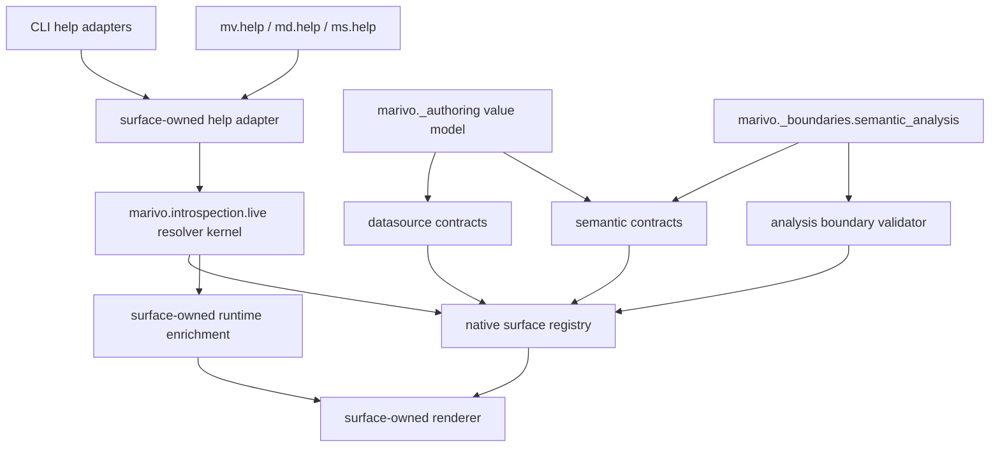

# Marivo Live Infrastructure Layering Design

Status: implemented; repository verification complete

Date: 2026-07-16

## Summary

Refactor Marivo's private live-help infrastructure into four explicit layers:

1. a neutral `marivo.introspection.live` resolution kernel;
2. a private `marivo._authoring` domain kernel shared only by datasource and
   semantic authoring;
3. surface-owned datasource, semantic, and analysis capability kernels;
4. a private semantic-analysis boundary protocol.

Before this cutover, the implementation had the right public behavior but an
imprecise internal ownership boundary. `marivo.introspection.live` called
itself neutral while also owning datasource/semantic authoring states, effects,
transitions, repairs, and semantic-analysis handoff schemas. Analysis,
meanwhile, retained a parallel resolver because its richer capability
descriptors could not be represented losslessly by the authoring-shaped
`LiveCapability` model.

The implemented design shares mechanisms without flattening domain contracts:

- `marivo.introspection.live` owns how a registered target is identified,
  resolved, reflected, bounded, and handed to a surface renderer;
- `marivo._authoring` owns the private cross-surface value model for the
  datasource-to-semantic authoring lifecycle;
- each public surface owns the meaning, topology, renderer, runtime contracts,
  and validation of its native capability registry;
- `marivo._boundaries.semantic_analysis` owns the directional handoff and
  continuity protocol between semantic and analysis.

This is an internal architectural cutover. It does not change public imports,
help targets, help text, signatures, result fields, operator behavior,
datasource effects, semantic readiness behavior, analysis type algebra, or
skill policy. No new public `authoring`, `introspection`, or `boundaries`
module is introduced.

## Relationship To Existing Designs

This design refines internal ownership in:

- [`2026-07-13-marivo-analysis-interface-surface-design.md`](2026-07-13-marivo-analysis-interface-surface-design.md);
- [`2026-07-13-marivo-semantic-live-interface-surface-design.md`](2026-07-13-marivo-semantic-live-interface-surface-design.md).

Those designs remain authoritative for their public surface contracts. This
document supersedes only their internal placement claims where they describe
one shared live capability model, one shared renderer, authoring contracts, or
semantic-analysis handoffs as neutral introspection infrastructure.

The boundary-kernel skills remain unchanged in responsibility:

- live help owns installed API and mechanical contract facts;
- object/result `.show()` and `.contract()` own current runtime facts and
  mechanically valid continuations;
- structured errors own typed repair;
- skills own policy boundaries, routing discipline, evidence continuity, and
  closeout obligations;
- the agent owns planning and judgment.

## Problem

### The neutral package owns domain vocabulary

Before this cutover, `marivo.introspection.live.model` contained all of the
following:

- generic surface identity and environment types;
- datasource/semantic authoring state ids;
- datasource/semantic effect and transition vocabularies;
- `AuthoringContract` and `AuthoringRepair`;
- `LiveCapability`, whose fields are shaped around authoring transitions;
- analysis-to-semantic and semantic-to-analysis handoff schemas.

The package is import-neutral, but import neutrality alone does not make a
model conceptually neutral. Names such as `semantic.previewed`,
`evidence.acquired`, `reacquire`, and `SemanticHandoffReceipt` express domain
meaning rather than target-resolution mechanics.

### Analysis cannot adopt the current shared descriptor losslessly

The analysis registry distinguishes operators, constructors, reads, recovery,
and boundaries. Its descriptors drive:

- parameter-name-to-input-family validation;
- artifact-family classification;
- family-preserving `SameAsInputFamily` outputs;
- generated type algebra;
- constructor-consumer reverse edges;
- artifact affordances;
- governed-entry and terminal-boundary guarantees;
- the runtime family gate.

The former `LiveCapability` exposed one string output family and authoring
input/state/effect fields. Converting analysis descriptors into it would have lost
runtime contract information. Keeping both models and generating one from the
other would create two registries whose help and execution contracts could
drift.

### Shared implementation and shared ownership are conflated

Datasource and semantic legitimately share the shape of authoring states,
effects, transitions, contracts, and repairs. That does not make those concepts
part of introspection. Conversely, concrete transition availability and repair
generation depend on surface-owned registries and runtime objects and must not
move into a shared authoring module.

### Handoff continuity is not introspection

Directional handoffs, project fingerprints, catalog fingerprints, readiness
status, and handoff receipts protect a cross-domain execution boundary. They
may reference a live help target and environment fingerprint, but their primary
responsibility is continuity validation, not symbol discovery.

### Duplicate resolver mechanics can drift

Datasource and semantic use the surface-parameterized resolver in
`marivo.introspection.live`. Analysis still owns parallel implementations of:

- target-kind dispatch;
- exact type and callable matching;
- error and semantic-object enrichment;
- lexical suggestion indexing;
- resolved-target variants.

The implementations currently behave similarly, but future changes can make
unknown-target errors, suggestions, callable identity, or runtime-object
resolution differ across surfaces.

## Decision

Adopt **mechanism sharing with native domain descriptors**.

The neutral kernel becomes generic over the descriptor type returned by a
surface registry. It does not require all surfaces to use one capability
schema. A resolved target retains the original native descriptor and is passed
to the owning surface renderer.

Datasource and semantic share a private authoring value model because they
participate in one authoring lifecycle. Their registries, contract builders,
renderers, errors, and runtime enrichers remain separate.

Analysis adapts its existing registry directly to the generic live resolver.
Its native descriptor union remains the only source for help topology, type
algebra, artifact affordances, and runtime family validation.

Directional semantic-analysis handoffs move to a private boundary module that
depends only on neutral identities and refs. Neither semantic nor datasource
owns the shared crossing protocol, and introspection does not acquire boundary
meaning.

## Design Principles

### Mechanism, not meaning

A concept belongs in `marivo.introspection.live` only when all of these are
true:

1. it applies to at least two public help surfaces;
2. it can be defined without datasource, semantic, artifact, readiness, or
   analysis vocabulary;
3. it does not decide whether a capability is legal or which capability should
   be chosen;
4. it performs no connection, query, mutation, project load, or artifact read;
5. it preserves the surface's native descriptor rather than translating it to
   a weaker common schema;
6. it can remain a leaf that imports none of `marivo.datasource`,
   `marivo.semantic`, or `marivo.analysis` at module load time.

Sharing alone is not sufficient. A shared domain concept belongs in a private
domain kernel, not automatically in introspection.

### One registry truth source per surface

Each public surface has exactly one native capability registry. Help,
runtime validation, object contracts, reverse edges, and drift checks consume
that registry directly or through a read-only view.

No migration step may materialize a second descriptor table for the shared
resolver. An adapter may normalize lookup method names or expose read-only
properties; it may not copy capability facts.

### Surface-owned meaning and rendering

The shared resolver answers only "what registered target is this?" The surface
renderer answers "what does this target mean on this surface?"

Root grouping, focused help sections, input/output algebra, authoring effects,
artifact boundaries, surface-specific reference briefings, error briefings, and
runnable examples remain surface-owned.

### Reflection supplies live Python facts

Callable signatures, docstrings, and callable identity come from the installed
Python objects. Registries store stable identity and relationships, not copied
parameter tables or long-form prose.

### Mechanical continuation is not policy

`AuthoringContract` and `ArtifactContract` report mechanically valid
continuations. They do not encode agent choice, business judgment, or the
ordered policy constraints owned by the packaged skills.

## Target Architecture



The dependency direction is downward toward smaller, more neutral concepts:

```text
marivo.refs
    ^
    |
marivo.introspection.live
    ^                 ^
    |                 |
marivo._authoring     marivo._boundaries.semantic_analysis
    ^      ^                    ^                 ^
    |      |                    |                 |
datasource semantic          semantic          analysis

analysis --------------------> marivo.introspection.live
```

`marivo._authoring` and `marivo._boundaries` are private packages and are not
added to any public `__all__`.

## Layer 1: Neutral Live Introspection Kernel

### Ownership

`marivo.introspection.live` owns:

- `HelpSurface`;
- `LiveHelpTarget`;
- `EnvironmentFingerprint`;
- `SurfaceLimits`;
- a minimal resolvable-descriptor protocol;
- a generic read-only registry protocol;
- `LiveSurface[D]`;
- `ResolvedLiveTarget[D]`;
- exact target-kind dispatch;
- exact callable, bound-method, type, runtime-object, and error matching;
- bounded lexical suggestion construction and ranking;
- callable-path import and identity helpers;
- generic signature/docstring reflection helpers;
- fingerprint rendering and masking;
- render-budget enforcement;
- generic unknown-target and cross-surface error payloads.

It does not own:

- capability kinds such as operator, authoring transition, or recovery;
- input or output family vocabularies;
- root groups or teaching order;
- authoring states, effects, contracts, or repairs;
- analysis artifacts, type algebra, or runtime family gates;
- semantic verification, preview, or readiness meaning;
- directional handoff schemas or project/catalog continuity;
- surface-specific error base classes;
- complete root or focused help rendering.

### Minimal descriptor protocol

The resolver requires only facts needed for identity and suggestions:

```python
class ResolvableHelpDescriptor(Protocol):
    @property
    def canonical_id(self) -> str: ...

    @property
    def public_entrypoint(self) -> str | None: ...

    @property
    def summary(self) -> str: ...
```

The protocol deliberately excludes inputs, outputs, states, effects,
constraints, examples, and boundary guarantees. Those facts remain on the
native descriptor type and are visible to the surface renderer through the
generic resolved target.

### Generic registry protocol

```python
DescriptorT_co = TypeVar("DescriptorT_co", covariant=True)

class LiveSurfaceRegistry(Protocol[DescriptorT_co]):
    surface: HelpSurface

    def canonical_ids(self) -> tuple[str, ...]: ...
    def by_canonical_id(self, canonical_id: str) -> DescriptorT_co: ...
    def by_callable(self, value: object) -> DescriptorT_co: ...
```

Registries may expose additional surface-owned methods. Analysis retains
`by_id`, type-algebra rows, reverse edges, and native descriptor iteration.
Datasource and semantic retain groups and consumed-type catalogs.

### Generic surface and resolved target

```python
@dataclass(frozen=True)
class LiveSurface(Generic[DescriptorT]):
    registry: LiveSurfaceRegistry[DescriptorT]
    type_index: Mapping[type, str]
    error_types: Mapping[str, type]
    error_base: type
    default_suggestions: tuple[str, ...]
    help_target_error: Callable[[object, tuple[str, ...]], NoReturn]
    enrich: Callable[[object], ResolvedLiveTarget[DescriptorT] | None] | None
    suggestion_index: LiveSuggestionIndex


@dataclass(frozen=True)
class ResolvedLiveTarget(Generic[DescriptorT]):
    kind: ResolveKind
    surface: HelpSurface
    canonical_id: str | None = None
    descriptor: DescriptorT | None = None
    type_name: str | None = None
    reference_id: str | None = None
    error_name: str | None = None
    error_kind: str | None = None
    original: object | None = None
```

The neutral resolve vocabulary is `descriptor`, `type_contract`,
`reference_briefing`, `error_contract`, and `error_briefing`. The former
`semantic_briefing` kind and `semantic_id` field were renamed to
`reference_briefing` and `reference_id`. The resolver treats the reference id
as opaque; only the surface-owned enrichment hook and renderer know whether it
identifies a semantic ref, catalog object, or another registered reference
family.

`original` remains available for surface-owned runtime briefings. The neutral
resolver never dereferences semantic refs, loads a project, reads an artifact,
or interprets an error repair.

`ResolvedLiveTarget` deliberately remains one private optional-field carrier
during this parity-first infrastructure cutover. This is a scoped exception to
the repository preference for closed kind-dispatched variants, not a reusable
public modeling pattern. Existing surface renderers already consume this shape,
and replacing it with a new resolved-target class hierarchy would add migration
risk without changing the public contract.

The exception is closed and mechanically checked:

| `kind` | Required payload | Other payload fields |
|---|---|---|
| `descriptor` | `canonical_id`, `descriptor` | must be `None` |
| `type_contract` | `type_name` | must be `None` |
| `reference_briefing` | `reference_id`, `original` | must be `None` |
| `error_contract` | `error_name` | must be `None` |
| `error_briefing` | `error_name`, `original`; optional `error_kind` | must be `None` |

Construction helpers and exhaustive tests enforce these combinations. No new
optional payload field or resolve kind may be added without either extending
this matrix explicitly or replacing the carrier with a closed variant union.

### Resolution behavior

The shared resolver preserves the current closed dispatch order:

1. canonical string lookup;
2. surface-owned enrichment for explicitly allowed runtime targets;
3. registered public type lookup;
4. registered callable or bound-method lookup;
5. registered runtime-object type lookup;
6. surface-owned typed help error with bounded suggestions.

There is no arbitrary attribute walking, duck-typed public-object acceptance,
fuzzy alias resolution, or automatic cross-surface redirect.

### Reflection behavior

Shared reflection helpers may:

- unwrap bound methods and properties;
- produce a stable dotted callable identity;
- import a registered callable path;
- obtain the installed signature and owned docstring;
- reject an unresolved or mismatched registered path.

They may not decide which parameters are invocation-critical, explain a
surface constraint, or construct a runnable example. Those remain renderer and
registry responsibilities.

### Rendering behavior

The neutral renderer layer is limited to:

- newline normalization;
- hard line/codepoint budget enforcement;
- exact or masked environment-fingerprint formatting;
- small formatting helpers that accept already interpreted values.

It must not render `AuthoringContract`, `ArtifactContract`, type algebra,
semantic briefings, or surface root indexes.

## Layer 2: Private Authoring Domain Kernel

### Placement

Create a private package:

```text
marivo/_authoring/
    __init__.py
    model.py
    render.py
    errors.py
```

The package owns the shared datasource-to-semantic mechanical authoring value
model. It is not a public authoring facade, workflow engine, planner, or third
help surface.

It depends on `marivo.introspection.live` for `LiveHelpTarget` and shared
render-budget primitives. `marivo.introspection.live` must not depend on
`marivo._authoring`.

### Shared authoring model

Move or rename the following concepts into `marivo._authoring.model`:

- `AuthoringStateId`;
- `AuthoringStateRef`;
- `DataAccessEffect`;
- `ConnectionEffect`;
- `MutationEffect`;
- `EffectFlag`;
- `AuthoringEffects`;
- `TransitionKind`;
- `TransitionInputRole`;
- `AuthoringInputRequirement`;
- `AuthoringTransition`;
- `AuthoringContract`;
- `RepairKind`;
- `AuthoringRepair`;
- the shared datasource/semantic capability value, renamed from
  `LiveCapability` to `AuthoringCapability`;
- `AuthoringCapabilityKind`.

The state and repair vocabularies remain closed because the runtime and help
surface promise exhaustive behavior. Names remain qualified where ownership
matters, such as `datasource.registered` and `semantic.ready`.

This shared vocabulary expresses the mechanical authoring domain, not skill
policy. For example, an available preview transition does not prove that the
skill's verify-before-preview policy has been satisfied.

### Shared authoring rendering and errors

Move the following out of neutral introspection:

- bounded `AuthoringContract` rendering;
- transition-state formatting;
- `ContractScopeErrorPayload`;
- contract-scope payload construction.

Surface-owned error classes continue to wrap the shared payload. The shared
module does not introduce a public authoring error hierarchy.

### Surface-owned contract construction

Keep concrete builders in:

- `marivo.datasource._capabilities.contracts`;
- `marivo.semantic._capabilities.contracts`.

Those modules own:

- runtime subject identity;
- state detection from current objects/results;
- capability-to-transition mapping;
- availability and blocker calculation;
- surface-specific input requirements;
- surface-specific repair construction;
- access to the native surface registry;
- deterministic final contract construction.

The shared authoring package must not import either surface registry or build a
contract from a datasource/semantic object.

### Normalization

Datasource and semantic currently duplicate contract normalization. The pure
normalization key is suitable for `marivo._authoring` only if both surfaces use
exactly the same ordering contract:

```text
surface
canonical target
transition kind
subject refs
input requirement roles/families/subjects/exact keys
```

If either surface requires a different domain ordering, normalization remains
surface-owned. Shared code must not impose a false universal teaching order.

## Layer 3: Surface-Owned Capability Kernels

### Datasource

`marivo.datasource._capabilities` owns:

- `DatasourceCapabilityRegistry`;
- datasource root groups;
- datasource input/output family catalogs;
- datasource type contracts and error catalog;
- datasource capability rows using `AuthoringCapability`;
- datasource effects and authoring transition facts;
- datasource runtime-object enrichment;
- datasource root/focused/type/error rendering;
- datasource contract builders and repair mapping;
- datasource live-surface adapter.

Datasource remains a leaf with respect to semantic and analysis. It may import
`marivo.introspection.live` and `marivo._authoring`.

### Semantic

`marivo.semantic._capabilities` owns:

- `SemanticCapabilityRegistry`;
- semantic root groups;
- semantic input/output family catalogs;
- semantic type contracts and error catalog;
- semantic capability rows using `AuthoringCapability`;
- semantic verification/preview/readiness transition facts;
- semantic runtime-object and ref enrichment;
- semantic root/focused/type/error rendering;
- semantic contract builders and repair mapping;
- semantic live-surface adapter.

Semantic may import datasource where the existing public semantic layer needs
physical datasource types, but the authoring kernel must not introduce a new
semantic-to-analysis import.

### Analysis

`marivo.analysis._capabilities` retains its native closed descriptor union:

- `OperatorCapability`;
- `ConstructorCapability`;
- `ReadCapability`;
- `RecoveryCapability`;
- `BoundaryCapability`;
- `SameAsInputFamily`;
- analysis input and artifact families;
- analysis root groups and visibility;
- type algebra;
- constructor-consumer reverse edges;
- runtime family validation;
- analysis type/error catalogs;
- analysis root/focused/type/error/semantic-briefing rendering.

Analysis adds a read-only adapter or protocol-conforming methods so its native
registry can be passed to `LiveSurface[CapabilityDescriptor]`. The adapter may
map canonical help lookup to existing `by_help_target`/`by_id` behavior. It
must return the original descriptor object.

Analysis does not convert descriptors to `AuthoringCapability` and does not
adopt authoring states, effects, transitions, or repairs.

### Analysis live-surface cutover

Add an `ANALYSIS_LIVE_SURFACE` configuration parallel to the datasource and
semantic configurations. It supplies:

- the native analysis registry view;
- the exact public type index;
- the analysis error catalog and base class;
- current default suggestions;
- analysis-owned unknown-target error construction;
- allowlisted enrichment for analysis errors, semantic refs/objects, and
  registered runtime objects.

`mv.help_text()` then uses the shared `resolve_live_target()` and passes the
generic resolved target to the existing analysis renderer.

After parity is proven, delete the analysis-owned duplicate resolver and
suggestion implementation. The analysis renderer and registry remain.

## Layer 4: Semantic-Analysis Boundary Protocol

### Placement

Create:

```text
marivo/_boundaries/
    __init__.py
    semantic_analysis.py
    fingerprints.py
```

This private package owns:

- `AnalysisToSemanticHandoff`;
- `SemanticToAnalysisHandoff`;
- `SemanticHandoffReceipt`;
- project fingerprint computation;
- catalog fingerprint computation;
- shared continuity-field rendering/masking helpers specific to the handoff.

It depends on:

- `marivo.refs` for typed semantic identities;
- `marivo.introspection.live` for `LiveHelpTarget` and
  `EnvironmentFingerprint`.

It imports none of `marivo.datasource`, `marivo.semantic`, or
`marivo.analysis` at module load time.

### Ownership

Semantic owns producing `SemanticToAnalysisHandoff` from readiness. Analysis
owns validating it and producing `SemanticHandoffReceipt`. Analysis owns
producing `AnalysisToSemanticHandoff` for genuine semantic absence. The private
boundary package owns only the shared schemas and deterministic continuity
algorithms.

The boundary package does not choose an operator, infer a semantic object,
accept warnings, run readiness, or mutate session state.

### Persistence boundary

Directional handoff and receipt objects are in-memory boundary values. They do
not appear in session-store rows, project state, user-global state, artifact or
job metadata, evidence storage, or any other Marivo persistence schema.
`ReadinessReport.to_dict()` may produce a masked display projection of a
handoff, but that render is not a repository persistence contract.

This non-persistence rule is a prerequisite for the atomic private-type move.
If a future design persists a handoff or receipt, it must first define a
versioned storage schema, serialization identity, privacy behavior, and
backward-compatible decode/migration rules. It may not rely on the private
module relocation guarantees in this design.

### No compatibility re-export

Because these are private internal modules, the cutover updates all internal
imports atomically. It does not leave re-exports from
`marivo.introspection.live.model` or
`marivo.analysis._capabilities.model` as a second supported location.

Public field annotations and runtime object identity remain stable within the
candidate package. No handoff type is added to a public module `__all__`.

## Target Package Layout

```text
marivo/
    introspection/
        live/
            __init__.py       # neutral ownership declaration only
            model.py          # targets, environment, limits, generic protocols
            resolve.py        # generic target resolution and suggestions
            reflect.py        # callable identity/import/signature helpers
            render.py         # budgets and environment rendering
            errors.py         # generic help-target payloads

    _authoring/
        __init__.py
        model.py              # authoring state/effect/transition/contract/repair
        normalize.py          # shared deterministic contract normalization
        render.py             # bounded authoring-contract rendering
        errors.py             # contract-scope payloads

    _boundaries/
        __init__.py
        semantic_analysis.py  # directional handoff schemas and receipt
        fingerprints.py       # project/catalog continuity fingerprints

    datasource/
        _capabilities/
            model.py
            registry.py
            surface.py
            render.py
            contracts.py
            validation.py

    semantic/
        _capabilities/
            model.py
            registry.py
            surface.py
            render.py
            contracts.py
            validation.py

    analysis/
        _capabilities/
            model.py
            registry.py
            surface.py
            render.py
            validation.py
```

The file split is a target ownership map, not a requirement to create one file
per tiny type. Implementation may combine small files when doing so preserves
the dependency rules and keeps domain vocabulary out of the neutral kernel.

## Import Contracts

Retain the existing rules:

- datasource must not import semantic or analysis;
- semantic must not import analysis;
- `marivo.introspection.live` must not import datasource, semantic, or
  analysis.

Add:

- `marivo.introspection.live` must not import `marivo._authoring` or
  `marivo._boundaries`;
- `marivo._authoring` must not import datasource, semantic, analysis, or
  `_boundaries`;
- `marivo._boundaries` must not import datasource, semantic, analysis, or
  `_authoring`;
- analysis must not import datasource/semantic merely to configure its live
  resolver at module import time; existing runtime semantic integration remains
  explicit and lazy where required.

The intended private dependency graph is acyclic:

```text
introspection.live <- _authoring <- datasource
introspection.live <- _authoring <- semantic
introspection.live <- _boundaries <- semantic
introspection.live <- _boundaries <- analysis
introspection.live <- analysis._capabilities
```

## Public Contract Preservation

The refactor must preserve:

- `mv.help`, `mv.help_text`, `md.help`, `md.help_text`, `ms.help`, and
  `ms.help_text` signatures and return behavior;
- all current canonical help targets;
- root/focused help grouping and bounded content;
- CLI environment fingerprints and command routing;
- exact type/callable/runtime-object/error target acceptance;
- surface-owned typed help errors and suggestions;
- datasource and semantic `.contract()` return behavior;
- analysis `ArtifactContract` behavior;
- analysis type algebra and runtime family gate;
- datasource effect and explicit-scope facts;
- semantic verification, preview, readiness, and handoff behavior;
- directional handoff validation and receipt identity;
- public `__all__` snapshots.

Private import paths are intentionally not compatibility contracts. Repository
tests must migrate to the new private owners rather than pin old locations.

## Migration Plan

The implementation is one internal architectural cutover with ordered
workstreams. Intermediate commits may exist locally, but no candidate package
may expose a mixed ownership state.

### Phase 1: Lock behavior and dependencies

- Record the current root/focused help output and target-resolution matrix for
  all three surfaces.
- Assert current analysis registry/type-algebra/runtime-gate identity.
- Assert datasource/semantic authoring state, transition, effect, repair, and
  contract behavior.
- Assert handoff schema identity, fingerprint algorithms, and receipt
  validation.
- Assert that no handoff or receipt type or serialized payload is present in
  session, project, artifact, job, evidence, or user-global persistence.
- Extend import-linter contracts for the target private layers before moving
  domain code.

### Phase 2: Generalize the neutral resolver

- Introduce the minimal descriptor protocol and generic registry protocol.
- Make `LiveSurface`, `ResolvedLiveTarget`, suggestion indexing, and resolution
  generic over the native descriptor type.
- Extract neutral reflection helpers.
- Keep datasource and semantic behavior unchanged while migrating their type
  annotations.
- Prove root/focused help and error parity.

### Phase 3: Adapt analysis to `LiveSurface`

- Add protocol-conforming methods or a read-only native-registry view.
- Add `ANALYSIS_LIVE_SURFACE` and analysis enrichment/error hooks.
- Route `mv.help_text()` through the shared resolver.
- Keep the analysis renderer and descriptor union unchanged.
- Prove exact resolution, suggestions, type algebra, artifact contracts, and
  runtime family-gate parity.
- Delete the duplicate analysis resolver and suggestion implementation only
  after parity tests pass.

### Phase 4: Extract the private authoring kernel

- Move authoring states, effects, transitions, contracts, repairs, and the
  shared authoring capability model from introspection into
  `marivo._authoring`.
- Rename `LiveCapability` to `AuthoringCapability`.
- Move authoring contract rendering and contract-scope payloads.
- Update datasource and semantic imports atomically.
- Keep concrete builders and registry ownership in their surface modules.
- Remove old private re-exports rather than maintaining two locations.

### Phase 5: Extract the semantic-analysis boundary

- Move directional handoff schemas and receipts into
  `marivo._boundaries.semantic_analysis`.
- Move project/catalog continuity fingerprints into the boundary package.
- Update semantic producers, analysis consumers, errors, tests, and renderers
  atomically.
- Preserve masked ordinary rendering and exact environment diagnostics.
- Remove handoff/fingerprint ownership from introspection.

### Phase 6: Close ownership and documentation drift

- Narrow the `marivo.introspection.live` package docstring to mechanism-only
  ownership.
- Update the two July 13 live-interface specs to reference this design for
  internal placement.
- Update import-linter contracts and architecture tests.
- Remove obsolete relocation/backward-compatibility assertions.
- Verify no active code or spec describes `LiveCapability` as a neutral
  cross-analysis descriptor.
- Run the full repository gates.

## Verification Strategy

### Neutral-kernel tests

- Resolve canonical strings, registered callables, bound methods, public types,
  runtime objects, error types, and error instances through each surface.
- Reject private, arbitrary, and cross-surface objects with the owning typed
  error.
- Produce deterministic bounded suggestions from native descriptors.
- Preserve the original native descriptor object in the resolved target.
- Prove the resolver performs no connection, query, mutation, project load, or
  artifact read.
- Enforce root/focused output budgets without silent truncation.

### Analysis parity tests

- Every analysis capability id/help target still resolves.
- Every registered callable maps to the same native descriptor identity.
- Generated type-algebra rows are byte-for-byte unchanged.
- `SameAsInputFamily` remains typed and drives family-preserving output.
- Constructor-consumer reverse edges are unchanged.
- Runtime `validate_capability_inputs()` consumes the same registry object.
- Artifact `.contract()` affordances and boundary ports are unchanged.
- Semantic-ref and error-instance briefings remain bounded and equivalent.

### Authoring tests

- Datasource and semantic registries use `AuthoringCapability` without a
  duplicate descriptor table.
- Every authoring state/effect/transition/repair remains in the closed
  vocabulary.
- Contract normalization is deterministic.
- Datasource contracts never include semantic-owned transitions except through
  explicit namespaced handoff targets.
- Semantic contracts do not reconstruct datasource evidence or effects.
- Contract rendering and scope errors retain current budgets and repairs.
- Skill-owned policy order is not added as fake runtime state.

### Boundary tests

- Semantic readiness produces the same typed handoff facts.
- Analysis rejects stale environment, project, catalog, ref, readiness, and
  preview-evidence facts before issuing a receipt.
- Project and catalog fingerprints remain byte-for-byte compatible.
- Ordinary handoff/receipt rendering masks paths; explicit environment
  diagnostics reveal them.
- Construct and validate a handoff, persist and recover the owning session, and
  prove that no handoff or receipt object/payload was written to session rows,
  artifact/job metadata, project state, evidence storage, or user-global state.
- Assert that no persistent model or store schema includes a handoff/receipt
  field; a display-only `ReadinessReport.to_dict()` projection does not satisfy
  or weaken this assertion.
- The private boundary package imports no surface module.

### Surface and packaging tests

- Public `__all__` snapshots are unchanged.
- No private infrastructure package appears in root help.
- CLI and Python help remain equivalent.
- Candidate-wheel help fingerprints match the execution interpreter/package.
- Active specs agree on ownership.
- Import-linter proves the target dependency graph.

### Repository gates

Run focused tests first, then:

```text
make test
make typecheck
make lint
make examples-check
```

Implementation verification completed on 2026-07-16: all 3,635 repository
tests passed, type checking passed for 228 source files, lint and all six import
contracts passed, and the example suite passed. Focused public-help parity
checks also preserved the existing normalized output for analysis, datasource,
and semantic targets.

## Risks And Mitigations

### Generic infrastructure becomes an optional-field mega-model

Mitigation: the neutral descriptor protocol contains identity/suggestion facts
only. Resolved targets remain generic over the native descriptor. The existing
private optional-field resolved-target carrier is retained only as the explicit
parity exception defined by the closed kind/payload matrix above; construction
and exhaustive tests reject every invalid combination and prevent field growth.

### An adapter becomes a second registry

Mitigation: require identity-preserving lookup tests. The adapter returns the
exact native descriptor object and stores no descriptor rows.

### Moving private types breaks runtime Pydantic identity

Mitigation: perform the move atomically, update all internal imports and tests,
and verify serialization/repr/field parity. Do not preserve two class objects
or compatibility subclasses. This mitigation depends on handoff and receipt
objects remaining absent from every persistence schema. The boundary test must
prove that premise before relocation; if it fails, a versioned persistence
migration is required and this move cannot proceed as specified.

### Shared authoring normalization imposes false ordering

Mitigation: share normalization only when both surface contracts intentionally
use the same mechanical ordering. Keep teaching order and policy order outside
the shared function.

### Handoff extraction creates import cycles

Mitigation: the boundary package depends only on refs and the neutral live
kernel. Surface behavior remains in semantic/analysis and imports the shared
schemas in one direction.

### Refactoring help changes agent behavior unintentionally

Mitigation: make public output parity a release gate. Any deliberate help
content change requires a separate public-surface decision rather than being
smuggled into the infrastructure refactor.

## Rejected Alternatives

### Make every surface use `LiveCapability`

Rejected because the current model is authoring-shaped and cannot preserve
analysis input-family mappings, type algebra, family-preserving outputs,
artifact affordances, or boundary guarantees.

### Convert analysis descriptors into `LiveCapability` rows

Rejected because it creates a second help registry separate from the runtime
family gate and artifact contracts.

### Move all authoring contracts into `marivo.semantic`

Rejected because datasource would depend on a higher semantic layer and
semantic would incorrectly own datasource declaration, connection,
inspection, scope, and evidence states.

### Move all authoring contracts into `marivo.datasource`

Rejected because datasource would own semantic load, verification, preview,
readiness, and handoff vocabulary.

### Keep authoring and handoff models in introspection

Rejected because import neutrality is not conceptual neutrality. It obscures
ownership and makes future analysis integration appear to require authoring
semantics.

### Duplicate datasource and semantic contract models

Rejected because the surfaces intentionally share one mechanical authoring
protocol and result convention. Duplicating the envelope would create
avoidable drift while still failing to establish a correct owner.

### Create a public `marivo.authoring` facade

Rejected because users already have the correct public owners: `md` for
datasource contracts and `ms` for semantic contracts. The shared layer is
private implementation infrastructure, not a third authoring API.

## Acceptance Criteria

- `marivo.introspection.live` contains no authoring, artifact, readiness, or
  semantic-analysis handoff vocabulary.
- The shared resolver accepts native datasource, semantic, and analysis
  descriptors without conversion.
- Each surface has exactly one capability registry truth source.
- Analysis help uses the shared resolver while type algebra, runtime family
  validation, and artifact contracts continue to use the native analysis
  registry.
- Datasource and semantic share the private authoring value model while keeping
  concrete contract builders and renderers surface-owned.
- Directional handoff schemas and project/catalog fingerprints have one private
  boundary owner outside introspection.
- Neutral resolution uses `reference_briefing` and `reference_id`; no
  semantic-specific resolve kind or payload field remains in
  `marivo.introspection.live`.
- The private optional-field `ResolvedLiveTarget` is limited to its documented
  closed kind/payload matrix and every invalid combination is rejected.
- Handoff and receipt types and payloads are absent from all Marivo persistence
  schemas; their atomic private relocation depends on this invariant.
- Existing public APIs, help text, target resolution, errors, contracts, and
  runtime behavior are unchanged.
- The target import graph is enforced mechanically.
- No compatibility alias, dual registry, public infrastructure module, or
  mixed old/new ownership path remains.
- Focused and full repository gates pass.
