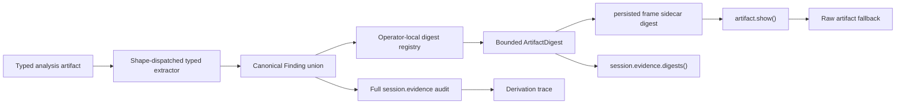

# Marivo Evidence Typed Digest Refactor Design

Status: proposed

Date: 2026-07-18

## Summary

Refactor the Marivo Evidence Engine from a three-stage
`finding -> proposition -> assessment` judgment model into a two-stage,
operator-local evidence model:

```text
typed artifact -> typed findings -> bounded ArtifactDigest
```

Marivo remains a deterministic Python analysis library. This design adds no
LLM, model provider, prompt, natural-language inference, or agent-authored
judgment runtime.

The new engine keeps deterministic extraction, stable identities, provenance,
quality context, bounded rendering, artifact-local mechanical contracts, and
raw audit access. It removes system-seeded propositions, generic assessment
status, fixed numeric confidence, causal-sounding attribution roles, the
`SessionKnowledge` projection, and the persisted follow-up/planner subsystem
from the default and public evidence contract.

The agent-facing result is a typed, bounded abstraction of one artifact. It
states what the operator computed, the epistemic kind of each item, which
relevant inferences were not computed, what was omitted from the bounded view,
and how to reach the raw artifact or canonical findings. It does not state a
generic final conclusion.

The same cutover applies only the minimum public-surface repairs directly
justified by live defects: preserve affordance parameter roles, replace the
candidate selector's `Any` return with a closed value, and bound session
collection reads with simple keyset pages. It does not introduce an invocation
planner, a new repair ontology, candidate continuation machinery, or snapshot
pagination semantics.

This design defines one atomic **Cutover A**: typed digest plus deletion of the
assessment/knowledge/follow-up model and the minimum dependent contract fixes.
A broader **Loop V2** is explicitly outside this release. It may receive a
separate design and breaking cutover only after the external Suite B has a
calibrated, preregistered baseline. No released Cutover A state exposes both old
and new evidence semantics as competing agent paths.

## Evidence for the decision

A preregistered five-condition ablation used ten persisted artifacts from the
live `~/source/silin/test` environment. The cases covered scalar change,
additive and weighted attribution, hypothesis testing, weak and strong sample
association, forecasting, anomaly candidates, quality, and a 418-row panel.
GLM-5.2 generated 100 valid answers and GPT-5.5 generated 50; each model family
blindly judged the other, and 43 answers received manual audit.

The experiment separated five inputs:

1. bounded raw artifact;
2. ideal typed digest only;
3. raw plus ideal typed digest;
4. raw plus current evidence statements with labels removed;
5. raw plus current evidence statements and assessment labels.

The observed product-level results were:

| Comparison | GLM-5.2 | GPT-5.5 |
| --- | ---: | ---: |
| digest fact recall minus raw | +0.15 | +0.05 |
| digest limitation recall minus raw | +0.35 | +0.10 |
| digest forbidden-claim rate minus raw | -0.033 | 0 |
| digest input surface versus raw | -63.7% | -63.7% |
| digest output tokens versus raw | -29.9% | -21.4% |
| digest latency versus raw | -22.1% | -13.3% |

On the seven label-eligible cases, current assessment labels added zero fact
recall and zero limitation recall over the same neutral facts. They reduced
directness in both model families and increased forbidden claims, unsupported
assertions, or unqualified label copying. GLM label copying increased by 64.3
percentage points; GPT label copying increased by 14.3 points.

The experiment therefore supports the proposed typed digest, not the current
Evidence Engine as a whole. Neutral current statements had little or no stable
value over raw artifacts. The positive treatment included explicit epistemic
kinds, operator boundaries, `not_computed` information, omissions, provenance,
and fallback guidance that the current projection does not consistently carry.

The experiment is sufficient for this architecture decision. It is not a proof
that one digest is sufficient for every future agent question. This design
therefore makes sufficiency task-relative and retains canonical findings and a
raw-artifact fallback.

The experiment is not considered a durable decision record until its
preregistration, frozen cases, prompts and schemas, deterministic scorer, valid
raw generations, cross-family judgments, manual audit, invalid-run ledger,
summary outputs, and lock manifest are committed in the sibling
`../marivo-agent-evals` project. That repository owns model-backed agent UX
evaluation and installs the exact target Marivo wheel into a SHA-addressed
environment. Secrets, provider credentials, caches, and model-private reasoning
are excluded from committed assets. Marivo records the external evaluator
commit, scenario-manifest hash, target Marivo SHA, wheel hash, model ids, and
report id used for the decision; it does not vendor prompts, transcripts,
model profiles, or model-backed runners.

## Relationship to existing contracts

This design preserves the three use situations defined by
[`docs/specs/analysis/evidence-access-surface.md`](../../specs/analysis/evidence-access-surface.md):

- result-bound immediate reading;
- session-bound recap and recovery;
- object-bound audit and replay.

It does not preserve the old three-surface API layout. Result reading remains on
the artifact. Session recap and object audit share one direct
`session.evidence` namespace. `session.knowledge()` is removed instead of being
rebuilt around the new digest.

It supersedes that document's contracts for:

- proposition seeding and assessment recomputation;
- `validated | refuted | inconclusive | pending` as generic evidence status;
- generic numeric evidence confidence and `confidence_basis`;
- `driver` facts and threshold-derived contribution roles;
- `session.knowledge()`, `SessionKnowledge`, and every `knowledge.*` method;
- `OpenQuestion`, `OpenAnomaly`, `OpenItemKind`, `OpenQuestionReason`, and
  `BlockedFollowup`;
- `recommended_followups`, `FollowupAction`, `TriggeredByFollowup`, the
  follow-up table/execution markers, and C1/C2 generation;
- the mixed `BlockingIssue` base schema and the misleading `ConfidenceScope`
  name, replaced by `ArtifactIssue` and `AnalysisScope`;
- the proposition/assessment public audit API;
- the proposition, assessment snapshot, and assessment-edge write path.

It also supersedes the typed item and projection sections of
[`2026-07-10-intent-result-evidence-summary-design.md`](2026-07-10-intent-result-evidence-summary-design.md).
That design's single `artifact.show()` read path, bounded commit-time snapshot,
evidence-before-preview rendering, failure isolation, deterministic ordering,
and session/raw-audit separation remain valid. The older decision to use
`SessionKnowledge` as the session recap object is superseded: the ablation
validated artifact digests, not a second cross-artifact taxonomy or planner.

The planned `EventFrame` / `LifecycleFrame` extension in the canonical evidence
spec is preserved, but its observation, persistence, verification, and failure
sections must be rewritten in finding/digest vocabulary during the atomic
cutover. Those frames remain planned rather than implemented at this design
date. The canonical spec's proposed `AnalysisScope` tagged variants are retained
only as a future-design disposition: their concrete variants and compatibility
behavior belong to the corresponding future frame designs rather than Cutover
A, and they do not become digest confidence.

This is documentation disposition only: Cutover A adds no Event/Lifecycle
runtime type, extractor, help entry, or test fixture. Semantic-hypothesis
candidates continue to emit no evidence finding or digest item until a
statistical operator actually runs.

The cutover also amends
[`session-state-and-runtime.md`](../../specs/analysis/session-state-and-runtime.md)
and [`operators-and-frames.md`](../../specs/analysis/operators-and-frames.md),
which currently refer to `judgment.db`, established facts, or assessment-era
terminology. Acceptance requires these files and the canonical evidence spec to
describe one digest-era contract.

Until this design is implemented atomically, the installed live API and the
active canonical specs remain authoritative.

## Current problem

### Assessment does not add independent evidence

The current runtime seeds a proposition directly from one finding and then
assesses that proposition from the same seed finding. Examples include:

- a delta direction creates a change proposition, then validates it when the
  seed direction matches the direction copied into the proposition;
- a decomposition share is classified by fixed thresholds as
  `primary_driver` or `secondary_driver`, then validated whenever the same seed
  contains a concrete share;
- `reject_null` creates a tested-hypothesis proposition, then becomes a generic
  validated/refuted assessment;
- a correlation result without a p-value becomes inconclusive with numeric
  confidence `0.3`;
- every validated family receives the same numeric confidence `0.9`.

This is deterministic, but it is not corroboration. The proposition and latest
assessment add identities and history around a fact that is already present;
they do not add a new measurement, sample, test, model, reviewer, or independent
source.

### Generic labels are semantically wider than their predicates

`validated` does not say what was validated. A null rejection, a matching
delta direction, a non-null algebraic contribution share, and a reviewed
anomaly are different predicates with different statistical meanings. Mapping
all of them to one status encourages consumers to interpret the status as the
truth of a broader claim.

The current `0.9` and `0.3` constants have no declared target event,
calibration population, scoring rule, held-out calibration result, or frequency
interpretation. They are rule categories encoded as numbers, not statistical
confidence.

### Attribution terminology crosses the computation boundary

A contribution value or share can be an exact algebraic decomposition under a
declared formula. A fixed share threshold cannot turn that decomposition into a
causal driver. `primary_driver` is therefore stronger than the evidence unless
the input comes from a separately declared causal design, which current
attribution operators do not implement.

### The bounded surface hides the right limitations

The current summary persists a free-form `statement` plus optional status and
confidence. It does not make the following uniformly machine-readable:

- significance statistics were not computed;
- an attribution is algebraic rather than causal;
- a forecast has no observed actual or accuracy evaluation;
- an anomaly remains a detector candidate;
- a raw preview or digest omitted items;
- a question falls outside the digest's registered task class.

The ablation indicates that these boundaries, rather than generic labels, are
the valuable part of a compact surface.

### Session knowledge and follow-ups cross the same boundary

The current `SessionKnowledge` snapshot is not a neutral recap. It reconstructs
facts from proposition/assessment joins, merges anomalies with synthetic
questions, groups an issue into an `OpenQuestion` after it appears on two
artifacts, labels remediation actions as `blocked_followups`, and exposes the
first five commit-ordered actions as `next_steps`.

Those names are stronger than the implemented predicates:

- `next_steps()` performs no task-relative ranking or decision; it deduplicates
  persisted actions, preserves commit order, and truncates;
- `blocked_followups()` returns unexecuted actions whose source issue remains
  unresolved, even though such a remediation may be exactly what can run next;
- `OpenQuestion` turns a repeated issue kind into question state using an
  arbitrary two-artifact threshold and assessment-shaped fields;
- `open_items()` merges detector candidates and repeated issues even though
  they have different epistemic kinds and lifecycles;
- the public session wrappers never set `TriggeredByFollowup`, and no runtime
  path resolves `blocking_issues.resolved_by_step_id`, so the persisted
  execution/open-state model cannot stay truthful.

The repository already has the correct boundary: `artifact.contract()` derives
mechanical compatibility from the live capability registry and explicitly does
not rank, recommend, or choose. Persisting C1/C2 recommendations beside that
contract creates a second planner surface with weaker semantics. The ablation
did not test or justify this cross-artifact planner layer.

### The current continuation contract loses invocation roles

The live capability registry knows public parameter roles such as
`compare(a, b)`, `attribute(frame)`, `forecast(history)`, and
`assess_quality(target)`. The current artifact contract flattens those mappings
into a family-only `required_inputs` list and one generic
`deterministic_slots={"source_ref": ...}` entry. An agent can discover that an
operator accepts the artifact family but cannot mechanically determine where
the artifact ref belongs in the call. After removing the follow-up subsystem,
leaving this shape unchanged would make the only continuation surface weaker
than its stated contract.

### The current recap and candidate exits are not bounded typed loops

`frame_summaries()` and evidence collection reads return ordinary lists without
cursor bounds. Bounding each digest does not bound a session containing many
digests.

Candidate consumption has a parallel ambiguity: the live object-local selector
accepts a free-form `attribute` and returns `Any`, while canonical prose also
mentions a separate `session.select(...)` route. Neither shape satisfies one
path per capability or a typed write-execute handoff.

### The existing ablation validates reading, not the full loop

The preregistered evidence ablation measures conclusion quality, limitation
recall, forbidden claims, token volume, and latency from supplied inputs. It
does not measure whether an agent can turn `contract()` into a legal call,
recover through a typed repair, consume a candidate, or resume a persisted DAG
after context loss. The digest decision remains supported, but this evidence
cannot justify a new public loop contract in Cutover A. It supplies the
measurement plan for a later Loop V2 design instead.

## Goals

1. Give an agent a compact, typed, directly useful view of each intent result.
2. Make every emitted item derivable from the artifact and operator contract.
3. Preserve scope, window, grain, alignment, method, unit, and provenance.
4. Encode epistemic kind and missing inference explicitly.
5. Bound the default surface without claiming universal sufficiency.
6. Preserve canonical findings and raw-artifact fallback for unregistered or
   detail-dependent questions.
7. Use the same persisted digest for result rendering and session recap.
8. Keep evidence failure independent from successful analysis computation.
9. Reduce the public evidence model and remove uncalibrated judgment semantics.
10. Make future evidence-surface value testable through a versioned ablation
    harness owned by `../marivo-agent-evals`.
11. Keep planning on the agent side: Marivo exposes computed evidence,
    artifact-local compatibility, exact blockers, and typed repairs, but no
    session-level next-step queue or open-work interpretation.
12. Repair only verified public-contract defects required by the cutover:
    preserve affordance parameter names/roles, remove the candidate selector's
    `Any`, and make session collection reads bounded by default.

## Non-goals

This refactor does not add:

- an LLM or external model runtime;
- natural-language conclusion generation;
- business recommendations, strategy, or action selection;
- causal inference;
- automatic semantic-object authoring;
- an agent-authored proposition or assessment write path;
- a universal sufficient statistic for arbitrary questions;
- a general rule engine or user-extensible production-rule language;
- a calibrated probability model;
- a second report, dashboard, or publishing layer;
- a replacement for `artifact.to_pandas()` or canonical evidence audit;
- enumerated invocation options or a generated-call planner;
- a replacement repair type hierarchy;
- candidate-level continuation affordances or execution constraints;
- snapshot/HWM pagination, total-count snapshots, or cross-query cursor policy;
- compatibility aliases for any removed knowledge, follow-up,
  proposition/assessment, or audit API.

## Normative principles

### N1 — Operator-local entailment

Every emitted digest item must satisfy a registered derivation rule:

```text
artifact + operator contract |- typed digest item
```

The rule names exact source fields and a version. If no rule exists, Marivo
does not emit the item.

### N2 — No epistemic upgrade

The digest may normalize, aggregate, rank, or bound computed information. It
must not upgrade:

- association to causality;
- algebraic contribution to causal driver;
- null rejection to a proven business hypothesis;
- predicted value to known future value;
- candidate anomaly to confirmed incident;
- one expectation pass to general data validity;
- a rule category to calibrated probability.

### N3 — Unknown and not computed are data

Missing p-values, confidence intervals, actuals, accuracy evaluation, causal
design, or complete rows are represented explicitly when they are material to
the operator's ordinary interpretation. They are never filled with defaults or
silently omitted in a way that makes a stronger interpretation appear valid.

### N4 — Sufficiency is task-relative

The digest supports a registered artifact-reading task class. It does not
claim to answer every question. Its fallback descriptor identifies when full
findings or raw rows may be needed.

### N5 — Provenance is not confidence

Source references and derivation rules establish traceability. They do not
establish truth probability. Provenance fields never feed a numeric confidence
score.

### N6 — One persisted projection

`artifact.show()` and `session.evidence.digests()` consume the same persisted
`ArtifactDigest`. They never independently reinterpret raw finding payloads.

### N7 — Typed values before prose

The canonical digest stores closed typed values, not rendered statements.
Rendering is a pure view over those values. An agent can consume structured
fields without parsing text.

### N8 — Bounded by default, complete by audit

The digest is deliberately bounded. Full typed findings remain available from
`session.evidence`; raw artifact rows remain available through the artifact's
existing structured and terminal exits.

Session collection reads are also bounded. A bounded item type inside an
unbounded Python list does not satisfy this principle. Summary, digest, and
finding queries return deterministic keyset pages with explicit `has_more` and
`next_cursor`; complete audit is obtained by paging, never by an unbounded
default return.

### N9 — Mechanical continuation is role-preserving

`artifact.contract()` may expose every compatible capability, but each input row
must retain its public parameter name, accepted families, and whether the current
artifact can bind that parameter. It never flattens `compare(a=..., b=...)`,
`attribute(frame=...)`, `forecast(history=...)`, or
`assess_quality(target=...)` into a family-only list or a generic `source_ref`.
The contract does not enumerate binding combinations, generate calls, or choose
among valid roles or capabilities.

## Safe inference ceiling

Marivo's deterministic evidence runtime stops at L2 by default:

| Level | Allowed output | Forbidden upgrade |
| --- | --- | --- |
| L0 structural | availability, row count, scope, window, grain, omission | business correctness |
| L1 computed | delta, rank, algebraic contribution, coefficient, statistic, predicate result, interval | cause or external validity |
| L2 bounded interpretation | sample association, algebraic contributor, detector candidate, model forecast | business impact, calibrated belief, action conclusion |
| L3 judgment | causal, strategic, policy, business, or action conclusion | not emitted by this runtime |

L3 requires premises or designs outside the operator artifact. Adding more
deterministic rules does not remove that requirement.

## Target type model

### Epistemic kinds

Every digest item has one closed epistemic kind:

```python
EpistemicKind = Literal[
    "observed",
    "algebraic",
    "estimated",
    "tested",
    "predicted",
    "candidate",
]
```

The kind describes how the value was produced. It is not a quality score or
truth probability.

### Derivation

```python
class DerivationRule(BaseModel):
    rule_id: str
    rule_version: str
    operator: str
    source_fields: tuple[str, ...]
    source_finding_refs: tuple[str, ...]
```

`source_fields` contains paths owned by the typed artifact/finding contract.
The runtime does not accept caller-authored rule ids or field paths.

### Digest item union

The public item family is a closed discriminated union:

```python
DigestItem = Annotated[
    ObservationFact
    | ChangeFact
    | ContributionFact
    | AssociationFact
    | TestDecision
    | ForecastOutput
    | AnomalyCandidate
    | QualityCheckResult,
    Field(discriminator="kind"),
]
```

Every variant shares:

```text
item_id
kind
epistemic_kind
artifact_ref
subject
scope
derivation
```

Variant fields are precise and non-overlapping. There is no optional-field
mega-class and no generic payload on a public digest item.

The closed item discriminator is:

```python
DigestItemKind = Literal[
    "observation",
    "change",
    "contribution",
    "association",
    "test_decision",
    "forecast_output",
    "anomaly_candidate",
    "quality_check",
]
```

`epistemic_kind` is fixed by the item variant in v1:

| Digest item | Fixed epistemic kind |
| --- | --- |
| `ObservationFact` | `observed` |
| `ChangeFact` | `algebraic` |
| `ContributionFact` | `algebraic` |
| `AssociationFact` | `estimated` |
| `TestDecision` | `tested` |
| `ForecastOutput` | `predicted` |
| `AnomalyCandidate` | `candidate` |
| `QualityCheckResult` | `tested` |

The field is intentionally redundant with the discriminator. It gives generic
filters and audit tooling a stable epistemic axis without making consumers
maintain their own item-kind mapping. Validation rejects a mismatched pair.
`QualityCheckResult` is `tested` because it reports evaluation of one exact
expectation predicate; its measured input remains present in the source quality
finding. Intrinsic `QualitySummary` metadata is context, not a predicate result.
The pure renderer includes non-null quality context, including scoped evaluated,
failed, and warning check counts for a quality report; it does not upgrade those
counts into a global validation label.

The key renames are:

| Current type/term | Target type/term | Reason |
| --- | --- | --- |
| `ObservationSummary` | `ObservationFact` | one typed observation digest |
| `ChangeFact` with assessment base | `ChangeFact` without assessment fields | preserve computed change only |
| `AttributedDriver` | `ContributionFact` | remove causal implication |
| `AssociationSummary` | `AssociationFact` | identify a sample estimate |
| `TestedHypothesis` | `TestDecision` | report the exact test decision |
| `ForecastSummary` | `ForecastOutput` | distinguish model output from truth |
| `OpenAnomaly` | `AnomalyCandidate` | candidate state is intrinsic |
| `ArtifactEvidenceItem.statement` | pure renderer over `DigestItem` | prevent prose from becoming canonical data |

`ContributionFact` carries contribution value, share when defined, dimension
keys, contribution rank, and decomposition method. It carries no
`primary_driver`, `secondary_driver`, or generic role.

`TestDecision` carries null, alternative, method, alpha, statistic, p-value,
sample size, effect estimate and interval when computed, and `reject_null`. It does not convert
`reject_null` into `validated` or `refuted`.

`AnomalyCandidate` retains the detector inputs that make the candidate directly
readable: candidate reference, score, threshold, rank, current and baseline
values, absolute and relative deviation, and the detector's flag level. These
remain candidate facts; none implies confirmation, cause, or impact.

### Inference boundaries

```python
class InferenceBoundary(BaseModel):
    kind: InferenceBoundaryKind
    reason: InferenceBoundaryReason
    required_evidence: tuple[RequiredEvidenceKind, ...]
```

The initial closed vocabularies are:

```python
InferenceBoundaryKind = Literal[
    "significance_not_computed",
    "interval_not_computed",
    "causal_effect_not_estimated",
    "business_impact_not_provided",
    "forecast_actual_not_observed",
    "forecast_accuracy_not_evaluated",
    "candidate_not_reviewed",
    "full_distribution_not_in_digest",
    "raw_rows_omitted",
    "quality_dimensions_not_tested",
]

InferenceBoundaryReason = Literal[
    "operator_did_not_compute",
    "artifact_does_not_contain",
    "digest_bound_exceeded",
    "outside_library_contract",
    "requires_independent_evidence",
]

RequiredEvidenceKind = Literal[
    "significance_statistic",
    "uncertainty_interval",
    "causal_design",
    "business_policy",
    "observed_forecast_actual",
    "forecast_error_metric",
    "independent_review",
    "full_distribution",
    "raw_rows",
    "additional_quality_check",
]
```

`kind` identifies the inference that is unavailable. `reason` identifies why
this artifact/digest cannot supply it. `required_evidence` identifies the
evidence family that could close the boundary; it is descriptive and does not
create an automatic follow-up.

Builders emit only boundaries relevant to their operator. A scalar observation
does not mechanically list every inference Marivo could have performed.

### Omission and fallback

```python
class OmissionSummary(BaseModel):
    retained_items: int
    omitted_items: int
    omitted_kinds: tuple[DigestItemKind, ...]
    bounded: bool

class RawFallback(BaseModel):
    artifact_ref: str
    findings_available: bool
    rows_available: bool
    recommended_when: tuple[FallbackReason, ...]
```

The remaining closed vocabulary is:

```python
FallbackReason = Literal[
    "omitted_item_detail",
    "row_level_validation",
    "unregistered_question",
    "recompute_with_additional_statistic",
    "partial_evidence",
]
```

`recommended_when` contains only these mechanical conditions. It is not a
recommended business action.

### Artifact digest

```python
class ArtifactDigest(BaseModel):
    digest_version: str
    artifact_ref: str
    operator: OperatorSemantics
    subject: Subject
    scope: AnalysisScope
    items: tuple[DigestItem, ...]
    boundaries: tuple[InferenceBoundary, ...]
    omissions: OmissionSummary
    quality: QualitySummary | None
    fallback: RawFallback
    fingerprint: str
```

There is deliberately no `conclusion`, `status`, `confidence`,
`confidence_basis`, `proposition_id`, or `assessment_id`.

The fingerprint covers the normalized typed digest excluding the fingerprint
itself. It proves equality between persisted result meta and the session store;
it is not a confidence or integrity signature for external data.

## Minimum loop-facing fixes in Cutover A

Cutover A does not claim to redesign the full agent loop. It fixes only the live
type-contract defects that would otherwise survive the evidence deletion.

### Role-preserving affordance inputs

Replace the current flattened family-only `required_inputs` and generic
`source_ref` template with the minimum role-preserving input rows:

```python
class ArtifactInputRequirement(BaseModel):
    parameter: str
    accepted_families: tuple[str, ...]
    bindable_from_current_artifact: bool

class ArtifactAffordance(BaseModel):
    capability_id: str
    public_entrypoint: str
    help_target: str
    input_requirements: tuple[ArtifactInputRequirement, ...]
    preconditions: tuple[ArtifactPrecondition, ...]
    expected_output_family: str
```

For `compare`, the rows preserve `a`, `b`, `alignment`, and `sampling`; the
current `MetricFrame` is marked bindable for `a` and `b`, without materializing
two invocation options or selecting a role. Static parameter types, defaults,
closed values, and runnable examples remain owned by `mv.help(help_target)`.

The old `ArtifactParamTemplate`, flattened `required_inputs`, and
`dict[str, Any]` deterministic slot contract are removed. Cutover A adds no
invocation skeleton, binding-option enumeration, parameter-schema reference, or
generated call.

### Typed candidate selection

Candidate consumption uses one object-local path:

```python
selection = candidate_set.select(rank=1)
```

Remove the generic `attribute: str -> Any` selector and the contradictory
`session.select(...)` route. `CandidateSet.select(...)` returns a closed
`CandidateSelection` union dispatched by `CandidateSet.shape`:

```python
CandidateSelection = Annotated[
    PointAnomalySelection
    | PeriodShiftSelection
    | DriverAxisSelection
    | SliceSelection
    | WindowSelection
    | CrossSectionalOutlierSelection,
    Field(discriminator="kind"),
]
```

Every variant carries `candidate_ref`, `source_artifact_ref`, `rank`, score,
reason codes, and the exact typed selector value for its shape. A selection is a
typed plan value, not a new evidence artifact, finding, recommended next step,
or continuation contract. Cutover A adds no `CandidateAffordance` or
`CandidateConstraint` family.

### Repair contract in Cutover A

Keep the current `AnalysisRepair` public shape used by structured errors. An
`ArtifactIssue` may carry at most one such repair when the runtime can state a
concrete retry, inspect, semantic-authoring, or environment action from current
state. Cutover A removes `remediation_followups` but does not replace repair with
a new type hierarchy or treat repairs as queued work.

## Deferred Loop V2 questions

The following are evaluation questions, not Cutover A public types or acceptance
requirements:

- whether parameter names plus `bindable_from_current_artifact` are insufficient
  and binding-specific invocation options improve valid next-call rate;
- whether the existing `AnalysisRepair` shape causes repair-follow failures that
  justify a closed replacement union;
- whether typed candidate selections need item-local continuation affordances or
  constraints;
- whether cold-start tasks need additional session-level lineage projections
  beyond existing jobs, frame summaries, `get_frame(ref)`, and artifact lineage.

Suite B measures these questions. A later Loop V2 proposal must cite its frozen
baseline and justify each added public type independently; it is not part of the
atomic evidence cutover defined here.

## Intent-specific derivation contract

| Intent/result | Allowed digest items | Required boundaries when absent | Explicitly forbidden |
| --- | --- | --- | --- |
| `observe` scalar | value, unit, scope, row count | raw omission when applicable | good/bad, business impact |
| `observe` time series | bucket count, first/last bucket and value, min/max/mean when computed, endpoint change direction | full distribution when bounded | generic trend unless a trend method ran |
| `observe` segmented/panel | segment/bucket counts, total when algebraically valid, ranked segment values/shares | omitted segments/rows | importance or causal rank |
| `compare` | current, baseline, delta, relative delta when denominator permits, presence, comparison scope | relative delta undefined reason | improvement, regression, materiality without policy |
| `attribute`/`decompose` | contribution value/share/rank, formula/method, reconciliation residual | causal effect not estimated | driver, root cause, impact certainty |
| `correlate` | coefficient, method, aligned `n`, lag/alignment | significance/interval when not computed; causal effect | significance without statistic; causality |
| `hypothesis_test` | null/alternative, statistic, p-value, alpha, sample size, effect estimate/interval when computed, `reject_null` | interval/effect when not computed | hypothesis true/false probability; generic validation |
| `forecast` | model/method, horizon, point/interval, training/evaluation scope | actual not observed; accuracy not evaluated | future truth, guaranteed interval coverage |
| anomaly discovery | candidate reference, score, detector, threshold, candidate rank, observed/baseline and deviation values when computed | candidate not reviewed | confirmed incident, root cause |
| quality report | metric/check value and exact expectation predicate result | untested quality dimensions | dataset validated, globally safe |

The endpoint direction in an observation is named
`endpoint_change_direction`; it is not rendered as a trend. A trend requires a
registered trend estimator or test.

`ObservationFact` carries a closed `ObservationValue` union. The initial union
contains scalar, time-series, segmented, and panel metric variants. Cutover A
adds no Event/Lifecycle digest variant or fixture because those artifact
families are not implemented. Their existing planned disposition remains: a
future implementation requires its own design and may extend
`ObservationValue`; it must not reopen proposition/fact side channels.

A predicate result is always named after the predicate, for example:

```text
null_rejected_at_alpha
expectation_condition_passed
candidate_review_completed
forecast_actual_observed
```

The runtime never collapses these into one generic status.

## Internal rule registry

One private registry owns digest semantics:

```text
(artifact family, semantic shape, operator version)
    -> finding adapters
    -> digest item builders
    -> inference-boundary builders
    -> deterministic ordering
    -> item/boundary bounds
    -> fallback reasons
```

Each rule entry declares:

```text
rule_id
rule_version
accepted finding variants
produced digest variants
source field paths
sort key
maximum retained items
boundary rules
```

The registry contains no arbitrary callable registration or public extension
hook. A new item family or epistemic upgrade requires a design change, a typed
variant, derivability tests, and a versioned ablation update in
`../marivo-agent-evals`.

Static help may describe the operator's digest contract from this registry,
but the registry itself is not public API.

## Canonical finding model

`Finding` remains the canonical full-volume evidence record to minimize the
persistence change, but its public shape becomes typed:

- replace `payload: dict[str, Any]` with a closed discriminated
  `FindingValue` union;
- add `epistemic_kind`;
- add `DerivationRule`;
- retain finding id, artifact id, session id, subject, canonical item key,
  window, quality state, and extractor/schema versions;
- prohibit status, confidence, proposition linkage, and free-form conclusion.

High-volume `metric_value` findings remain canonical audit data. Observation
digest findings remain bounded aggregate records and are the ordinary inputs
to `ObservationFact`; the result digest does not copy every metric-value row.

The closed `FindingValue` union includes a `QualityCheckFindingValue` variant,
and `FindingType` gains `quality_check`. Every `QualityCheckResult` derives from
one or more canonical quality-check findings that retain the check id, measured
value, exact expectation predicate and parameters, predicate result, evaluated
scope, and source refs. A `QualityReport` extractor emits these findings before
building its digest. Quality items never derive directly from frame metadata;
therefore `session.evidence.findings(...)` and `trace(finding_id)` are at least
as complete as the digest. `QualitySummary` in frame metadata remains intrinsic
context and cannot substitute for a quality-check finding.

Extractor output is validated by a `TypeAdapter` before any finding is
persisted. An invalid extractor output is an evidence failure, not a dict that
later projections attempt to interpret with defaults.

## Runtime architecture



### Commit pipeline

`commit_result()` becomes:

1. compute the deterministic artifact id and write the canonical frame data;
2. compute intrinsic quality and lineage metadata;
3. extract and validate the closed typed findings;
4. build one digest in memory from those exact finding objects and artifact
   metadata;
5. in one SQLite transaction, persist the artifact, findings, digest snapshot,
   and exact artifact-local issues;
6. copy the same digest object into frame meta and persist `meta.json`;
7. return the unchanged typed frame/result.

There is no proposition-seeding loop and no assessment recomputation phase.
The digest builder does not reread SQLite after commit. This removes the current
dual projection in which artifact summary and `SessionKnowledge` independently
reconstruct typed values from proposition/finding/assessment payload
precedence. There is no follow-up generation phase, execution-marker update, or
second post-commit transaction.

`evidence_digest` replaces `evidence_summary` in the session-local exclusions
owned by `marivo/analysis/frames/_content_hash.py`. Digest creation timestamps
and evidence projection therefore do not change canonical frame content
identity or artifact ids.

### Failure isolation

Analysis computation still wins over evidence projection:

- extractor failure: persist the artifact, set `evidence_status="partial"`,
  persist no fabricated finding or digest, and expose a typed issue;
- digest failure after successful extraction: persist the artifact and typed
  findings, set partial, omit the digest, add
  `evidence_digest_unavailable`, and point to `session.evidence`;
- store unavailable: return the artifact with intrinsic metadata,
  `evidence_status="unavailable"`, and no digest;
- `emit_evidence=False`: persist the artifact without findings or digest and do
  not render an evidence section; expose `evidence_status="unavailable"` and do
  not fabricate an issue for evidence that the caller intentionally suppressed;
- empty successful extraction: persist an empty digest with zero omissions;
- a declared `not_computed` boundary is normal complete evidence, not partial
  failure.

No failure path fabricates an empty result and calls it complete when the
engine does not know whether evidence exists.

A failure to write the final `meta.json` is an artifact-persistence failure,
not an evidence-projection failure. The runtime must not register a frame in
`session_store.db` that cannot be reloaded from its sidecar. Retrying the same
deterministic artifact id after this failure is idempotent.

### Determinism

For identical canonical artifact content, operator contract, and extractor
version:

- finding semantic payloads are byte-stable after normalized serialization;
- digest ordering is stable;
- digest fingerprint is stable;
- DB digest payload and frame-meta digest payload are byte-equal;
- rendering is pure and does not read the database or raw frame.

Finding equality and finding-id inputs exclude wall-clock `committed_at` /
`committed_at_us`. Digest fingerprint input excludes `fingerprint` itself and
all persistence timestamps, including `created_at_us`. Persisted audit rows may
still record these timestamps; replay stability is defined over normalized
semantic payloads and identities, not byte-for-byte SQLite pages.

## Disposition of current abstractions

| Current abstraction | Decision | Digest-era owner |
| --- | --- | --- |
| `session.knowledge()` / `SessionKnowledge` | remove | `session.evidence` direct queries plus `frame_summaries()` / `get_frame()` recovery |
| `knowledge.facts()` / `observations()` | remove | typed `ArtifactDigest.items`; canonical `session.evidence.findings()` for full volume |
| `knowledge.open_items()` / `OpenQuestion` / `OpenAnomaly` | remove | `AnomalyCandidate` digest items or original `CandidateSet`; exact artifact issues in `artifact.contract()` |
| `knowledge.next_steps()` | remove | agent chooses; `artifact.contract().affordances` only states compatibility |
| `knowledge.blocked_followups()` / `BlockedFollowup` | remove | exact `ArtifactIssue` and optional typed repair |
| proposed `persistent_blockers()` | reject | no cross-artifact issue interpretation in the library |
| `recommended_followups` / `FollowupAction` | remove | no persisted planner queue; contract affordances and issue repair are computed/read locally |
| `TriggeredByFollowup` / execution markers | remove | ordinary artifact lineage already records source artifacts/jobs; the agent owns why it invoked an operator |
| `BlockingIssue` | replace | closed immutable `ArtifactIssue` union; `ArtifactContract.issues` |
| `ConfidenceScope` | rename only in Cutover A | `AnalysisScope`, preserving the current metric-shaped fields and serving as `ArtifactDigest.scope` |
| `artifact.show()` | keep | one bounded immediate result read, including digest and limitations |
| `artifact.contract()` | keep | sole mechanical compatibility/precondition surface; never recommendation |
| `session.evidence` | keep and narrow | digest lookup, canonical findings, and derivation trace only |
| `session.frame_summaries()` / `get_frame()` | keep and bound | deterministic keyset-paged artifact enumeration and exact object load |

Cutover A removal is atomic. None of the deleted names receives a deprecated
alias or a digest-era type with the same stronger semantics. Deferred Loop V2
questions are not part of that atomic boundary.

## Public surfaces

### Surface 1: result-bound

Replace:

```python
frame.meta.evidence_summary: ArtifactEvidenceSummary | None
```

with one public structured route on the artifact:

```python
artifact.evidence_status: EvidenceStatus
artifact.evidence_digest: ArtifactDigest | None
```

The persisted frame sidecar still stores `evidence_digest` so `artifact.show()`
is pure after reload, but `frame.meta.evidence_digest` is serialization detail,
not a separately documented public read path. `evidence_status` describes
availability when no digest exists; it is not another digest projection.

`artifact.show()` remains the one immediate read path. It renders, in order:

1. artifact identity and evidence completeness;
2. digest items;
3. material inference boundaries;
4. omission/fallback summary;
5. data preview;
6. a closing hint to `artifact.contract()` and raw fallback when relevant.

`artifact.contract()` remains the only public capability-compatibility surface.
It exposes registry-derived affordances, their preconditions, exact
artifact-local issues, and boundary ports. It never ranks or recommends an
operator. The current public `artifact.blocking_issues` shortcut is removed;
the one structured read path is `artifact.contract().issues` and the bounded
human/agent view is `artifact.show()`.

The digest retains at most five items and at most three inference boundaries in
the rendered snapshot. The complete set of canonical findings remains in the
audit surface. `max_output_bytes=None` removes the outer Card byte bound but
does not expand the persisted digest.

The canonical digest stores no `statement`. Rendering uses one formatter per
closed item variant. Render tests forbid unqualified `validated`, `confidence`,
`primary_driver`, `secondary_driver`, `root cause`, and causal `impact` wording.

### Surface 2: session-bound recap and audit

Remove `session.knowledge()` and the public `SessionKnowledge` type entirely.
Session recap is a direct query over the same persisted digests; object audit
uses the same namespace:

```python
session.frame_summaries(
    kind=None,
    evidence_status=None,
    limit=20,
    cursor=None,
)
session.get_frame(ref)

session.evidence.digests(
    operator=None,
    subject=None,
    limit=10,
    cursor=None,
)
session.evidence.digest(artifact_ref)
session.evidence.findings(
    kind=None,
    artifact_ref=None,
    subject=None,
    limit=50,
    cursor=None,
)
session.evidence.finding(finding_id)
session.evidence.trace(finding_id)
```

The collection methods return concrete bounded result families:

```python
class FrameSummaryPage(BoundedPage[FrameSummaryEntry]): ...
class ArtifactDigestPage(BoundedPage[ArtifactDigest]): ...
class FindingPage(BoundedPage[Finding]): ...
```

`BoundedPage` is a private implementation base; only the three concrete result
families are public/help targets.

Each page has an immutable `items` tuple, `limit`, `has_more`, and opaque
`next_cursor`; it implements a bounded single-line `repr` and bounded `.show()`.
The default order is newest commit first with a stable artifact/finding identity
tie-breaker. The cursor contains only the last key required for the next keyset
query. `limit` is positive and capped at 100. There is no `limit=None` or
list-returning compatibility path. Cutover A does not promise snapshot/HWM
semantics, a total matched count, or cursor reuse across different filters.

`digests(...)` pages over the same immutable `ArtifactDigest` values stored on
results. It is a digest query, not an assertion that every session artifact has
complete evidence. Full audit uses explicit paging.

`FrameSummaryEntry` gains only `evidence_status`; existing job and artifact
lineage surfaces continue to own execution history and DAG recovery.

`digest(ref)` never returns ambiguous `None`; when no digest exists it raises a typed
`EvidenceDigestNotAvailableError` carrying the artifact's status, whether typed
findings exist, and the exact raw/audit fallback.

`finding(id)` likewise never returns ambiguous `None`; an absent finding raises
typed `FindingNotFoundError`. This replaces the assessment-era
`PropositionNotFoundError` on the direct evidence lookup path.

If the evidence store itself is unavailable, `digests(...)`, `digest(...)`,
`findings(...)`, `finding(...)`, and `trace(...)` raise typed
`EvidenceStoreUnavailableError`; they never return an empty page, digest-missing,
or not-found result that could be mistaken for known-empty evidence.
`frame_summaries(...)` remains available from session/frame metadata and reports
each artifact's persisted `evidence_status`.

There is deliberately no session-level `candidates()` convenience. A persisted
digest is bounded, so such a method could silently present five retained
anomalies as the complete candidate set. The agent reads candidate items in a
digest for the bounded conclusion surface, and uses the canonical findings or
the original `CandidateSet` artifact when it needs every candidate.

There is also no replacement for `persistent_blockers()`. Repetition across two
artifacts is not evidence that an issue became a question, more important, or
still applicable. Exact issues remain artifact-local immutable conditions in
`artifact.contract().issues`; the agent may compare them across
artifacts without Marivo inventing cross-artifact state.

Because `ArtifactDigestPage.items` contains `ArtifactDigest` directly, the digest
type is a first-class public result rather than exempt nested metadata. It
implements a bounded single-line `__repr__` containing artifact identity,
version, retained and omitted counts, and a `.show()` hint. Its bounded `.show()`
renders the digest without an artifact preview; `.contract()` exposes only
mechanically valid raw/audit reads. The immediate result path remains
`artifact.show()` and does not require a second digest call.

`trace(finding_id)` returns a direct `EvidenceDerivationTrace` containing the
typed finding, derivation rule, source artifact, source fields, source refs, and
digest item references that retain it. It does not synthesize support/oppose
edges.

Remove:

```text
session.evidence.propositions(...)
session.evidence.assessments(...)
session.evidence.proposition(id)
session.evidence.latest_assessment(id)
session.evidence.trace(proposition_id)
```

Also remove public `Proposition`, `Assessment`, `AssessmentStatus`,
`PropositionType`, and the current proposition-based `EvidenceTrace`.

Remove all knowledge and follow-up types and methods in the same cutover:

```text
session.knowledge
SessionKnowledge
knowledge.facts / observations / open_items / for_subject
knowledge.blocked_followups / next_steps
OpenQuestion / OpenAnomaly / OpenItemKind / OpenQuestionReason
BlockedFollowup / PersistentBlockingIssue
FollowupAction / TriggeredByFollowup
```

There are no deprecation aliases. Keeping both audit vocabularies would preserve
the exact ambiguity this refactor removes.

## Persistence and destructive schema cutover

### Schema v2

Keep the current session-local `judgment.db` filename during this refactor to
avoid combining a semantic cutover with a file-location migration. Internally,
rename `JudgmentStore` to `EvidenceStore`; the on-disk filename may be addressed
by a later storage-only design.

Schema v2 keeps:

- `artifacts`;
- `findings`, with typed-kind, epistemic-kind, derivation, and typed payload.

It adds:

```text
artifact_digests(
    artifact_id primary key,
    digest_version,
    payload,
    fingerprint,
    created_at_us
)

artifact_issues(
    issue_id primary key,
    artifact_id,
    session_id,
    issue_kind,
    severity,
    typed_payload,
    created_at_us
)
```

Fresh v2 databases do not need proposition, assessment-snapshot, or
assessment-edge tables. They also do not contain `followups`, mutable
`resolved_by_step_id`, or `triggered_by_followup` state.

### Pre-Cutover-A sessions

There is no v1-to-v2 adapter, dual read, or sidecar compatibility path. An
existing `judgment.db` whose `PRAGMA user_version` is not exactly v2 is rejected
with `SchemaVersionMismatchError`. Frame sidecars containing removed
`confidence_scope`, `evidence_summary`, or `blocking_issues` fields are rejected
with `FrameMetaInvalidError`.

The recovery path is explicit: remove the incompatible analysis session and
run the analysis again. No old confidence, proposition, assessment, issue,
follow-up, execution-marker, or resolution record is reinterpreted as typed v2
evidence. This is the only behavior consistent with an atomic breaking cutover
whose old judgment semantics have deliberately been deleted.

## Artifact issues, contracts, and repair

Replace the mixed `BlockingIssue` model with a closed `ArtifactIssue`
discriminated union. The current name is inaccurate because the type also
contains warnings; its generic `message`/`payload` fields and
`remediation_followups` allow multiple semantic shapes.

Every `ArtifactIssue` variant carries exact typed fields, `severity`, source
refs, and at most one `AnalysisRepair`. The repair exists only when the library
can state a mechanically valid action from current state. Rendering derives a
message from the variant; prose is not canonical data. Issues are immutable
facts about the producing artifact. A later artifact does not mutate or
"resolve" an earlier artifact's issue.

The initial closed union is:

```python
ArtifactIssue = Annotated[
    DataQualityIssue
    | ComparabilityIssue
    | EvidenceAvailabilityIssue,
    Field(discriminator="kind"),
]
```

| Variant | Closed kinds | Required typed content |
| --- | --- | --- |
| `DataQualityIssue` | `null_rate_high`, `sample_size_low`, `time_coverage_incomplete`, `outlier_sensitivity_detected`, `duplicate_keys_detected` | observed value, exact expectation/threshold, evaluated scope |
| `ComparabilityIssue` | `comparability_incompatible`, `comparability_approximate`, `definition_drift_detected`, `cross_session_scope_mismatch` | left/right `AnalysisScope`, incompatible fields, definition refs; approximation details for uneven-coverage mean folding |
| `EvidenceAvailabilityIssue` | `evidence_partial`, `evidence_store_unavailable`, `evidence_digest_unavailable` | failed stage, findings availability, fallback, stable error category |

The current `outlier_winsorize_recommended` kind becomes
`outlier_sensitivity_detected`; detection does not prescribe winsorization.
Candidate-row readiness/cost/permission conditions are not artifact evidence.
Cutover A adds no general candidate-constraint abstraction; shape-specific
candidate fields remain on the `CandidateSet`/`CandidateSelection` contract and
never enter `ArtifactDigest` or `session.evidence`.

`artifact.contract().issues` is the structured issue surface.
`artifact.contract().affordances` remains the complete registry-derived set of
mechanically compatible operators with role-preserving input requirement rows.
The old `ArtifactParamTemplate`, flattened family-only `required_inputs`, and
generic `source_ref` slot are removed. Neither issues nor affordances are
recommendations. Digest boundaries never become queued work: for example,
`significance_not_computed` states a limitation but does not tell the agent that
a hypothesis test is the next step.

Delete C1 `dag_continuation`, C2 `quality_remediation`, `FollowupAction`,
`TriggeredByFollowup`, `BlockedFollowup`, `recommended_followups`,
`remediation_followups`, and all persistence/execution code for them. Candidate
selection remains a typed value; it is not renamed to a follow-up or promoted
into a session queue.

Rename `ConfidenceScope` to `AnalysisScope` in this same breaking cutover.
Cutover A preserves the current metric-shaped data contract: metric ids,
segment keys, window, and assumptions. That shape is sufficient to serve as
`ArtifactDigest.scope`; the cutover does not add scope inference or comparison
behavior. Event/Lifecycle tagged variants and a possible
`compatible_with(other)` contract belong to the corresponding future frame or
Loop V2 design and require their own justification and tests. `AnalysisScope`
carries no belief, probability, score, or confidence field. Keeping the old
name would preserve precisely the epistemic ambiguity this refactor removes.

## Help, skill, and documentation ownership

The live `mv.help(...)` surface owns:

- the `ArtifactDigest` type contract;
- the concrete page result contracts and bounded cursor semantics;
- the minimal role-preserving `ArtifactAffordance.input_requirements` contract;
- the closed `CandidateSelection` contract and existing `AnalysisRepair`
  behavior;
- each operator's possible digest item kinds;
- inference boundaries and fallback mechanics;
- `artifact.evidence_status`, `artifact.evidence_digest`,
  `artifact.contract().issues`, and the direct `session.evidence` methods;
- evidence failure states and destructive schema-version errors.

This is net-new help authoring: the live help registry has no evidence topics at
the design date. Package 4 adds the topics and their resolution tests; it must
not describe this as an update to an existing help contract.

`artifact.show()` owns the current digest values and omissions.
`artifact.contract()` owns mechanically compatible capabilities and exact
preconditions. The agent owns next-action selection.

The packaged `marivo-analysis` skill remains a one-file boundary kernel. It
only states that Marivo digest items are bounded operator evidence, not causal
or business conclusions, and that the agent must use fallback when the question
exceeds the digest contract. It does not duplicate the item schema, method
tables, or inference-boundary enum.

The implementation cutover must update together:

- `README.md` and `README.zh-CN.md`: replace “findings and judgments” /
  “unresolved questions” with typed findings, bounded digests, explicit
  limitations, and raw audit fallback;
- `docs/specs/agent-friendly-public-surface.md` for the renamed
  `ArtifactContract.issues`, minimal role-preserving affordance inputs, bounded
  keyset paging, typed candidate selection, and no-planner boundary;
- `docs/specs/analysis/evidence-access-surface.md`;
- `docs/specs/analysis/python-analysis-design.md`;
- `docs/specs/analysis/session-state-and-runtime.md`;
- `docs/specs/analysis/operators-and-frames.md`;
- `mv.help(...)` registry and examples;
- `marivo/skills/marivo-analysis/SKILL.md` only for the boundary statement;
- `site/src/content/docs/en/latest/concepts/evidence.mdx` and the matching
  Chinese page, rewritten around digest/finding rather than
  finding/proposition/assessment;
- both `latest` analysis-workflow pages, removing `session.knowledge()`, facts,
  open items, drivers, and next-step queue examples;
- both `latest` index pages and any latest quick-start/first-analysis copy that
  describes Evidence Engine behavior;
- a bilingual release note for the breaking version; historical `v0.x` site
  snapshots remain unchanged;
- generated Python API docs, deleting removed type pages and adding digest,
  item, issue, and trace pages;
- public-surface and content-drift tests.

README and site copy must state the product boundary consistently: Marivo
records and normalizes analysis evidence; the consuming agent produces the
cross-artifact conclusion and decides what to run next. No public document may
describe Marivo as settling facts, maintaining open questions, ranking next
steps, or assigning confidence to a conclusion.

Historical versioned docs remain historical unless the repository's release
policy explicitly rebuilds them.

## Implementation impact map

| Area | Required change |
| --- | --- |
| `evidence/types.py` | add closed digest/finding unions; remove assessment base fields and public judgment types |
| `evidence/extraction/*` | emit typed finding variants and derivation metadata |
| `evidence/seeding.py` | delete |
| `evidence/assessment.py` | delete |
| `evidence/summary.py` | replace statement builder with pure typed digest renderer |
| `evidence/knowledge.py` | delete; direct digest reads move to the audit/query layer |
| `evidence/audit.py` | direct finding/digest/derivation audit |
| `evidence/pipeline.py` | remove seed/assess/follow-up phases; build and persist one digest |
| `evidence/store.py` | fresh schema v2, immutable issues, strict rejection of every non-v2 store, no follow-up tables |
| `evidence/identity.py` | add digest item/fingerprint identities; retire proposition/assessment ids |
| `followups.py` | delete follow-up types; relocate retained compatibility/issue types to their owners |
| intent internals | remove `_triggered_by` / `triggered_by_followup` parameters and lineage plumbing |
| `session/core.py` | remove `knowledge()`; add paged digest/finding audit reads plus bounded frame summaries and typed store-unavailable behavior |
| `errors.py` | add `EvidenceDigestNotAvailableError`; keep the existing `EvidenceStoreUnavailableError` and `AnalysisRepair` definitions, with new read paths reusing the former |
| public exports | remove knowledge/judgment/follow-up types; export only approved digest/item/issue/scope/trace, concrete page, and candidate-selection results |
| frame meta/rendering | replace `evidence_summary` with `evidence_digest`; replace `blocking_issues` with typed `issues` |
| artifact contracts | replace flattened affordance families with parameter-named input requirement rows; rename `blocking_issues` to `issues` and remove planner duplication |
| candidate selection | make `CandidateSet.select(rank=...)` the sole route; return a closed typed selection instead of `attribute -> Any` |
| frame content hashing | replace the session-local `evidence_summary` exclusion with `evidence_digest` |
| README/help/docs/site/skills | atomic bilingual public-contract cutover, including net-new evidence help topics |
| Marivo tests | deterministic derivability, affordance-role, candidate typing, keyset paging, schema rejection, rendering, failure, and drift gates only |
| external evaluation interface | cite exact `marivo-agent-evals` report identities; Suite A gates Cutover A and Suite B remains calibration-only |

## Test strategy

### Deterministic unit and contract tests

Every digest item family requires tests for:

- exact source-field derivation;
- typed serialization round-trip;
- deterministic item id, order, fingerprint, and rendering;
- missing/undefined numeric behavior;
- scope, unit, window, grain, method, alignment, and source-ref preservation;
- relevant `not_computed` boundaries;
- omission and fallback accounting;
- absence of semantic upgrades.

The minimum loop-facing fixes additionally require deterministic tests for:

- every artifact affordance preserving public parameter names and roles from
  the capability registry;
- multi-role inputs such as `compare(a, b)` marking both rows bindable from the
  current artifact without emitting binding combinations;
- every affordance resolving one live help target;
- no `Any`, generic `source_ref`, flattened family-only `required_inputs`,
  invocation-option type, or generated code slot in the Cutover A affordance;
- every candidate shape returning its exact `CandidateSelection` variant from
  the one object-local `CandidateSet.select(rank=...)` path;
- candidate selection carrying no candidate-affordance/constraint machinery;
- every public page enforcing positive bounded limits, stable keyset ordering,
  and truthful `has_more`/`next_cursor` without snapshot/HWM semantics;
- evidence collection reads raising typed store-unavailable state rather than
  returning an empty page.

### Intent-specific adversarial tests

Minimum adversarial fixtures:

- scalar increase with no business target does not render improvement;
- endpoint increase does not render trend;
- additive and weighted contribution never render driver or cause;
- contribution shares with a reconciliation residual preserve the residual;
- correlation without p-value/interval emits both missing boundaries;
- strong correlation still does not emit significance or cause;
- null rejection renders the exact predicate, not hypothesis validation;
- non-rejection does not render proof of no effect;
- forecast without actuals emits no accuracy claim;
- anomaly score remains a candidate;
- one passed quality expectation does not validate the dataset;
- every quality digest item traces to a canonical quality-check finding;
- a bounded large panel reports exact retained/omitted counts and fallback.

### Persistence and destructive-cutover tests

- fresh schema v2 creation;
- every non-v2 evidence-store schema is rejected without migration;
- sidecars containing removed evidence fields are rejected without adaptation;
- fresh v2 contains no follow-up, resolution, or triggered-by tables/columns;
- DB digest and frame-meta digest byte equality;
- frame reload and cross-process session recovery;
- paged `FrameSummaryEntry` values enumerate missing/partial evidence without an
  unbounded collection read;
- digest/finding keyset pages remain stable for a fixed store and resume from
  the last sort key;
- `FrameSummaryEntry.evidence_status` distinguishes missing/partial digests, and
  `session.evidence.digest(ref)` raises the typed unavailable error rather than
  returning `None`;
- future-schema refusal remains intact.

### Failure-injection tests

- extractor failure;
- typed validation failure;
- digest-builder failure after findings succeed;
- SQLite unavailable/locked;
- meta write failure;
- artifact-issue typed validation failure;
- empty emitted evidence;
- suppressed evidence;
- partial and unavailable paged `frame_summaries()` / direct digest-query
  semantics.

### Public-surface and drift tests

Pin removal of:

```text
Proposition
Assessment
AssessmentStatus
PropositionType
FactKind
EvidenceCompleteness
ArtifactEvidenceItem
ArtifactEvidenceItemKind
AttributedDriver
AssociationSummary
ForecastSummary
TestedHypothesis
LagSweepSummary
ObservationSummary
ObservationDigest
ArtifactEvidenceSummary
SessionKnowledge
session.knowledge
knowledge.facts
knowledge.observations
knowledge.open_items
knowledge.for_subject
knowledge.blocked_followups
knowledge.next_steps
OpenQuestion
OpenAnomaly
OpenItemKind
OpenQuestionReason
BlockedFollowup
FollowupAction
TriggeredByFollowup
BlockingIssue
ConfidenceScope
recommended_followups
remediation_followups
evidence.propositions
evidence.assessments
evidence.latest_assessment
```

Pin presence and help resolution for the new digest, item variants,
`ArtifactIssue`, `AnalysisScope`, `artifact.contract().issues`,
role-preserving `ArtifactAffordance.input_requirements`, `CandidateSelection`,
`FrameSummaryPage`, `ArtifactDigestPage`, `FindingPage`,
`session.evidence.digests`, `session.evidence.digest`,
`EvidenceDigestNotAvailableError`, `EvidenceStoreUnavailableError`, direct paged
finding audit, and derivation trace. Pin removal of `ArtifactParamTemplate`,
`CandidateSet.select(attribute=)`, and `session.select(...)` from the current
public contract. Negative tests also keep deferred Loop V2 shapes such as
`InvocationOption`, replacement repair variants, `CandidateAffordance`, and
`CandidateConstraint` out of Cutover A exports and help.
Verify Python help, CLI help, both READMEs, latest English/Chinese site docs,
API docs, and packaged skill boundaries against the same public registry.
Negative drift tests reject `SessionKnowledge`, `next_steps`, `open_items`,
`driver fact`, generic assessment/confidence, and `recommended_followups` from
current public docs.

### External agent-value evaluation

All model-backed evaluation lives in `../marivo-agent-evals`. Marivo contains no
model SDK, provider configuration, prompt corpus, agent orchestrator, transcript,
or model-backed test command. The external project builds and installs the exact
target Marivo wheel, copies packaged skills from the same commit, starts fresh
synthetic projects and fresh agent sessions, and separates product failures from
infrastructure failures.

The external project owns two versioned suites for this design.

#### Suite A — digest reading ablation

The evidence-digest suite commits the preregistration, frozen cases,
prompt/response/judge schemas, deterministic scorer, valid raw generations,
cross-family judgments, manual audit, invalid-run ledger, summary outputs, and
lock manifest. For a material digest-contract change it:

- compares digest-only with bounded raw;
- compares raw+digest with raw;
- includes at least two independent model families;
- blinds condition and generator identity from cross-family judges;
- resamples cases rather than repeated model calls;
- manually audits every forbidden positive and at least 20% of remaining
  output;
- retains failures and invalid runs with reasons.

The existing preregistered gates remain the first regression baseline:

- digest fact recall no more than five points below raw;
- digest forbidden-claim rate no more than two points above raw;
- no new systematic failure family;
- surface reduction reported as a first-class cost metric;
- any generic label-copy regression is a release blocker.

#### Suite B — read-write-execute-read loop

Suite B evaluates an installed wheel from question/artifact state through
`show()`/`contract()`/help, one generated call, execution or typed repair,
candidate/fallback use, cold-start recovery, and stop behavior. It reports call
validity, execution/recovery success, fallback/candidate correctness,
unsupported calls, forbidden claims, tokens, and latency under the external
project's existing `skill_surface` and `surface_only` variants.

Its initial scenarios and outputs are calibration evidence only and do not gate
Cutover A. After the harness and failure taxonomy are audited, a second
preregistered version may define thresholds and support a separate Loop V2
proposal; this design does not invent uncalibrated numeric thresholds.

Every externally cited report records the evaluator commit, scenario-manifest
hash, target Marivo SHA, wheel hash, packaged-skill hashes, model ids, SDK
version, run id, and infrastructure-failure ledger. A material digest contract
change reruns Suite A against the exact candidate wheel.
Affordance, candidate-selection, or paging changes may run Suite B for
calibration. A stale Suite A report for a different Marivo SHA is not evidence
for release.

Model evaluation does not prove logical soundness or callable legality.
Deterministic Marivo derivability, type, affordance-role, candidate, paging, and
schema-rejection tests are the soundness gate. Suite A tests downstream digest value;
Suite B observes closed-loop usability without defining Cutover A's public
shape.

## Acceptance criteria

The refactor is complete only when all of the following are true:

1. No runtime path seeds or assesses a proposition.
2. No public evidence type or rendered digest exposes generic status or numeric
   confidence.
3. No algebraic attribution path emits `driver` terminology.
4. Every digest item has an epistemic kind, derivation rule, source fields, and
   artifact reference.
5. Every registered intent emits the required boundaries for material
   uncomputed inference.
6. `artifact.show()` and paged `session.evidence.digests()` read the same
   persisted digest; there is no `SessionKnowledge` reconstruction.
7. Full canonical typed findings and raw artifact fallback remain reachable.
8. Result computation succeeds when evidence extraction/projection fails, with
   truthful partial/unavailable state.
9. Every non-v2 evidence store and every sidecar containing removed evidence
   fields is rejected; there is no compatibility adapter or migration path.
10. Public API, both READMEs, help, `agent-friendly-public-surface.md`,
    `evidence-access-surface.md`,
    `session-state-and-runtime.md`, `operators-and-frames.md`, latest bilingual
    site docs, the breaking-version release note, generated API docs, and
    packaged skill boundary text agree; planned Event/Lifecycle families remain
    explicitly unimplemented and outside Cutover A tests.
11. Targeted tests, full `make test`, `make typecheck`, `make lint`,
    `make examples-check`, docs API generation, and site content verification
    pass.
12. The committed, lock-manifested Suite A in `../marivo-agent-evals` has a
    report for the exact candidate Marivo SHA and remains within its
    preregistered gates.
13. No public or persisted v2 path exposes `next_steps`, `open_items`,
    `blocked_followups`, repeated-issue question synthesis, or a follow-up
    execution queue; `artifact.contract()` is the sole mechanical capability
    surface.
14. The minimum loop-facing fixes are present and no broader Loop V2 mechanism
    leaks into the cutover: affordances retain parameter names and bindability,
    `CandidateSet.select(rank=...)` returns a closed typed variant, collection
    reads use simple bounded keyset pages with typed store-unavailable behavior,
    and no invocation-option, replacement-repair, candidate-affordance, or
    candidate-constraint type is public.

## Delivery sequence

Packages 1–5 are Marivo implementation work packages, not public compatibility
phases. The external evaluation workstream lands in the sibling repository and
is referenced by exact commit/report identity; it is not vendored into a Marivo
package.

### Package 1 — Contract and type kernel

- land this revised proposed design without changing the still-live canonical
  runtime contract;
- define typed finding values, digest items, boundaries, omission, fallback,
  and fingerprint types;
- define minimal role-preserving affordance input rows, typed candidate
  selections, and concrete bounded keyset-page result types;
- define the private operator rule registry and derivability contract;
- add type serialization and rule-registry tests.

All Package 1 Python types and registry entries remain module-internal and out
of public `__all__`, `mv.help(...)`, generated API docs, and public-surface
snapshots until Package 4 performs the atomic cutover. A development branch may
contain both implementations internally; no released public state exposes both
semantics.

### Package 2 — Extractors and digest builders

- convert each extractor family to the closed finding union;
- implement operator-specific digest and boundary builders;
- add adversarial semantic-boundary tests;
- keep old seeding/assessment/follow-up code temporarily unreachable only
  inside the development branch.

### Package 3 — Store and commit pipeline

- add schema v2 and reject every non-v2 store;
- persist one canonical digest snapshot;
- remove seed/assess/follow-up writes and triggered/resolution state from
  `commit_result()` and the store;
- add failure injection, fingerprint equality, reload, and schema-rejection tests.

### Package 4 — Public surface cutover

- replace frame-meta summary and rendering;
- remove `session.knowledge()` / `SessionKnowledge` and add bounded paged digest
  and finding audit methods under `session.evidence`;
- make frame summaries keyset paged and add typed evidence-store-unavailable
  query behavior;
- replace `BlockingIssue` with `ArtifactIssue`, retain the existing
  `AnalysisRepair` shape, and update artifact contracts with parameter-named
  input requirement rows;
- replace generic/session candidate selection with the one object-local closed
  typed selection path;
- remove old exports, seeding/assessment/follow-up modules, identities, and
  tests;
- update public-surface snapshots and live help.

### External evaluation dependency

The standalone `marivo-agent-evals` project owns its scenarios, runners,
instrumentation, scoring, reports, and repository evolution. This document
specifies only the integration boundary: Cutover A cites a gated Suite A report
for the exact candidate wheel and may cite a non-blocking Suite B calibration
report. Each citation includes evaluator commit, scenario-manifest hash, Marivo
SHA, wheel/skill hashes, model/SDK ids, run id, and infrastructure-failure
ledger. Marivo deterministic tests never call that project, a model, or the
network.

### Package 5 — Documentation and evaluation closeout

- update both READMEs, canonical specs, latest bilingual site docs, and
  the breaking-version release note;
- update generated API docs and the one-file skill boundary statement;
- run all Marivo deterministic gates;
- run gated Suite A against the exact candidate Marivo wheel and record its
  report identity; optionally record Suite B as calibration evidence;
- cut over atomically only after all acceptance criteria pass.

Loop V2 is not a sixth implementation package. It requires a new proposal after
Suite B's initial harness has been audited and a second preregistered version has
enough evidence to justify concrete public shapes.

## Rejected alternatives

### Keep assessments but hide labels from `show()`

Rejected. It preserves a duplicated proposition/assessment model with no
demonstrated agent value, keeps a session projection semantically stronger than the
result surface, and leaves future code likely to re-expose the labels.

### Rename confidence to strength or score

Rejected. A different field name does not add calibration, a target event, or
independent evidence. A number still invites probabilistic interpretation.

### Keep `SessionKnowledge` as a thin digest wrapper

Rejected. A wrapper with only `digests()` adds a second public namespace and
result type without adding information; adding candidates, blockers, or next
steps recreates unvalidated cross-artifact interpretation. Direct
`session.evidence.digests()` preserves recap and recovery with one persisted
model and one query namespace.

### Keep follow-ups but rename them affordances

Rejected. Artifact affordances already come from the live capability registry
through `artifact.contract()`. Persisting another copy introduces drift and
stale execution state. Exact issue repair belongs on the typed `ArtifactIssue`;
operator choice remains with the agent.

### Keep family-only affordances and rely on `mv.help(...)`

Rejected. Help owns the static callable contract, but only the artifact contract
knows the current artifact ref and dynamic preconditions. Flattening parameter
roles forces the agent to guess how current state binds into a legal call.
Parameter-named input rows bridge dynamic state to static help without choosing
an analytical action or enumerating calls.

### Keep unbounded session lists because each item is bounded

Rejected. Collection cardinality is an independent context cost. Cursor pages
preserve complete audit while keeping every default read bounded and making
omission explicit.

### Ship unvalidated Loop V2 machinery in Cutover A

Rejected. Binding-option enumeration, replacement repair variants,
candidate-level affordances/constraints, and snapshot/HWM cursor semantics go
beyond the verified defects. Suite B's first version is calibration-only; a
second preregistered, audited version may justify and gate a separate Loop V2
proposal.

### Commit model-backed eval assets in the Marivo library repository

Rejected. Model profiles, prompts, orchestration, transcripts, judgments, and
agent-friendliness scoring are external-product evaluation concerns. The sibling
`../marivo-agent-evals` project already evaluates exact Marivo wheels in fresh
environments and owns infrastructure-versus-product failure classification.
Marivo keeps deterministic soundness and public-contract tests only.

### Send raw plus digest on every call

Rejected as the default. The ablation found useful answer improvements, but the
combined input surface was 36.4% larger than raw. Digest-first with explicit
fallback preserves the benefit without paying that cost on every task.

### Use digest-only without fallback

Rejected. The experiment established task-relative non-inferiority, not
universal sufficiency. Arbitrary row-level, adversarial, or unregistered
questions still need canonical findings or raw data.

### Keep free-form statements and improve templates

Rejected. Template wording is not a machine-checkable derivability contract.
Canonical typed values and pure rendering are required to prevent prose drift.

### Calibrate the current 0.9 and 0.3 values

Rejected for this refactor. The underlying events mix unrelated predicates, so
one shared probability target is incoherent. Predicate-specific statistical
calibration would be a separate model and product capability, not a repair to
the present constants.

### Add an LLM summarizer

Rejected and outside product scope. The observed value comes from deterministic
typed compression and explicit boundaries; an LLM would add a second inference
system, nondeterminism, provider/runtime dependencies, and a new calibration
problem.

## Final decision

Marivo Evidence Engine becomes a deterministic typed evidence compressor, not
a self-assessing conclusion engine.

Its normative promise is:

> Given a typed artifact and a registered operator contract, Marivo emits a
> bounded, provenance-linked digest of exactly derivable facts, names material
> uncomputed inferences and omissions, and preserves access to canonical
> findings and raw data. Artifact contracts preserve parameter names and
> bindability while stating only mechanical compatibility; candidate selections
> are typed and session collection reads are bounded by simple keyset pages. The
> agent owns all cross-artifact conclusions, open-work interpretation,
> prioritization, parameter judgment, binding choice, next-step selection, and
> stop decisions beyond that boundary.
