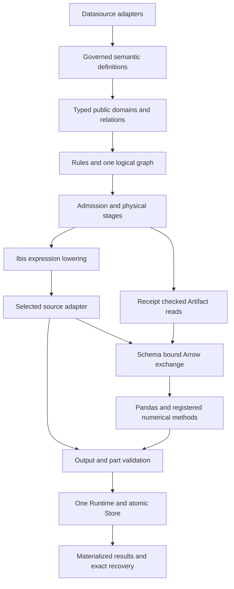

# Marivo 全量分析代数与 Analysis DSL 重构实施计划

Date: 2026-09-26

Status: implementation plan；五项重构原则来自本次用户要求，完整重构尚未实施或验收。

## 1. 决策、范围与文档权威

以[分析组合的语义与代数契约 v0.5](2026-09-23-analysis-algebra-theory.md)、
[语义层与 Analysis DSL 接口设计](2026-09-24-marivo-semantic-analysis-dsl-interface-design.md)和
[DSL 实现架构设计](2026-09-24-marivo-analysis-dsl-architecture-design.md)为依据，
将 Marivo 收敛为一套受治理业务定义、一套分析域与量的组合规则、一套执行图和一套
Runtime/Store。已完成的 MVP 是重构基线，其模块划分、类型名称及持久化表示都接受调整。

本计划是**破坏性重构**。不保持旧 Python 调用、内部 import、Help target、序列化格式或
旧 Session/Artifact 的兼容性；不提供迁移器、兼容别名、双读、旧新执行器回退或旧数据升级。
保留业务能力与方法语义的任务按本文能力表逐项完成；保留某个已有操作名是目标设计选择，
不构成旧参数、旧类型或旧实现继续存在的承诺。

“完整”覆盖 datasource、semantic、analysis、执行与存储、结果与证据、Help/CLI、
packaged skills、文档示例、测试、安装包和六种现有数据库适配。它不要求重写没有职责冲突的
工具函数，也不将新功能研究、统计推断系统或 Agent 推理规划引入 Marivo。
最终交付不能留下“只完成新入口、内部仍调用旧家族执行链”的状态。

本次交付是实施计划。产品实施、提交、发布和外部服务操作不因本文落盘而发生。
实施时各阶段先在当前 owning specs 接受其具体契约，再修改代码；不以本计划替代精确 API
与方法规范。目标设计仍未明确的扩展必须先补契约，不能用占位类进入产品。

### 1.1 固定基线与已有证据

仓库基线：`panda`，`95cb4ecff8126362a409246acebc2b223966a3d3`；编写时跟踪工作树干净。

| 输入 | SHA-256 |
| --- | --- |
| 分析代数 v0.5 | `c1901f306952e294fb11c329fbf66f5358e1ec3e605f69d9dcd3e60852acc309` |
| DSL 接口设计 | `319223cf12e7c9b53b0b5bda5c0d7b2e558b4e372e48534e072eb53eed39365a` |
| DSL 架构设计 | `1f1feab98bf9c91a86b23bae83ef7e5bb764658141866b943d89611a24ffb001` |
| MVP 验证计划 | `83d887968bf602a0674dc2903681ec81d828b8e7985679e66c2f68b3560b3cd5` |

MVP 验收见本地[组合验收记录 §15–§16](../plans/2026-09-24-marivo-analysis-dsl-composition-acceptance.md)。
它支持 J1–J4、DuckDB、pandas 固定续算、受控交换、求值身份、冷恢复和限定真实 Agent 旅程；
不授予全目标 DSL、其他数据库或发布资格。编写前的同一 checkout 已重跑公共 Runtime 测试，
18 项通过；历史 `make check-agent`、安装包与 Agent 结果仍按各自记录的快照解释。

该验收记录及原始附件位于 Git 忽略目录，不能作为新 checkout 必然具备的附件。R0 要建立
受版本控制的验收索引及可取得的证据包；无法取得的历史附件标为历史记录，相关门禁重新执行。
本文放在受 Git 跟踪规则覆盖的 `docs/superpowers/specs/`，避免主实施计划仅存在于本地忽略目录。

### 1.2 契约接受顺序

1. 本次用户提出的五项原则约束整个重构；旧实现和旧 owning specs 中冲突的行为必须调整。
2. 理论文档规定域、量、贡献、Cell、方法状态、部件、依据与条件保持；不自动证明具体后端正确。
3. DSL 接口设计规定目标业务对象和唯一操作入口；架构设计规定规则、执行位置和交换责任。
4. 每阶段将已闭合的具体规则、类型、错误及支持矩阵写入唯一 owning spec，随后实施和验收。
5. 阶段验收只证明记录的输入、方法、类型和后端；不把历史成功、编译成功或 mock 成功扩成支持。

理论有限核心、目标语言、具体方法实现分别记账。首轮 MVP 的 int64/float64、UTC 事件轴、
两根 ratio 等限制不是全量设计的永久限制；扩展它们需要具体契约和验证。

## 2. 五项硬约束及可检查结果

| 原则 | 实施约束 | 完成证据 |
| --- | --- | --- |
| 读取逻辑只由 Ibis 表达 | 业务读取、完整性校验、计数探测、时间/类型验证都构造 Ibis 表达式；Ibis 独占方言 SQL 编译 | 产品读取链无手写 SQL 模板、SQL AST 拼装、生成后改写和 raw SQL 绕行；真实驱动提交可追溯到对应 Ibis 表达式 |
| 后端差异通过统一接口 | 连接、物理 schema、类型解码、批次、取消、资源、能力资格由各 adapter 实现；公共编译器和 Runtime 不按 backend 名称分支 | 同一契约套件验证六个 adapter；只安装所选依赖仍可导入和执行；不增加第二份资格判断 |
| 遵循代数与元算子 | DSL 构造组合明确的绑定、对应、逐行计算、两种归约和部件运输规则；领域方法保留自己的规则 | 每方法具有完整规则、局部正反例、独立 oracle、语义及 K 续算检查；结果族名不成为准入依据 |
| MVP 纳入整体架构 | 拆解 `J1Context`、`J1Node`、`J3Observed`、`execute_j1` 和场景专属 codec；复用已验证的计算与故障语义 | 产品代码与当前协议无 J1/J2/J3/J4/S0/S4 场景身份；四条旧旅程在新统一链上重新通过 |
| 破坏性切换 | 删除旧接口、旧 registry 分支、旧 SQL 实现、旧缓存协议和旧 codec；不做兼容或迁移 | 旧名字不可导入、旧 Help 不重定向、旧状态不被升级或重算；最终只剩一套图、执行入口和 Store owner |

本计划不批准任何 Marivo 自编 SQL 例外。发现 Ibis 无法表达的必要能力时，依次评估：
已注册的 Ibis 准备加 Python 计算、Ibis/驱动已有公开 API、明确的依赖改进；仍无法履行时登记
阻塞。需要例外必须另行取得用户对**具体操作、后端、SQL 用途和边界**的明确允许。
“历史上用过”“放进 adapter”“只读”“参数化”均不构成允许。

### 2.1 SQL 边界的具体处理

- 允许 adapter 通过 Ibis 编译 API 取得 SQL，并由原生驱动原样提交，以保证类型和游标生命周期。
  编译产物绑定表达式身份、参数、结果 schema、用途和所选实现；不能接收任意字符串伪装成产物。
- 禁止 `backend.sql(handwritten)`、手工 SELECT/CTE/窗口函数、拼接校验查询、SQLGlot 改写、
  自定义 SQL 模板和在 Marivo 中注册手写方言编译规则。封装成 helper 或 Ibis raw 表不改变边界。
- 元数据检查优先使用 Ibis/驱动的元数据 API；需要读取系统表时同样构造 Ibis 表达式。
  无法提供的可选元数据显式标 unavailable；影响方法准入的事实缺失则拒绝相应路线。
- 事务、会话设置、取消、临时资源和认证优先使用驱动/后端公开 API。必须手写控制语句的遗留
  能力列入例外待决清单；本计划不以“不是 SELECT”为由批准它。
- `md.test` 等探测使用 Ibis 表达式或连接 API，不保留隐藏的手写 `SELECT 1` 通道。
  `md.raw_sql` 以及执行 SQL oracle 的产品 parity 路径不能自动保留；默认目标删除这类任意 SQL
  执行入口，parity 可消费独立取得的预期结果或受治理 Ibis 参照。如要求保留 SQL 执行能力，先
  单独接受其例外，再更新公共契约、权限、副作用和验收。
- `ms.from_sql(...)` 可继续保存 provenance 文本，但不会使文本获得执行资格。
  测试夹具建库和独立 SQL oracle 属于测试进程，不导入产品查询模板，也不进入生产执行链。
- 项目本地 Store 的 SQLite 持久化语句属于内部事务存储，不是 datasource 查询表达。
  它们只存在于 Store owner，不能借此读取业务来源或执行分析。对它们做单独白名单审计。

## 3. 当前实现盘点与目标责任

下列路径均相对仓库根。目标位置是本次重构的模块责任划分；移动代码时同时删除原实现及
消费者，不创建转发模块维持旧 import。单纯位置调整不能作为一项能力验收通过。

| 当前实现 | 重构处理与唯一目标责任 |
| --- | --- |
| `datasource/engines/base.py`、各 `engines/*.py`、`backends.py` | 统一 datasource adapter contract、选择和生命周期；移除 `postprocess_sql`、SQL quoting/probe 字段及分散的 backend 判断 |
| `datasource/inspection.py`、`metadata.py`、`runtime.py`、`source.py`、`json_source.py` | 通过 adapter 做读取和物理事实检查；Table/CSV/Parquet/JSON、HTTP 参数与认证均进入明确输入契约 |
| `semantic/ir.py`、`validator.py`、`resolver.py`、`_definition_identity.py` | 统一定义环境、Ref kind、身份、版本、路径、时间角色和值政策；归一化只产生业务契约与 Ibis 构造 |
| `semantic/metric_graph*.py`、`runtime_metric*.py`、`unit_algebra.py` | 一个贡献计算图与 builder 推导 owner；装饰器的声明与 builder 的推导分别保留依据 |
| `semantic/event.py`、`state_model.py` | occurrence、participant、规范状态转移及顺序前提；不承担一次分析的成员选择、覆盖或 replay |
| `analysis/public_dsl.py`、`datasets/*`、`observation/dsl_j1.py` | 收敛为域、单量关系、领域结果的具体 Logical/Materialized 变体；删除旧家族的并行公共体系 |
| `datasets/descriptors.py`、`handles.py`、`observation/contracts.py` | 提取一套域、量、Cell、部件、规则与有类型图；复用既有职责，不在旁边建设第二套 AST |
| `operators/registry.py`、`dsl_j1_contracts.py`、各 `*_contracts.py` | 统一方法语义注册；实现资格引用该方法版本，消除同一方法的旧家族与 MVP 双注册 |
| `compiler/lowering.py`、`dsl_j1_source.py`、`dsl_j3_ratio.py`、各家族 compiler | 按元算子及方法 lowering 到 Ibis；领域 matcher/replayer 保持独立方法，不再通过场景分派 |
| `compiler/placement.py`、`source_admission.py`、`operators/*_support.py` | 纯计划需求与注册实现匹配；物理实现资格归 adapter，实现失败不触发再选路 |
| `materialization/*_execution.py`、`scalar_sql_execution.py` | 源端传输与资源移入 datasource adapter；Runtime 只执行有类型阶段和校验输出 |
| `duckdb_statements.py`、`*_event_sql.py`、`lifecycle_bundle.py`、`lifecycle_integrity.py`、`temporal_sql.py`、`compiler/driver_numeric.py` | 逐项替换 SQL 拼装、宏、编译补丁；可用 Ibis 的改成表达式，需要完整算法的接入预先注册的 Python 方法 |
| `dsl_j1_runtime.py`、`dataset_execution.py`、`admission.py` | 合成唯一执行入口与 Run 协调；所有来源型顶层执行使用新求值身份 |
| `dsl_j1_artifact.py`、`dsl_j1_receipt.py`、`dsl_public_snapshot.py`、各 `*_codec.py`/`*_publication.py` | 共用描述符、部件、receipt、原子提交与恢复框架；方法只拥有自己的状态 schema 和校验 |
| `retained.py`、`reads.py`、`local_execution.py`、`parquet_scan.py` | 受控 Arrow/Parquet 读取后进入 pandas；删除 Artifact→DuckDB/远端的执行路线 |
| `session/*`、`materialization/store.py`、`writer_guard.py`、`reconciliation.py` | 保留唯一 Session/Run/Store 所有者并更新协议；旧 generation 读前拒绝，无迁移 |
| `analysis/evidence/*`、`findings` 读取、`ontology/*` | 适配新量/域/Artifact 身份；ontology 保持可选语义关联，不推导计算准入、因果或自动分析计划 |
| `_help/*`、各 `_capabilities/*`、CLI、`introspection/*` | 原生 owner 决定签名及导航；当前结果决定续算；消除旧新 inventory 和重复 Help 入口 |
| `project.py`、config/secrets、doctor、telemetry、安装脚本 | 核对新包结构和协议；凭据、项目状态及诊断继续有明确 owner，不因全量重构重复实现 |
| `tests/*`、`devtools/*`、`docs/specs/*`、`site/*/latest`、packaged skills | 随每阶段更换当前契约与示例，最终删除旧路径测试和运行脚本；独立 oracle 与失败证据继续保存 |

上述盘点是首份定位清单。R0 通过导出、调用图、SQL 提交入口和存储格式反查补齐；不得因为
文件没有出现在本表就默认为无影响，也不得把历史文档列出的已不存在模块重建出来。

## 4. 目标架构



图中箭头表示责任链，不授权 semantic 或 Logical 构造打开 datasource。连接及 reader 的创建
只发生在显式 datasource 动作或获准执行阶段；来源 schema 需要即时验证时，也不能借纯计划
名义提前查询。Artifact 恢复消费其冻结契约，不加载当前业务定义来修补旧结果。

### 4.1 模块布局与依赖约束

建议收敛为以下责任布局；具体文件粒度在 R0 按现有模块确定，不预建空包：

```text
marivo/
  datasource/
    adapters/          # contracts, one resolver, concrete backend implementations
    ...                # authored sources, credentials, inspection and snapshots
  semantic/
    ...                # governed definitions, contribution graph, validation
  analysis/
    core/              # domain, quantity, Cell, parts, rules, one logical graph
    relations/         # concrete public domain/relation variants and typed handles
    methods/           # one method registry, closed contracts, local algorithms
    domains/           # event matching, lifecycle replay and their result contracts
    compiler/          # pure admission, placement, Ibis expression lowering
    materialization/   # one Runtime, exchange, local execution, codecs and Store
    session/           # public context, exact history and lifecycle actions
    evidence/          # committed evidence and bounded reads
```

- `core` 不导入 datasource 驱动、Ibis backend、pandas、Store 或公共关系类；内核检查签名和规则。
- semantic 不依赖 Analysis 实例或运行状态；Analysis 通过 Ref 和规范定义消费 semantic。
- 公开关系构造依赖 core/method contracts；不执行查询、不接触 SQL、不中途发布 Artifact。
- compiler 消费方法和实现声明；具体驱动仅由 adapter resolver 延迟导入。
- pandas/NumPy/SciPy 算法位于 local implementation，不能读取 Catalog、连接来源或分配 Run。
- datasource adapter 不导入 Analysis 公共对象、家族节点或 Store；方法 lowering 通过明确参数调用它。
- Runtime 统一阶段顺序、资源 ownership、发布和恢复，不认识 J1 或某个业务案例。
- 用 import-linter 和选择性依赖安装验证边界；循环 import 不能用通用 `object`/动态属性掩盖。

`relations`/`methods`/`core` 是当前责任的最终归并位置，实施中不得同时维护可执行旧版和新版。
每个工作包迁入消费者后删除旧模块；最终没有 `legacy`、`v1_compat` 或转发 shim。

### 4.2 元算子和方法规则

每个元算子规定 `InputSignatures + Parameters → OutputSignature + Pre + RequiredParts +
PartTransform + Post + Transport + Eval`，参数用封闭的类型变体表示。

| 元算子责任 | 典型组合 | 必须保留的区分 |
| --- | --- | --- |
| 绑定与投影 | members、read、observe、固定视图 | 业务定义身份、本次输入身份、主体角色、时间与坐标分别绑定 |
| 域映射与对应 | 分组、compare 配对、多根坐标并集、members | 单射/单值/覆盖/重数分别检查；缺行不是 Null，完整元组并集不是笛卡尔积 |
| Cell 与逐行计算 | 谓词、Difference、ratio finish、状态视图 | Defined/Null/Undefined/Unknown 与原因；不短路豁免硬失败 |
| 当前行状态构建 | summarize、count_defined、weighted_mean | 当前实例是新贡献；统计权重不能冒充原指标组件或抽样权重 |
| 原状态归约 | observe 组件合并、rollup、获准时间折叠 | 合并原组件后 finish；贡献许可、目标域、空状态、顺序和版本可验证 |
| 部件运输 | where、projection、compare、视图、物化 | 主体映射、端点、组件、覆盖、固定参照随输入精确绑定；丢失部件同步撤销能力 |

Event matching、Lifecycle replay、归因、排名、抽样、相关与预测是有独立方法契约的扩展。
它们复用输入、Cell、配对、部件、交换和执行设施，但不以通用 reduce 替代领域算法。
禁止任意用户回调、万能 payload、自由字典规则或通用“证明器”绕过封闭方法。

方法语义与实现资格分别登记在同一方法注册体系中：前者决定问题含义、前提、状态及 K；
后者声明某方法版本在特定输入、数值类型和后端上的路线、检查、精度与资源要求。
adapter 不决定空贡献、缺侧、配对、业务顺序、单位或统计权重。

成员域与主体投影遵循以下规则，具体语义由 DSL 接口设计 §5.1、§6.2 拥有：

- `session.members(EntityRef)` 信任完整 `primary_key` 与版本声明，直接投影完整身份；
  不默认添加 distinct，不新增自动全源唯一性预检。版本化 Entity 先按明确的 `at` 解析，
  不能通过对全部历史 `distinct(K)` 构造成员域。
- Entity 域经 where 后仍保持身份唯一性；主体映射为恒等或已有依据的单射时，members
  直接投影。唯一性推导保留声明依赖，不能登记为实测全源唯一性。
- Journey/Interval 等多个实例映射到同一主体时，Subjects 必须取得唯一主体集合；来源
  lowering 使用 Ibis distinct 或等价集合像实现，固定输入使用同义本地实现。编译器根据
  映射及唯一性依据决定是否需要物理去重，不引入公共去重开关。
- 已观察到违反本次消费契约的重复身份必须拒绝，不能用 distinct 或取第一行修补。
  来源声明不取消既有成员、关系 fanout、对齐、交换及输出完整性检查。

### 4.3 一个图与两个数值归约含义

公开 `AnalysisDomain`、`AnalysisRelation` 和领域结果是同一有类型图的视图，不各自维护 AST。
节点依赖用有类型角色和明确 identity 表示，元算子推导出的域、量、状态与义务成为节点契约。
标识至少区分定义指纹、显式节点 identity、本次 realization 和 Artifact ref。

`summarize` 从当前行建立 RowStatistic 状态；`rollup` 合并当前量获准的原状态。
两者可共用物理归约设施，但不得共用问题定义。RowStatistic 如承诺后续 rollup，必须保存
其当前行贡献单位与真实状态；不继续沿用 MVP 中仅能展示的终端统计快照冒充完整目标形状。

逻辑重排只对已登记规律和前提启用。L1、L7、L8、L9 的数值/状态等价、语义等价、K 等价
分别验证；浮点容差不判断身份。重构不要求开发通用成本优化器或自动代数证明系统。

## 5. 统一 datasource 与执行适配契约

### 5.1 接口分工

从现有 `EngineProfile`、`ExecutionAdapter`、`BatchStream` 归并得到一套接口。以下是内部
责任和类型方向，不是新增公共 API，也不是未经类型设计即可复制的 Python 签名。

| 接口责任 | 输入与输出 | 限制 |
| --- | --- | --- |
| Provider 注册与连接 | 已验证 backend spec、连接用途 → 所选 SourceSession | 六种后端分别实现；声明/选择纯函数，不导入未选驱动 |
| 物理来源与元数据 | typed Table/File/JSON source、必要列 → Ibis relation/schema、带范围的物理事实 | 不接收 SQL；schema 与业务完整性分开；不能通过元数据路径读任意业务行 |
| 实现资格 | 方法版本、类型、来源特征、检查义务 → QualifiedImplementation 或结构化拒绝 | 静态能力与本次已验证物理事实分别记录；不可编译或语义不符均拒绝 |
| Ibis 编译与执行 | Ibis expression、typed parameters、purpose、expected schema → 受控编译产物或 BatchStream | `statement(sql: str)` 从共用接口移除；原生传输只能提交未改写的编译产物 |
| 结果解码 | 驱动值与固定 schema → 精确 Arrow 批次 | nullable int64、复合身份、Decimal、timezone、Duration 不隐式降精度 |
| 资源与取消 | 所拥有连接、游标、reader、事务 → close/interrupt 状态 | 正常、异常、提前停止都清理；本地 close 与远端已终止分别报告 |
| 来源覆盖依据 | exact source/Event binding、请求范围 → observed/declared/unknown facts | 不能由 count、最大时间或空结果推导业务覆盖 |

方法如何组成 Ibis 表达式归 Analysis implementation owner；datasource adapter 负责自己的
物理能力实现。共享 Ibis lowering 只依赖抽象接口；确有后端差异的表达式实现按注册分派，
不能在共享函数中堆叠 `if backend == ...`。不存在第二份“编译器说支持、Runtime 又自行判断”矩阵。

### 5.2 六后端的必须验证事项

| 后端 | 必须处理的物理差异 | 不能继承的旧捷径 |
| --- | --- | --- |
| DuckDB | 表与文件来源、HTTP/JSON、扩展/认证、精确类型、Ibis reader 与资源生命周期 | Artifact Parquet 扫描、本地 spill、手写 macro 和临时 SQL 视图 |
| PostgreSQL | namespace/search path、复合身份解码、binary cursor/事务、精度和时区 | `postgres_event_sql.py` 的包裹 SQL 与未经 Ibis 构造的 schema 查询 |
| MySQL | 流式 cursor、warning/truncation、无效日期、Decimal、零时区与字段类型 | 拼接日期校验 SQL、扩大数值范围时静默转 float、失败后本地重试 |
| SQLite | 实际存储类型、int64 溢出、字符串比较、时间表示、增量 fetch | 在 Marivo 中注入方言编译补丁或用来源 SQLite 代替 Artifact 本地计算 |
| Trino | catalog/schema、参数与取消、资源/阶段限制、不同表类型的物理资格 | SQL AST 后处理、手写事件 CTE、把 Iceberg 一次验收泛化到全部表类型 |
| ClickHouse | Nullable/LowCardinality、时间精度、流式 query id 与取消、表拓扑 | 手写 packet SQL、把本地 MergeTree 验收泛化到 Distributed 或远端确认终止 |

原生 driver reader 可以保留，只要 SQL 来自 Ibis、返回统一批次且履行自己的生命周期。
不用“统一接口”强迫所有后端使用同一个不适合其类型或游标的 reader。

### 5.3 路线选择与支持目标

纯来源同一可执行来源域优先选择已获准 Ibis 路线；缺少源端算法时可**在执行前**选择已注册的
Ibis 准备→Python 方法。该路线须保持范围、身份、Cell、部件与数值政策；来源执行失败后
不得改选它。纯 Artifact 路线始终受控读取→pandas/NumPy/SciPy，禁止回源或上传。

六后端都必须在实际部署环境验证基础成员/属性、观察、完整域、多根组件、比较与合法本地
续算。其他本计划交付方法可以使用合格源端路线或 Ibis 准备→本地路线，不要求六套相同 SQL
计划。R0 按“方法 × 数值类型 × 时间/来源形状 × 后端 × 路线”冻结目标矩阵；不能到最终阶段
把尚未实现的必需单元改成“不支持”来完成验收。

新 DSL 的后端资格重新验证，旧 C0–C10 记录仅用于选择回归反例。无法取得真实服务的必需
单元标为阻塞/未验证，其他单元可继续；完整后端验收不能由桩或编译检查代替。
能力桩用于证明替换 adapter 无需修改语义核，并测试无合法路线、错误类型与不回退。

跨不同 datasource 的现场数据组合不由六 adapter 自动获得资格。本轮不新增联邦 join 或
跨源上传；需要该能力须先接受独立的输入、对齐与快照契约。显式 Artifact+现场来源混合图
继续按架构规定在 Run 和数据读取前拒绝，此项拒绝本身有正反例且明确披露。

## 6. 完整能力交付表

本表约束 R0 的能力台账。每行都要覆盖 Logical 构造、获准执行、Materialized 视图、声明的
K、冷恢复、结构化拒绝及公共发现。未承诺某项 K 的结果必须明确拒绝，不能为凑齐矩阵补回源。

| ID | 目标能力 | 目标契约与关键验收 | 主阶段 |
| --- | --- | --- | --- |
| C01 | datasource 声明、inspect、sample、文件/JSON、凭据与参数 | Ibis 读取、真实 metadata、作用域参数、认证脱敏、错误 repair；任意 SQL 通道按 §2.1 处理 | R1 |
| C02 | Entity、变量、Relationship、Metric、Event、StateModel、日历 | Ref-only、身份/版本/角色/单位、声明与推导依据、严格 authoring validator | R2 |
| C03 | 成员、属性与版本选择 | 非版本/快照/validity；精确 `at` 与 `before_end`；无 last-known；read 数值/分类/时间/布尔 | R5 |
| C04 | 单根/多根观察与 runtime_metric | aggregate/slice/ratio/linear/weighted_mean；组件分别绑定过滤、路径、窗口、贡献单位；opaque Metric 只消费声明 | R5 |
| C05 | 完整坐标、分组、两种归约 | Entity×分类×时间、实际元组并集、显式空组、部分轴消去、RowStatistic 状态、count 与 count_defined | R5 |
| C06 | 时间网格、认证期间、累计与半可加折叠 | 成员/属性/指标/坐标四种时间角色；DST、calendar、累计重叠、空间/时间 fold 顺序与单位 | R5 |
| C07 | 比较、派生量与选择 | TimeChange/CohortContrast/PeriodChange、绝对/相对、ExactKeys/UnionKeys、嵌套 Difference、状态谓词、where→members | R6 |
| C08 | cohort、固定参照、权重、排名与展示 | 全机会域量词、Unknown/Undefined、share/penetration、reference/statistical weight、standardize、rank/limit、terminal table | R6 |
| C09 | 归因 | additive_difference/component_mix、joint/hierarchy、共同 Top-K→Other、原 target/basis/rule、筛选后核对范围 | R6 |
| C10 | 精确 distinct 与分位数直接观察 | 精确身份、线性插值、显式 approximate 许可与实际算法披露；首次无原量 rollup/对应归因 | R5、R9 |
| C11 | Event 匹配与漏斗 | first_per_subject/every_start、assignment/重数、随访与覆盖、funnel compare/attribute、单量 selector | R7 |
| C12 | 步骤耗时与领域选人 | exact steps、completed/observed duration、Journey→Subject 映射、dropout 真值与已知域 | R7 |
| C13 | Lifecycle | inception、业务顺序、canonical history、区间/迁移/违规、distribution/dwell、时点 read→where→members | R7 |
| C14 | 候选发现、相关与预测 | 既有闭合 discover 方法、Pearson/Spearman/Kendall 与 lag、多量配对、naive/drift/seasonal_naive、方法假设 | R8 |
| C15 | Session、Run、Artifact 与证据 | 来源新求值、固定精确命中、图内共享、原子发布、不明提交协调、断源恢复、findings/history/revalidate | R4，后续各阶段 |
| C16 | Help、类型、错误、repr/show/contract、CLI/skills/site | 一个入口、具体类型、有界披露、动态 K、独立 reachability/drift/budget 约束与安装包真实 Agent | 各阶段、R10 |
| C17 | ontology、项目工具、遥测、依赖与打包 | 新身份与结果衔接、无额外 planner/证据 authority、秘密与主体键不泄露、可选依赖隔离 | R2、R10 |
| C18 | 相对 Anchor 观察与 retention | 先闭合 §8.2 的公开契约；Subject/Subject×Anchor、elapsed/calendar、重叠贡献与覆盖、固定 Ω 和确定性未知界 | R0 设计、R7 实施 |

### 6.1 有意删除或收紧的能力

以下变更必须进入 breaking-change 清单和新 Help，不能以兼容实现偷偷保留：

- 旧 Population/Dataset 家族及其与目标链重复的入口；目标从 `session.members` 开始。
  Event/Lifecycle 的领域 namespace 和 Session 运行服务按目标设计保留，输入改为新域。
- 来源 Lazy 的历史 definition-only 命中、固定 Artifact 经 DuckDB 计算、私有 J1 恢复入口。
- 依赖手写 SQL 或生成后补丁且尚无获准新实现的路线；不能保留为隐藏 fallback。
- 去重/分位数首次接入的原量上卷、distinct_membership/distribution_shapley 归因，不从当前
  展示值推定充分状态。它们属于目标设计明确收紧的续算，不借“完整重构”扩大本轮准入。
- 仅 occurrence ID 稳定排序就授权业务先后；仅值相等、键集合相等或 residual=0 就授权
  输入等同、完整分区、因果或贡献可合并的行为。
- 任意列字典回灌、任意回调、动态字段绕过类型、旧 Help alias 和旧协议双读。

### 6.2 尚待闭合的目标扩展

完整重构覆盖现有能力及本文接受的目标设计；接口尚未闭合的必需目标先补设计再实现。
仅保留理论位置、明确没有目标公共接口的研究扩展单独列出，不能被 C01–C18 的通过隐含覆盖：

| 项目 | 缺少的决定 | 本计划处理 |
| --- | --- | --- |
| 相对 Anchor 观察与 retention | 公开构造、锚点/窗口重叠政策、覆盖载体、状态及 K 的完整规则 | 作为 C18 的必需设计工作由 R0 闭合，R7 实施；契约未闭合时该项阻塞，不能算完整目标交付 |
| `evaluate_each` | 封闭模板及参数位、固定共享输入、失败切片、输出类型 | 保留设计位置，待独立接受后实施；不开放 Python callback |
| 多对多贡献/分配、同根多角色路由、跨源与 mixed 执行 | 精确贡献许可、输入捕获、路线及身份协议 | 默认明确拒绝；独立接受前不能以 join 或上传修复 |
| bootstrap、因果、生存/马尔可夫推断、通用 FormulaBasis | 完整统计/领域方法及假设 | 不属于本轮交付，无占位工厂 |

R0 的冻结清单明确必需目标与研究扩展，并逐项检查没有把**现有且目标应承接的能力**移到
范围外。除已纳入的 C18，若再决定交付表中其他研究扩展，先补 owning spec、插入实现阶段
和验收，再更新冻结矩阵；不能只把状态改为“后续支持”而声称扩大的范围完成。

## 7. MVP 统一改造与删除清单

### 7.1 按职责替换名称与表示

下表名称为目标内部概念，公开类型以接口设计及最终静态类型契约为准。J1–J4 可以继续作为
验收旅程 ID，但不能出现在产品类型、方法 ID、持久化协议、分派分支或用户结果中。

| MVP 现状 | 统一后的职责 |
| --- | --- |
| `J1Context` | Session 绑定的不可变语义定义上下文；通用部分与 Entity 观察规则分离 |
| `J1Members`、`J1Read`、`J1SelectedCategory`、`J1Group` | 域输入、属性取值、Select、GroupMapping 等有类型节点及其公开视图 |
| `J1Observed` 与 `J3Observed` | 一个 Observation 方法族；单根/多根是封闭贡献计划变体，不另建场景类型 |
| `J3Route/J3Routes` | 贡献根到成员的 RootRoute/RootRoutes；支持目标的完整根集合，不硬编码两根 |
| `J1Statistic/J1Difference` | RowStatistic 与 Comparison 节点；方法决定单位、端点、状态和部件 |
| `J4Association/J4Coefficient*` | Association 领域结果、固定 coefficient 视图与共同 Select/RowReduce |
| `J1ExecutionResult` | 受控关系执行结果：签名、显式键、Cell、方法状态、部件和已履行检查 |
| `J1SourcePlan`、`run_j4_source*` | 统一物理阶段图与已注册方法实现；来源数值及 Python 数值使用同一语义契约 |
| `place_j1_*`、`execute_j1` | 通用输入分类、放置、单次执行协调与原子发布 |
| `dsl_j1_artifact/receipt`、`dsl_public_snapshot` | 共用 Artifact descriptor、规范图快照和方法状态 codec；不保存 Python 类名作恢复分派 |

每次迁入同时更新 imports、registry、错误位置、方法/协议 ID、类型正反例、Help、codec 和
调用方；删除旧模块后用引用扫描和安装包验证。禁止 `J1Observed = ObservationNode` 这样的
过渡 alias。`J1` 前缀消失但仍保留两套执行链同样不算完成。

### 7.2 已有证据的复用规则

独立原始事实、SQL/Fraction/平均秩 oracle、故障注入情形和业务问题可以复用；执行代码、
wheel 和 Artifact 必须重建。旧 Artifact 不能进入新 reader 来证明兼容或冷恢复。
新冷恢复测试必须先用新 writer 发布，再在新进程中禁止源连接、恢复精确引用并执行原 K。

J1–J4 同时保留数值、域、单位、Cell、方法状态、部件、身份、动态 contract 和独立 Agent
判据。重命名测试不替代跨业务域测试；还要保持非电商 Entity/字段/单位的同类构造。

## 8. 执行、状态与存储的统一义务

### 8.1 求值与放置

1. 只沿执行根的实际依赖分类；Materialized 是叶子，lineage 不参与来源依赖展开。
2. 纯构造/计划检查已知前提，登记本次数据检查；能力缺失在最早可确定处拒绝。
3. 来源图通过准入后分配新的 Run/求值 identity；同一 Lazy 对象重复执行不命中旧输入。
4. 同次显式节点只实现一次，所有消费者共享该绑定；不同顶层 execute 不共享来源实现身份。
5. 固定图用确切 receipt、方法/协议版本、定义和绑定命中；命中不新建 Run，未命中才执行。
6. 整个图只有一项顶层执行协调；内部阶段不各自创建 Run，也不发布供用户误用的半成品。
7. 执行失败、取消和发布结果不明按原 Run 协调；不新建身份自动重试，不覆盖已有成功结果。

共享实现与来源事务快照是不同保证。一个节点的多个消费者必须共享真实实现，而非仅复制
相同子查询文本；可用获准后端 API 或本次本地受控结果完成，不能借此上传 Artifact 或手写 SQL。
独立查询的跨源/跨表一致快照未经具体资格验证不承诺。

### 8.2 交换与保留能力

继续用固定 schema、可关闭的 `BatchStream` 和显式 RecordBatch；不新增另一套传输协议。
身份、坐标、Cell 标签/原因、量/域绑定、方法状态、依据和 receipt 由 Marivo 拥有，Arrow
负责物理编码。空流保持 schema；四种 Cell 不能压成 SQL NULL；主表和部件按键相连。

source、Parquet、pandas→Arrow 生产者共用向量验证 schema、nullable 大整数、Decimal、
时间精度/时区、Duration、复合身份、空部件、换序、重复键及损坏拒绝。
验证需要耗尽时，提前 close 不得产出 completed evidence。正常/异常/取消均释放拥有资源。

本地执行明确逐批、可合并状态或完整输入算法。Spearman/排序/匹配等不因分批读取就取得
有界内存保证；记录 Arrow Table、pandas 转换和 NumPy/算法工作区的共存开销。
不自动 spill、截断、抽样、近似或设置新的输入规模准入门槛。

### 8.3 一个新协议，无历史迁移

在现有 Store owner 上统一 schema/descriptor/receipt/snapshot 协议，具体新版本号由 R4
按实际格式变更确定。方法状态保持独立版本，不能仅因同为三列 sum/count 就共用语义身份。

- 新写入与新恢复只接受一套当前格式；旧 Store/Artifact 在读前结构化拒绝。
- 不迁移、不双读、不自动重建、不自动删除用户旧 `.marivo`；旧状态不参与新验收。
- 错误说明格式不受支持及使用新项目/新状态环境的操作边界，不提供隐式覆盖“修复”。
- 所有保留类型、端点、定义和 K 来自已验证的冻结快照及部件；不依赖当前 semantic 文件。
- 发布包含主表、所有必要部件和 receipt；任一失败不留下成功 Artifact。
- 并发写保护、提交结果不明、receipt 损坏、文件丢失和进程退出后的协调由同一 Runtime 处理。

## 9. 分阶段实施

阶段是可核验的工作包。每个阶段完成其 owning specs、实现、对应公共披露和测试；R10 做
全体整合，不承担替前面阶段补缺失的基本错误、codec 或 Help。

整个重构分支在 R10 前是未完成候选，不将某阶段测试通过当作可发布。每包按调用依赖一起
修改消费者，删除旧分支；不得为保持旧测试绿色增加兼容适配。如果接口变更跨越两个工作包，
将最小闭合消费者调整前移到同一包，并更新依赖记录。未完成目标进入能力台账，不通过跳过
新契约测试或批量 xfail 隐藏；已交付能力的回归仍须通过。

依赖主链为 `R0 → R1/R2 → R3 → R4 → R5 → R6 → R7/R8 → R9 → R10`。
R1 与 R2 的契约协调完成后可独立推进；R7/R8 共享已经稳定的 R5/R6 能力。后端定向验证从
R1 开始，R9 汇总并补齐完整资格。实施阶段不得跳过依赖门禁来宣称整体完成。

### R0 — 冻结重构范围、契约和可复核基线

**输入：**本文四份设计基线、当前 public exports/Help、owning specs、MVP 及旧后端验收。

**工作：**

- 建立 C01–C18 的逐项台账：当前入口/owner、目标唯一入口、保留或明确删除、目标方法、K、
  后端/类型支持、实施阶段、独立反例和验收命令。分辨实际代码与历史文档残留。
- 固定旧新语义差异，包括零分母、缺侧、原状态/当前行、时点版本、同刻顺序、distinct/quantile
  续算收紧及 SQL/parity 入口；更新对应 owning specs 的目标契约。
- 冻结元算子、方法注册与 adapter 接口，完整比较六后端既有资格；登记所有生产 SQL 构造点、
  控制语句、Ibis 补丁和 Artifact→DuckDB 路线的替代 owner。
- 对 §6.2 的未闭合扩展作明确范围记录；完成 C18 Anchor/retention、权重/参照构造、
  普通 Relation ratio、业务顺序依据等本轮必需契约的具体 typed 输入、规则和 K，
  不交给实现者临时设计。
- 将历史证据整理成受版本控制的索引，记录内容 hash、代码 SHA、依赖和可取得位置；固定
  独立事实/oracle，不把候选 reducer 当预期生成器。
- 建立隔离工作分支/工作树，记录每阶段基线和未提交差异；不修改其他工作区状态。

**交付：**能力/支持矩阵、SQL 替代清单、规则与模块映射、breaking-change 清单、验收索引。

**出口：**每项现有能力有目标去向；没有未决定的必需公共输入；没有默许 SQL 例外或迁移需求；
阶段和验收均能追到精确 owner。R0 的完成不称为实现完成。

### R1 — 统一 datasource adapters 与基础 Ibis 读取

**依赖：**R0。**责任：**`datasource/*`、源端传输 adapter、依赖注册和相关 authoring/inspection。

**工作：**

- 从 EngineProfile/ExecutionAdapter 归并 §5 接口，六个 provider 分别实现连接、metadata、
  参数、Ibis 编译、批次、精确解码、取消与清理；删除共用 `statement(sql)` 和后处理接口。
- 数据库表、CSV/Parquet/JSON、HTTP 数据源绑定通过规范入口取得 Ibis relation；关闭读取
  旁路，认证/设置中必须手写 SQL 的需求按 §2.1 单独登记，不默认继承。
- inspect/sample/test/preview/source-health 走同一读取所有者；缓存、范围、真实性及错误
  类型保持区分。秘密仍以 env 引用声明，不进入项目状态/SQL/日志。
- 先接入基础成员、扫描/过滤/投影/分组和必要校验；领域方法的旧 SQL 在其迁入阶段替换，
  保留在删除台账中且不得成为新执行路径的 fallback。
- 移除未经单独允许的 raw SQL/parity 执行入口，同步 Help/CLI/文档和相应导出。

**出口：**六 adapter 的同一接口正反例和所选依赖隔离通过；各已接入读取都有真实 Ibis→driver
记录；静态检查能阻止新增裸 SQL 通道；尚未验收的后端单元状态真实。

### R2 — 统一 semantic 业务定义和计算图

**依赖：**R0，读取相关测试使用 R1。**责任：**`semantic/*`、Ref/introspection、ontology 衔接。

**工作：**

- 规范 Entity 身份与 version row、Dimension/TimeDimension/Measure 的值型、单位和时间角色；
  snapshot/validity 不靠名字或物理分区推导；关系方向、基数与业务角色明确。
- 装饰器必须显式声明 unit/additivity/时间/值政策；禁止通过 body 推断业务规则。builder
  aggregate/ratio/linear/weighted_mean 从明确输入推导有前提的规则、单位和 RequiredParts。
- additivity 绑定坐标与贡献许可，时间折叠/半可加与非可加保持独立；ratio 保留原组件，
  min/max/mean/count/distinct/quantile 各有数值和状态契约。
- 完成 Event occurrence/participant 和 StateModel 转移/顺序依据，覆盖声明属于分析执行输入。
- 保持受限 Ibis authoring、加载/校验/ready/source-health 的不同事实；定义版本/声明依据进入
  identity，不让 readiness 或 ontology 赋予未验证计算资格。

**出口：**真实 authoring 项目加载、Ref/单位/版本/路径/时间正反例、strict typing 及独立单位
推导通过；Analysis 只需消费规范定义，不在后端或 pandas 再推业务含义。

### R3 — 建立统一代数内核、方法注册与执行图

**依赖：**R1/R2 契约完成。**责任：**`core`、`methods`、graph、compiler admission/placement。

**工作：**

- 从 descriptors/handles、MVP 及旧节点提取一套 Domain/Quantity/Cell/Parts/Rule 模型；
  域和承载量的关系分开，公开对象不暴露内部证明/传输类型。
- 实现 §4.2 六项元算子及其前提/输出推导；Subjects、配对、部件限制保持精确角色和包含映射。
- 验证成员身份与主体映射的独立规则：Entity 根域及保持单射的筛选不增加去重；非单射
  Subjects 产生集合像。检查 Ibis 图与固定输入结果，且不把来源声明升级为检查记录。
- 合并旧 operator 与 MVP 方法注册；semantic rule 版本与 physical implementation 资格分离，
  拒绝重复 owner、未知方法/类型和 optional-field mega-class。
- 统一来源/fixed/mixed 分类与纯计划；元算子 lowering 产生 Ibis 或 local method 阶段，
  共用代码不含 backend 名称判断，不输出 SQL 字符串。
- 建立规则实例检查与变换反例；仅开启有证据的局部替换，不新增全局优化器。

**出口：**构造/计划零来源 I/O，规则正反例和有类型图测试通过；同一操作只走一个注册方法；
registry/adapter 选择不会把“不支持”变成运行后回退。

### R4 — 统一 Runtime、交换与存储，吸收 MVP

**依赖：**R3。**责任：**materialization/session、MVP 全部构造/执行/codec 消费者。

**工作：**

- 完成 §7 的职责拆分与命名替换，J1–J4 四条旅程全部改用统一节点、方法和执行入口。
- 将 source-only 新求值、fixed-only 精确命中、mixed 早拒绝、共享实现纳入唯一 Runtime；
  删除 `execute_j1` 与旧 definition-only source cache 路径。
- 完成统一交换、主表/parts/receipt、方法状态 codec 与规范快照；固定续算仅 pandas。
- 在现有 Store owner 上接受新格式和读前拒绝；删除旧 reader/升级/回退分支，保留原子性、
  writer guard、reconcile 与失败定位服务。
- 按同一新 wheel 重跑 J1–J4 数值/域/状态/部件/来源变化/固定命中/共享/故障/断源冷恢复。

**出口：**MVP 业务证据在新架构重新成立；运行内共享有实际读取/实现计数；失败和不明提交
不重放、不覆盖；所有新固定路线禁用 DuckDB 仍通过；产品已无场景专属执行链和旧协议兼容。

### R5 — 完整成员、观察、坐标与数值归约

**依赖：**R4/R2。**责任：**relations、observation methods、temporal、runtime_metric、数值 codec。

**工作：**

- 承接 C03–C06/C10：版本化 members/read、无窗口/窗口/时点观察、runtime_metric 五工厂、
  完整根集合、分支过滤、贡献坐标、Entity×Time 和显式空组。
- 成员验收覆盖完整复合主键、精确 snapshot/validity 选择、Entity 筛选后直接投影、
  多实例同主体的集合像及已观察到的重复身份拒绝；验证根域不引入 distinct 或全源预检。
  Journey/Interval 的具体主体映射在 R7 补齐同一组规则的领域验收。
- 实现目标的部分坐标消去与时间粗化，所有 fold 检查贡献、单位、覆盖、重叠和顺序；
  不把无参全局 rollup 当成部分轴上卷。
- 完成 sum/count/count_defined/min/max/mean/weighted_mean 及其状态，分清普通 ratio、
  原组件 ratio 和当前行统计；RowStatistic 保持承诺的状态续算。
- distinct/quantile 直接观察按目标政策接入；exact 不降级 approximate，首次不开放无充分
  状态的原量 rollup/归因。Decimal/Duration/时间数值按方法逐项接受并验证。
- 加入 report/source/calendar timezone、DST、认证期间、累计窗口及状态时点；移除 MVP
  仅 UTC/两根/单列身份等临时限定时同时补新准入矩阵。

**出口：**多根不同粒度不放大、完整元组不伪造、合法空贡献与未知覆盖分开；直接观察与合法
状态归约在独立 oracle 下相符；所有承诺 K 新进程断源通过，错误不会建议补零或换问题。

### R6 — 完整关系组合、比较、参照与归因

**依赖：**R5。**责任：**compare/select/cohort、references/weights、rank/table、attribution methods。

**工作：**

- 完成 C07–C09：三种 comparison design、ExactKeys/UnionKeys、相对变化、嵌套 Difference；
  MissingCoordinate 与 Cell 分开，完整空贡献才可采用 metric_empty。
- 实现类型化多输入谓词、is_defined 与全机会域 cohort 量词；Unknown 可决定规则与
  Undefined 硬失败分开，成员投影不抹去原实例重数。
- share/penetration、统计权重/参照权重与 standardize 绑定其固定域；筛选/排名不重算分母，
  缺层不重归一化；普通比值不自动取得份额语义。
- rank 的 ties/partition、全局 limit 和每组排名筛选保持不同含义；table 仅完整同键展示，
  不生成另一套动态列 DSL。
- attribute 从量与部件选择唯一方法，完成 joint/hierarchy、共同 Top-K/Other 和核对；
  Logical 轴展开是显式依赖，Materialized 缺部件拒绝，筛选后不声称完整分区。

**出口：**接口设计 §6–§7 全部本轮已闭合方法有正反例与 K；固定参照及共享节点跨分支保持；
绝对/相对/公式/时期 Difference 不因相同单位或数值相同混淆。

### R7 — Event、Lifecycle 与 Anchor 领域方法接入

**依赖：**R5/R6。**责任：**domains、Event/Lifecycle methods、其状态与来源准备。

**工作：**

- 承接 C11–C13：事件匹配先产生 canonical Journey assignment，再计算漏斗、耗时、
  流失真值及主体投影；reducer 不重新匹配、不从汇总恢复主体。
- first_per_subject/every_start、共享/独占最终事件、随访边界及覆盖各自保存；实际 row
  absence 不自动成为失败机会，observed_duration 不冒充完成时间。
- replay 生成 canonical 区间、转移、违规和主体状态；inception、NotStarted、Unknown、
  输出窗口左极限及同刻顺序有独立契约。稳定 ID 排序不作为业务授权。
- 有业务顺序才能扫描；无顺序时仅接受有封闭实现并验证相关输出/轨迹均不变的方法，
  不开发通用排列证明器，不只检查终态相同。
- 漏斗 compare/attribute、History 的 distribution/transitions/violations/intervals/dwell
  消费同一保留结果；单量视图复用共同规则，领域统计单位和方法名不丢失。
- 按 R0 已闭合的 C18 契约实现相对 Anchor 观察与 retention；区分 elapsed 168 hours 和
  七个日历日、单主体和 Subject×Anchor、共享/独占贡献及固定 Ω。保存已知真/假/未知
  的完整划分，100 个实例中 25 真、5 假、70 未知应为 [25%,95%]，不称置信区间。
- 逐项移除事件 packet SQL、生命周期 SQL bundle/宏和手写完整性查询；以 Ibis 准备及获准
  本地 matcher/replayer 承接，只有独立验证过的 Ibis 源算法可以下推。

**出口：**独立状态机/匹配 oracle 与业务反例通过；相同终态但不同 occurrence 违规身份的
顺序反例被正确处理；cold Journey/History/Anchor 结果的所有 K 不读源、不重放；跨家族选人
再观察成立；retention 不通过删除 Unknown 改变固定总体。

### R8 — 统计与数值扩展接入

**依赖：**R5/R6。**责任：**discovery、association、forecast methods 与固定结果视图。

**工作：**

- 承接 C14 的既有闭合候选方法：点/窗口异常、期间变化窗口、Entity outlier、driver axes；保留
  搜索域、评分、候选单位与后续限制，分数不成为原因。
- 完成多量 Pearson/Spearman/Kendall、获准 lag 与每 pair 的精确域、方向、Null/完整对
  计数、常量/不足对状态；来源数值与 Python 路线独立对照，不分批独立求秩。
- 完成三种 forecast 模型及 normal_residual 区间，保留训练域、未来坐标、自由度和假设；
  不自动插补、不将区间相加、不把实际校准当代数结论。
- 各领域结果提供固定 typed 视图，复用 where/rank/table；预测量、相关系数和观察量的
  定义不同，不能因都为 NumericRelation 就授予原量上卷。
- 对算法实际需要完整输入的情形记录 Arrow/pandas/NumPy 共存成本，无隐式采样或容量降级。

**出口：**每种数值方法有独立 oracle、病态输入与边界拒绝、行序/批次不变性和冷恢复；
方法语义只有一个 owner，物理双实现的持续防漂移测试存在。

### R9 — 全后端资格、SQL 清零与运行代价

**依赖：**R1–R8。**责任：**六 adapter、所有 method implementation、集成与成本工具。

**工作：**

- 按 R0 冻结矩阵在六种真实数据库执行正例与拒绝例，分别记录编译、实际提交、数值、
  类型、检查、批次和资源/取消；源端路线与 Ibis 准备→本地路线分别判定。
- 完成 SQL 替代台账闭合；审计 driver 实际提交与 Ibis 编译产物，清除隐藏 preflight、
  metadata、类型检查、时间修正和源端算法 SQL，单独列出有明确批准的例外（默认空）。
- 对当前支持的表拓扑、时间型、整数/Decimal/复合身份及源端失败进行资格复核；连接或
  `md.test` 通过不等于该 backend/method 单元通过。
- 测量 1,000/100,000 事实及方法必要的压力反例，覆盖全来源、source→Python、fixed-only；
  记录查询次数、交换/Artifact 字节、批次、转换复制、工作区共存、耗时和物化大小。
- 对不可用后端保留阻塞证据，不将 skipped 计作通过；修复必须重新运行受影响矩阵单元。

**出口：**每个必需资格单元有真实证据，已知不支持形状明确拒绝；生产读取没有未批准 SQL；
成本与扩展改动位置可复核，不能以类数下降或单次速度宣称通用性能收益。

### R10 — 公共契约收口、安装包与完整交付验收

**依赖：**R9 与各阶段披露门禁。**责任：**全库集成、Help/CLI、skills/site、包与真实 Agent。

**工作：**

- 删除所有被替换的 public exports、家族实现、旧方法注册、旧缓存/codec、转发 alias、
  SQL模板与失效测试；只保留新契约、独立 oracle、历史证据归档。
- 对 ontology、evidence、project/config/secrets、doctor/telemetry 和安装工具反查所有引用；
  不把未列入数值代数的 Session/证据能力误删，也不恢复历史 planner 系统。
- 公共具体类型、API docstrings、Help registry、预算/可达性/漂移测试、动态 contract、
  expected/received/repair、CLI bootstrap 和 latest 中英文示例同步。
- packaged semantic/analysis skills 只更新流程和判断边界，不复制 API/参数矩阵。执行该编辑
  前须按 AGENTS.md 取得明确授权；本计划没有修改 skills，也不将该要求推迟到最终发现。
- 从当前同一候选 SHA 构建隔离 wheel，确认 `site-packages`/`direct_url.json`，完整运行用户
  旅程、独立 oracle、新协议断源冷恢复及真实 Agent；失败轨迹不可人工改成成功。
- 在受版本控制的验收记录中逐行判定语义、实现、公共使用、Agent、每后端资格、资源和包装。
  代码变化后只复用明确未受影响的证据，受影响单元重跑。

**出口：**§12 的全部必需门禁通过，C01–C18 去向闭合，没有兼容/迁移残留、未批准 SQL 或
两个 current owner；仅研究扩展按 §6.2 明确列在范围外。发布操作另按 release skill 执行，
“重构完成”“发布验证完成”“已发布”分别记录。

## 10. 每个方法的统一验收义务

每个方法登记一行及其测试链接。简单方法可以共享测试夹具与执行框架，但预期来自独立定义；
不以一套测试调用两个共同错误实现当作等价证据。

| 维度 | 必需检查 |
| --- | --- |
| 类型与构造 | 具体 Ref kind、域/字段所有权、Logical/Materialized 方法分离；构造和计划零业务 I/O |
| 定义与域 | 量模板、单位、贡献/实例单位、时间角色、完整键域、多重性、合法空组 |
| 值与状态 | 四 Cell 与 MissingCoordinate、非有限/溢出/精度、空状态与缺状态、原状态及 RowStatistic |
| 规则 | 完整推导样例和缺前提拒绝；选择/映射/配对/归约/运输分别履行前提 |
| 物理实现 | Ibis 表达与真实执行、pandas/数值核、方法同向量双路线、无执行后回退 |
| 交换与恢复 | 受控 producer、schema/键/版本/receipt 拒绝、断源新进程恢复同一 K |
| 身份与 Runtime | 来源再次求值、fixed 命中、显式节点共享、独立捕获拒绝、混合早拒绝、原子失败 |
| 披露与用户使用 | repr/show/contract/help/repair 与当前能力一致，strict typing 负例，公开安装包脚本 |
| 后端资格 | 后端/版本/表类型/数值类型/时间语义/实际路线与资源单独登记 |

理论规律检查不能仅写成“相关测试覆盖”：L1 要实际比较共同全定义输入上的连续选择与合法
合取，并加入非 Defined 拒绝差异；L8 比较直接/分层真实状态；L9 固定相同含空组目标域；
L6 比较恢复前后的可执行 K 及结果。需要升级到语义或 K 等价时同时验证定义和部件。
有限测试仍不宣称完成一般形式化证明。

## 11. 完整用户旅程与真实 Agent

J1–J4 保留为基础回归；以下旅程覆盖扩展后的架构边界。每题从正式 datasource/semantic
项目和公开入口开始，有独立脚本、oracle、fresh-process recovery；真实 Agent 的结果另列。

| 旅程 | 贯穿能力与关键判别 |
| --- | --- |
| A01 分层收入与空贡献 | J1 总数→地区→渠道；Null/零、显式空组、直接 Ref 与读取后分组 |
| A02 按变化选人继续观察 | J2 比较→where→members→新观察；当前行均值包含合法零贡献 |
| A03 多根比率及两种归约 | J3 明细/订单不同粒度、多坐标与部分 rollup；总体 40 与当前行均值 130/3 分开 |
| A04 配对相关与固定续算 | J4、并列秩/Null/错域、配对计数、负系数筛选、两物理路线 |
| A05 历史成员与多时间角色 | 指定成员版本、历史属性、下一期指标、日历/时区；缺快照不取最近版本 |
| A06 分支公式、期间与嵌套比较 | 分子筛选不改分母、半可加/累计、Exact/UnionKeys、负基线与零基线、变化的变化 |
| A07 固定参照与归因 | share→rank/limit、penetration、standardize、Top-K→Other、筛选后核对范围 |
| A08 全机会域 cohort | 至少 k 次、全部、存在；合法空机会域、Unknown 可决定与 Undefined 硬失败 |
| A09 事件旅程与漏斗 | matching、funnel compare/attribute、步骤耗时、Journey 统计单位、流失选人继续观察 |
| A10 生命周期 | inception→replay→时点状态选人、迁移/违规身份、区间与 dwell；冷恢复不重放 |
| A11 候选与统计模型 | 候选搜索域、lag 方向、多量 pairing、forecast 区间语义与后续固定视图 |
| A12 跨业务复用与治理 | 非电商 Entity/字段/单位映射；来源变化、固定身份、失败恢复、秘密/主体键披露边界 |
| A13 相对观察与留存 | 多 Anchor、DST 下 elapsed/calendar 区别、重叠窗口、固定 Ω、未知界及禁止隐式删未知 |

至少让真实 Agent 独立覆盖全部公开能力簇；一题可覆盖多个簇，但脚本通过不能替代 Agent。
Agent 只获得业务问题、正式声明、安装环境与 Help 起点，不给 oracle、预写答案或私有代码。
记录实际模型、工具、提示、wheel、session、完整轨迹、结果和修复；每次修复后用新的隔离
会话/项目重验，保留失败。正确数字但绕回旧入口、手工 pandas 重写 DSL 或时间域错误仍失败。

Agent 验证可在已资格后端上检验语言使用；六后端执行资格由独立技术矩阵完成，不要求把
同一业务问题机械重复为全部模型×全部数据库的笛卡尔积，也不从单模型推断普遍成功率。

## 12. 工程门禁与完成判定

### 12.1 阶段门禁

- 修改 Python 后用 `make test TESTS='...'`、`make runtime-test TESTS='...'`、
  `make typecheck TYPECHECK_TARGETS='...'`、`make lint-agent LINT_TARGETS='...'` 验证相关范围。
  新 fixture/test 变更遵守仓库 `marivo-test-fixtures` skill。
- 公共或共享行为阶段收口执行 `make check-agent`；Runtime 定向用例单独补足，默认测试
  跳过 Runtime 不等于通过。新状态/codec 阶段含真实新进程及故障注入。
- API 文档通过 `make docs-api` 或 check-agent 等价步骤；site latest 中英文内容同步并在
  `site/` 执行 `npm run build`。产品代码/测试/示例保持英文。
- 新增 architecture tests 检查 import 方向、唯一 registry/Runtime、backend 选择、SQL 来源、
  未选 optional dependency 隔离、禁止 Artifact→DuckDB。静态扫描与运行提交审计互补。
- 不用测试维护旧兼容形状；保留能击穿新规则的独立业务反例，删除只确认旧实现细节的断言。

普通阶段不运行完整 release-check 或启动 MinIO。六后端资格在 R9 的独立真实环境进行；
最终发布准备才按 `marivo-release` 执行规定的广泛 Runtime/安装/发布门禁。

### 12.2 最终必须全部满足

1. C01–C18 每项有实现或目标设计明确删除的结论；必需方法无“待定”冒充完成，C18 不因
   原设计缺签名而自动移到范围外。
2. 产品不再有场景命名、旧 Population/Dataset 并行入口、旧方法注册、旧 source cache、
   Artifact DuckDB 路线、双读/迁移/兼容 alias；历史文档和旅程 ID 不计产品残留。
3. 所有 datasource 读取与数据校验可追溯到 Ibis 表达式，无未批准的 SQL/编译补丁通道。
4. 六 adapter 通过冻结的必需真实资格矩阵；未验证/阻塞不能登记为通过。
5. 规则、数值、完整域、状态、身份、原子性、资源、交换及 K 冷恢复全部满足各方法义务。
6. 公共入口唯一，strict typing、Help、当前 contract、错误修复、CLI、skills 和中英文文档一致。
7. 同一候选代码/依赖构建的隔离 wheel 通过公开用户旅程；真实 Agent 有独立审计证据。
8. `make check-agent`、相关 Runtime、site、打包和安装检查通过；所有失败都有明确处置。
9. 成本与扩展改动记录可定位；没有以相同数值、几条绿色测试或更少类名替代架构证据。

## 13. 验收记录与实施交接

主验收文件拟为 `docs/superpowers/specs/2026-09-26-marivo-full-refactor-acceptance.md`，在 R0
创建并随阶段更新；当前计划不提前创建“通过”记录。必要机器可读索引与小型 oracle 输入
纳入版本控制；大型原始日志/wheel 以受控证据包保存，索引记录 hash 和实际可取得位置。
仅指向 `/tmp` 或本地忽略目录且其他审阅者不可取得的材料，不能作为最终唯一证据。

每个验收单元至少记录：

- requirement/capability ID、方法/规则版本、owner、代码 SHA 与未提交 diff hash；
- 理论/接口/owning spec 版本、依赖、后端和非敏感配置、数据/声明 digest；
- 具体命令、实际结果、独立预期、时间、失败复现及完整日志位置；
- Logical/Materialized/K、来源或本地路线、实际 Ibis/driver 提交、资源和 receipt；
- 静态类型、真实后端、安装包脚本、真实 Agent 分别取通过/失败/未验证/阻塞；
- 旧 API/模块/SQL/协议删除项、明确范围外项、已批准例外（默认空）及其精确依据。

阶段交接同时给出新增/修改 owner、重复语义判断清理情况、方法/状态/类型增量和新增 backend
需要实现的接口清单。不得只提交代码行数或宣称“零内核修改”；合理的新普适规则需要说明
动机、版本及回归，不应藏入 adapter。

## 14. 优先风险及处理顺序

| 风险 | 处理 | 不能采用的替代 |
| --- | --- | --- |
| 旧源端功能依赖 SQL，Ibis 暂不能等价表达 | R0 标定具体点，R1/R7/R8 选择合格 Ibis 或准备→Python 实现，R9 验证；否则阻塞或单独申请例外 | 换文件继续拼 SQL、隐藏 compiler 插件、自动近似 |
| 旧领域规则与新代数前提冲突 | R0 接受具体新契约，保留业务问题及反例，R7 重新验证相关轨迹和输出 | 数字相同就认定语义保持 |
| MVP 的实体观察假设侵入通用内核 | R3 按六种职责拆分，R7/R8 用 Journey/History/模型输出验证复用 | 给 J1Context 不断增加可选字段 |
| 新协议破坏恢复或重复求值 | R4 同时改变 key、Run、receipt、Store、codec 和恢复，并做断源/故障/并发验证 | 只删缓存命中、按最新 Artifact 恢复、自动迁移旧状态 |
| 目标接口存在未闭合定义 | R0 固定本轮范围并完成必需契约；研究扩展单列 | 占位 API、Any、实现阶段自行猜业务规则 |
| 远端环境或资源不可用 | 记录实际阻塞并推进独立部分；资格保持未验证 | 将 mock 或旧版本后端记录当作新实现成功 |
| 分阶段实施留下双体系 | 每包删除替换部分、同步消费者，R10 扫描安装包和公开发现面 | 长期 legacy 路线、兼容 wrapper、运行失败回退 |
| 文档与 Agent 工作流晚于实现 | 每阶段同步 disclosure；skill 编辑授权在实际编辑前落实 | 把全部 Help/错误/skills 修补留到最后验收 |

第一批实施从 R0 的能力/SQL/协议台账与接口冻结开始，随后进入 R1/R2；不以全库机械改名
开启重构。完成一个工作包时按其出口交接，最终按 §12 统一判定完整重构。
