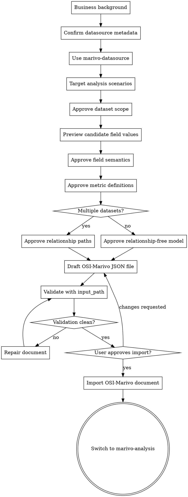

# Marivo Semantic-Layer Skill

Use this skill for current Marivo stdio MCP semantic-layer work only.

It owns business knowledge intake, reusable semantic contracts, OSI-Marivo document drafting,
validation, import, export, and deciding when to hand off to analysis. It does not own
datasource-only browse or session-scoped investigation loops.

## Checklist

You MUST complete these items in order when building or changing a reusable semantic model:

1. **Gather business background** - collect knowledge-base entries, metric docs, KPI definitions,
   dashboard notes, field glossaries, reporting SQL, or related report references.
2. **Confirm datasource metadata** - use `marivo-datasource` to verify datasource availability
   and discover physical schema before defining analysis scenarios.
3. **Clarify target analysis scenarios** - identify the questions, output shape, time expectation,
   and scenario-level dimensions the model must support.
4. **Approve dataset scope** - present the candidate datasets and wait for explicit user approval.
5. **Preview candidate field values** - use bounded sample rows from the approved datasets to verify
   candidate key, time, dimension, enum-like, filter, format, and null patterns.
6. **Approve field semantics** - present primary keys, unique keys, time fields, dimensions, and
   uncertainties before writing fields into the document.
7. **Approve metric definitions** - present metric names, ANSI SQL aggregation expressions,
   business meanings, primary time fields, additivity, and non-additive warnings.
8. **Approve relationship paths** - present join paths and cardinality, or get explicit approval
   for a relationship-free model.
9. **Draft and validate the document** - write a complete OSI-Marivo JSON document to a local file
   and validate it with `marivo-validate_osi_semantic_models` using `input_path`.
10. **Get import approval** - summarize the validated model and local JSON path, then import only
   after the user explicitly approves import.
11. **Hand off to analysis** - once imported and approved for use, switch to `marivo-analysis` for a
    smoke test or real investigation.

## Process Flow

The terminal state is switching to `marivo-analysis`. Do not start a session-scoped investigation
inside this skill.

## The Process

**1. Gather business background:**

- Start with business background, not table names. A table name or column list is physical metadata,
  not a reusable semantic contract.
- Ask for knowledge-base entries, metric docs, KPI definitions, dashboard notes, field glossaries,
  reporting SQL, or related report references.
- Do not ask for target scenarios or datasource connection details in the same question.
- This step is complete only when the user has provided written business background material, or has
  explicitly said none exists, and you can name the business entity or grain, population or
  exclusions, and important terms.

**2. Confirm datasource metadata:**

- Use `marivo-datasource` to verify datasource availability and discover physical schema before
  defining analysis scenarios.
- Browse schemas, tables, columns, and sample rows as metadata context, not as canonical analysis
  evidence.
- Return to this skill after the physical metadata needed for semantic authoring is available.

**3. Clarify target analysis scenarios:**

- Ask for the analysis questions this semantic model must support.
- Identify the expected output shape: observation, trend, anomaly detection, comparison,
  decomposition, validation, forecast, or similar.
- Clarify the primary time expectation and scenario-level dimensions.
- Do not ask for datasource connection details in the same question.
- This step is complete only when the target analysis question, output shape, primary time
  expectation, and scenario-level dimensions are clear.

**4. Approve dataset scope:**

- After metadata is confirmed, present the dataset scope options and stop. If there is only one
  viable dataset, still ask the user to confirm that dataset.
- Prefer the smallest business-approved dataset set that supports the target scenario.
- Do not make field, metric, or relationship decisions until the in-scope dataset list is explicitly
  approved.

**5. Preview candidate field values:**

- After dataset scope approval, use `marivo-datasource` and `marivo-preview_table` to preview
  bounded sample rows from each selected dataset before proposing field expressions.
- Preview candidate primary keys, unique keys, time fields, dimensions, enum-like fields, and filter
  columns needed by the target scenarios.
- Identify available time partition fields from datasource metadata or sample rows, and include them
  in the candidate time fields.
- Note the SQL column type from browse_columns output for each candidate time field. Column types
  like DATE, TIMESTAMP, VARCHAR, and BIGINT determine the OSI `data_type`. When the SQL type is
  VARCHAR or an integer type, also inspect sample values to determine the `format` pattern.
  See `references/time-field-patterns.md` for the full decision guide.
- Verify actual value shapes before writing expressions: date strings such as `YYYYMMDD` versus
  `YYYY-MM-DD`, status values such as `SUCCEED` versus guessed labels, variable-width hour values,
  and null, blank, or sentinel patterns.
- Treat preview output as metadata grounding only, not canonical analysis evidence.
- If preview is unavailable, state why and carry the uncertainty into the field semantics approval
  gate.

**6. Approve field semantics:**

- For each selected dataset or clear group of similar datasets, present the proposed primary key,
  unique keys, time fields, dimensions, and uncertainties.
- Cite the observed sample patterns for candidate key, time, dimension, enum-like, and filter fields,
  or explicitly state that preview was unavailable and why.
- Choose the primary key from the approved business grain, not from physical naming conventions
  alone.
- Use explicit time fields. Distinguish event time, snapshot time, partition time, and ingestion
  time when they differ.
- When a dataset has an available time partition field, prefer it as the primary time field and make
  that choice explicit in the approval gate.
- If the scenario must use event time, snapshot time, or ingestion time instead of an available time
  partition, explain the business reason before asking for approval.
- Mark time fields with `dimension.is_time: true` and a MARIVO field extension containing
  `support_min_granularity`, `data_type`, and (when required) `format` and `required_prefix`.
  Every time field must declare `data_type`. When data_type is "string" or "integer", `format`
  is also required. When format is "hh" or "h", `required_prefix` is required.
  See `references/time-field-patterns.md` for the complete decision guide and examples.
- Infer `data_type` from the SQL column type returned by browse_columns: DATE columns are "date",
  TIMESTAMP columns are "timestamp", VARCHAR/TEXT columns are "string", INTEGER/BIGINT columns are
  "integer".
- When data_type is "string" or "integer", infer `format` from preview sample values: 8-character
  strings like '20260325' are "yyyymmdd", 10-character strings like '2026032514' are "yyyymmddhh",
  1-2 digit hour values like '14' or 14 are "hh" or "h". See `references/time-field-patterns.md`
  for the full format catalog.
- When two time-like columns appear together (e.g., log_date + log_hour), model them as composite
  time fields: the date field gets a date format, and the hour field gets format "hh" or "h" with
  `required_prefix` set to the date field name.
- Infer `support_min_granularity` from datasource metadata and sampled values: date partition fields
  such as `log_date` are normally `day`; timestamp fields or proven date+hour expressions may be
  `hour`.
- Keep measures in the metric stage, not the field stage.
- Do not write fields into the document until the user explicitly approves the primary key, unique
  keys, time fields, and dimensions.

**7. Approve metric definitions:**

- Present proposed metrics with name, observed dataset, ANSI SQL aggregation expression, business
  meaning, primary time field, additive dimensions, and non-additive warnings.
- Do not create reusable metrics from source column names alone.
- Metrics using `SUM` are additive only across approved dimensions.
- `AVG`, ratios, and percentile-style metrics are non-additive. Label them clearly and explain that
  they are not decomposable.
- Do not write a metric into the document until the user explicitly approves its name, expression,
  meaning, primary time field, and additivity warning.
- Metric expressions must be complete aggregate expressions that include aggregate functions (e.g.,
  `SUM(col)`, `CAST(SUM(...) AS DOUBLE) / CAST(SUM(...) AS DOUBLE)`). Row-level expressions without
  aggregates (e.g., `CASE WHEN state = 'FAILED' THEN 1 ELSE 0 END`) will produce incorrect SQL.
  The `decomposition_semantics.type` field determines decomposition strategy only; it does not
  auto-wrap the expression in aggregate functions.

**8. Approve relationship paths:**

- If multiple datasets are used, present join paths, join columns, and cardinality, then stop for
  approval.
- If relationships are intentionally omitted, get explicit approval for a relationship-free model.
- For a single-dataset model, do not skip this silently; present "single dataset, no relationships"
  and wait for explicit approval.
- Add relationships only when the target scenario requires cross-dataset semantics and the user
  approves the path and cardinality.

**9. Draft and validate the document:**

- Refer to `references/osi-marivo.schema.json` for the OSI-Marivo JSON document schema when drafting
  the document structure, fields, and extensions.
- Write the document to a local JSON file before validation.
- Validate with `mcp__marivo__validate_osi_semantic_models`, passing
  `input: { input_path: "<local_json_file_path>" }`; do not use inline JSON payloads.
- Repair validation issues immediately and re-run validation from the local file.
- Validation success is not import approval.

**10. Get import approval:**

- After validation succeeds, present a concise summary of models, datasets, fields, metrics,
  relationships, known limitations, and the local JSON path.
- Ask explicitly whether the user approves import.
- Import only after explicit user approval, using the validated local document file rather than
  inline JSON.
- After import, report the local semantic model JSON document path used for validation/import.

**11. Hand off to analysis:**

- Need current semantic state: use `marivo-list_semantic_models`, `marivo-get_semantic_model`, or
  `marivo-export_osi_semantic_models`.
- Once the reusable graph is imported and approved for use, switch to `marivo-analysis`.
- Use `marivo-analysis` for a representative smoke test or real investigation.
- If analysis reveals a semantic gap, return to this skill and repeat the document repair,
  validation, and import-approval steps.

## After Building Semantic Layer

Before analysis, make sure all of the following are true:

- datasource is ready
- semantic contract is explicit
- datasource metadata is confirmed and target analysis scenarios are clear
- dataset scope, previewed field values, field semantics, metric definitions, and relationship paths
  were approved in order
- the complete OSI-Marivo document was validated from a local file with `input_path`
- the user explicitly approved import
- the imported model limitations are known, especially non-additive metrics

When these checks pass, hand off to `marivo-analysis` for the smoke test or investigation. If the
analysis reveals a semantic gap, return to this skill, repair the document, validate it again, and
get import approval again before continuing analysis.

## Key Principles

- **Business first** - Do not infer reusable semantic contracts from table names or column names
  alone.
- **One approval at a time** - A single user response approves only the currently active gate unless
  the user explicitly names multiple gates and approves them together.
- **Multiple choice preferred** - Easier to answer than open-ended when possible.
- **Document-first management** - Build, validate, import, export, and repair complete OSI-Marivo
  documents instead of mutating semantic objects one by one.
- **Explicit grain before fields** - State what one row represents before choosing primary keys,
  time fields, dimensions, or metrics.
- **Metrics are business formulas** - Metric names, expressions, meanings, time fields, and
  additivity must come from approved business definitions.
- **Validation is technical, not business approval** - A valid document can still encode the wrong
  contract.
- **Import is a hard gate** - Never import without explicit user approval.
- **Analysis is separate** - This skill prepares reusable semantics; `marivo-analysis` produces
  session-scoped evidence.

## Common Mistakes

- defining field expressions from column names alone without previewing representative values
- assuming time formats, success states, hour padding, or enum values before checking sample rows
- omitting data_type, format, or required_prefix on time fields, which causes schema validation
  to fail; every time field needs data_type, and string/integer time fields also need format
- treating preview rows as proof of a business conclusion instead of metadata grounding
