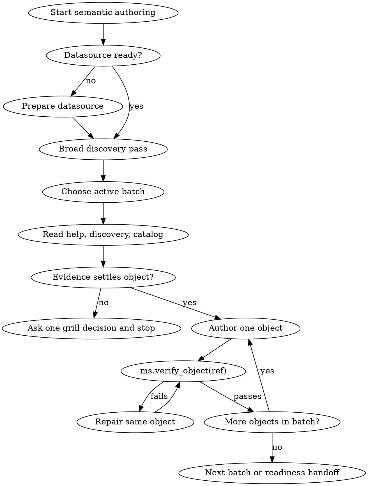

# marivo-semantic

Use this skill when defining project datasources or reusable semantic objects.
For metric-centered analysis on an already-ready semantic project, use
`marivo-analysis`.

This skill is written for projects that depend on Marivo as a Python library.
Do not rely on Marivo repository fixtures, `make`, or a fixed `.venv` name in
the target project. Identify the project Python environment and use its
explicit interpreter path, such as `<venv>/bin/python`.

## Layer Contract

The current authoring sequence is:

```text
help -> discover -> settle/grill -> author -> verify
```

This skill owns workflow and routing only:

- `ms.help(...)` owns the static authoring contract.
- `md.discover_*` owns datasource evidence shown through `.show()` /
  `.render()`.
- `ms.load()`, `ms.verify_object(...)`, `ms.readiness(...)`, and load errors
  own catalog state, validation, blockers, and handoff readiness.

When starting authoring, consult these help topics for the staged workflow
detail — this skill never repeats their parameter tables or schemas:

- `md.help("authoring")` — datasource-backed authoring workflow
  (discover -> settle -> author -> verify), including the
  register/test/inspect chain for a new datasource.
- `ms.help("authoring")` — semantic authoring workflow and the
  dependency ladder (domain -> entity -> dimension -> time_dimension ->
  measure -> metric -> relationship).
- `md.help("ai_context")` — canonical `ms.ai_context(...)` contract shared
  by datasources and every semantic object.

Do not copy constructor parameter tables, discovery result schemas, parse
recipes, backend catalogs, or public error catalogs into skill docs.

## Hard Gates

These gates apply before writing semantic code:

- **Evidence before questions:** inspect `ms.help(...)`, the matching
  `md.discover_*` evidence, current catalog state, project docs, source
  SQL/provenance when present, Git review context when available, and user
  answers.
- **Wide discovery, narrow authoring:** collect domain- or table-group evidence
  once when useful, then reuse it while authoring. Broad evidence collection
  does not change the authoring unit.
- **One active batch:** default to one entity plus one semantic kind, such as
  `entity.sales.orders + dimension`. Relationship and cross-entity batches may
  span entities only when the kind requires it.
- **One object then verify:** author exactly one semantic object, run
  `ms.verify_object(ref)`, and fix failures before advancing.
- **One grill decision:** A grill turn MUST ask exactly one unresolved semantic decision,
  then stop and wait. Do not ask numbered lists of questions.
  Do not write semantic code after asking.
- **Ref-only links:** object-to-object authoring parameters use Ref objects,
  not bare semantic-id strings. Use returned/imported refs, or
  `ms.ref("<kind>.<semantic_id>")` for explicit forward or cross-file refs.
- **No contract transcription:** when a field, signature, backend parameter,
  parse shape, or error detail is unclear, read help, discovery output, or the
  structured error instead of restating it here.

## Process Flow



The broad discovery pass includes `md.inspect_table(...)`,
`md.inspect_partitions(...)` when the table is partitioned, and the matching
`md.discover_*` calls. It gathers reusable physical evidence; it does not
change the narrow authoring unit.

## Canonical Loop

Build datasource-backed semantic objects in dependency order:

```text
domain -> entity -> dimension -> time_dimension -> measure -> metric
       -> relationship -> cross-entity metric -> derived metric
```

Datasource registration is a prerequisite owned by `marivo.datasource`; it is
not a semantic ladder rung.

You may run a broad discovery pass for the relevant domain or table group to
collect schema, partitions, profiles, relationship candidates, existing catalog
state, and project evidence. After that pass, keep authoring narrow: choose one
active batch, author one object, verify it, then repeat.

For each active batch, use one state machine:

```text
choose active batch
  -> inspect ms.help(...)
  -> run matching md.discover_*
  -> inspect ms.load() catalog state
  -> settle from evidence, registry, project docs, source SQL/provenance, and Git review context
  -> grill one unresolved semantic decision, if needed
  -> author one object
  -> ms.verify_object(ref)
  -> repeat or close batch
```

Do not author a full domain in one pass. Do not write several objects and
verify later. Do not skip to another batch while the current object has not
passed `ms.verify_object(ref)`.

## Grill Rules

Ask the user only for semantic intent, business policy, or ambiguity that
remains after the evidence pass.

Do not ask for datasource facts Marivo can discover: schema, column names, data
types, sample values, join-key viability, partition state, or existing refs.

Do not invent multiple-choice options. Every option must be grounded in
metadata comments, column profiles, sample distributions, existing semantic
objects, source SQL, project docs, or Git review context. If evidence supports
one path, ask for confirmation of that path. If evidence is too thin for
options, ask an open clarification or run another bounded discovery query.

## Existing Catalog

Use `ms.load()` for current semantic state. Browse through typed collection
properties, not a kind/scope matrix:

```python
catalog = ms.load()
catalog.domains.show()

sales = catalog.domains.get("sales")
sales.entities.show()
sales.metrics.show()

orders = sales.entities.get("orders")
orders.dimensions.show()
orders.time_dimensions.show()
orders.measures.show()
orders.relationships.show()
```

Each collection supports `.items`, `.ids()`, and `.refs()` for complete reads,
and `.get(key)` for exact typed-ID or unique local-name lookup. Container
`.show()` cards advertise their own live navigation properties and counts, so
rely on them instead of a static matrix.

Use `catalog.get("metric.sales.revenue").details().show()` for a full briefing
on a specific object. Use `mv.help(ref)` for a short consumption briefing on a
semantic object. Use `ms.help("<topic>")` for authoring contracts. Read
semantic source files only when you need to modify them or debug implementation
expressions.

## Anti-Patterns

- Asking before discovery.
- Authoring a whole domain or many object kinds in one batch.
- Writing multiple objects before verification.
- Offering plausible but evidence-free grill options.
- Passing naked semantic-id strings where Ref objects are expected.
- Treating raw SQL diagnostics as executable semantic expression bodies.
- Handing blocked refs to `marivo-analysis`.

## Reference Routing

| Need | Read |
| --- | --- |
| Datasource prerequisite and discovery budgets | `references/datasource.md` |
| Analysis handoff readiness | `references/closeout.md` |
| Workflow-level failure modes | `references/pitfalls.md` |
| Cumulative metric authoring (all-history, MTD, trailing) | `references/cumulative-metrics.md` |
| Cumulative anchor grill points (reset-grain, window-span, partial-window) | `references/cumulative-anchors-v2.md` |
| Runnable examples | `references/examples/` |
