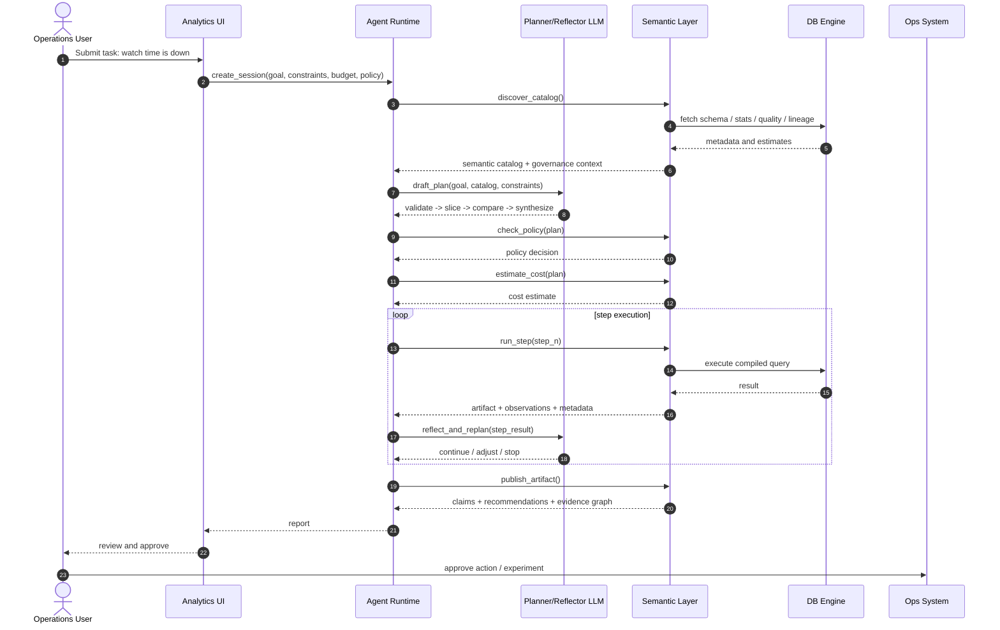

# Factum 设计文档

## 1. 执行摘要

Factum 是一个面向 Agentic Analytics（代理式数据分析）的系统设计.

核心判断是：当前很多 LLM 与数据库的集成效果不佳，并不是因为模型“不会写 SQL”，而是因为外围系统没有向模型暴露足够的结构化能力，使其无法稳定地进行规划、反思、工具编排、治理约束感知以及基于证据的推理。在多数系统中，模型只能看到零碎 schema、生成 SQL、拿到原始 rows，然后在缺少语义、质量、成本与可追溯证据的前提下尝试总结结论。

Factum 试图提供一种不同的接口：

- 用**有状态的分析会话**替代一次性查询
- 用**语义发现**替代 schema 猜测
- 用**类型化分析步骤**替代任意 prompt-to-SQL
- 用**确定性的证据打包**替代无结构的结果解读
- 通过纯 **HTTP API** 对外暴露能力，供 Agent、UI 和外部工具调用

当前代码库已从最初的 DuckDB MVP 演进为完整的多引擎语义层与 agent runtime 平台。

本文档同时描述两部分内容：

1. 来自前序讨论的 **目标系统设计**
2. 当前仓库中的 **MVP 实现形态**

目标是为后续扩展 Factum 的工程师提供一份完整的技术蓝图，使其能将 Factum 从本地设计探针逐步演进为更完整的语义层与 Agent Runtime 平台。

## 2. 问题定义

### 2.1 当前 LLM + 数据库交互模式的问题

大多数 LLM 驱动的数据分析系统仍然依赖一个很窄的执行闭环：

1. 提供 schema 或表文档
2. 让模型生成 SQL
3. 执行 SQL
4. 返回 rows
5. 让模型总结结果

这套方式在简单查询上有效，但一旦进入真正的数据分析场景就会出现明显问题：

- **业务语义是隐式的**：模型必须自行判断哪个指标定义才是正确口径
- **分析过程不是有状态的**：中间结果、假设、计划都不是一等对象
- **治理信息暴露不足**：权限、脱敏、预算、策略边界通常不在模型可见接口内
- **质量信号缺失**：freshness、异常、血缘、上游变更往往不可见或零散暴露
- **不支持反思**：模型缺少可以直接推理的显式 evidence graph
- **工具编排粗糙**：数据库被当成一个字符串型查询工具，而不是一个类型化分析运行时

### 2.2 为什么只有 SQL 不够

SQL 作为声明式查询语言非常强大，但它并不是一个完整的 Agentic 分析接口。

它并不天然表达：

- 规划与重规划
- 会话状态与检查点
- 证据支持与反证
- 成本感知的步骤选择
- 策略约束下的改写与执行
- 推荐动作的证据回溯
- 可复现元数据

更合理的做法是：将数据库视为执行底座，而在其上方暴露更丰富的语义层与编排层接口。

## 3. 愿景

Factum 的目标是成为一个让 LLM 或 Agent 可以通过**高于原始 SQL 的契约**来分析数据的系统。

在完整形态下，Factum 应该提供：

- 一个暴露实体、指标、维度与业务定义的语义层
- 一个面向 Agent 的运行时，支持会话、计划、步骤、检查点与证据
- 一组确定性分析器，将数据输出转换为机器可消费的 observations
- 面向治理的接口，用于策略、成本、血缘和质量感知
- 一层标准化的 HTTP API，供 Agent、UI 和工具调用
- 可迁移到 DuckDB、PostgreSQL、Trino、Spark、Snowflake 等多种执行引擎之上

简而言之，Factum 试图成为 **LLM Agent 与数据执行引擎之间的分析操作层（analysis operating layer）**。

## 4. 目标与非目标

### 4.1 目标

- 验证一种比 text-to-SQL 更丰富的交互模型。
- 让语义对象、分析步骤与证据成为一等对象。
- 通过确定性 evidence packaging 产出可审计的结构化分析结果。
- 保持服务有状态、可被工具调用。
- 通过 HTTP API 为 Agent、UI 和工具链提供接入。
- 支持多引擎执行，统一路由与方言翻译。

### 4.2 非目标

- 在 MVP 阶段构建完整的生产级元数据平台。
- 在当前阶段实现真正的、由 LLM 驱动的全自动规划控制器。
- 把任意用户自写 SQL 作为主接口暴露出去。
- 完整解决因果推断问题。
- 直接替代企业现有 BI 平台或治理平台。

## 5. 目标读者

本文面向需要扩展 Factum 的工程师。

读者阅读后应能够：

- 理解 Factum 的架构动机
- 理解当前 DuckDB MVP 的实现方式
- 理解目标语义层与 API 设计方向
- 理解 evidence packaging 的工作机制
- 理解 HTTP API 层的设计与模块边界
- 明确下一阶段应如何扩展实现

## 6. 术语表

- **Session（会话）**：分析的顶层单元；保存 `goal`、`policy`、`constraints` 等 API 字段以及所有输出。
- **Semantic object（语义对象）**：比物理表更高层的业务对象，例如 entity、metric、dimension、asset。
- **Asset（资产）**：物理数据源，例如一张表。
- **Step（步骤）**：类型化分析动作，例如 `compare_metric`、`profile_table`、`aggregate_query`。
- **Artifact（产物）**：某个步骤持久化后的结果载荷。
- **Observation（观察）**：从步骤结果中提取出的类型化事实。
- **Claim（结论）**：由一个或多个 observation 支持或反驳的综合性判断。
- **Evidence edge（证据边）**：例如 `supports`、`contradicts`、`justifies` 之类的关系。扩展类型包括 `correlates_with`、`temporally_precedes`、`mechanistically_explains`、`eliminates_alternative`、`experimentally_confirms`。
- **Recommendation（建议）**：从被支持的 claim 导出的行动建议，包含 `causal_basis` 字段用于标注因果证据强度。
- **Semantic Layer / SL（语义层）**：位于物理数据库之上，向 Agent 暴露业务语义、治理、执行规划和证据能力的层。
- **Inference Level（推理层级）**：六级证据强度阶梯（L0-L5），区分相关性与因果性。L0 共现、L1 统计关联、L2 时间先后、L3 机制合理性、L4 混淆排除、L5 干预验证。
- **Readiness Signal（准备度信号）**：每步执行后返回的五维结构化评估，帮助 Agent 判断"证据够不够做结论"。
- **Extractor Registry（提取器注册表）**：StepType → ExtractorType → ObservationType 的形式化映射，确保每种 observation 类型都有对应的确定性提取器。
- **Tentative Claim（暂定结论）**：增量合成过程中自动生成的初步结论，status=tentative，需通过 synthesize_findings（promotion）操作升级为 confirmed。

## 7. 架构原则

### 7.1 用会话替代一次性查询

分析必须是有状态的。每次调查都应属于某个 session，而 session 需要拥有：

- goal
- constraints
- budget
- policy
- step outputs
- evidence graph
- recommendations

### 7.2 用语义替代 schema 猜测

Agent 应该操作 metrics、entities、dimensions 和 policies，而不是直接猜表名与列名。

### 7.3 用类型化步骤替代 SQL 字符串

对外契约应该以步骤和任务为中心，而不是以字符串为中心。SQL 可以作为内部编译目标，但不应成为主要交互接口。

### 7.4 用确定性逻辑提取事实

事实层应尽可能由确定性逻辑提取。LLM 可以参与解释和语言组织，但不应成为唯一的事实来源。

### 7.5 协议适配层应尽量薄

HTTP 层应只做干净的协议暴露，不承载业务逻辑。（MCP 层已从代码库移除，目前是纯 HTTP API 服务。）

### 7.6 做引擎抽象，但不能掩盖引擎差异

长期来看 Factum 应该支持多引擎，但 PostgreSQL、Spark、Snowflake、DuckDB 的能力和运行特征并不相同。系统应通过成本、能力和执行元数据把这些差异显式暴露出来，而不是假装它们完全可互换。

## 8. 目标系统架构

完整形态的 Factum 可以被划分为六个逻辑层：

```text
+----------------------------------------------------------+
| User / Agent / LLM Client                                |
+-----------------------------+----------------------------+
                              |
                              v
+----------------------------------------------------------+
| Interaction Layer                                         |
| UI, HTTP API                                              |
+-----------------------------+----------------------------+
                              |
                              v
+----------------------------------------------------------+
| Agent Runtime / Session Layer                             |
| sessions, plans, checkpoints, step orchestration          |
+-----------------------------+----------------------------+
                              |
                              v
+----------------------------------------------------------+
| Semantic Layer                                            |
| catalog, metric definitions, policy, quality, lineage,    |
| stats, plan validation, compilation, evidence packaging   |
+-----------------------------+----------------------------+
                              |
                              v
+----------------------------------------------------------+
| Execution Layer                                           |
| DuckDB / PostgreSQL / Spark / Snowflake adapters          |
+-----------------------------+----------------------------+
                              |
                              v
+----------------------------------------------------------+
| Data Assets                                                |
| warehouse tables, event logs, metadata, quality rules     |
+----------------------------------------------------------+
```

### 8.1 主要运行时角色

- **User**：定义业务目标，并对最终动作进行审核批准。
- **Agent runtime**：管理 session 状态、步骤执行与产物持久化。
- **LLM**：负责草拟计划、基于证据反思，并生成面向人的总结性表达。
- **Semantic layer**：提供业务语义、治理上下文与步骤编译能力。
- **Database / engine**：真正执行分析计算。
- **Ops systems**：消费 recommendations，并执行实验或运营动作。

## 9. 端到端示例流程

经典示例场景是：

> 某视频网站最近播放时长下降，运营团队希望识别主要原因并制定恢复策略。

### 9.1 概念时序



### 9.2 在这个流程里系统必须暴露什么

为了支撑上述流程，Factum 必须暴露的不应只是 rows，还应包括：

- 语义指标，例如 watch time、retention
- 治理边界与访问限制
- 血缘与质量状态
- 当前 vs 基线的对比结果
- 带有支持关系与反证关系的证据对象
- 可复现与成本上下文
- 与证据绑定的建议动作

## 10. 语义层设计

语义层是 Factum 中最核心的概念组件。

它不能被简单理解为一个 BI 指标注册中心，而应被视为一个 **面向 LLM / Agent 的语义、治理、统计与执行门面层**。

### 10.1 语义层职责

语义层应至少承担六类职责：

1. **语义映射**
   - 将业务语言映射为 entities、metrics、dimensions、segments
2. **上下文供给**
   - 提供 schema、定义、joins、质量、freshness、血缘与变更信息
3. **治理控制**
   - 执行或显式暴露权限、脱敏、策略边界与预算限制
4. **执行编译**
   - 将类型化分析步骤编译为物理执行计划
5. **证据打包**
   - 将执行结果转换为 observations、claims、edges 与 recommendations
6. **反思支持**
   - 暴露足够结构，使 planner 或 LLM 能基于中间证据进行反思和重规划

### 10.2 核心语义对象类型

未来完整实现至少应支持：

- **entities**：user、session、video、device
- **metrics**：watch_time、retention_30s、first_frame_time_p95、preroll_timeout_rate、recommendation_ctr
- **dimensions**：platform、app_version、country、network_type、content_type
- **segments**：派生的人群切片
- **assets**：物理表或视图
- **policies**：脱敏、聚合限制、访问策略
- **quality rules**：freshness、null-rate、anomaly checks
- **lineage links**：上下游依赖关系

## 11. 目标 API 设计

前序讨论提出，应从 `text_to_sql(query) -> rows` 演进到一个有状态的分析运行时。

### 11.1 顶层运行时 API

目标顶层 API 形态包括：

- `create_session(goal, constraints, budget, policy)`
- `discover_catalog()`
- `draft_plan()`
- `approve_or_patch_plan()`
- `run_step()`
- `checkpoint()`
- `reflect_and_replan()`
- `publish_artifact()`

### 11.2 面向能力的 API 分类

系统最终应暴露按能力组织的接口。

#### 读能力

- `scan`
- `sample`
- `profile`
- `query`
- `explain`
- `get_stats`

#### 写 / 变换能力

- `transform`
- `materialize`
- `merge`
- `upsert`

#### 治理能力

- `check_policy`
- `check_quality`
- `get_lineage`
- `get_provenance`
- `request_approval`

#### 编排能力

- `spawn_tool`
- `wait_job`
- `cancel_job`
- `retry_from_checkpoint`

#### 记忆 / 上下文能力

- `store_fact`
- `store_artifact`
- `load_context`

### 11.3 统一响应信封

讨论中建议使用一个标准化响应结构：

```json
{
  "result": {},
  "evidence": [],
  "assumptions": [],
  "uncertainty": {},
  "cost": {},
  "latency": {},
  "affected_assets": [],
  "reproducibility_token": "",
  "live_claims": [],
  "readiness": {
    "goal_coverage": {"explored": [], "pending": [], "ratio": 0.0},
    "evidence_sufficiency": {"claim_count": 0, "avg_confidence": 0.0, "min_support_count": 0},
    "contradiction_resolution": {"unresolved_count": 0, "blocking": false},
    "budget_remaining": {"scan_bytes_pct": 0.0, "step_count_pct": 0.0},
    "diminishing_returns": {"recent_observation_diversity": 0.0, "novelty_trend": "stable"},
    "suggested_actions": []
  }
}
```

`live_claims` 包含当前 session 中所有活跃的 tentative 和 confirmed claims 快照。`readiness` 字段提供五维准备度评估（参见 §13.8.2），帮助 Agent 判断是否需要继续探索或可以进入 synthesis。Factum 不替 Agent 做"要不要 synthesize"的决策，只提供结构化信息。

这样每个操作都比单纯返回 rows 更适合用于后续规划与反思。

### 11.4 Session 与 Step 生命周期

长期来看，运行时需要显式表达生命周期状态。

#### Session 状态

- `open`：会话已创建，可进入规划或执行
- `running`：一个或多个步骤执行中
- `waiting_approval`：等待策略或人工审批
- `completed`：分析流程成功完成
- `failed`：发生终态错误
- `cancelled`：会话被主动终止

#### Step 状态

- `pending`
- `validated`
- `running`
- `succeeded`
- `failed`
- `skipped`
- `cancelled`

#### 生命周期规则预期

- 每个 step 必须且只能属于一个 session
- 同一个 checkpoint / input snapshot 下，step 应尽可能幂等
- 失败信息应记录为 step-level artifact，而不仅仅是协议层错误
- 重试时应保留此前失败元数据，以支持审计
- checkpoint 应引用 semantic version、data snapshot、policy version 与 plan hash

## 12. 目标语义层 API 面

讨论中提出，语义层 API 可以按领域进行组织。

### 12.1 Catalog / discovery

- `discover_catalog`
- `search_semantics`
- `get_semantic_object`

目标：

- 发现可用语义对象
- 查看 metric / entity 定义
- 用语义搜索替代 schema 猜测

### 12.2 Profiling / statistics

- `get_profile`
- `sample_rows`
- `get_change_log`

目标：

- 暴露 row count、分布、分位数、top values 以及最近变更

### 12.3 Governance / policy

- `check_policy`
- `estimate_cost`
- `get_quality_status`
- `get_lineage`

目标：

- 让执行过程具备安全性、可审计性与预算感知

### 12.4 Planning / compilation

- `validate_step`
- `compile_step`
- `explain_step`

目标：

- 将分析建模为类型化步骤，而不是原始 SQL 文本

### 12.5 Execution / job

- `run_step`
- `get_job`
- `cancel_job`
- `retry_job`
- `resume_from_checkpoint`

目标：

- 支持异步、有状态、可恢复的执行

### 12.6 Reflection / recommendation

- `suggest_next_steps`
- `evaluate_evidence`

目标：

- 支持基于部分进展与证据强度的推理

## 13. Evidence Packaging 设计

Evidence packaging 是 Factum 最关键的设计点。

### 13.1 为什么需要 evidence packaging

Rows 不是一个适合高层推理的接口，因为它们不会显式表达：

- 什么最重要
- 哪些发现支持某个结论
- 哪些发现反驳某个结论
- 数据质量是否足够支撑结论
- 当前应该有多大信心

Evidence packaging 的目标就是把步骤输出变成一个结构化 evidence graph。

### 13.2 证据对象模型

Factum 在概念上使用五类输出对象。

#### Raw artifact

例如：

- 排序后的切片对比结果
- 聚合结果表
- 图表载荷
- 临时表引用

#### Observation

从 artifact 中提取出的类型化事实。

例如：

- Android 8.3.1 / 4g / short-video 流量的 watch time 下降 14.2%
- 同一切片的 first-frame time 上升 18%
- preroll timeout rate 升高
- recommendation CTR 并未明显崩塌

#### Claim

由 observations 支持或反驳的综合性结论。

例如：

- 播放时长下降集中在 Android 8.3.1 弱网短视频流量中
- 播放体验恶化比推荐质量下滑更像主要原因

#### Evidence edge

类型化关系，分为基础层和因果增强层：

**基础层**（已实现）：

- `supports` — 支持
- `contradicts` — 反驳
- `justifies` — 论证

**因果增强层**（对应推理层级，参见 §13.8.1）：

- `correlates_with` — L0/L1 统计共现
- `temporally_precedes` — L2 时间先后
- `mechanistically_explains` — L3 已知因果路径
- `eliminates_alternative` — L4 排除混淆因素
- `experimentally_confirms` — L5 实验验证

Synthesizer 根据 claim 下挂的 edge 类型分布自动推断 `inference_level`。

#### Recommendation

由 claims 支撑的行动建议。

例如：

- 优先修复 Android 播放问题
- 为弱网用户降低 preroll 负担
- 为受影响人群运行恢复实验

### 13.2.1 规范证据对象示例

#### Observation 示例

```json
{
  "observation_id": "obs_123",
  "type": "metric_change",
  "subject": {
    "metric": "watch_time",
    "slice": {
      "platform": "android",
      "app_version": "8.3.1",
      "network_type": "4g",
      "content_type": "short"
    }
  },
  "payload": {
    "current_value": 82.4,
    "baseline_value": 96.1,
    "delta_pct": -14.2,
    "current_sessions": 280,
    "baseline_sessions": 285
  },
  "significance": {
    "sample_size": 280,
    "practical_significance": true
  },
  "quality": {
    "freshness_ok": true,
    "sample_size_ok": true
  }
}
```

#### Claim 示例

```json
{
  "claim_id": "claim_456",
  "type": "root_cause_candidate",
  "text": "播放时长下降集中在 Android 8.3.1 弱网短视频流量中，且播放体验退化是最主要驱动因素。",
  "scope": {
    "platform": "android",
    "app_version": "8.3.1",
    "network_type": "4g",
    "content_type": "short"
  },
  "confidence": {
    "raw_score": 0.91,
    "calibrated_confidence": null
  },
  "inference_level": "L1",
  "inference_justification": [
    "效应在 android/4g/short 切片上持续存在 → L1",
    "未检测到 watch_time 与 first_frame_time 之间的时间先后关系 → 无法升至 L2",
    "因果路径 (首帧延迟↑ → 观看时长↓) 需要领域知识确认 → 无法升至 L3"
  ],
  "supporting_observations": ["obs_123", "obs_789"],
  "contradicting_observations": [],
  "status": "tentative"
}
```

#### Recommendation 示例

```json
{
  "rec_id": "rec_789",
  "claim_id": "claim_456",
  "priority": "P0",
  "action_text": "优先发布 Android 8.3.1 播放热修复，重点降低弱网场景下的首帧时延。",
  "expected_impact": "恢复受影响人群的 30 秒留存与 watch time。",
  "risk": "需要分阶段发布与持续监控。",
  "validation_metric": {
    "primary_metric": "watch_time",
    "secondary_metric": "retention_30s"
  },
  "causal_basis": {
    "inference_level": "L1",
    "strongest_evidence": "首帧时延上升 18% 与观看时长下降 14.2% 在同一切片上共现，且在多个切片一致",
    "unresolved_confounds": ["app 版本更新可能引入其他变更", "CDN 变更未排除"],
    "suggested_validation": "对 android/8.3.1/4g 用户灰度发布首帧优化补丁，观察 watch_time 是否恢复"
  }
}
```

### 13.3 核心原则：事实靠代码，语言靠模型

长期原则应该是：

- **事实应尽量由确定性逻辑提取**
- **语言表达可以由 LLM 优化**

系统应避免让 LLM 成为唯一的证据抽取器。

### 13.4 增量合成提取流水线

> **设计变更**（基于评审 M-03）：从"大爆炸式终态步骤"重构为"增量合成 + Promotion"模式。每次 step 执行完毕后自动执行增量合成，`synthesize_findings` 变为 promotion 操作。

每次 step 执行应遵循如下增量过程：

1. 执行 query 或 step
2. 存储 artifact
3. 从 artifact 中通过 Extractor Registry（§13.8.3）确定性提取 observations
4. 计算 significance 与 quality 元数据
5. **增量合成**（自动执行，非显式步骤）：
   - 5a. 尝试将新 observations 归入已有 claims（scope 匹配）
   - 5b. 对未匹配的 observations 创建 tentative claim（`status=tentative`）
   - 5c. 检测新 observations 是否与已有 claims 矛盾，生成 `contradicts` edge
   - 5d. 更新所有受影响 claims 的 confidence
6. 连接 evidence edges（包括因果增强 edge 类型）
7. 计算并返回 readiness signal（§13.8.2）

**`synthesize_findings` 作为 promotion 操作**：

当 Agent 显式调用 `synthesize_findings` 时，执行以下 promotion 逻辑：

- 将满足条件的 tentative claims 升级为 `confirmed`
- 对 confirmed claims 生成 recommendations
- 对未能 promote 的 claims 生成"证据不足"标注
- 自动标记高风险 recommendations 需要审批

### 13.5 置信度打分

当前使用一个确定性的打分方式，基于以下因子：

- effect strength
- consistency across signals
- sample size proxy
- quality proxy
- contradiction penalty

当前公式为：

```text
raw_score =
  0.30 * effect_strength
  + 0.25 * consistency
  + 0.20 * sample_score
  + 0.25 * data_quality_score
  - contradiction_penalty
```

这个公式很简单，但结构上很重要，因为 confidence 是可持久化、可审查的，而不是纯 narrative。

#### 校准层（计划中）

> **设计变更**（基于评审 M-05）：在现有公式上增加校准层。

当前公式输出的 0.91 与 0.72 之间的差距缺乏语义锚点。计划增加：

- 在 confidence 对象上同时暴露 `raw_score`（公式直接输出）和 `calibrated_confidence`（校准后）
- 收集人类分析师对同一组 observations 的判断作为校准基线
- 使用 isotonic regression 或分箱映射将公式输出校准到人类判断分布
- 在校准数据不足时，`calibrated_confidence` 为 null，消费方应使用 `raw_score`

### 13.6 支持与反证

未来更健壮的实现必须同时建模：

- 强化 claim 的证据
- 削弱或推翻 claim 的证据

只有这样，系统才不至于基于单边证据生成过度自信的结论。

### 13.7 Recommendation 生成阈值

当前 MVP 中 recommendation 生成逻辑仍然偏手工，但未来系统应显式定义门槛。

建议最低条件包括：

- 至少存在一个超过配置置信度阈值的 root-cause claim
- 不存在超过严重度阈值的未解决 contradiction
- 证据作用域必须被限制在某个明确 scope 内，而不是泛化叙述
- 每条 recommendation 必须绑定 validation metric
- 每条 recommendation 必须携带 risk 描述

在未来版本中，任何会改变用户行为或消耗预算的 recommendation 都应该接入审批机制。

### 13.8 Factum 与 Agent 控制流边界约定

> **新增章节**（基于评审 M-12）：这是整个系统最关键的接口设计。

#### 13.8.1 推理层级（Inference Level）

Claim 的 `confidence` 分数混合了"相关性强度"和"因果确定性"两个维度。引入六级证据强度阶梯，区分相关性与因果性：

| 级别 | 名称 | 含义 | 实现方式 |
|------|------|------|----------|
| L0 | Co-occurrence | 两个指标在同一时间窗口内变化了 | 确定性代码 |
| L1 | Statistical association | 效应在多个切片上持续存在 | 确定性代码 |
| L2 | Temporal precedence | A 在时间上先于 B 变化，且 lag 一致 | 确定性代码 |
| L3 | Mechanism plausibility | 存在已知因果路径 | LLM 辅助 + 领域知识 |
| L4 | Confound elimination | 备选解释已被测试并削弱 | 混合（代码 + LLM） |
| L5 | Interventional confirmation | 实验或回滚验证了因果关系 | 外部系统 |

每个 Claim 上增加 `inference_level` 和 `inference_justification` 字段。`inference_justification` 记录系统用了哪些检验来确定当前级别、以及为什么没能升到更高级别。

核心原则：**前三级（L0-L2）完全由确定性代码实现**，契合"事实靠代码"原则。

#### 13.8.2 Readiness Signal

每个 step 执行后的 response 中增加 `readiness` 字段，包含五个维度的结构化评估：

- **goal_coverage**：目标维度覆盖率（已探索 / 待探索维度列表）
- **evidence_sufficiency**：claims 的 confidence 分布与支撑强度
- **contradiction_resolution**：是否存在未解决的 `contradicts` edge（blocking 标志）
- **budget_remaining**：已用扫描字节 / 步骤数占比
- **diminishing_returns**：最近 N 步的 observation 产出多样性变化

输出一个排序的 `suggested_actions` 列表，synthesize 只是其中一个可能的建议。

#### 13.8.3 Extractor 注册表

> **设计变更**（基于评审 M-01）：建立 StepType → ExtractorType → ObservationType 的形式化映射。

当前只有 `ComparisonRowExtractor` 和 `AggregateRowExtractor`，但系统声称支持 7 种 observation 类型。需要补齐映射：

```
compare_metric   → ComparisonRowExtractor     → metric_change
aggregate_query  → AggregateRowExtractor       → contribution_shift
funnel_analysis  → FunnelExtractor（待实现）     → funnel_drop
anomaly_scan     → AnomalyExtractor（待实现）    → anomaly_detection
qoe_analysis     → QoEExtractor（待实现）        → qoe_regression
ad_analysis      → AdExtractor（待实现）          → ad_regression
rec_analysis     → RecommendationExtractor（待实现）→ recommendation_signal
```

每个 Extractor 必须声明：消费的 artifact 类型、产出的 observation 类型、前置条件。

#### 13.8.4 Synthesizer 可审计子步骤

> **设计变更**（基于评审 M-06）：将 claim 生成逻辑拆分为三个显式、可审计的子步骤。

1. **Scope Clustering**：按共享维度对 observations 聚类
2. **Signal Alignment**：检查同一 scope 内的 observations 方向一致性
3. **Claim Formulation**：对一致性高的聚类生成 claim；对矛盾组生成 pending claim

每步都有日志输出，使 claim 生成过程透明可审计。

#### 13.8.5 职责边界

**Factum 的职责（测量与暴露）**：

- 确定性地提取 observations、计算 confidence、检测 contradictions
- 增量合成 tentative claims
- 计算并返回 readiness signal
- 提供排序的 `suggested_actions` 列表
- 执行 promotion（synthesize）时应用门槛约束
- 执行 L0-L2 确定性因果检验（§13.9）

**Agent 的职责（解释与决策）**：

- 解释 readiness signal，决定下一步动作
- 决定何时调用 synthesize（promotion）
- 决定是否在矛盾未解决时强制 synthesize
- 基于用户意图和预算做 tradeoff 决策
- L3+ 因果推理（借助 LLM 能力）

**核心原则**：Factum 永远不"决定"——它只测量和暴露。Agent 永远不"猜"——它基于 Factum 提供的结构化信息做有据可查的决策。

### 13.9 确定性因果检验器

> **新增章节**（基于评审 M-09）：实现 L0-L2 确定性因果检验，完全契合"事实靠代码"原则。

#### 跨切片一致性检验（L0→L1）

对 observations 按 scope 分组后，统计效应方向和幅度是否跨切片一致。如果效应在多数切片上持续存在（方向一致率 > 阈值），将 inference_level 从 L0 升至 L1。

#### 时间先后检验（L1→L2）

比较 supporting observations 的 `observed_window`。如果早期窗口持续先于后期窗口，且两者严格不重叠，将 inference_level 从 L1 升至 L2。

#### 剂量-反应检验（L1 bonus）

对 observation pairs 做 Spearman 相关系数。如果 A 的变化幅度与 B 的变化幅度存在单调关系，增加一个 `dose_response` 信号标注。

#### 逆转检验（L2 bonus）

在时间线上找干预点（如 app 版本更新时间），检查干预前后指标是否反转。如果存在反转，增加一个 `reversal_detected` 信号标注。

### 13.10 Observation 时序标注

> **设计变更**（基于评审 M-08）：在 Observation 和 Edge 上增加时序信息。

在 observation 上增加：

- `observed_window`：观察到该事实的时间窗口（`{"start": "...", "end": "..."}`）
- `temporal_order`：发现顺序（step 执行的全局序号）

在 evidence edge 上增加 `precedes` 类型，表示"A 在时间上先于 B 被观察到"。

这些时序标注为下游 LLM reflector 提供时序线索，系统本身不做因果推断（L3+），但暴露足够信息供 Agent 判断。

## 14. 当前仓库架构

代码库已从最初的 DuckDB MVP 演进为完整的多引擎语义层与 agent runtime 平台，实现了 vNext 蓝图中全部核心模块。

### 14.1 当前运行时层次

```text
Browser / Agent / HTTP Client
  → FastAPI service (app/main.py → app/api/app_factory.py)
  → Web UI:
      Admin UI (app/static/admin.html) — Sources、Engines、Bindings、Semantic、Governance、Observability
      User UI  (app/static/user.html)  — Catalog、Sessions、Plans、Evidence、Jobs
  → API routers (app/api/ — 每个领域一个模块):
      sessions, planning, sources, engines, routing, semantic, catalog,
      governance, jobs, approvals, metrics, health
  → Service layer:
      SemanticLayerService   — session/step/evidence 编排
      PlanningService        — plan CRUD、validation、execution、cost estimation
      ReplanningService      — step 失败后的 re-planning
      SourceService          — source 注册中心 + adapter 工厂
      EngineService          — engine 注册中心 + analytics engine 工厂
      BindingService         — source-engine 绑定（优先级选择）
      QueryRouter            — 表名 → source → binding → engine 解析
      CatalogRuntimeService  — 搜索、解析、planner-context、图遍历
      GovernanceService      — policy/quality CRUD + enforcement
      JobService             — 异步 job 提交与执行
      ApprovalService        — 审批工作流
      MetricsCollector       — 请求/step/错误计数
  → Analysis core (app/analysis_core/):
      IR、compiler、executor、primitives/composites、StepRunnerRegistry、step runners
  → Execution layer (app/execution/):
      orchestrator、federation、routing_runtime、costing、capabilities、translation
  → Evidence engine (app/evidence_engine/):
      extractors（comparison、aggregate）、factories、pipeline、scoring、synthesizers
  → Storage:
      MetadataStore ABC  → SQLiteMetadataStore, PostgresMetadataStore
      AnalyticsEngine ABC → DuckDBAnalyticsEngine, TrinoAnalyticsEngine,
                           SparkConnectAnalyticsEngine, SparkThriftAnalyticsEngine
  → Catalog adapters:
      CatalogAdapter ABC → LocalCatalogAdapter, HiveMetastoreAdapter,
                          TrinoCatalogAdapter, UnityCatalogAdapter,
                          PolarisAdapter, GlueCatalogAdapter, DuckDBCatalogAdapter
```

**MetadataStore** 与 **AnalyticsEngine** 均为可插拔抽象接口，业务逻辑与后端实现完全解耦。

### 14.2 为什么选择 DuckDB 和 SQLite

DuckDB 继续作为分析引擎，原因包括：

- 本地分析执行速度快
- 不需要额外外部基础设施
- 易于打包与测试
- SQL 能力足以支撑当前示例流程

SQLite 被选为元数据存储，原因包括：

- 零基础设施本地测试
- DDL 语法可移植到 MySQL/PostgreSQL
- 满足单进程开发需求

### 14.3 当前仓库实现映射

```text
app/
  main.py                    # 入口：from app.api.app_factory import create_app
  api/
    app_factory.py           # create_app() 工厂：存储初始化、服务组装、路由注册
    router.py                # 12 个路由模块集中注册
    sessions.py / planning.py / sources.py / engines.py / routing.py
    semantic.py / catalog.py / governance.py / jobs.py / approvals.py
    metrics.py / health.py / deps.py / models.py
  analysis_core/             # IR、compiler、executor、primitives、composites、step registry、step runners
  evidence_engine/           # extractors（comparison、aggregate）、factories、pipeline、scoring、synthesizers
  execution/                 # orchestrator、federation、routing_runtime、costing、capabilities、translation
  governance_engine/         # repository、runtime、approvals（模块化治理运行时）
  planner/
    replanning.py            # ReplanningService
  registry/                  # source/engine/binding registries + factories + sync_runtime
  semantic_runtime/          # CatalogRuntimeService、resolution、planner_context、repository、semantic_metadata
  session/
    session_manager.py       # SessionManager
  service.py                 # Session/step/evidence 编排
  planning.py                # Plan CRUD、validation、execution、cost estimation
  evidence.py                # 兼容 facade（evidence engine 在 app/evidence_engine/）
  semantic.py                # 语义实体/指标/映射 CRUD
  sources.py                 # Source 注册中心 + adapter 工厂
  engines.py                 # Engine 注册中心 + analytics engine 工厂
  bindings.py                # Source-engine 绑定 CRUD
  routing.py                 # QueryRouter：表名 → source → binding → engine
  sync.py                    # 外部 catalog 同步引擎
  governance.py              # GovernanceService：policy/quality CRUD + enforcement
  jobs.py                    # JobService：异步 job 提交与执行
  approvals.py               # ApprovalService：审批 CRUD + 自动标记
  observability.py           # MetricsCollector、TimingMiddleware、JSONFormatter、setup_logging()
  dialect.py                 # SQL 方言翻译：DuckDB → trino/spark
  config.py                  # YAML 配置加载（sources、engines、bindings、governance、ui）
  storage/
    metadata.py              # MetadataStore ABC
    analytics.py             # AnalyticsEngine ABC
    schema.py                # 全部 DDL（方言中立）
    sqlite_metadata.py       # SQLite 实现
    duckdb_analytics.py      # DuckDB 实现 + demo 数据种子
    pg_metadata.py           # PostgreSQL 实现
    trino_analytics.py       # Trino 分析引擎适配器
    spark_connect_analytics.py  # Spark Connect (gRPC) 适配器
    spark_thrift_analytics.py   # Spark Thrift/Kyuubi 适配器
    repositories.py          # JobRepository 等存储仓库
  static/
    admin.html               # 管理 UI（Sources、Engines、Governance 等）
    user.html                # 用户 UI（Sessions、Plans、Evidence 等）
    shared.css / shared.js   # 共享设计令牌与组件
  adapters/
    base.py                  # CatalogAdapter ABC + 数据类
    local_adapter.py         # Mock/本地适配器
    hive_adapter.py          # Hive Metastore 适配器
    trino_adapter.py         # Trino catalog 适配器
    unity_adapter.py         # Unity Catalog 适配器
    polaris_adapter.py       # Polaris Catalog 适配器
    glue_adapter.py          # AWS Glue 适配器
    duckdb_adapter.py        # DuckDB catalog 适配器
tests/                       # ~500 个测试，37 个测试模块（含 Playwright E2E）
```

## 15. 当前数据模型

存储分布在两个数据库中。所有 DDL 定义在 `app/storage/schema.py` 中，使用方言中立的 SQL（TEXT 时间戳，无 DuckDB 特有类型）。

### 15.1 分析表（DuckDB）

- `watch_events`
- `player_qoe`
- `ad_events`
- `recommendation_events`

这些表编码了示例场景中的关键维度：

- period：baseline vs current
- platform：android、ios、web
- app version
- network type：wifi、4g
- content type：short、long

### 15.2 控制面与证据表（SQLite 元数据存储）

- `sessions`
- `steps`
- `artifacts`
- `observations`
- `claims`
- `evidence_edges`
- `recommendations`

### 15.3 Source 注册表（SQLite 元数据存储）

- `sources` — 已注册的外部 catalog 来源（local、Hive Metastore 等）
- `source_objects` — 从外部来源同步的物理 catalog 对象（schema、table、column）
- `sync_jobs` — 同步任务跟踪（full_sync、incremental_sync）

### 15.4 语义层表（SQLite 元数据存储）

- `semantic_entities` — 业务实体，带 draft/published 生命周期与版本跟踪
- `semantic_metrics` — 指标定义，带 SQL 表达式、维度与生命周期
- `semantic_mappings` — 语义对象与物理 source 对象之间的映射

### 15.5 关系模型

- 一个 session 有多个 steps
- 一个 step 可以产出多个 artifacts
- 一个 step 可以产出多个 observations
- 一个 session 有多个 claims
- 一个 session 有多个 recommendations
- edges 用于连接 observations、claims 与 recommendations
- 一个 source 有多个 source_objects（带父子层级）
- 一个 source 有多个 sync_jobs
- 语义实体/指标通过 semantic_mappings 链接到 source_objects

外键约束通过 `PRAGMA foreign_keys=ON` 在 SQLite 中启用。source_objects 与 semantic_mappings 表使用了显式 `REFERENCES` 子句。

## 16. 当前服务契约

### 16.1 FastAPI endpoints

#### 管理 UI（配置开关控制）

- `GET /ui` — 管理 Web 界面（仅当配置中 `ui.enabled: true` 时可用）
- `/static/` — 静态资源挂载（同上条件）

#### 核心 session 与 step 端点

- `GET /health`
- `POST /sessions` / `GET /sessions` / `GET /sessions/{session_id}`
- `POST /sessions/{session_id}/steps/{step_type}`
- `GET /sessions/{session_id}/evidence`
- `GET /sessions/{session_id}/planner-context`

#### Planning 端点

- `POST /sessions/{session_id}/plans` — 创建 plan
- `GET .../plans` / `GET .../plans/{plan_id}` / `PATCH .../plans/{plan_id}`
- `POST .../plans/{plan_id}/validate` / `approve` / `execute`
- `GET .../plans/{plan_id}/explain`
- `POST .../plans/{plan_id}/estimate-costs`
- `GET .../plans/{plan_id}/budget-check`

#### Source 注册端点

- `POST /sources` / `GET /sources` / `GET /sources/{source_id}`
- `PUT /sources/{source_id}` / `DELETE /sources/{source_id}`
- `POST /sources/{source_id}/sync` / `GET /sources/{source_id}/sync/{job_id}`
- `GET/POST/DELETE /sources/{source_id}/sync/selections`
- `GET /sources/{source_id}/catalog/schemas` / `.../catalog/tables`
- `GET /sources/{source_id}/objects`
- `GET /sources/{source_id}/engines`

#### 语义 CRUD 端点

- `POST /semantic/entities` — 创建实体
- `GET /semantic/entities` — 列出实体（支持 `?status=published` 过滤）
- `GET /semantic/entities/{id}` — 获取实体
- `PUT /semantic/entities/{id}` — 更新实体
- `POST /semantic/entities/{id}/publish` — 发布实体（draft -> published，revision++）
- `POST /semantic/metrics` — 创建指标
- `GET /semantic/metrics` — 列出指标
- `GET /semantic/metrics/{id}` — 获取指标
- `PUT /semantic/metrics/{id}` — 更新指标
- `POST /semantic/metrics/{id}/publish` — 发布指标
- `POST /semantic/mappings` — 创建映射（语义对象 <-> 物理资产）
- `GET /semantic/mappings` — 列出映射
- `DELETE /semantic/mappings/{id}` — 删除映射

#### Catalog 查询端点

- `GET /catalog/search?q=...&type=...` — 全文搜索实体、指标、资产
- `GET /semantic/resolve/{name}` — 将业务术语解析为语义对象 + 物理资产
- `GET /catalog/graph?root=...&depth=...` — 对象图遍历

### 16.2 当前 step 类型

定义在 `app/analysis_core/primitives.py`（`STEP_TAXONOMY`）：

- `compare_metric` — 比较已发布语义指标在 typed `time_scope` 定义的 current 与 baseline 窗口中的变化；支持 `table`、`metric`、`dimensions`、`scope`、`time_axis`、`order`、`limit`
- `profile_table` — 分析表的行数与列级完整性/基数信号
- `sample_rows` — 返回有界行样本；支持 `filter`、`columns`、自动分区
- `aggregate_query` — 临时 GROUP BY + 聚合；通过 `AggregateRowExtractor` 生成 observations；可用 `extract_observations=false` 关闭
- `synthesize_findings` — 复合步骤；将 observations 转化为 claims 和 recommendations

Session `constraints` / `raw_filter` 会自动注入 `compare_metric`、`sample_rows`、`aggregate_query`、`attribute_change` 等支持的 query step。每次 step 执行生成独立的 step_id/observations（不删除同类型先前输出）。

### 16.3 当前 semantic catalog

`GET /catalog` 端点仍返回硬编码的 catalog 结构以保持向后兼容。但系统现在支持完整的 metadata-driven 语义层：

- **实体** 可通过 `POST/PUT /semantic/entities` 创建、更新和发布
- **指标** 可通过 `POST/PUT /semantic/metrics` 创建，带 SQL 定义、维度和实体绑定
- **映射** 将语义对象链接到从外部 catalog 同步的物理 source 对象
- **搜索与解析** 允许 Agent 发现并解析业务术语到其物理来源

语义对象遵循 **draft/published/deprecated 生命周期**，带版本跟踪。发布操作会递增 revision 号。

### 16.4 当前请求 / 响应示例

以下 JSON 仅为接口示例，示例中的英文文本表示可能的字面输入或输出内容。

#### 创建 session 请求

```json
{
  "goal": "Investigate why watch time dropped recently.",
  "constraints": {},
  "budget": {
    "max_scan_bytes": 500000000000,
    "max_latency_sec": 120
  },
  "policy": {
    "aggregate_only": true,
    "min_group_size": 100
  }
}
```

#### 创建 session 响应

```json
{
  "session_id": "sess_abcd1234",
  "goal": "Investigate why watch time dropped recently.",
  "status": "open",
  "constraints": {},
  "budget": {
    "max_scan_bytes": 500000000000,
    "max_latency_sec": 120
  },
  "policy": {
    "aggregate_only": true,
    "min_group_size": 100
  }
}
```

#### Workflow 响应形态

```json
{
  "session_id": "sess_abcd1234",
  "workflow": null,
  "steps": [],
  "final_summary": "Watch-time decline is concentrated in Android 8.3.1 weak-network short-video traffic.",
  "claims": [],
  "recommendations": []
}
```

## 17. 当前 MVP 的 Evidence Packaging 逻辑

当前 MVP 已经将 evidence packaging 具体实现出来。

### 17.1 Observation 类型（7 种）

- `metric_change` — 指标在 slice 上的 baseline vs current 变化
- `funnel_drop` — 漏斗环节的转化下降
- `contribution_shift` — 维度贡献度变化
- `anomaly_detection` — 异常检测信号
- `qoe_regression` — 播放体验退化
- `ad_regression` — 广告相关指标退化
- `recommendation_signal` — 推荐质量信号

### 17.2 按步骤的行为

> 每个步骤执行完毕后，系统自动执行增量合成（§13.4 第 5 步），无需 Agent 显式调用。

#### `compare_metric`

- 从语义层解析指标定义（表、SQL 表达式、维度）
- 按 slice 比较 baseline vs current 窗口
- 对下降最明显的切片排序
- 通过 `ComparisonRowExtractor` 生成 `metric_change` observations
- 使用 `scope` 表达非时间过滤；所有时间条件都进入 `time_scope`
- **增量合成**：新 observations 自动归入或创建 tentative claims

#### `aggregate_query`

- 执行 ad-hoc GROUP BY + 聚合
- 通过 `AggregateRowExtractor` 生成 observations（可用 `extract_observations=false` 关闭）
- 使用 `measures` 表达聚合逻辑，并与 `compare_metric` 共享 `time_scope` / `scope` / `time_axis` 契约
- **增量合成**：同上

#### `profile_table` / `sample_rows`

- 分析表结构与数据质量信号
- 返回行数、列分布、基数等

#### `synthesize_findings`（promotion 操作）

- **不再是"大爆炸式终态步骤"**，而是 promotion 操作
- 将满足门槛的 tentative claims 升级为 confirmed
- 对 confirmed claims 生成 recommendations
- 对未能 promote 的 claims 生成"证据不足"标注
- 持久化完整 evidence graph
- 自动标记高风险 recommendations 需要审批

### 17.3 Evidence Engine 架构

`app/evidence_engine/` 分为四层：

- **Extractor 层**：通过 Extractor Registry 管理（§13.8.3）。当前已实现：`ComparisonRowExtractor`、`AggregateRowExtractor`。待实现：`FunnelExtractor`、`AnomalyExtractor`、`QoEExtractor`、`AdExtractor`、`RecommendationExtractor`
- **Scoring 层**：`app/evidence_engine/scoring.py` — 确定性置信度评分（effect strength、consistency、sample size、data quality、contradiction penalty），暴露 `raw_score` + `calibrated_confidence`（§13.5）
- **Synthesizer 层**：`app/evidence_engine/synthesizers/` — 拆分为三个可审计子步骤（§13.8.4）：Scope Clustering → Signal Alignment → Claim Formulation
- **因果检验层**（计划中）：L0-L2 确定性因果检验器（§13.9）

## 18. 协议层设计

### 18.1 当前状态：纯 HTTP API

MCP server/client 层已从代码库完全移除（commit 3ebf377）。Factum 目前是纯 HTTP API 服务，Agent、UI 和外部工具均直接通过 FastAPI endpoints 交互。

API routers 按领域拆分到 `app/api/` 下的独立模块：sessions、planning、sources、engines、routing、semantic、catalog、governance、jobs、approvals、metrics、health。

### 18.2 协议层设计原则（保留）

- 协议层应尽量薄，不承载业务逻辑
- 使用类型化 Pydantic 模型（`app/api/models.py`）
- 提供可操作的错误信息
- 支持 JSON 响应

### 18.3 未来扩展方向

如需重新引入 MCP，建议保持 thin proxy 风格，工具按能力类型分组（discovery / planning / execution）。所有业务逻辑保留在 FastAPI service 层，MCP 仅做协议包装。

## 19. 测试与验证

项目拥有完整的测试套件，**37 个测试模块共约 500 个测试**。主要模块包括：

- `tests/test_mvp.py`（47 个）— QueryRouter wiring、metric resolution、generic steps、session endpoints
- `tests/test_adapters.py`（45 个）— 所有 catalog 适配器（Local、Hive、Trino、Unity、Polaris、Glue、DuckDB）
- `tests/test_bindings.py`（40 个）— binding 服务、query router、API、配置
- `tests/test_planning.py`（37 个）— plan CRUD、validation、execution、cost estimation、API
- `tests/test_sources.py`（31 个）— source 注册、sync mode、selection CRUD
- `tests/test_engines.py`（31 个）— engine 服务、API、Trino、SparkConnect、SparkThrift
- `tests/test_evidence.py`（26 个）— observation factories、claim synthesis、confidence scoring
- `tests/test_governance.py`（16 个）、`tests/test_approvals.py`（16 个）
- `tests/test_compiler_executor.py`（17 个）— analysis core compiler + executor
- `tests/test_ui_playwright.py`（20 个，browser 未安装时跳过）— Playwright E2E

执行命令：

```bash
.venv/bin/python3 -m unittest discover -s tests -v
```

所有测试均使用 `SQLiteMetadataStore` 作为元数据后端、`DuckDBAnalyticsEngine` 作为分析后端，端到端验证整个系统。

## 20. 运行方式

### 20.1 安装依赖

```bash
python3 -m venv .venv && source .venv/bin/activate
pip install -e .                  # 核心依赖（Python >=3.12）
pip install -e ".[hive]"          # 可选：Hive Metastore 适配器
```

### 20.2 启动 FastAPI 服务

```bash
uvicorn app.main:app --reload     # FastAPI on :8000
```

### 20.3 重要环境变量

- `DUCKDB_MVP_DB` — 分析数据库路径（默认 `data/mvp.duckdb`）
- `FACTUM_CONFIG` — YAML 配置文件路径（默认 `factum.yaml`）

## 21. 安全、治理与可靠性

### 21.1 在设计方向中已经明确的重要问题

尽管 MVP 很小，但更大的设计讨论已经明确将下列能力视为一等问题：

- 权限控制
- 脱敏与“仅允许聚合结果访问”策略
- 成本与扫描预算感知
- 质量状态与 freshness
- 血缘与 provenance
- 可复现性
- support 与 contradiction 跟踪

### 21.2 当前 MVP 已体现的部分

- catalog notes 中声明“仅允许聚合结果访问”策略
- evidence 以及支持 / 反证关系被持久化
- evidence extraction 是确定性的
- wrapper 具备可操作的错误提示
- session 级别状态可持久化

### 21.3 已实现的治理与运维能力

- ✅ 策略执行：`field_mask`、`row_filter`、`aggregate_only`、`max_rows`（`app/governance.py` + `app/governance_engine/`）
- ✅ Quality rules：freshness、null_rate、row_count_min（`GovernanceService`）
- ✅ Approval workflow：`ApprovalService` + auto-flag（`app/approvals.py`）
- ✅ 成本估算与预算执行：`PlanningService` + `app/execution/costing.py`
- ✅ 异步 job 提交与状态追踪：`JobService`（`app/jobs.py`）
- ✅ Observability：结构化日志、metrics endpoint、timing middleware（`app/observability.py`）

尚未实现：

- 真实的 auth 与 RBAC/ABAC
- Lineage graph（已有 provenance 跟踪）
- 生产级 job queue（目前为同步降级）
- 多用户隔离

## 22. DuckDB 之外的引擎考量

更大的设计讨论对不同数据库引擎在 agentic analytics 场景下的特点做了对比。

### PostgreSQL

优势：

- 强事务支持
- 适合低延迟业务场景与中等规模分析工作负载

对 agentic analytics 的挑战：

- 面对超大扫描时扩展性不如分布式系统
- 事务语义和扩展能力增加了理解复杂度
- 锁和可变状态对简单 agent 来说更难推理

### Spark

优势：

- 大规模分布式分析执行
- 适合海量事件数据

挑战：

- 惰性求值（lazy evaluation）
- shuffle 成本与 skew
- async job 行为
- 在迭代式 agent loop 中延迟较高且执行不透明

### Snowflake

优势：

- 强大的云数仓执行能力
- 弹性计算与丰富 SQL 支持

挑战：

- warehouse 选择与成本治理
- 异步执行与排队问题
- 在 naive 集成下，模型通常感知不到成本与上下文

### DuckDB

优势：

- 本地部署简单
- 开发体验很好
- 非常适合做 MVP 与原型验证

挑战：

- 不是分布式生产引擎
- 单节点假设限制了扩展性

## 23. 适配器契约

Factum 现在有三种具体的适配器契约：一种用于分析引擎，一种用于元数据存储，一种用于外部 catalog。

### 23.1 AnalyticsEngine 契约（已实现）

定义在 `app/storage/analytics.py`。每个分析引擎必须实现：

- `initialize()` — 创建表并种子数据
- `query_rows(sql, params)` — 执行 SQL 并以 dict 列表返回
- `table_exists(table_name)` — 检查表是否存在
- `table_row_count(table_name)` — 返回行数

当前实现：`DuckDBAnalyticsEngine`、`TrinoAnalyticsEngine`、`SparkConnectAnalyticsEngine`、`SparkThriftAnalyticsEngine`。

### 23.2 MetadataStore 契约（已实现）

定义在 `app/storage/metadata.py`。每个元数据存储必须实现：

- `initialize()` — 创建所有 DDL 表
- `connect()` — 上下文管理器，提供原始连接
- `execute(sql, params)` — 执行写语句
- `execute_many(sql, rows)` — 批量插入
- `query_rows(sql, params)` — 以 dict 列表返回所有匹配行
- `query_one(sql, params)` — 返回第一个匹配行或 None

当前实现：`SQLiteMetadataStore`、`PostgresMetadataStore`。

### 23.3 CatalogAdapter 契约（已实现）

定义在 `app/adapters/base.py`。每个外部 catalog 适配器必须实现：

- `source_type()` — 标识字符串（如 `'local'`、`'hive_metastore'`）
- `capabilities()` — `CatalogCapabilities` 数据类（schemas、partitions、lineage 等）
- `test_connection()` — 验证连通性
- `list_schemas(catalog_name)` — 返回 schema 级 `PhysicalObject`
- `list_tables(schema_name)` — 返回 table 级 `PhysicalObject`
- `get_table_detail(schema_name, table_name)` — 返回详细表信息
- `list_columns(schema_name, table_name)` — 返回 column 级 `PhysicalObject`

可选方法（默认抛出 `NotImplementedError`）：

- `get_table_stats(schema_name, table_name)`
- `list_partitions(schema_name, table_name)`

当前实现：`LocalCatalogAdapter`（mock）、`HiveMetastoreAdapter`（需要 `hmsclient`）、`TrinoCatalogAdapter`、`UnityCatalogAdapter`、`PolarisAdapter`、`GlueCatalogAdapter`、`DuckDBCatalogAdapter`。

### 23.4 为什么这些契约重要

如果没有稳定的适配器边界，semantic layer 就会把引擎特有与 catalog 特有的假设泄漏到 planning 与 evidence packaging 中。三个契约确保：

- `service.py` 中的业务逻辑永远不直接接触 SQLite 或 DuckDB
- 外部 catalog 元数据被标准化为统一的 `PhysicalObject` 模型
- 新增后端无需修改现有代码

## 24. 当前局限性与已解决问题

**已解决：**

- ~~静态 semantic catalog~~ — metadata-driven，支持 entity/metric CRUD 和 draft/published 生命周期
- ~~没有 metadata ingestion~~ — source 注册中心 + 同步引擎，支持 Local、Hive、Trino、Unity、Polaris、Glue、DuckDB
- ~~没有多引擎支持~~ — DuckDB、Trino、SparkConnect、SparkThrift 全部实现
- ~~没有 plan 或 plan IR~~ — `PlanningService` 带 validation、execution、cost estimation、re-planning
- ~~没有治理能力~~ — `GovernanceService` 带 policy enforcement、quality rules、approval workflow
- ~~没有 async execution~~ — `JobService` 带后台执行与状态追踪
- ~~没有 observability~~ — MetricsCollector、TimingMiddleware、结构化日志、`/metrics` endpoint
- ~~没有多 catalog 适配器~~ — Unity、Polaris、Glue、Trino、DuckDB 全部实现
- ~~没有可视化界面~~ — Admin UI（`/admin`）+ User UI（`/ui`），双页分离

**仍未实现：**

- 真实的 auth 与 RBAC/ABAC
- LLM 驱动的 reflection loop（planner 骨架已就绪）
- 生产级 job queue（目前为后台线程 + 同步降级）
- Streaming step execution
- Lineage graph

**结构性缺失**（基于设计评审识别）：

- Extractor 覆盖面不足：仅 2 个提取器，但声称支持 7 种 observation 类型（§13.8.3）
- Claim 不区分相关性与因果性：confidence 分数混合了两个维度，需要 inference_level（§13.8.1）
- Agent 控制流边界未定义：synthesize 触发时机未明确，缺少 readiness signal（§13.8.2、§13.8.5）
- 增量合成未实现：synthesize_findings 仍为终态步骤，需重构为增量合成 + promotion（§13.4）
- 置信度缺乏校准锚点：无 ground truth 对比基线（§13.5）
- Synthesizer 逻辑不透明：claim 生成过程未拆分为可审计子步骤（§13.8.4）

## 25. Roadmap

### 已完成（全部阶段）

- ✅ 存储拆分：SQLite（元数据）+ DuckDB（分析），可插拔抽象接口
- ✅ Source 注册中心：注册、sync、catalog browse
- ✅ Catalog 适配器：Local、Hive、Trino、Unity Catalog、Polaris、AWS Glue、DuckDB
- ✅ PostgreSQL 元数据存储
- ✅ 语义 CRUD：实体/指标/映射，draft/published 生命周期，版本追踪
- ✅ Catalog 查询：全文搜索、术语解析、planner-context、图遍历
- ✅ Engine 注册中心：DuckDB、Trino、SparkConnect、SparkThrift
- ✅ Source-engine 绑定 + QueryRouter
- ✅ YAML 配置驱动启动自动注册
- ✅ 类型化 planning：plan IR、validation、execution、cost estimation、re-planning
- ✅ Evidence engine：多观察类型、AggregateRowExtractor、provenance、置信度评分
- ✅ SQL 方言翻译：DuckDB → Trino/Spark
- ✅ 跨引擎联邦查询：FederationPlanner + FederationRuntime
- ✅ Governance：policy enforcement、quality rules、approval workflow
- ✅ Async jobs：JobService，后台执行 + 状态追踪
- ✅ Observability：MetricsCollector、TimingMiddleware、结构化日志
- ✅ Web UI：Admin UI（`/admin`）+ User UI（`/ui`），共享 assets
- ✅ Analysis core：IR、compiler、executor、primitives、composites、step registry
- ✅ Execution substrate：orchestrator、federation、costing、capabilities

### 下一阶段：Evidence Engine 深化与 Agent 协作（基于设计评审）

#### 第一批：P0 — 结构性基础

这四项修改共同解决核心问题：Factum 与 Agent 之间的控制流如何运作。

1. **M-12 Factum-Agent 控制流边界约定**（§13.8.5）— 先明确原则，再写代码
2. **M-03 增量合成重构**（§13.4）— synthesize_findings 从终态步骤重构为增量合成 + promotion
3. **M-04 Readiness Signal API**（§13.8.2）— 每步返回五维准备度评估
4. **M-01 Extractor 注册表**（§13.8.3）— 补齐 7 种 observation 类型的提取器
5. **M-02 inference_level 字段**（§13.8.1）— 在 Claim 上区分相关性与因果性

#### 第二批：P1 — 因果推理与可解释性

在第一批基础上增强证据质量和可解释性。

6. **M-07 扩展 Evidence Edge 类型**（§13.2）— 因果增强 edge 类型
7. **M-08 时序标注**（§13.10）— Observation 和 Edge 上增加时序信息
8. **M-09 确定性因果检验器**（§13.9）— L0-L2 确定性因果检验
9. **M-06 Synthesizer 拆分**（§13.8.4）— 三个可审计子步骤
10. **M-05 置信度校准**（§13.5）— raw_score + calibrated_confidence

#### 第三批：P2 — 工程优化与 Reflection Loop

11. **M-10 Recommendation 因果标签** — causal_basis 字段
12. **M-11 Reflection Loop** — 收缩工程表面积，优先推进 LLM reflection loop

#### 持续 / 未来工作

- Auth 与 RBAC
- 生产级异步 job queue（目前为后台线程 + 同步降级）
- Streaming step execution
- Lineage graph

## 26. 备选方案对比

### 26.1 只做 text-to-SQL

被否决，因为它不能充分支持 sessions、evidence graphs、contradiction handling 和 planning。

### 26.2 只做 MCP，不保留 HTTP 服务

被否决，因为这会把业务逻辑与协议适配层耦合在一起，降低复用性。注：MCP 层后来也已从代码库移除，系统已演进为纯 HTTP API 服务，所有 Agent 和 UI 均直接调用 FastAPI endpoints。

### 26.3 在确定性证据层之前先做 planner

被否决，因为这会在事实层尚不可靠时就过早投入编排系统建设。

## 27. 开放问题

- ~~语义对象应该如何外部化？~~ **已解决**：数据库元数据 + CRUD API。
- ~~类型化 step IR 应该长什么样？~~ **已解决**：`app/analysis_core/ir.py`（`AnalysisRequest`、`AnalysisStepIR` 等）。
- ~~quality 与 lineage 应如何暴露给 planner？~~ **已解决**：planner-context 端点 + GovernanceService。
- ~~跨引擎成本感知路由应如何工作？~~ **已解决**：`app/execution/costing.py` + `RoutingRuntime` + `EngineCapabilityProfile`。
- ~~workflow steps 是否应从 `semantic_metrics` 解析指标定义？~~ **已解决**：`compare_metric` step 通过语义层解析。
- ~~recommendation 在什么条件下必须接入 approval hooks？~~ **已解决**：自动标记高风险 recommendations，`ApprovalService` 处理审批流程。
- 哪些 evidence-extraction 规则可以引入 LLM 辅助（目前全为确定性）？→ 部分回答：L3+ 因果推理需要 LLM 辅助（§13.8.1），L0-L2 保持确定性
- Lineage graph 应如何建模与暴露给 planner？
- 同步引擎如何处理增量同步与漂移检测？
- ~~synthesize_findings 应该由 Agent 显式调用还是自动触发？~~ **已回答**：增量合成自动执行，synthesize_findings 变为显式 promotion 操作（§13.4、§13.8.5）
- 置信度校准需要多少人类判断样本才能产出有意义的 calibrated_confidence？
- Extractor 注册表是否需要支持运行时动态注册（plugin 模式）？

## 28. 决策总结

Factum 背后的核心决策包括：

- 使用有状态 session 模型
- 暴露 semantic objects，而不仅是 schema
- 用类型化步骤表示分析过程
- 将输出打包为结构化 evidence
- 在可能的地方用确定性逻辑处理执行与证据层
- 通过纯 HTTP API 暴露服务（MCP 层已移除）
- **将元数据存储（SQLite/PostgreSQL）与分析引擎（DuckDB/Trino）分离**
- **为元数据存储、分析引擎和外部 catalog 使用可插拔适配器契约**
- **将语义对象（实体、指标、映射）存储在元数据数据库中，带 draft/published 生命周期**
- **通过基于同步快照的模型集成外部 catalog（首先是 Hive Metastore），Factum 存储同步副本但外部 catalog 保持权威性**
- **暴露语义搜索、解析和图遍历供 Agent 消费**

## 29. 附录：读者应记住的一句话

如果读者只记住一件事，那应该是：

> Factum 不是在尝试构建一个“更会写 SQL 的提示词”，而是在构建一个“Agent 与数据系统之间更好的契约”。

这个 DuckDB MVP 已经证明：即使只是一个狭窄的本地系统，只要引入 sessions、semantics、typed steps 和 evidence packaging，系统行为就会比传统的 text-to-SQL 交互更适合 Agentic 数据分析。下一阶段的重点，是在不丢失确定性、可审计性和可用性的前提下，把这些思想泛化为更完整的平台。
