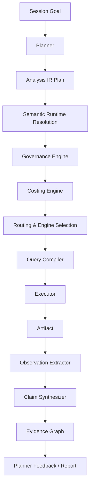
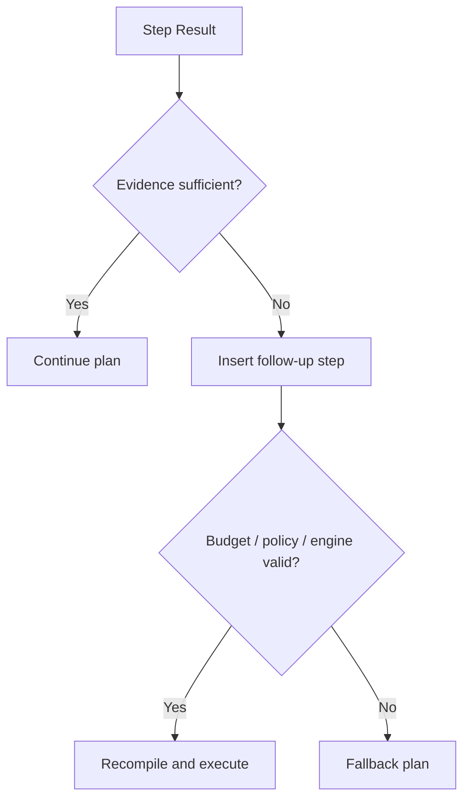

# Factum vNext 架构蓝图

## 1. 文档目的

本文档给出 Factum 下一版本的目标架构蓝图。它不是对当前实现状态的描述，而是对下一阶段核心模块边界、执行链路和演进策略的设计提案。

目标是回答以下问题：

- Factum 的“核心分析内核”应该长什么样
- semantic layer、planning、governance、routing、evidence 之间应该如何衔接
- 多引擎能力应如何纳入统一执行语义
- 如何在不推倒当前 MVP 的前提下完成演进

相关文档：

- `plan/factum-design-doc.md`：英文设计文档（当前实现全量描述）
- `plan/factum-design-doc.zh.md`：中文设计文档（当前实现全量描述）
- `CLAUDE.md`：代码库工程指南（架构、约定、测试方式）

当前实施状态（全部阶段已完成）：

本蓝图所描述的所有核心模块已全部落地实现：

- **Session & Orchestration**：`SessionManager`（`app/session/`）、`PlanningService`（`app/planning.py`）、`ReplanningService`（`app/planner/replanning.py`）
- **Analysis Core**：IR（`app/analysis_core/ir.py`）、compiler/executor、primitives/composites、`StepRunnerRegistry`（`app/analysis_core/`）
- **Semantic Runtime**：`CatalogRuntimeService`、resolution、planner-context、semantic metadata（`app/semantic_runtime/`）
- **Governance Engine**：policy/quality CRUD + 编译时 enforcement、audit hooks（`app/governance_engine/`、`app/governance.py`）
- **Costing Engine**：`app/execution/costing.py`，集成在 plan validate / budget-check 链路
- **Execution Substrate**：routing runtime、capability negotiation、dialect translation、federation（`app/execution/`）
- **Evidence Engine**：extractors（comparison、aggregate）、factories、pipeline、scoring、synthesizers（`app/evidence_engine/`）
- **Catalog Adapters**：Local、Hive、Trino、Unity Catalog、Polaris、AWS Glue、DuckDB（`app/adapters/`）
- **Registry 层**：source/engine/binding registries + factories（`app/registry/`）
- **MCP 层已移除**：MCP server/client 已从代码库完全删除，Factum 目前是纯 HTTP API 服务

本蓝图现在是对当前实现的等价描述，而非未来目标文档。

## 2. 设计目标

vNext 的目标不是简单增加更多 API，而是形成一套稳定的中间层能力，使 HTTP、MCP、UI 和未来的 Agent Controller 都能复用同一执行内核。

具体目标：

- 以 **analysis IR** 为中心建立统一执行链
- 让 semantic layer 成为可执行语义层，而非仅元数据登记层
- 把 governance、costing、routing 变成编译链的一部分
- 让 evidence 成为结构化结果层，而不是后处理补丁
- 为多引擎、重规划、联邦执行保留清晰扩展位

## 3. 核心设计原则

### 3.1 IR-first

所有 planning、validation、routing、governance、execution 都优先围绕同一中间表示工作，而不是围绕 SQL 字符串或 handler 内部状态工作。

### 3.2 Semantic-first

外部请求应尽量基于 semantic object、metric、dimension、policy，而不是直接基于物理表名。

### 3.3 Deterministic evidence

事实结构由代码和规则产生，语言模型最多用于解释与补充叙述。

### 3.4 Honest multi-engine

不隐藏引擎差异，而是显式建模差异，并把它们暴露给 planning 与 routing。

### 3.5 Thin protocol adapters

HTTP、UI 只是协议与交互层，不承载分析领域逻辑。（MCP 层已从代码库移除，Factum 目前是纯 HTTP API 服务。）

## 4. 目标分层

```text
+-----------------------------------------------------------+
| User / Agent / LLM Controller                             |
+-----------------------------------------------------------+
                             |
                             v
+-----------------------------------------------------------+
| Interaction Layer                                         |
| HTTP API / MCP tools / Web UI / future SDK                |
+-----------------------------------------------------------+
                             |
                             v
+-----------------------------------------------------------+
| Session & Orchestration Layer                             |
| session manager / planner / workflow runtime / checkpoint |
+-----------------------------------------------------------+
                             |
                             v
+-----------------------------------------------------------+
| Analysis Core                                             |
| analysis IR / compiler / executor / evidence pipeline     |
+-----------------------------------------------------------+
                             |
                             v
+-----------------------------------------------------------+
| Semantic & Governance Layer                               |
| semantic catalog / policy engine / quality / costing      |
+-----------------------------------------------------------+
                             |
                             v
+-----------------------------------------------------------+
| Execution Substrate                                       |
| engine capability / routing / translation / federation    |
+-----------------------------------------------------------+
                             |
                             v
+-----------------------------------------------------------+
| Data Assets & External Catalogs                           |
| warehouse tables / logs / catalogs / metadata systems     |
+-----------------------------------------------------------+
```

与当前设计相比，vNext 的关键变化是把 “analysis core” 单独提升为独立层，作为语义层与执行层之间的桥梁。

## 5. 核心模块蓝图

### 5.1 Session Manager

职责：

- 管理会话生命周期
- 保存目标、约束、预算、策略、上下文
- 管理 checkpoint 与 artifact 引用
- 维护执行状态与中间结果

不负责：

- SQL 编译
- policy enforcement 细节
- evidence synthesis 细节

### 5.2 Planner

职责：

- 根据目标与 planner context 生成 plan draft
- 维护 plan 的依赖图
- 在执行反馈后触发 re-planning
- 输出的是 analysis IR plan，而不是直接 SQL plan

建议输入：

- session goal
- semantic context
- policy context
- engine capability context
- budget / latency constraints

建议输出：

- ordered analysis steps
- step intent
- expected outputs
- fallback paths

### 5.3 Analysis IR

这是 vNext 的中枢。

建议至少包含以下对象：

#### AnalysisRequest

- goal
- semantic targets
- constraints
- budget
- policy context

#### AnalysisStepIR

- step_kind
- target metrics / entities
- dimensions
- filters
- time windows
- dependencies
- expected artifact type
- evidence extraction strategy

#### ExecutionPlanIR

- target engine
- compilation strategy
- materialization strategy
- estimated cost
- policy transforms

Analysis IR 的作用是把“用户意图”与“SQL/engine 细节”解耦。

### 5.4 Semantic Runtime

当前 semantic layer 更偏 CRUD 与映射。vNext 需要让它成为运行时能力。

建议职责：

- 解析 metric / entity / dimension 的业务语义
- 解析合法 grain
- 解析可用 join path
- 输出 semantic planner context
- 为 compiler 提供 semantic resolution

建议扩展 semantic object 元数据：

- grain
- measure type
- allowed dimensions
- lineage
- default filters
- quality expectations
- policy tags

### 5.5 Governance Engine

建议从“检查器”升级为“治理引擎”。

职责：

- policy resolution
- policy compilation
- result shaping constraints
- provenance annotation
- audit event generation

建议输出两类结果：

- **hard constraints**：直接进入 query compile 或 execution limits
- **soft signals**：进入 evidence / report / warnings

### 5.6 Costing Engine

独立存在，不附着在 planning 或 routing 内部。

职责：

- 估算 rows / bytes / remote latency
- 根据 engine capability 推断执行代价
- 在 plan validation 与 re-planning 中提供输入

### 5.7 Query Compiler

compiler 应基于 AnalysisStepIR 和 semantic resolution 工作，生成：

- logical query plan
- engine-specific query plan
- policy-applied query representation

它不应直接暴露给上层用户。

### 5.8 Executor

职责：

- 选择执行策略
- 调用 engine adapter
- 管理 materialization / retries / partial failures
- 返回结构化 artifact，而不是只返回 rows

### 5.9 Evidence Engine

建议拆分为三层：

- artifact normalizer
- observation extractor
- claim synthesizer

并为每层保留扩展点。

### 5.10 Routing & Engine Capability Layer

Routing 不应只看表在哪个引擎，而应综合：

- semantic operation type
- required SQL features
- governance compatibility
- cost / latency
- freshness needs

建议引入 `EngineCapabilityProfile`：

- supports_window_functions
- supports_filter_clause
- supports_materialized_staging
- supports_federation
- latency_class
- cost_class
- policy_support_level

## 6. 关键执行流程

### 6.1 目标到执行的主链



这个主链的关键点在于：

- semantic resolution 在 SQL compile 之前完成
- governance 与 costing 在路由和编译前介入
- evidence 不是末端装饰，而是执行结果的正式输出层

### 6.2 Re-planning 闭环



## 7. vNext 的 step 体系

建议将 step 分为三层：

### 7.1 Primitive Steps

- compare_metric
- aggregate_metric
- segment_metric
- rank_segments
- profile_table
- sample_rows
- validate_quality
- explain_claim

### 7.2 Composite Steps

由多个 primitive 组合而成，例如：

- diagnose_metric_drop
- analyze_funnel
- analyze_contribution_shift
- compare_quality_signals

### 7.3 Domain Workflows

面向具体场景的模板，例如：

- watch_time_drop
- signup_conversion_drop
- ad_monetization_regression

这样做的好处是：

- primitive 稳定
- composite 可复用
- domain workflow 可快速扩展

## 8. Evidence 系统蓝图

### 8.1 数据模型

保留当前五类对象，但增强定义：

- **Artifact**：步骤输出的结构化结果
- **Observation**：从 artifact 中确定性提取出的事实
- **Claim**：由 observation 支持或反驳的结论
- **EvidenceEdge**：对象间关系
- **Recommendation**：在 claim 之上的行动建议

### 8.2 新的扩展点

建议接口：

- `ArtifactSchema`
- `ObservationExtractor`
- `ClaimSynthesizer`
- `ConfidenceScorer`
- `RecommendationPolicy`

### 8.3 Provenance 模型

每条 observation / claim / recommendation 应关联：

- source semantic objects
- engine used
- policy decisions
- quality warnings
- parent step
- generation version

## 9. Governance 蓝图

治理引擎建议覆盖以下阶段：

### 9.1 请求前

- session policy resolution
- user / agent context validation

### 9.2 编译时

- row filter injection
- field mask rewrite
- aggregation enforcement
- result limits

### 9.3 结果时

- warning annotation
- provenance tagging
- approval requirement generation

### 9.4 审计时

- 保存 policy decisions
- 保存 blocked queries / fallback plans
- 保存 approval chain

## 10. 多引擎蓝图

### 10.1 支持模式

建议显式支持三种执行模式：

1. **single-engine**：全部在同一 engine 上执行
2. **staged handoff**：中间结果物化后交给另一 engine
3. **federated merge**：多个 engine 输出后做统一合并

### 10.2 Capability-aware routing

Routing 决策建议综合以下维度：

- required features
- policy requirements
- estimated cost
- freshness guarantees
- locality
- intermediate materialization cost

### 10.3 Translation layer

SQL 方言翻译仍然需要保留，但其定位应下沉到 compiler / execution substrate，而不是由上层 step handler 直接感知。

## 11. 协议与 API 蓝图

### 11.1 外部 API 设计方向

建议逐步把外部 API 从“操作 handler”转向“提交分析意图”：

- create_session
- draft_plan_from_goal
- validate_plan
- execute_plan
- get_evidence
- explain_decision

而不是持续暴露越来越多的场景化 endpoints。

### 11.2 协议扩展方向

当前为纯 HTTP API。如未来需要重新引入 MCP，建议保持 thin proxy 风格，工具分为三类：

- discovery tools
- planning tools
- execution / evidence tools

## 12. 代码模块演进建议

建议从当前结构逐步演进为如下模块边界：

```text
app/
  api/                  # HTTP routers (one module per domain)
  session/              # session manager
  planner/              # planning, validation, replanning
  semantic_runtime/     # semantic runtime and catalog services
  governance_engine/    # policy engine, quality engine, approvals
  analysis_core/        # IR, compiler, executor, primitives, composites, step registry
  evidence_engine/      # extractors, synthesizers, scoring
  execution/            # routing runtime, engine capability, translation, federation
  registry/             # source/engine/binding registries, factories
  storage/              # metadata and analytics backends
  adapters/             # catalog adapters (Local, Hive, Trino, Unity, Polaris, Glue, DuckDB)
  static/               # Web UI files (admin.html, user.html, shared.css, shared.js)
```

**此模块边界已全部实现。**

## 13. 迁移策略

建议采用兼容演进，而非一次性重写。

### 13.1 第一步：引入 IR，不替换旧 handler

现有 `run_step()` 保留，但在内部逐步转向 IR compile。

### 13.2 第二步：用 primitive/composite 重写旧工作流

把 `watch_time_drop` 这类场景模板迁移到原语层之上。

### 13.3 第三步：治理与 routing 迁移到 compiler 前链

把 policy / costing / capability checks 从 service 内部散点逻辑迁移到统一 pipeline。

### 13.4 第四步：收敛 API

当新内核稳定后，再逐步减少场景化 endpoint。

## 14. 非目标

vNext 蓝图不追求：

- 一步到位替换当前所有 service
- 在当前阶段解决完整因果推断
- 在没有稳定 IR 的前提下优先优化 UI 体验
- 为每个新业务场景单独设计新的核心抽象

## 15. 结论

Factum vNext 的关键不是“再加几个服务”，而是建立一个清晰的分析内核，使 semantic、planning、governance、routing、evidence 都能围绕同一个中间表示协作。

一句话概括：

**把 Factum 从“结构良好的 MVP”推进为“以 IR 为中心的 agentic analytics runtime”。**
