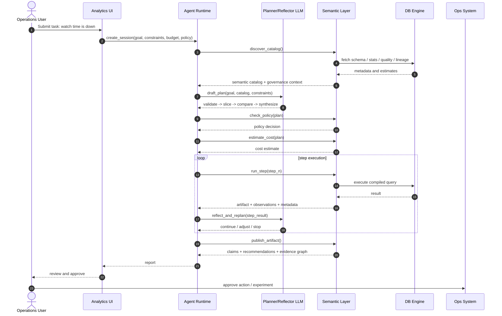

# OmniDB Design Doc

## 1. Executive Summary

OmniDB is an agentic analytics system design, with a DuckDB-based MVP, for moving beyond the traditional `natural language -> SQL -> rows` interaction model.

The core thesis is that current LLM-to-database systems underperform not because models cannot write SQL, but because the surrounding system does not expose enough structure for planning, reflection, tool orchestration, governance, and evidence-based reasoning. In most systems, the model sees only schema fragments, generates SQL, receives raw rows, and then has to infer conclusions without explicit semantics, quality signals, cost context, or traceable evidence.

OmniDB proposes a different interface:

- stateful analysis sessions instead of one-shot queries
- semantic discovery instead of schema guessing
- typed analysis steps instead of arbitrary prompt-to-SQL generation
- deterministic evidence packaging instead of unstructured result interpretation
- a pure HTTP API so agents, UIs, and tooling interact at the right abstraction level

The repository has evolved from an initial DuckDB MVP into a full multi-engine semantic layer and agent runtime platform, realizing all core modules described in the vNext architecture blueprint.

This document describes both:

1. the **target system design** and architectural principles
2. the **current implementation** in this repository

The goal is to give engineers a complete technical reference for understanding and extending OmniDB.

## 2. Problem Statement

### 2.1 The problem with current LLM + database interactions

Most LLM-powered analytics systems still rely on a narrow execution loop:

1. provide schema or table docs
2. ask the model to write SQL
3. execute SQL
4. return rows
5. let the model summarize the result

This approach breaks down for serious data analysis because:

- **business semantics are implicit**: the model must infer which metric definition is correct
- **analysis is not stateful**: intermediate results, assumptions, and plans are not first-class
- **governance is weakly surfaced**: permissions, masking, cost budgets, and policy boundaries are usually outside the model-visible interface
- **quality signals are missing**: freshness, anomalies, lineage, and upstream changes are invisible or ad hoc
- **reflection is unsupported**: the model has no explicit evidence graph to reason over
- **tool orchestration is crude**: the database is treated as a string-based query tool instead of a typed analytical runtime

### 2.2 Why SQL alone is not enough

SQL is excellent as a declarative query language, but it is not a complete interface for agentic analysis.

It does not naturally model:

- planning and re-planning
- session state and checkpoints
- evidence support vs contradiction
- cost-aware step selection
- policy-aware transformations
- recommendation justification
- reproducibility metadata

A better system should treat the database as an execution substrate, while exposing a richer semantic and orchestration layer above it.

## 3. Vision

OmniDB aims to become a system where an LLM or agent can analyze data using a higher-level contract than raw SQL.

At full maturity, OmniDB should provide:

- a semantic layer exposing entities, metrics, dimensions, and business definitions
- an agent-facing runtime with sessions, plans, steps, checkpoints, and evidence
- deterministic analyzers that transform data outputs into machine-usable observations
- governance-aware interfaces for policy, cost, lineage, and quality
- a standard HTTP API for agent, UI, and tool integration
- portability across engines such as DuckDB, PostgreSQL, Spark, and Snowflake

In short, OmniDB is intended to be an **analysis operating layer** between LLM agents and data engines.

## 4. Goals and Non-Goals

### 4.1 Goals

- Validate a richer interaction model than text-to-SQL.
- Make semantic objects, analysis steps, and evidence first-class.
- Demonstrate deterministic evidence packaging in a working MVP.
- Keep the service stateful and tool-friendly.
- Provide a clean HTTP API for agent tooling, UIs, and external integrations.
- Establish a path toward a future multi-engine system.

### 4.2 Non-Goals

- Build a production-ready metadata platform in the MVP.
- Implement full autonomous planning with a real LLM controller.
- Support arbitrary user-written SQL as the primary interface.
- Solve full causal inference.
- Replace enterprise governance or BI platforms outright.

## 5. Audience

This document is written for engineers extending OmniDB.

A reader should be able to:

- understand the architectural motivation
- understand the current DuckDB MVP
- understand the target semantic-layer and API direction
- understand how evidence packaging works
- understand how the HTTP API layer is structured and how to extend it
- identify the next implementation steps

## 6. Glossary

- **Session**: the top-level unit of analysis; stores goal, policy, constraints, and outputs.
- **Semantic object**: a higher-level business object such as an entity, metric, dimension, or asset.
- **Asset**: a physical data source, such as a table.
- **Step**: a typed analysis operation, such as `compare_metric`, `profile_table`, `aggregate_query`.
- **Artifact**: a persisted step result payload.
- **Observation**: a typed factual finding extracted from a step result.
- **Claim**: a synthesized conclusion supported or contradicted by observations.
- **Evidence edge**: a relationship such as `supports`, `contradicts`, or `justifies`.
- **Recommendation**: an action proposal derived from supported claims.
- **Semantic Layer (SL)**: the layer that exposes business semantics, governance, execution planning, and evidence-oriented interfaces above the physical database.

## 7. Architectural Principles

### 7.1 Sessions over one-shot queries

Analysis should be stateful. Every investigation belongs to a session that owns:

- goal
- constraints
- budget
- policy
- step outputs
- evidence graph
- recommendations

### 7.2 Semantics over schema

Agents should operate on metrics, entities, dimensions, and policies rather than table names and column guessing.

### 7.3 Typed steps over SQL strings

The external contract should be step-oriented and task-oriented, not string-oriented. SQL remains an internal compilation target, not the primary interface.

### 7.4 Deterministic fact extraction

Evidence should be extracted by deterministic logic wherever possible. LLMs may help with synthesis and explanation, but they should not be the sole source of factual structure.

### 7.5 Thin protocol adapters

The HTTP layer should expose the service cleanly without embedding domain logic. (The MCP layer was removed from the codebase; OmniDB is now a pure HTTP API service.)

### 7.6 Engine abstraction with implementation honesty

The long-term design should abstract across engines, but each engine's characteristics still matter. PostgreSQL, Spark, Snowflake, and DuckDB are not interchangeable, and the system should surface those differences through cost, capability, and execution metadata.

## 8. Target System Architecture

The full intended OmniDB architecture has six logical layers.

```text
+----------------------------------------------------------+
| User / Agent / LLM Client                                |
+-----------------------------+----------------------------+
                              |
                              v
+----------------------------------------------------------+
| Interaction Layer                                         |
| UI, HTTP API                                              |
+-----------------------------+----------------------------+
                              |
                              v
+----------------------------------------------------------+
| Agent Runtime / Session Layer                             |
| sessions, plans, checkpoints, step orchestration          |
+-----------------------------+----------------------------+
                              |
                              v
+----------------------------------------------------------+
| Semantic Layer                                            |
| catalog, metric definitions, policy, quality, lineage,    |
| stats, plan validation, compilation, evidence packaging   |
+-----------------------------+----------------------------+
                              |
                              v
+----------------------------------------------------------+
| Execution Layer                                           |
| DuckDB / PostgreSQL / Spark / Snowflake adapters          |
+-----------------------------+----------------------------+
                              |
                              v
+----------------------------------------------------------+
| Data Assets                                                |
| warehouse tables, event logs, metadata, quality rules     |
+----------------------------------------------------------+
```

### 8.1 Major runtime roles

- **User**: defines the business goal and approves actions.
- **Agent runtime**: manages session state, steps, and artifacts.
- **LLM**: drafts plans, reflects on evidence, and generates human-readable conclusions.
- **Semantic layer**: provides business semantics, governance context, and step compilation.
- **Database/engine**: executes analytical computation.
- **Ops systems**: consume recommendations and run experiments or operational actions.

## 9. End-to-End Example Workflow

The canonical example is:

> A video platform has seen a recent drop in watch time. Operations wants to identify likely causes and define actions to recover engagement.

### 9.1 Conceptual sequence



### 9.2 What the system should expose in that flow

To support this flow, OmniDB must expose more than rows:

- semantic metrics such as watch time and retention
- governed access boundaries
- lineage and quality state
- current-vs-baseline comparisons
- evidence objects with support and contradiction
- reproducibility and cost context
- recommendations tied back to evidence

## 10. Semantic Layer Design

The Semantic Layer is the core conceptual component in OmniDB.

It should not be treated as a BI-only metrics registry. Instead, it is an **LLM/agent-facing facade** over semantics, governance, statistics, and execution.

### 10.1 Responsibilities

The semantic layer should own six major responsibilities:

1. **Semantic mapping**
   - map business language to entities, metrics, dimensions, and segments
2. **Context supply**
   - provide schema, definitions, joins, quality, freshness, lineage, and change information
3. **Governance control**
   - enforce or surface permissions, masking, policy boundaries, and budget limits
4. **Execution compilation**
   - compile typed analysis steps into physical execution plans
5. **Evidence packaging**
   - transform execution outputs into observations, claims, edges, and recommendations
6. **Reflection support**
   - expose enough structure for a planner or LLM to reflect and re-plan

### 10.2 Core semantic object types

A future full implementation should support at least:

- **entities**: user, session, video, device
- **metrics**: watch_time, retention_30s, first_frame_time_p95, preroll_timeout_rate, recommendation_ctr
- **dimensions**: platform, app_version, country, network_type, content_type
- **segments**: derived audience slices
- **assets**: physical tables or views
- **policies**: masking, aggregation, access constraints
- **quality rules**: freshness, null-rate, anomaly checks
- **lineage links**: upstream and downstream dependencies

## 11. Target API Design

The broader discussion proposed moving from `text_to_sql(query) -> rows` to a stateful analysis runtime.

### 11.1 High-level runtime APIs

The intended top-level API shape is:

- `create_session(goal, constraints, budget, policy)`
- `discover_catalog()`
- `draft_plan()`
- `approve_or_patch_plan()`
- `run_step()`
- `checkpoint()`
- `reflect_and_replan()`
- `publish_artifact()`

### 11.2 Capability-oriented APIs

The system should eventually expose typed capability groups.

#### Read capabilities

- `scan`
- `sample`
- `profile`
- `query`
- `explain`
- `get_stats`

#### Write / transform capabilities

- `transform`
- `materialize`
- `merge`
- `upsert`

#### Governance capabilities

- `check_policy`
- `check_quality`
- `get_lineage`
- `get_provenance`
- `request_approval`

#### Orchestration capabilities

- `spawn_tool`
- `wait_job`
- `cancel_job`
- `retry_from_checkpoint`

#### Memory / context capabilities

- `store_fact`
- `store_artifact`
- `load_context`

### 11.3 Unified response envelope

The broader discussion suggested a normalized response structure:

```json
{
  "result": {},
  "evidence": [],
  "assumptions": [],
  "uncertainty": {},
  "cost": {},
  "latency": {},
  "affected_assets": [],
  "reproducibility_token": ""
}
```

This is important because it makes every operation more usable for planning and reflection than plain rows.

### 11.4 Session and step lifecycle

The long-term runtime should make lifecycle state explicit.

#### Session states

- `open`: session created and ready for planning or execution
- `running`: one or more steps are in progress
- `waiting_approval`: blocked on policy or user approval
- `completed`: analysis flow finished successfully
- `failed`: a terminal error occurred
- `cancelled`: session was intentionally stopped

#### Step states

- `pending`
- `validated`
- `running`
- `succeeded`
- `failed`
- `skipped`
- `cancelled`

#### Expected lifecycle rules

- every step belongs to exactly one session
- each step should be idempotent when rerun from the same checkpoint or input snapshot
- failures should be recorded as step-level artifacts, not only as transport errors
- retries should preserve prior failure metadata for auditability
- checkpoints should reference semantic version, data snapshot, policy version, and plan hash

## 12. Target Semantic Layer API Surface

The discussion proposed a semantic-layer API organized into domains.

### 12.1 Catalog / discovery

- `discover_catalog`
- `search_semantics`
- `get_semantic_object`

Purpose:

- discover available semantic objects
- inspect metric and entity definitions
- support semantic search rather than schema guessing

### 12.2 Profiling / statistics

- `get_profile`
- `sample_rows`
- `get_change_log`

Purpose:

- expose row counts, distributions, quantiles, top values, and recent metadata changes

### 12.3 Governance / policy

- `check_policy`
- `estimate_cost`
- `get_quality_status`
- `get_lineage`

Purpose:

- make execution safe, auditable, and budget-aware

### 12.4 Planning / compilation

- `validate_step`
- `compile_step`
- `explain_step`

Purpose:

- treat analysis as typed steps rather than raw SQL text

### 12.5 Execution / job

- `run_step`
- `get_job`
- `cancel_job`
- `retry_job`
- `resume_from_checkpoint`

Purpose:

- support async, stateful, and resumable execution

### 12.6 Reflection / recommendation

- `suggest_next_steps`
- `evaluate_evidence`

Purpose:

- support reasoning over partial progress and evidence strength

## 13. Evidence Packaging Design

Evidence packaging is the most important design concept in OmniDB.

### 13.1 Why it exists

Rows are not a good interface for higher-level reasoning because they do not explicitly encode:

- what matters
- which findings support a conclusion
- which findings contradict a conclusion
- whether data quality is good enough
- how confident the system should be

Evidence packaging turns step outputs into a structured evidence graph.

### 13.2 Evidence object model

OmniDB uses five conceptual output types.

#### Raw artifact

Examples:

- ranked slice comparison
- aggregated result table
- chart payload
- temp table reference

#### Observation

A typed factual finding extracted from an artifact.

Examples:

- watch time down 14.2% for Android 8.3.1 / 4g / short-video traffic
- first-frame time up 18% for the same slice
- preroll timeout rate increased
- recommendation CTR did not collapse

#### Claim

A synthesized conclusion supported or contradicted by observations.

Examples:

- watch-time decline is concentrated in Android 8.3.1 weak-network short-video traffic
- playback experience degradation is a stronger explanation than recommendation failure

#### Evidence edge

A typed relationship:

- `supports`
- `contradicts`
- `justifies`
- future: `derived_from`, `related_to`, `caused_by_candidate`

#### Recommendation

An action proposal backed by claims.

Examples:

- prioritize Android playback fix
- reduce preroll burden for weak-network users
- run a recovery experiment for the affected cohort

### 13.2.1 Canonical evidence object examples

#### Observation example

```json
{
  "observation_id": "obs_123",
  "type": "metric_change",
  "subject": {
    "metric": "watch_time",
    "slice": {
      "platform": "android",
      "app_version": "8.3.1",
      "network_type": "4g",
      "content_type": "short"
    }
  },
  "payload": {
    "current_value": 82.4,
    "baseline_value": 96.1,
    "delta_pct": -14.2,
    "current_sessions": 280,
    "baseline_sessions": 285
  },
  "significance": {
    "sample_size": 280,
    "practical_significance": true
  },
  "quality": {
    "freshness_ok": true,
    "sample_size_ok": true
  }
}
```

#### Claim example

```json
{
  "claim_id": "claim_456",
  "type": "root_cause_candidate",
  "text": "Watch-time decline is concentrated in Android 8.3.1 weak-network short-video traffic, with playback degradation as the leading driver.",
  "scope": {
    "platform": "android",
    "app_version": "8.3.1",
    "network_type": "4g",
    "content_type": "short"
  },
  "confidence": 0.91,
  "supporting_observations": ["obs_123", "obs_789"],
  "contradicting_observations": [],
  "status": "supported"
}
```

#### Recommendation example

```json
{
  "rec_id": "rec_789",
  "claim_id": "claim_456",
  "priority": "P0",
  "action_text": "Prioritize an Android 8.3.1 playback hotfix focused on reducing first-frame latency for weak-network sessions.",
  "expected_impact": "Recover 30-second retention and watch time in the impacted cohort.",
  "risk": "Requires staged rollout and monitoring.",
  "validation_metric": {
    "primary_metric": "watch_time",
    "secondary_metric": "retention_30s"
  }
}
```

### 13.3 Core principle: facts by code, language by model

The intended long-term rule is:

- **facts should be extracted deterministically**
- **language can be improved by an LLM**

The system should avoid making the LLM the only source of evidence extraction.

### 13.4 Example extraction pipeline

A step execution should follow this pattern:

1. run query or step
2. store artifact
3. extract observations from artifact
4. compute significance and quality metadata
5. synthesize or update claims
6. connect evidence edges
7. emit recommendations if supported

### 13.5 Confidence scoring

The current MVP uses a deterministic score built from:

- effect strength
- consistency across signals
- sample size proxy
- quality proxy
- contradiction penalty

The current formula is:

```text
confidence =
  0.30 * effect_strength
  + 0.25 * consistency
  + 0.20 * sample_score
  + 0.25 * data_quality_score
  - contradiction_penalty
```

This is intentionally simple, but the structure matters because confidence is persisted and inspectable.

### 13.6 Support and contradiction

A future robust implementation should always model both:

- evidence that strengthens a claim
- evidence that weakens or rejects it

This prevents the system from producing overly confident summaries based only on supportive signals.

### 13.7 Recommendation generation thresholds

The current MVP uses hand-authored recommendation logic, but the future system should make recommendation gating explicit.

Suggested minimum conditions:

- at least one supported root-cause claim above a configurable confidence threshold
- no unresolved contradiction above a configurable severity threshold
- evidence linked to a bounded scope, not only a global narrative
- a validation metric for every recommendation
- a risk statement for every recommendation

In future versions, recommendations that change user-facing behavior or spend budget should route through approval hooks.

## 14. Current Architecture in This Repository

The codebase has evolved from an initial DuckDB MVP into a full multi-engine semantic layer and agent runtime platform, realizing all core modules described in the vNext architecture blueprint. The MCP layer was removed; OmniDB is now a pure HTTP API service.

### 14.1 Current runtime layers

```text
Browser / Agent / HTTP Client
  → FastAPI service (app/main.py → app/api/app_factory.py)
  → Web UI:
      Admin UI (app/static/admin.html) — Sources, Engines, Bindings, Semantic, Governance, Observability
      User UI  (app/static/user.html)  — Catalog, Sessions, Plans, Evidence, Jobs
  → API routers (app/api/ — one module per domain):
      sessions, planning, sources, engines, routing, semantic, catalog,
      governance, jobs, approvals, metrics, health
  → Service layer:
      SemanticLayerService, PlanningService, ReplanningService,
      SourceService, EngineService, BindingService, QueryRouter,
      CatalogRuntimeService, GovernanceService, JobService,
      ApprovalService, MetricsCollector
  → Analysis core (app/analysis_core/):
      IR, compiler, executor, primitives/composites, StepRunnerRegistry, step runners
  → Execution layer (app/execution/):
      orchestrator, federation, routing_runtime, costing, capabilities, translation
  → Evidence engine (app/evidence_engine/):
      extractors (comparison, aggregate), factories, pipeline, scoring, synthesizers
  → Storage:
      MetadataStore ABC  → SQLiteMetadataStore, PostgresMetadataStore
      AnalyticsEngine ABC → DuckDBAnalyticsEngine, TrinoAnalyticsEngine,
                           SparkConnectAnalyticsEngine, SparkThriftAnalyticsEngine
  → Catalog adapters:
      CatalogAdapter ABC → LocalCatalogAdapter, HiveMetastoreAdapter,
                          TrinoCatalogAdapter, UnityCatalogAdapter,
                          PolarisAdapter, GlueCatalogAdapter, DuckDBCatalogAdapter
```

**MetadataStore** and **AnalyticsEngine** are pluggable abstract interfaces — business logic never touches engine-specific code directly.

Sources and engines are connected via **source-engine bindings** — a `source_engine_bindings` table that declares which engines can query which sources, with a priority field for preference ordering. The **QueryRouter** resolves table names through `source_objects → source_id → bindings → engine`, picking the highest-priority engine that covers all requested tables.

### 14.2 Why DuckDB and SQLite were chosen

DuckDB remains the analytics engine because it offers:

- fast local analytics
- no external infrastructure requirement
- simple packaging and testing
- SQL expressiveness sufficient for the example workflow

SQLite was chosen for the metadata store because:

- zero-infrastructure local testing
- dialect-neutral DDL portable to MySQL/PostgreSQL
- sufficient for single-process development

### 14.3 Repository implementation mapping

```text
app/
  main.py                    # Thin wrapper: from app.api.app_factory import create_app
  api/
    app_factory.py           # create_app() factory: storage setup, service wiring, routers
    router.py                # 12 API router modules registered
    sessions.py / planning.py / sources.py / engines.py / routing.py
    semantic.py / catalog.py / governance.py / jobs.py / approvals.py
    metrics.py / health.py / deps.py / models.py
  analysis_core/             # IR, compiler, executor, primitives, composites, step registry, step runners
  evidence_engine/           # extractors (comparison, aggregate), factories, pipeline, scoring, synthesizers
  execution/                 # orchestrator, federation, routing_runtime, costing, capabilities, translation
  governance_engine/         # repository, runtime, approvals (modular governance runtime)
  planner/
    replanning.py            # ReplanningService
  registry/                  # source/engine/binding registries + factories + sync_runtime
  semantic_runtime/          # CatalogRuntimeService, resolution, planner_context, repository, semantic_metadata
  session/
    session_manager.py       # SessionManager
  service.py                 # Session/step/evidence orchestration
  planning.py                # Plan CRUD, validation, execution, cost estimation
  evidence.py                # Legacy facade (evidence engine in app/evidence_engine/)
  semantic.py                # Semantic entity/metric/mapping CRUD
  sources.py                 # Source registry + adapter factory
  engines.py                 # Engine registry + analytics engine factory
  bindings.py                # Source-engine binding CRUD
  routing.py                 # QueryRouter: table names → source → binding → engine
  sync.py                    # External catalog sync engine
  governance.py              # GovernanceService: policy/quality CRUD + enforcement
  jobs.py                    # JobService: async job submission + execution
  approvals.py               # ApprovalService: approval request CRUD + auto-flagging
  observability.py           # MetricsCollector, TimingMiddleware, JSONFormatter, setup_logging()
  dialect.py                 # SQL dialect translation: DuckDB → trino/spark
  config.py                  # YAML config loading (sources, engines, bindings, governance, ui)
  storage/
    metadata.py              # MetadataStore ABC
    analytics.py             # AnalyticsEngine ABC
    schema.py                # All DDL (dialect-neutral)
    sqlite_metadata.py       # SQLite implementation
    duckdb_analytics.py      # DuckDB implementation + demo data seeding
    pg_metadata.py           # PostgreSQL implementation
    trino_analytics.py       # Trino analytics engine adapter
    spark_connect_analytics.py  # Spark Connect (gRPC) adapter
    spark_thrift_analytics.py   # Spark Thrift/Kyuubi adapter
    repositories.py          # JobRepository and other storage repositories
  static/
    admin.html               # Admin UI (Sources, Engines, Governance, etc.)
    user.html                # User UI (Sessions, Plans, Evidence, etc.)
    shared.css / shared.js   # Shared design tokens and components
  adapters/
    base.py                  # CatalogAdapter ABC + dataclasses
    local_adapter.py         # Mock/local adapter
    hive_adapter.py          # Hive Metastore adapter
    trino_adapter.py         # Trino catalog adapter
    unity_adapter.py         # Unity Catalog adapter
    polaris_adapter.py       # Polaris Catalog adapter
    glue_adapter.py          # AWS Glue adapter
    duckdb_adapter.py        # DuckDB catalog adapter
tests/                       # ~500 tests across 37 test modules (including Playwright E2E)
```

## 15. Current Data Model

Storage is split across two databases. All DDL is defined in `app/storage/schema.py` using dialect-neutral SQL (TEXT timestamps, no DuckDB-specific types).

### 15.1 Analytical tables (DuckDB)

- `watch_events`
- `player_qoe`
- `ad_events`
- `recommendation_events`

These tables encode the example scenario across:

- period: baseline vs current
- platform: android, ios, web
- app version
- network type: wifi, 4g
- content type: short, long

### 15.2 Control and evidence tables (SQLite metadata store)

- `sessions`
- `steps`
- `artifacts`
- `observations`
- `claims`
- `evidence_edges`
- `recommendations`

### 15.3 Source registry tables (SQLite metadata store)

- `sources` — registered external catalog sources (local, Hive Metastore, etc.)
- `source_objects` — physical catalog objects synced from external sources (schemas, tables, columns)
- `sync_jobs` — sync job tracking (full_sync, incremental_sync)

### 15.4 Semantic layer tables (SQLite metadata store)

- `semantic_entities` — business entities with draft/published lifecycle and revision tracking
- `semantic_metrics` — metric definitions with SQL expressions, dimensions, and lifecycle
- `semantic_mappings` — links between semantic objects and physical source objects

### 15.5 Engine and binding tables (SQLite metadata store)

- `engines` — registered analytics engines (DuckDB, Trino, etc.) with connection config and capabilities
- `source_engine_bindings` — links between sources and engines with priority-based selection and `UNIQUE(source_id, engine_id)` constraint

### 15.6 Relationship model

- one session has many steps
- one step can emit many artifacts
- one step can emit many observations
- one session has many claims
- one session has many recommendations
- edges connect observations to claims and claims to recommendations
- one source has many source_objects (with parent-child hierarchy)
- one source has many sync_jobs
- one source can bind to many engines (via source_engine_bindings, with priority ordering)
- one engine can bind to many sources
- semantic entities/metrics link to source_objects via semantic_mappings

Foreign-key constraints are enforced in SQLite via `PRAGMA foreign_keys=ON`. The source_objects, semantic_mappings, and source_engine_bindings tables use explicit `REFERENCES` clauses.

## 16. Current Service Contract

### 16.1 FastAPI endpoints

#### Admin UI (config-gated)

- `GET /ui` — serves the admin web interface (only when `ui.enabled: true` in config)
- `/static/` — static asset mount (same condition)

#### Core session and workflow endpoints

- `GET /health`
- `POST /sessions`
- `GET /catalog`
- `POST /sessions/{session_id}/steps/{step_type}`
- `POST /sessions/{session_id}/workflow/watch-time-drop`
- `GET /sessions/{session_id}/evidence`
- `GET /sessions/{session_id}/planner-context`

#### Source registry endpoints

- `POST /sources` — register a new catalog source
- `GET /sources` — list registered sources
- `GET /sources/{source_id}` — get source details
- `POST /sources/{source_id}/sync` — trigger catalog sync
- `GET /sources/{source_id}/sync/{job_id}` — get sync job status
- `GET /sources/{source_id}/objects` — browse synced objects (filterable by `?type=table&schema=...`)
- `GET /sources/{source_id}/engines` — list engines bound to a source (ordered by priority)

#### Engine registry endpoints

- `POST /engines` — register a new analytics engine
- `GET /engines` — list registered engines
- `GET /engines/{engine_id}` — get engine details

#### Source-engine binding endpoints

- `POST /bindings` — create a source-engine binding
- `GET /bindings` — list bindings (filterable by `?source_id=...&engine_id=...`)
- `GET /bindings/{binding_id}` — get binding details
- `DELETE /bindings/{binding_id}` — delete a binding

#### Query routing endpoints

- `POST /routing/resolve` — resolve table names to the best available engine (body: `{"table_names": [...]}`)

#### Semantic CRUD endpoints

- `POST /semantic/entities` — create entity
- `GET /semantic/entities` — list entities (filterable by `?status=published`)
- `GET /semantic/entities/{id}` — get entity
- `PUT /semantic/entities/{id}` — update entity
- `POST /semantic/entities/{id}/publish` — publish entity (draft -> published, revision++)
- `POST /semantic/metrics` — create metric
- `GET /semantic/metrics` — list metrics
- `GET /semantic/metrics/{id}` — get metric
- `PUT /semantic/metrics/{id}` — update metric
- `POST /semantic/metrics/{id}/publish` — publish metric
- `POST /semantic/mappings` — create mapping (semantic object <-> physical asset)
- `GET /semantic/mappings` — list mappings
- `DELETE /semantic/mappings/{id}` — delete mapping

#### Catalog query endpoints

- `GET /catalog/search?q=...&type=...` — full-text search across entities, metrics, assets
- `GET /semantic/resolve/{name}` — resolve business term to semantic object + physical assets (includes engine info when bindings exist)
- `GET /catalog/graph?root=...&depth=...` — object graph traversal

### 16.2 Current step types

Defined in `app/analysis_core/primitives.py` (`STEP_TAXONOMY`):

- `compare_metric` — compare a published semantic metric between baseline and current windows; supports custom `period_start/period_end`, `filter`, `order` ASC/DESC, default `limit=10`
- `profile_table` — profile table row count and column-level completeness/cardinality signals
- `sample_rows` — return a bounded sample of rows; supports `filter`, `columns`, auto-partition
- `aggregate_query` — ad-hoc GROUP BY + aggregation; generates observations via `AggregateRowExtractor`; opt-out with `extract_observations=false`
- `synthesize_findings` — composite step; turns observations into claims and recommendations

Session constraints are auto-injected as SQL WHERE filters into `compare_metric`, `sample_rows`, and `aggregate_query`. Each step run generates independent step_id/observations (no deletion of prior same-type outputs).

### 16.3 Current semantic catalog

The `GET /catalog` endpoint still returns a hardcoded catalog shape for backward compatibility. However, the system now supports a full metadata-driven semantic layer:

- **Entities** can be created, updated, and published via `POST/PUT /semantic/entities`
- **Metrics** can be created with SQL definitions, dimensions, and entity bindings via `POST/PUT /semantic/metrics`
- **Mappings** link semantic objects to physical source objects synced from external catalogs
- **Search and resolution** allow agents to discover and resolve business terms to their physical sources

The semantic objects follow a **draft/published/deprecated lifecycle** with revision tracking. Publishing increments the revision number.

### 16.4 Current request / response examples

#### Create session request

```json
{
  "goal": "Investigate why watch time dropped recently.",
  "constraints": {},
  "budget": {
    "max_scan_bytes": 500000000000,
    "max_latency_sec": 120
  },
  "policy": {
    "aggregate_only": true,
    "min_group_size": 100
  }
}
```

#### Create session response

```json
{
  "session_id": "sess_abcd1234",
  "goal": "Investigate why watch time dropped recently.",
  "status": "open",
  "constraints": {},
  "budget": {
    "max_scan_bytes": 500000000000,
    "max_latency_sec": 120
  },
  "policy": {
    "aggregate_only": true,
    "min_group_size": 100
  }
}
```

#### Workflow response shape

```json
{
  "session_id": "sess_abcd1234",
  "workflow": "watch_time_drop",
  "steps": [],
  "final_summary": "Watch-time decline is concentrated in Android 8.3.1 weak-network short-video traffic.",
  "claims": [],
  "recommendations": []
}
```

## 17. Current MVP Evidence Packaging Logic

The current MVP implements evidence packaging concretely.

### 17.1 Observation types (7 types)

- `metric_change` — metric change for a slice between baseline and current
- `funnel_drop` — conversion drop at a funnel stage
- `contribution_shift` — dimension contribution shift
- `anomaly_detection` — anomaly signal
- `qoe_regression` — playback experience regression
- `ad_regression` — ad-related metric regression
- `recommendation_signal` — recommendation quality signal

### 17.2 Step-by-step behavior

#### `compare_metric`

- resolves the metric definition from the semantic layer (table, SQL expression, dimensions)
- compares baseline vs current window by slice
- ranks the largest negative movers
- emits `metric_change` observations via `ComparisonRowExtractor`
- supports custom `period_start/period_end`, `filter`, `order`, `limit`

#### `aggregate_query`

- runs an ad-hoc GROUP BY + aggregation
- emits observations via `AggregateRowExtractor` (disable with `extract_observations=false`)

#### `profile_table` / `sample_rows`

- analyzes table structure and data quality signals
- returns row counts, column distributions, cardinality

#### `synthesize_findings`

- aggregates all current session observations
- generates claims with evidence edges (supports / contradicts)
- produces recommendations, auto-flags high-risk items for approval
- persists the complete evidence graph

### 17.3 Evidence Engine architecture

`app/evidence_engine/` is structured in three layers:

- **Extractor layer**: `ComparisonRowExtractor`, `AggregateRowExtractor` — deterministic observation extraction from artifacts
- **Scoring layer**: `app/evidence_engine/scoring.py` — deterministic confidence scoring (effect strength, consistency, sample size, data quality, contradiction penalty)
- **Synthesizer layer**: `app/evidence_engine/synthesizers/` — merges observations into claims and recommendations

## 18. Protocol Layer

### 18.1 Current state: pure HTTP API

The MCP server/client layer was removed from the codebase (commit 3ebf377). OmniDB is now a pure HTTP API service. Agents, UIs, and external tools interact directly through FastAPI endpoints.

API routers are split into domain-specific modules under `app/api/`: sessions, planning, sources, engines, routing, semantic, catalog, governance, jobs, approvals, metrics, health.

### 18.2 Protocol layer design principles (retained)

- Keep the protocol layer thin — no business logic
- Use typed Pydantic models (`app/api/models.py`)
- Provide actionable error messages
- Support JSON responses

### 18.3 Future extension

If MCP needs to be reintroduced, it should remain a thin proxy — all business logic stays in the FastAPI service layer, and MCP tools are grouped by capability type (discovery / planning / execution).

## 19. Testing and Validation

The project has a comprehensive test suite with **~500 tests across 37 test modules**. Key modules:

- `tests/test_mvp.py` (47 tests) — QueryRouter wiring, metric resolution, generic steps, session endpoints
- `tests/test_adapters.py` (45 tests) — all catalog adapters (Local, Hive, Trino, Unity, Polaris, Glue, DuckDB)
- `tests/test_bindings.py` (40 tests) — binding service, query router, API, config
- `tests/test_planning.py` (37 tests) — plan CRUD, validation, execution, cost estimation, API
- `tests/test_sources.py` (31 tests) — source registry, sync mode, selection CRUD
- `tests/test_engines.py` (31 tests) — engine service, API, Trino, SparkConnect, SparkThrift
- `tests/test_evidence.py` (26 tests) — observation factories, claim synthesis, confidence scoring
- `tests/test_governance.py` (16 tests), `tests/test_approvals.py` (16 tests)
- `tests/test_compiler_executor.py` (17 tests) — analysis core compiler + executor
- `tests/test_ui_playwright.py` (20 tests, skipped if browser not installed) — Playwright E2E

Command:

```bash
.venv/bin/python3 -m unittest discover -s tests -v
```

All tests use `SQLiteMetadataStore` for metadata and `DuckDBAnalyticsEngine` for analytics, validating the dual-backend architecture end-to-end.

## 20. Operational Model

### 20.1 Setup and startup

```bash
python3 -m venv .venv && source .venv/bin/activate
pip install -e .                  # core deps (Python >=3.12)
pip install -e ".[hive]"          # optional: Hive Metastore adapter
uvicorn app.main:app --reload     # FastAPI on :8000
```

### 20.2 Important environment variables

- `DUCKDB_MVP_DB` — analytics DB path (default: `data/mvp.duckdb`)
- `OMNIDB_CONFIG` — path to YAML config file (default: `omnidb.yaml` in CWD)

## 21. Security, Governance, and Reliability

### 21.1 Already represented in the design direction

Even though the MVP is small, the broader design discussion explicitly identifies these concerns as first-class:

- permission control
- masking and aggregate-only semantics
- cost and scan-budget awareness
- quality status and freshness
- lineage and provenance
- reproducibility
- support and contradiction tracking

### 21.2 Present in the current MVP

- aggregate-only semantics in catalog notes
- persisted evidence and support/contradiction relationships
- deterministic evidence extraction
- actionable wrapper errors
- session-level persistence

### 21.3 Implemented governance and operational capabilities

- ✅ Policy enforcement: `field_mask`, `row_filter`, `aggregate_only`, `max_rows` (`app/governance.py` + `app/governance_engine/`)
- ✅ Quality rules: freshness, null_rate, row_count_min (`GovernanceService`)
- ✅ Approval workflow: `ApprovalService` + auto-flag (`app/approvals.py`)
- ✅ Cost estimation and budget enforcement: `PlanningService` + `app/execution/costing.py`
- ✅ Async job submission and status tracking: `JobService` (`app/jobs.py`)
- ✅ Observability: structured logging, metrics endpoint, timing middleware (`app/observability.py`)

Still not implemented:

- Real auth and RBAC/ABAC
- Lineage graph (provenance tracking is present)
- Production job queue (currently background threads with sync fallback)
- Multi-user isolation

## 22. Engine Considerations Beyond DuckDB

The broader discussion compared database engines from an agentic-analysis perspective.

### PostgreSQL

Strengths:

- strong transactions
- excellent for low-latency operational and moderate analytical workloads

Challenges for agentic analytics:

- harder to scale to very large scans
- transaction semantics and extensions add complexity
- locks and mutable state are harder for naive agents to reason about

### Spark

Strengths:

- large-scale distributed analytical execution
- suitable for massive event data

Challenges:

- lazy evaluation
- shuffle cost and skew
- async job behavior
- higher latency and execution opacity for iterative agent loops

### Snowflake

Strengths:

- strong cloud warehouse execution
- elastic compute and broad SQL capabilities

Challenges:

- warehouse selection and cost governance
- async execution and queueing considerations
- model-visible cost/context is often poor in naive integrations

### DuckDB

Strengths:

- simple local deployment
- excellent developer ergonomics
- ideal for MVP and prototyping

Challenges:

- not a distributed production engine
- single-node assumptions limit scalability

## 23. Adapter Contracts

OmniDB now has two concrete adapter contracts: one for analytics engines and one for external catalogs.

### 23.1 AnalyticsEngine contract (implemented)

Defined in `app/storage/analytics.py`. Every analytics engine must implement:

- `initialize()` — create tables and seed data
- `query_rows(sql, params)` — execute SQL and return rows as dicts
- `table_exists(table_name)` — check if a table exists
- `table_row_count(table_name)` — return row count

Current implementations: `DuckDBAnalyticsEngine`, `TrinoAnalyticsEngine`, `SparkConnectAnalyticsEngine`, `SparkThriftAnalyticsEngine`.

### 23.2 MetadataStore contract (implemented)

Defined in `app/storage/metadata.py`. Every metadata store must implement:

- `initialize()` — create all DDL tables
- `connect()` — context manager for raw connection access
- `execute(sql, params)` — execute a write statement
- `execute_many(sql, rows)` — batch insert
- `query_rows(sql, params)` — return all matching rows as dicts
- `query_one(sql, params)` — return first matching row or None

Current implementations: `SQLiteMetadataStore`, `PostgresMetadataStore`.

### 23.3 CatalogAdapter contract (implemented)

Defined in `app/adapters/base.py`. Every external catalog adapter must implement:

- `source_type()` — identifier string (e.g., `'local'`, `'hive_metastore'`)
- `capabilities()` — `CatalogCapabilities` dataclass (schemas, partitions, lineage, etc.)
- `test_connection()` — verify connectivity
- `list_schemas(catalog_name)` — return schema-level `PhysicalObject`s
- `list_tables(schema_name)` — return table-level `PhysicalObject`s
- `get_table_detail(schema_name, table_name)` — return detailed table info
- `list_columns(schema_name, table_name)` — return column-level `PhysicalObject`s

Optional methods (default to `NotImplementedError`):

- `get_table_stats(schema_name, table_name)`
- `list_partitions(schema_name, table_name)`

Current implementations: `LocalCatalogAdapter` (mock), `HiveMetastoreAdapter` (requires `hmsclient`), `TrinoCatalogAdapter`, `UnityCatalogAdapter`, `PolarisAdapter`, `GlueCatalogAdapter`, `DuckDBCatalogAdapter`.

### 23.4 Source-engine bindings and query routing (implemented)

The `BindingService` (`app/bindings.py`) manages the `source_engine_bindings` table — a many-to-many relationship between sources and engines with priority-based preference ordering. Key operations:

- `create_binding(source_id, engine_id, priority)` — create a binding with validation
- `ensure_binding(source_id, engine_id, priority)` — idempotent upsert keyed on `(source_id, engine_id)`
- `get_engines_for_source(source_id)` — return engines ordered by priority DESC (JOIN with engine metadata)
- Standard CRUD: `get_binding`, `list_bindings`, `delete_binding`

The `QueryRouter` (`app/routing.py`) resolves table names to analytics engine instances:

1. For each table name, query `source_objects` to find `source_id`
2. For each source, query active bindings to get candidate engine IDs
3. Intersect engine sets across all sources
4. Pick the engine with the highest total priority sum
5. Build the `AnalyticsEngine` instance via `EngineService.build_analytics_engine()`

This design supports the common pattern where multiple engines can query the same source (e.g., Trino for interactive, Spark for batch), with priority determining the default choice. Cross-engine federation (tables on different engines) is future work — the router currently requires all tables to share at least one common engine.

### 23.5 Why these contracts matter

Without stable adapter boundaries, the semantic layer would leak engine-specific and catalog-specific assumptions into planning and evidence packaging. The contracts ensure:

- business logic in `service.py` never touches SQLite or DuckDB directly
- external catalog metadata is normalized into a common `PhysicalObject` model
- new backends can be added without modifying existing code
- query routing is decoupled from step execution — the router resolves engines, step runners consume them

## 24. Current Limitations and Resolved Issues

**Resolved (all phases complete):**

- ~~static semantic catalog~~ — metadata-driven, entity/metric CRUD, draft/published lifecycle
- ~~no metadata ingestion~~ — source registry + sync engine, supports Local, Hive, Trino, Unity, Polaris, Glue, DuckDB
- ~~no multi-engine support~~ — DuckDB, Trino, SparkConnect, SparkThrift all implemented
- ~~no plan or plan IR~~ — `PlanningService` with validation, execution, cost estimation, re-planning
- ~~no governance~~ — `GovernanceService` with policy enforcement, quality rules, approval workflow
- ~~no async execution~~ — `JobService` with background execution and status tracking
- ~~no observability~~ — MetricsCollector, TimingMiddleware, structured logging, `/metrics` endpoint
- ~~no catalog adapters beyond local/Hive~~ — Unity, Polaris, Glue, Trino, DuckDB all implemented
- ~~no visual interface~~ — Admin UI (`/admin`) + User UI (`/ui`), split pages
- ~~step runners use hardcoded engine~~ — QueryRouter wired into step runners
- ~~no cross-engine federation~~ — FederationPlanner + FederationRuntime implemented
- ~~no SQL dialect translation~~ — `app/dialect.py` + `app/execution/translation.py`

**Still not implemented:**

- Real auth and RBAC/ABAC
- LLM-backed reflection/planning loop (planner skeleton is ready)
- Production async job queue (currently background threads with sync fallback)
- Streaming step execution
- Lineage graph

## 25. Roadmap

### Completed (all phases)

- ✅ Storage split: SQLite (metadata) + DuckDB (analytics), pluggable abstract interfaces
- ✅ Source registry with sync + catalog browse
- ✅ Catalog adapters: Local, Hive, Trino, Unity Catalog, Polaris, AWS Glue, DuckDB
- ✅ PostgreSQL metadata store
- ✅ Semantic CRUD: entities, metrics, mappings; draft/published lifecycle, revision tracking
- ✅ Catalog query: full-text search, term resolution, planner-context, graph traversal
- ✅ Engine registry: DuckDB, Trino, SparkConnect, SparkThrift
- ✅ Source-engine bindings + QueryRouter
- ✅ YAML-driven startup auto-registration
- ✅ Typed planning: plan IR, validation, execution, cost estimation, re-planning
- ✅ Evidence engine: multiple observation types, AggregateRowExtractor, provenance, confidence scoring
- ✅ SQL dialect translation: DuckDB → Trino/Spark
- ✅ Cross-engine federation: FederationPlanner + FederationRuntime
- ✅ Governance: policy enforcement, quality rules, approval workflow
- ✅ Async jobs: JobService, background execution, status tracking
- ✅ Observability: MetricsCollector, TimingMiddleware, structured logging
- ✅ Web UI: Admin UI (`/admin`) + User UI (`/ui`), shared assets
- ✅ Analysis core: IR, compiler, executor, primitives, composites, step registry
- ✅ Execution substrate: orchestrator, federation, costing, capabilities

### Remaining / future work

- Auth and RBAC
- LLM-backed planning and reflection loop
- Production async job queue (currently background threads with sync fallback)
- Streaming step execution

## 26. Alternatives Considered

### 25.1 Text-to-SQL only

Rejected as the primary model because it does not adequately support sessions, evidence graphs, contradiction handling, or planning.

### 25.2 MCP-only without HTTP service

Rejected because it would tightly couple business logic to the protocol adapter and make reuse harder. Note: the MCP layer was subsequently also removed from the codebase entirely; OmniDB is now a pure HTTP API service.

### 25.3 Planner-first before deterministic evidence

Rejected for the MVP because it would invest in orchestration before establishing a reliable fact model.

## 27. Open Questions

- ~~How should semantic objects be externalized?~~ **Resolved**: database metadata with CRUD APIs.
- ~~What should the typed step IR look like?~~ **Resolved**: `app/analysis_core/ir.py` (`AnalysisRequest`, `AnalysisStepIR`, etc.).
- ~~How should quality and lineage be surfaced to the planner?~~ **Resolved**: planner-context endpoint + GovernanceService.
- ~~How should cost-aware routing work across engines?~~ **Resolved**: `app/execution/costing.py` + `RoutingRuntime` + `EngineCapabilityProfile`.
- ~~Should workflow steps resolve metrics from `semantic_metrics` at execution time?~~ **Resolved**: `compare_metric` resolves through the semantic layer.
- ~~When should recommendations require approval hooks?~~ **Resolved**: `ApprovalService` auto-flags high-risk recommendations; explicit approval is required for governance/budget plan blocks.
- Which evidence-extraction rules should become model-assisted (currently all deterministic)?
- How should the sync engine handle incremental syncs and drift detection?
- How should the lineage graph be modeled and surfaced to the planner?

## 28. Decision Summary

The core decisions behind OmniDB are:

- use a stateful session model
- expose semantic objects instead of only schema
- represent analysis through typed steps
- package outputs into structured evidence
- keep execution and evidence logic deterministic where possible
- expose the service via pure HTTP API (MCP layer removed)
- **separate metadata storage (SQLite/PostgreSQL) from analytics engines (DuckDB/Trino)**
- **use pluggable adapter contracts for metadata stores, analytics engines, and external catalogs**
- **store semantic objects (entities, metrics, mappings) in the metadata database with draft/published lifecycle**
- **integrate with external catalogs (Hive Metastore first) through a sync-based snapshot model where OmniDB stores synced copies but external catalogs remain the authority**
- **expose semantic search, resolution, and graph traversal for agent consumption**
- **bind sources to engines explicitly** — source-engine bindings with priority-based selection determine which engine queries which source's tables
- **route queries through bindings** — a QueryRouter resolves table names to the appropriate engine by tracing source_objects → source → bindings → engine, requiring a common engine across all tables in a query
- **declarative YAML configuration** — sources, engines, and bindings are auto-registered from `omnidb.yaml` at startup

## 29. Appendix: Reader Takeaway

If a reader remembers only one thing, it should be this:

> OmniDB is not trying to build a better SQL prompt. It is trying to build a better contract between agents and data systems.

The DuckDB MVP proves that even a narrow local system can benefit from sessions, semantics, typed steps, and evidence packaging. The next stages are about generalizing those ideas without losing determinism, auditability, or usability.
