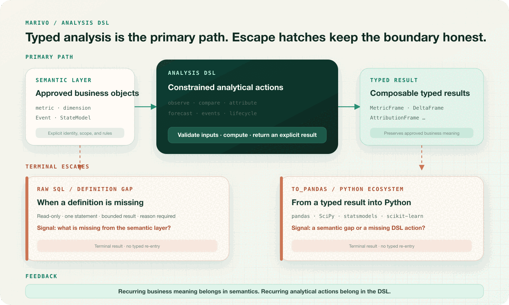

A semantic layer gives an agent dependable objects for revenue, customers, regions, and business time. It does not, by itself, answer a more practical question: when the analysis begins, how do we know the agent actually computed with those definitions instead of reading them and then writing its own approximation?

That distinction matters. If semantic definitions appear only as context, they remain reference material. An agent may explain the approved meaning of revenue perfectly, then execute a query against a different amount column, omit one status, or follow an undeclared join. The query can succeed. The answer can look sensible. Yet the semantic contract never governed the computation.

Marivo places an Analysis DSL above the semantic layer to move business meaning from “something the agent has seen” to an actual input of every inspectable analytical action. The DSL governs whether an action is valid, how it runs, and what it may return. It does not decide why a comparison matters, which dimension to investigate next, when the evidence is sufficient, or how the result should be interpreted. Those decisions remain with the agent.

## The semantic layer still needs an execution boundary

Consider a common failure mode. The semantic layer says that `sales.revenue` is net revenue from completed orders, recognized on completion time and available by sales region. The agent reads this description, selects an amount column from the orders table, adds a status filter, and aggregates by region.

Its query may match the definition exactly. It may also be only ninety percent right. The final table cannot prove that the calculation used the current definition of `sales.revenue`, including its default timeline, exclusions, unit, additivity, and allowed relationships. The semantic layer was consulted, but it was not a precondition of execution.

Marivo therefore separates two very different patterns:

- **Using a semantic definition as reference material.** The agent reads prose, then translates it into a lower-level computation of its own.
- **Using a semantic object as an input.** The agent passes a typed object from the current catalog to the Analysis DSL, and the runtime resolves and executes the definition.

In the second pattern, a plausible name is not enough. `observe` accepts a metric entry or stable ref from the current semantic catalog; dimensions come from their corresponding catalog as well. Stale objects, entries from another catalog, objects of the wrong kind, and bare strings are rejected before execution. The runtime resolves the calculation, timeline, entity, and relationships from the semantic definition rather than asking the agent to implement them again.

```python
import marivo.analysis as mv

session = mv.session.get_or_create(
    name="revenue-investigation",
    question="Why was third-quarter revenue lower than a year ago?",
)

revenue = session.catalog.metrics.get("sales.revenue")
region = session.catalog.dimensions.get("sales.orders.region")

current = session.observe(
    revenue,
    time_scope=mv.time_scope(start="2026-07-01", end="2026-10-01"),
    grain=mv.grain("month"),
    dimensions=[region],
    analysis_purpose="Measure third-quarter revenue by region",
)
```

This does not mean Marivo can prevent an agent from running arbitrary code elsewhere. The guarantee is narrower and more useful: **only results produced from semantic objects through Marivo's checked execution path remain part of the same traceable analysis.** If an agent exports data for a custom calculation, it has explicitly left that path. The custom output cannot be inserted back as a Marivo frame or presented as a fact produced under the same business definitions.

The point is not to seal every possible exit. It is to make the boundary visible: either the analysis still uses an approved business definition, or it has moved outside the governed path. When an organization relies on agent analysis for operations, governance, or decisions, that boundary is more dependable than a prompt telling the agent to follow the rules.

## Why an Analysis DSL reduces cognitive load

Asking an agent to write a low-level query may appear simpler because there is one less interface to learn. In practice, it combines several responsibilities in every generation:

- find the correct metric for the business question;
- expand it into fields, filters, and aggregation;
- select the right timeline and handle the edges of the requested period;
- determine whether the metric may be broken down by a dimension without multiplying values through a join;
- decide whether two results use compatible definitions and time grains;
- recover the meaning, scope, and origin of the output before taking the next step.

Only part of that work is analytical reasoning. Much of it is already stated in the semantic layer or can be checked directly by the runtime. If every step requires the agent to translate those rules back into a low-level implementation, the semantic layer helps generate queries but does not truly reduce the difficulty of analysis.

Marivo's Analysis DSL stays at the same level of abstraction as the semantic layer. The semantic layer supplies stable business nouns; the DSL supplies verbs that act on those nouns and on prior results.

```text
Semantic objects: revenue · region · completed_at
Analytical actions: observe · compare · attribute · forecast
Results: MetricFrame · DeltaFrame · AttributionFrame · ForecastFrame
```

To observe revenue, the agent passes `revenue` to `observe`. To quantify the change between two periods, it compares two `MetricFrame` results. To examine how regions contribute to that change, it passes the resulting `DeltaFrame` and `region` to `attribute`. The agent does not repeatedly drop down to tables, columns, and joins, then reconstruct a business concept such as “revenue change” from the output.

This removes three recurring burdens.

The first is **translation**. The agent says what to observe, over which period, at what grain, and by which dimensions; it does not rewrite the metric. The second is **memory**. Each action returns a result with a clear meaning that is not rewritten after creation. A later step can inspect its scope, structure, inputs, action, and quality information without reverse-engineering free-form code. The third is **repair**. When an input kind, result shape, or required condition is wrong, Marivo can explain the local problem and the available correction. The agent is no longer left to infer which layer of meaning caused a database error.

Reducing that burden must not turn analysis into a fixed workflow. After `compare`, the agent may attribute the change, search for candidates, check quality, or stop. A result can describe which actions accept it; only the agent can decide which action is relevant to the question. **An action being available does not make it useful, and a candidate is not a conclusion.**


## What the Analysis DSL actually constrains

A DSL adds little value if it merely gives shorter names to familiar database operations. It needs to make the parts that can change business meaning both explicit and machine-checkable.

In Marivo, an analytical action is constrained along at least five practical dimensions:

1. **Which business object is being used.** A metric, dimension, Event, or StateModel must be an object of the right kind in the current catalog. A prior result must belong to the current session. Similar names and frames from another investigation cannot be substituted silently.
2. **What the action covers and what kind of data it returns.** Time scope, grain, dimensions, and filters determine whether the result is a single value, a time series, grouped data, or a combination of time and groups. A later action can accept only the forms it explicitly supports.
3. **Whether two inputs mean compatible things.** Timelines, units, calculations, included populations, and semantic definitions must satisfy the needs of the action. Two numeric results are not necessarily comparable. A region column does not automatically make a change safe to attribute by region.
4. **Which important choices must be stated.** Window alignment, attribution axes, sampling, and forecast horizon use explicit options. These choices remain visible in the call instead of being guessed by the runtime.
5. **What a successful result is allowed to promise.** Each core action produces a result with one clear meaning. If the requirements are not met, the action fails explicitly instead of returning something that merely resembles the expected output.

These constraints apply to executable actions, not to the agent's thought process. Marivo does not insist that a question begin with a year-over-year comparison, choose the most important region on the agent's behalf, turn association into causation, or write the business conclusion. It makes sure the same inputs are computed under the same rules and protects the boundary of each operation. The agent forms hypotheses, chooses the next step, combines results, and takes responsibility for the interpretation.

## What the Analysis DSL can do

Marivo organizes the DSL around analytical questions and distinct result types, not around database operations.

### Begin by observing a metric

`session.observe(...)` computes a metric over an explicit scope, grain, and set of dimensions, then saves the result as a `MetricFrame`. Event paths begin with `session.events.match(...)`; lifecycle questions begin with `session.lifecycle.replay(...)`. All three start from typed semantic objects rather than inferring a business process from field names.

A typical metric investigation begins by observing change over time:

```python
revenue_by_region = session.observe(
    revenue,
    time_scope=mv.time_scope(start="2026-07-01", end="2026-10-01"),
    grain=mv.grain("month"),
    dimensions=[region],
    analysis_purpose="Review third-quarter revenue by region",
)
revenue_by_region.show()
```

Both `revenue` and `region` come from the semantic layer. The agent specifies the scope and breakdown for this investigation without reimplementing how revenue is calculated.

### Measure a change, then examine its composition

`session.compare(...)` accepts two compatible `MetricFrame` results and produces a `DeltaFrame`. It makes the correspondence between periods explicit and checks whether the inputs can be compared fairly before subtracting values. `session.attribute(...)` then calculates contributions along declared business dimensions and requires those contributions to reconcile with the total change. Attribution describes numerical contribution, not causation; interpretation remains the agent's responsibility.

```python
baseline = session.observe(
    revenue,
    time_scope=mv.time_scope(start="2025-07-01", end="2025-10-01"),
    grain=mv.grain("month"),
    dimensions=[region],
    analysis_purpose="Establish the year-ago baseline",
)

delta = session.compare(
    current,
    baseline,
    alignment=mv.window_bucket(),
    analysis_purpose="Measure the year-over-year change in Q3 revenue",
)
attribution = session.attribute(
    delta,
    axes=[region],
    analysis_purpose="Measure each region's contribution to the revenue change",
)
delta.show()
attribution.show()
```

`compare` answers “how much did it change?” and `attribute` answers “how much of that change is associated with each region?” The second answer still does not justify the claim that a region caused the decline.

### Find candidates worth investigating

`session.discover.*` is not a vague “automatic insight” interface. It is a set of focused discovery actions for unusual points in a time series, interval changes, possible driver dimensions, notable slices or windows, and results that diverge sharply from their peers at the same time. They return a `CandidateSet`, whose scores rank items only within that set. A candidate is a lead, not a confirmed anomaly and certainly not a business cause.

For example, the agent can narrow a region-level result to the slices most worth examining:

```python
candidates = session.discover.interesting_slices(
    current,
    search_space=[region],
    limit=5,
    analysis_purpose="Find regions worth investigating further",
)
candidates.show()
```

This reduces the search space. The agent still decides which candidate to pursue and whether it matters to the business question.

### Run statistical checks, forecasts, and quality checks

`correlate` measures the statistical association between two `MetricFrame` results. `hypothesis_test` runs a declared statistical test. `forecast` projects a historical frame into future intervals. `assess_quality` applies fixed quality checks to supported results. They return `AssociationResult`, `HypothesisTestResult`, `ForecastFrame`, and `QualityReport` rather than collapsing everything into a generic analysis response.

The distinctions are deliberate: association is not causation, a forecast is not an observation, and statistical significance is not the same as business importance. Keeping the result types separate makes it harder for an agent to claim more than an operation established.

The following example places the four actions side by side. `order_count_frame` uses the same period, grain, and region dimension as `current`:

```python
order_count = session.catalog.metrics.get("sales.order_count")
order_count_frame = session.observe(
    order_count,
    time_scope=mv.time_scope(start="2026-07-01", end="2026-10-01"),
    grain=mv.grain("month"),
    dimensions=[region],
)

association = session.correlate(current, order_count_frame)
test = session.hypothesis_test(current, baseline)
projection = session.forecast(current, horizon=3, model="drift")
quality = session.assess_quality(current)

association.show()
test.show()
projection.show()
quality.show()
```

These results answer different questions: whether revenue and order count move together, whether the current and baseline difference passes a statistical test, how the next three periods might develop, and whether the current data has known quality concerns. None is a substitute for another.

### Preserve event paths and lifecycle state

Funnels, time to reach a step, state distribution, state transitions, duration, and forbidden transitions use the dedicated `events.*` and `lifecycle.*` actions. These operations accept Events, patterns, and StateModels from the semantic layer and produce `EventFrame` or `LifecycleFrame` results with explicit meanings. A business process does not need to be flattened into temporary metrics that lose sequence and state.

Suppose `checkout_pattern` has already been composed from “cart created” and “payment completed” Events in the semantic layer. A funnel investigation can begin like this:

```python
journeys = session.events.match(
    pattern=checkout_pattern,
    cohort_window=mv.time_scope(
        start="2026-07-01T00:00:00Z",
        end="2026-07-08T00:00:00Z",
    ),
    completion_through="2026-07-15T00:00:00Z",
    matching=mv.first_per_subject(),
)
funnel = session.events.funnel(journeys)
funnel.show()
```

Lifecycle analysis follows the same pattern, with a defined StateModel as its input:

```python
order_lifecycle = session.catalog.state_models.get(
    "commerce.order_lifecycle"
)
history = session.lifecycle.replay(
    order_lifecycle,
    window=mv.time_scope(
        start="2026-07-01T00:00:00Z",
        end="2026-08-01T00:00:00Z",
    ),
    seed=mv.from_inception(),
)
state_counts = session.lifecycle.distribution(
    history,
    at=("2026-07-31T00:00:00Z",),
)
state_counts.show()
```

The first result preserves the order in which subjects move through the checkout steps; the second preserves orders moving between lifecycle states. The agent does not have to compress the process into a few temporary numbers and later guess what those numbers represented.

More operations are not automatically better. An operation belongs in the core DSL only when its inputs, output, failure behavior, and evidence can all be stated clearly. Saving a few lines of code or hiding a familiar sequence inside one large function is not enough to create a dependable analytical action.

## Constraints need boundaries—and escape hatches

No Analysis DSL can anticipate every method an investigation may require, nor should it trap an agent inside a closed system. Real work encounters business objects that have not been defined, specialized statistical methods, and calculations used only in a particular industry. Prohibiting all of them would simply push the agent around the system. A more honest design keeps the escape hatches explicit and makes the moment typed analysis ends impossible to miss.

Marivo provides two terminal paths in different directions. `md.raw_sql(...)` handles a temporary datasource-side diagnostic when the semantic layer does not yet cover the question. `frame.to_pandas()` begins with an established typed result and opens the broader Python ecosystem. Both provide necessary freedom; neither result can be passed back into the Analysis DSL and presented as a frame produced under the same constraints.

### raw_sql: a bounded diagnostic for a missing definition

If an agent cannot find the metric, dimension, relationship, Event, or StateModel required by a question, typed analysis should stop at that gap rather than quietly substitute a convenient column. Where project policy permits a temporary diagnostic, `md.raw_sql(...)` can run one read-only statement. Its `reason` must state what is missing, why the query is needed, and which provisional assumptions it makes.

```python
import marivo.datasource as md
import marivo.semantic as ms

diagnostic = md.raw_sql(
    ms.ref.datasource("warehouse"),
    """
    SELECT sales_region, SUM(net_amount) AS provisional_revenue
    FROM orders
    WHERE completed_at >= DATE '2026-07-01'
      AND completed_at < DATE '2026-10-01'
      AND status = 'completed'
    GROUP BY sales_region
    """,
    reason=(
        "sales.revenue and sales.orders.region are not defined; "
        "estimate the Q3 regional pattern while assuming net_amount is net revenue"
    ),
    limit=100,
)
diagnostic.show()
```

`raw_sql` rejects an empty `reason`, multiple statements, and writes, while bounding returned rows and execution time. The `limit` bounds the result, not necessarily the work performed by the database, so the statement itself must still be narrow. Its terminal `RawSqlResult` has no metric identity, typed next actions, or route back into the Analysis DSL. A result based on provisional assumptions must remain explicitly provisional; a successful query does not turn those assumptions into an approved business definition.

More importantly, an agent's use of `raw_sql` is not merely an implementation detail. It is a product signal: **the semantic layer cannot yet answer this question.** If the same gap recurs, the right response is not to preserve the SQL as a convenient template. It is to define the missing business object, relationship, or timeline so that the next investigation can return to the typed path.

### to_pandas: from dependable inputs into the Python ecosystem

`frame.to_pandas()` sits at the other end of the process. The agent first obtains a frame through `observe`, `compare`, or another typed action, so the metric, scope, grain, and dimensions are already explicit. It then receives an isolated pandas `DataFrame` and can use pandas, SciPy, statsmodels, scikit-learn, or a domain library available in the project environment for statistics, modeling, and visualization that the Analysis DSL does not provide.

```python
from scipy.stats import median_abs_deviation

rows = current.to_pandas()

# The metric, period, and region are already fixed by current.
# Use the Python ecosystem for a robust spread measure not offered by the DSL.
robust_spread = (
    rows.groupby("region")["revenue"]
    .apply(median_abs_deviation)
    .sort_values(ascending=False)
)
```

This boundary preserves what is most useful about Python's open ecosystem. Marivo does not need to wrap every statistical method as a core operation, and the agent does not have to discard the business meaning already established simply to use a specialist library. The boundary still matters: `robust_spread` is a custom result, not a Marivo frame, and cannot be passed to `compare` or `attribute`. The conversion and custom calculation should remain in the same rerunnable script, with the method, assumptions, and limitations stated separately.

Calling `to_pandas()` does not automatically mean the semantic layer is wrong. A one-off specialist method may simply be beyond the DSL's scope. It is still a signal worth examining. If the agent exports data to recalculate revenue, add business filters, or join entities by hand, the semantic definition is incomplete. If many investigations repeat the same custom statistical operation, the Analysis DSL may be missing an action worth typing.



Escape hatches do more than allow an unusual question to be completed. They reveal where the current contract stops and what should improve next. Occasional specialist work can remain in the Python ecosystem. Recurring business meaning belongs in the semantic layer; a recurring general-purpose analytical operation belongs in the DSL. Openness then becomes a source of better constraints rather than a way around them.

## What should the Analysis DSL produce?

The DSL should not produce a polished final conclusion. A conclusion combines business context, several analytical steps, and limits that a program cannot judge on its own. If the runtime writes it for the agent, facts and interpretation become entangled again.

Marivo's core actions produce results with a clear meaning that is not rewritten after creation. Each result retains at least:

- its result type, and whether the data is a scalar, time series, grouped data, or a combination of time and groups;
- the semantic objects, scope, grain, and analytical parameters used;
- the action and prior results from which it was produced;
- its output columns, data quality information, and whether it was saved completely;
- supported next actions and known limits on use.

An explicit result makes successful execution a dependable promise. A successful `compare` yields an inspectable `DeltaFrame`; if two inputs cannot be compared fairly, the operation stops instead of returning a table with a similar shape. An agent can recover the same result in a later task, and a person can inspect exactly what was compared.

Those results are still not the final evidence on which an organization should act. An investigation may contain several frames, while its final statement says that “the North region accounts for most of the revenue decline” or “the change is associated with the channel mix.” The system still needs to answer: which results support that sentence? Which exact fact is being cited? Has contribution been overstated as cause? What did a bounded summary omit? Can a later reviewer move from the claim back to the underlying result?

That is the subject of the next article: the **Evidence Engine**. The Analysis DSL turns each computation into a result whose meaning and scope are explicit. The Evidence Engine turns facts from those results into evidence that can be located, traced, and cited without quietly expanding what they prove. The first governs what an analytical step did; the second answers why a final claim deserves to be believed.

Follow Marivo's source and latest work on [GitHub](https://github.com/chengxianglibra/marivo). To see these actions inside a real investigation, start with [Your Agent's First Analysis](/docs/latest/first-analysis/), or read the previous article, [The Semantic Layer: Turning Business Meaning into an Executable Contract for Agents](/blog/semantic-layer-as-an-agent-contract/).

---

[Back to the Marivo Blog](/blog/) · [Read the current documentation](/docs/latest/)
