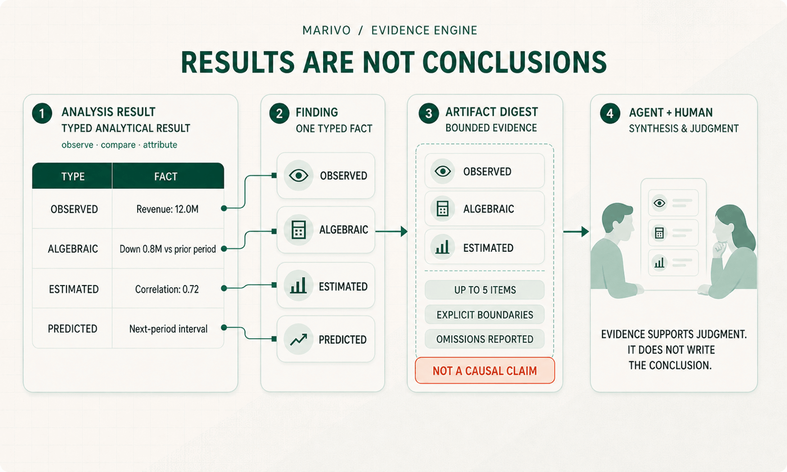

The previous article ended with a typed analytical result. `compare` had measured a change, `attribute` had broken that
change into numerical contributions, and `correlate` had estimated an association. We knew what each step had done, which
scope it used, and what kind of result it returned.

There is still a gap between that result and a sentence you can put in a report.

Suppose an attribution result shows that the North region accounts for most of a revenue decline. It is easy for an agent
to write, “The decline was mainly caused by the North region.” The sentence sounds reasonable, but it goes beyond the
calculation. `attribute` decomposed the change across regions. It did not establish what happened in the North, much less
prove that a particular business action caused revenue to fall.

The arithmetic is sound. The retelling is not.

Marivo's Evidence Engine is designed for that gap. It does not write conclusions for the agent or decide what the business
should do. Its job is more basic: extract the facts that a result actually establishes, preserve their identity, scope,
derivation, and limits, and make it clear how far each fact can be carried into a claim.

## Why a result is not yet evidence

A result table can certainly serve as evidence. But using it responsibly requires a reader to answer several questions on
the fly:

- Which row or value is worth citing?
- Was that value observed, calculated, estimated, or predicted?
- Which metric, period, and segment does it belong to?
- Which inputs and derivation rule produced it?
- Has the current view left out other results that still exist?
- What, specifically, does this result not establish?

Those questions are too important to leave as reminders in a prompt. An agent may remember that correlation is not
causation in one turn and describe a contribution as a cause in the next. It may copy the right number but forget that the
number covers only one region or one month. Or it may treat a group missing from a summary as if it were missing from the
full result.

The problem is not that agents cannot read tables. A table simply carries values, structure, and many conditions of use at
the same time. The Evidence Engine turns those implicit reading conditions into explicit runtime values.

The path is deliberately short:

```text
analytical result → typed findings → bounded artifact digest
```

A `Finding` is one typed fact extracted from a result with as little loss of meaning as possible. An `ArtifactDigest` is a
small, bounded projection for immediate reading. It selects a few findings and states both its inference boundaries and
its omissions. Connecting evidence across several results, deciding whether it supports a business conclusion, and
choosing what to investigate next remain the work of the agent and the business owner.



## First ask how the number is known

Many analytical misreadings begin with a correct number assigned to the wrong kind of knowledge.

“Revenue was 12.0 million,” “revenue fell by 0.8 million,” “the North region contributed 0.5 million of the decline,” and
“revenue and discount rate had a correlation of 0.72” can all appear as values in a table. They are not interchangeable.
The first is an observation. The next two are algebraic results under declared rules. The last is a statistical estimate.
They support different sentences.

The Evidence Engine therefore does not flatten every operator into a generic “insight” record. It preserves the meaning of
the Analysis DSL result that produced each fact:

- `observe` produces observation facts;
- `compare` produces change facts;
- `attribute` and `decompose` produce numerical contributions, not causes;
- `correlate` produces estimated associations, not effects;
- `hypothesis_test` records a statistical decision under a declared test, not business importance;
- `forecast` produces predictions, not observations;
- scored `discover.*` operations produce candidates for investigation, not confirmed anomalies.

This distinction can look conservative. That is precisely its value. While a fact still carries its status as observed,
algebraic, estimated, predicted, or candidate, it is harder to promote it silently into a stronger claim. A contribution
may still belong in a conclusion, but the wording has to remain honest: “The North region accounts for most of the decline
numerically” is supported. “The North region caused the decline” is not.

## A useful digest admits what it leaves out

Putting an entire result table into context is not a dependable evidence strategy. A result may contain hundreds of rows,
while the agent initially needs only a handful of facts. But a summary that selects “the five most important points”
without saying how it selected them creates a different problem: it makes the visible items look like the whole result.

Marivo's `ArtifactDigest` is explicitly bounded. Under the current contract, one digest retains no more than five items
and three inference boundaries. The limit is not an attempt to make the investigation look simple. It keeps the cost of an
immediate read predictable. Unlike a conventional summary, the digest also records how many items it kept, how many it
omitted, which selection rule it used, and when the reader should return to the full findings or source artifact.

“Not present in the digest” therefore does not mean “not present in the result.” Suppose an observation grouped by region
produces twenty segments. A digest may show five and state that fifteen were omitted. The agent can use the first five to
orient the next read. If the question concerns the sixth region, or requires the full distribution, it can follow the
digest back to the exact findings or the complete frame.

Every committed analytical artifact exposes the same read path:

```python
attribution.show()

print(attribution.evidence_status)
digest = attribution.evidence_digest
if digest is not None:
    digest.show()
```

`artifact.show()` renders that same bounded digest before the data preview. It is not a second prose summary generated
from the table. The structured value read in code and the readable version shown to a reviewer are two views of the same
digest. The agent and the reviewer do not receive competing versions of the evidence.

## A boundary belongs with the evidence, not in the footnotes

Technical reports often end with a sentence such as “correlation does not imply causation.” The warning is correct, but it
is too far from the number it governs. It is easily lost when a chart is copied, a report is shortened, or a result is
retold in another conversation.

The Evidence Engine keeps the boundary next to the evidence. Different operations prohibit different upgrades:

- a numerical contribution cannot be promoted directly to a causal explanation;
- an association cannot be promoted directly to an effect;
- a candidate cannot be promoted directly to a confirmed anomaly;
- a statistical test decision cannot be promoted directly to business importance;
- a forecast cannot be presented as an observed outcome.

These boundaries do not prevent an agent from investigating causality. They require a stronger claim to earn stronger
evidence. Moving from “the North region accounts for most of the decline” to “a pricing change in the North caused the
decline” requires evidence about the price change, temporal order, competing explanations, and a method capable of
supporting causal inference. The attribution result remains useful. It simply cannot carry that entire argument by itself.

For Marivo, traceability therefore means more than finding the table from which a number came. A reviewer must also be
able to see what kind of fact the number represents and which line of inference it has not crossed.

## Traceability does not mean putting every detail on screen

Traceability matters when someone needs to inspect the path, not when every detail is shown all the time.

Each `Finding` has a stable identity tied to its session, source artifact, business subject, and analytical scope. It also
records the derivation rule and source fields that produced it. When a fact needs closer review, the reader can move from
the digest to the exact finding and then back to the artifact from which it was extracted:

```python
page = session.evidence.findings(
    artifact_ref=attribution.ref,
    limit=50,
)

finding = page.items[0]
trace = session.evidence.trace(finding.finding_id)
source = session.get_frame(attribution.ref)
```

These are three reading depths along one path. The digest is appropriate immediately after an analytical action. A Finding
is appropriate when one fact must be cited precisely. The derivation trace and source frame are appropriate when a reviewer
needs to inspect the rule, fields, or full data. They are not three independent evidence systems.

Evidence is not merged across investigations merely because two metrics share a name. Every fact retains the identity of
its owning session and artifact. This apparently small constraint matters: “revenue declined” in a promotion review must
not merge with a result from another period, another input, or another investigation simply because both refer to revenue.

## Missing evidence should be inconvenient

Successful computation does not guarantee a complete evidence path. Finding extraction can fail. A digest may be
unavailable. The persistent store may be unreadable. If the system still returns a normal-looking summary, an agent cannot
tell whether it has complete evidence or a degraded substitute.

Marivo therefore gives every analytical artifact an explicit evidence status:

- `complete` means extraction and digest creation were committed successfully;
- `partial` means part of the evidence is missing, with the gap exposed as a typed issue;
- `unavailable` means no usable evidence digest is available.

`partial` does not mean “close enough,” and `unavailable` does not mean “nothing was wrong.” Either state requires the
agent to narrow its wording, inspect the source artifact, or repair the evidence path before relying on the digest. In the
same spirit, an empty Finding page means a healthy evidence store matched no records. If the store itself cannot be read,
the runtime raises an error instead of disguising failure as an empty result.

That behavior makes some workflows less smooth. Dependable analysis needs the friction. When the evidence path breaks,
the break should be visible. “Cannot be verified” must not become “no issue found” merely because the system wants to
produce a complete answer.

## The Evidence Engine does not think for the agent

If an evidence engine starts joining results into claims, assigning confidence scores to conclusions, and planning the
next investigation, it becomes another hidden analytical agent. The same questions then return one level deeper: Which
business context guided the synthesis? Why were these results selected? Which conflicts were ignored? Who decided that the
investigation was complete?

Marivo does not place those judgments inside the Evidence Engine. The engine projects the result of one analytical action
into facts that are bounded, traceable, and easy to inspect. Cross-artifact synthesis, causal interpretation, business
judgment, and the choice of what to do next remain with the agent. Whether a conclusion fits the organization's business
knowledge and decision standards remains a responsibility for the business owner.

The boundary separates two different kinds of work:

- fact extraction, identity, scope, derivation, selection, and omission rules can be reproduced by the runtime and belong
  in the Evidence Engine;
- interpretation that depends on the question, business context, and tradeoffs across several sources belongs with the
  agent and the people responsible for the decision.

The more deterministic the first category becomes, the more room the second has to remain open. The agent can spend less
effort reconstructing where each number came from and more effort testing hypotheses, noticing conflicts, and choosing the
next step. A reviewer, meanwhile, does not have to accept a single opaque interpretation. The reasoning can be taken apart
and checked against individual facts.

## One analytical step is grounded. The investigation still has to survive the conversation.

Across the series so far, the semantic layer has answered what we mean by revenue, customers, and business time. The
Analysis DSL has answered how one step may observe, compare, or attribute those objects. The Evidence Engine answers what
the facts produced by that step support—and what they do not.

Together, those three layers give one analytical action a dependable local path:

```text
business question
  → governed business objects
  → constrained analytical action
  → typed result
  → identified, scoped, bounded evidence
```

The Evidence Engine is not a log added after the analysis. The result, its findings, digest, and issues are committed as
the products of the same action. If part of that process fails, the status stays with the result. Evidence is produced with
the analysis rather than collected afterward to justify a conclusion already written.

A dependable analytical system should not make every conclusion sound as strong as possible. It should keep each sentence
within the evidence that supports it. That restraint does not make an agent less capable. It gives the agent room to
explore because every step says where it stands, what it rests on, and what it has not established.

But a reviewable local path is not yet a durable investigation. Evidence can be found later only if the
investigation itself does not dissolve when a conversation ends. Real analysis rarely finishes in one turn. The agent may
continue tomorrow or switch execution scripts midway through the work. Conversation context may shrink; results cannot
lose their order, identity, or relationships with one another. Whoever resumes the work needs to know what has already run,
which results remain usable, and where to continue without reconstructing the investigation from memory.

That is the subject of the next article: the **Analysis Session**. The Evidence Engine leaves one result with facts that can
be checked. The Analysis Session keeps actions, results, and evidence in one coherent investigation across turns. How an
analysis outlives a conversation—and how an agent recovers only the context it needs—is the next boundary in a dependable
analytical chain.

Follow Marivo's source and latest work on [GitHub](https://github.com/chengxianglibra/marivo). To understand the analytical
actions that precede evidence, read [Analysis DSL: Constrain Analytical Actions, Not Agent Reasoning](/blog/analysis-dsl-constrains-actions-not-agent-reasoning/).
To begin with a working investigation, see [Your Agent's First Analysis](/docs/latest/first-analysis/).

---

[Back to the Marivo Blog](/blog/) · [Read the current documentation](/docs/latest/)
