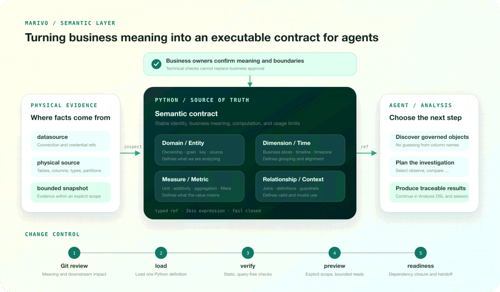

Giving an agent access to a database schema is easy. The difficult part begins when it sees columns such as `amount`, `status`, and `created_at`. Which one defines revenue? Which records belong in the calculation? When is that revenue recognized? Which dimensions may be used to break it down?

People face the same ambiguity, but they usually recognize it. They ask the report owner, check the finance policy, or look for an established definition. An agent is unusually good at turning scattered clues into a complete-looking answer. That ability improves analytical speed, but it can also turn “this seems likely” into “this must be correct” without anyone noticing the leap.

A longer prompt does not create a durable boundary. Data analysis agents need a business contract that can be executed, checked, reviewed, and maintained. In Marivo, that contract is the semantic layer.

## Why reading tables is not the same as understanding the business

Suppose an order table contains `created_amount`, `paid_amount`, and `settled_amount`. Before answering “Why did revenue decline last quarter?”, an agent has to settle several questions:

- Is revenue recognized when an order is placed, paid, or settled?
- How should cancellations, partial refunds, and full refunds be handled?
- Should the analysis use creation time, payment time, or settlement time?
- Are currencies converted per row or after aggregation?
- Does region come from the order address, the fulfillment warehouse, or the sales organization?
- May the metric be added safely across time and across regions?

The answers may be scattered across column comments, old SQL, dashboard notes, finance policy, and the memory of a colleague. Schema metadata can tell the agent that a column is numeric. A sample can reveal its common values. Neither establishes which definition the business has approved. A column named `paid_amount` may look like revenue and still be the wrong measure.

The most dangerous mistakes do not produce query errors. Two queries can both run and return plausible trends while using incompatible definitions. That may be acceptable in a demo. It is not acceptable when the result informs operations, governance, or management decisions.

### Prompts are not institutional memory

Putting metric definitions in the agent prompt can improve one conversation. It does not preserve consistency across time.

Prompts vary by entry point, team, and model. Conversations end. Rules in a long context may be compressed. The same definition is often copied into several skills and scripts, which then change independently. More importantly, a sentence such as “revenue excludes refunds” does not say which entity it applies to, how refunds are related, which timeline governs recognition, or whether the definition still runs against the current datasource.

The first job of a semantic layer is not to give the agent more information. It is to prevent the agent from quietly switching definitions. The agent remains free to decide how to investigate a revenue decline, but every step must refer to the same stable revenue identity. If that definition is missing or no longer valid, the system should stop instead of inventing a convenient substitute in the current conversation.

### Access does not create a business contract

For an agent, discovering a column and obtaining an analysis-ready object are different events.

The first is a physical observation: the column exists, it has a numeric type, and most sampled values are positive. The second is a business commitment: the value represents a specific fact, has a defined unit and aggregation rule, belongs to a declared timeline, may be segmented in known ways, and has an owner responsible for its meaning.

Only the second can serve as a stable input to analysis.

This is why a semantic layer is more than a friendlier data catalog. A catalog helps an agent find data. A semantic layer identifies which business objects have a reusable identity and a governed boundary. It replaces “this is probably how we calculate it today” with “this is the approved definition, and the runtime can check whether it still holds.”

## What the semantic layer must make explicit

A common approach starts with columns: add a display name, a description, and a few tags to each one. That improves discovery, but it can reduce the semantic layer to a polished data dictionary. Marivo starts elsewhere: **first identify the stable commitments that downstream analysis must depend on, then design the objects that carry them.**

An analysis needs clear answers to at least six questions:

1. Which business domain and business entity are under discussion?
2. What does one row represent, how is the entity identified, and is it versioned?
3. Which attributes and timelines may be used for observation?
4. What does each value mean, how is it aggregated, what is its unit, and where is it additive?
5. How are entities related, and how is join fanout prevented?
6. Which questions does the definition support, and where must it not be used?

Marivo does not compress all of that into one oversized metric object. Different semantic objects carry different commitments.



The important part of the diagram is not the number of objects in the center. It is the separation of responsibilities. A datasource supplies physical facts. A business owner confirms meaning. The semantic layer turns both into an executable contract. Once the agent receives a stable ref, it can plan the analysis without reconstructing business definitions from column names.

### Constraint 1: business objects, ownership, and analytical population

A `Domain` is both a business namespace and an ownership boundary. Marivo requires a domain `owner` because technical executability does not answer a business question: who is authorized to confirm this definition? Ownership is not decorative metadata. It makes semantic correctness an explicit business responsibility.

An `Entity` connects the analytical subject to physical data. It declares the datasource and table or file, what one row represents, the primary key, and any snapshot or validity semantics. A key must not be inferred merely because it happens to be unique in a small sample. Nor should row grain be guessed from a table name. Both are foundational commitments for deduplication, relationships, and metric computation.

This layer prevents the agent from analyzing the wrong subject. Two tables named `orders` may represent orders, order lines, and order-state snapshots respectively. Without an explicit entity, an agent can select the right amount column and still multiply revenue because one order appears on several rows. A stable ref points to an approved business object, not whichever table currently looks most like an order table.

### Constraint 2: scope, dimensions, and timelines

A regular dimension declares a business attribute that may be used for grouping or filtering. A time dimension is not simply a date-like column. It is a timeline with an explicit grain, parsing rule, timezone, and optional default status. Time deserves separate treatment because many plausible analytical errors occur at its boundaries: calendar day versus financial day, event time versus ingestion time, and UTC versus the operating timezone.

Dimensions govern more than whether an agent can write a `GROUP BY`. They specify which breakdowns have business meaning. Customer region, order region, fulfillment region, and sales territory are distinct concepts even if their values look similar. Completion time, payment time, and write time cannot be exchanged simply because they share a data type. The agent may choose the appropriate declared axis for the question; it may not promote an arbitrary field into a governed dimension for convenience.

The analytical population belongs within this boundary as well. Included statuses, excluded test records, and the selected snapshot version should live in entity, field, or metric definitions rather than in an incidental filter inside one query. A ref must continue to identify the same population across different analyses.

### Constraint 3: measures, metrics, and calculation rules

A measure is a row-level numeric fact with a unit and additivity. Whether an amount can be summed across time or entities should not be decided afresh in each query. Marivo declares the measure first and then aggregates it into a metric, keeping the row-level fact separate from the business calculation.

A metric combines measures, aggregation, filters, and business context into a value that downstream analysis can reference by stable identity. It may be a sum, count, weighted average, ratio, or linear composition of existing metrics. A custom Ibis expression is available when the standard builders cannot represent the calculation.

This is more explicit than placing `SUM(...)` in a query, but the additional structure preserves information that SQL often flattens: the row-level fact behind the total, its unit, whether it may be aggregated again, whether a filter belongs to the business definition or the current investigation, and which approved metrics a derived metric depends on. The result is not merely a number. It remains attached to a structured definition.

Ibis gives the contract enough computational range for real business rules. Straightforward metrics use builders such as `ms.aggregate(...)`. When a metric needs row-level conditions, null handling, type conversion, or an expression across several columns, a restricted decorator function can return an Ibis expression that Marivo compiles for the target backend. An agent is therefore not forced to choose between a small library of prebuilt metrics and unrestricted SQL generation. Complex calculations can enter the semantic layer while retaining an entity, declared dependencies, a unit, additivity, and a stable identity.

### Constraint 4: relationships, cardinality, and temporal structure

Single-table metrics are not enough for most investigations. Cross-entity analysis requires a relationship with declared join keys and cardinality; otherwise an agent can easily multiply a measure through a one-to-many join. A metric's root entity and fanout policy establish which population must be preserved and whether an unsafe path must fail or aggregate first. The agent may extend an investigation along declared relationships. It may not join tables opportunistically simply to obtain a result.

Marivo applies the same principle to financial periods, campaign windows, working days, business events, and state changes. Stable, reusable structures should be modeled explicitly instead of reinterpreted in every analysis. These objects govern business time and business process, not just the parsing of a timestamp column.

### Constraint 5: usage boundaries and runtime validation

Not every business rule can be reduced to a mechanical check. `ai_context.business_definition` explains what an object means; `guardrails` describe where it should not be used. They do not prove that a definition is correct, and they do not replace business approval. They make limitations visible when an agent selects an object and explains a result.

The runtime handles what can be checked mechanically. Typed refs constrain dependency kinds. The loader checks object structure and the dependency graph. `verify` checks the static contract. `preview` uses bounded data to confirm that an expression can materialize. `readiness` evaluates the dependency closure and identifies which objects can be handed to analysis. If any required condition cannot be established, Marivo fails closed. The agent does not get to swap columns, change the definition, or bypass the constraint silently.

The semantic layer therefore constrains an agent by narrowing what it may reasonably claim. It must begin with an approved identity, use business-defined axes, follow declared computation and relationship rules, and preserve limits that require human judgment. The layer cannot guarantee that every analysis meets the business need. It can expose the choices most likely to depart from that need, and reject departures that the runtime can detect.

A useful test for whether something belongs in the semantic layer is: **does it represent approved business meaning that many analyses will need to depend on?** If so, it should not exist only in a query or a conversation.

The current hypothesis, a temporary comparison period, a chart choice, an anomaly under investigation, and the final interpretation do not belong there. They belong to the analysis plan, Analysis Session, and evidence. The semantic layer defines dependable nouns and computational boundaries. The Data Analysis DSL acts on them. Mixing the two allows one-off questions to pollute stable definitions and lets analytical actions disappear inside metric code that is difficult to review.

## What a Marivo semantic contract looks like

The following example is deliberately small. Its purpose is to show how the responsibilities connect, not to catalog every API:

```python
# models/semantic/sales/_domain.py
import marivo.datasource as md
import marivo.semantic as ms

ms.domain(
    name="sales",
    owner="Mina Zhang",
    ai_context=ms.ai_context(
        business_definition="Sales from completed orders.",
        guardrails=["Revenue changes require approval from the finance owner."],
    ),
)

orders = ms.entity(
    name="orders",
    datasource=ms.ref.datasource("warehouse"),
    source=md.table("orders"),
    primary_key=["order_id"],
    ai_context=ms.ai_context(
        business_definition="Each row represents one order.",
        guardrails=["Do not join order lines in a way that multiplies amounts."],
    ),
)

region = ms.dimension_column(
    name="region",
    entity=orders,
    column="sales_region",
    ai_context=ms.ai_context(
        business_definition="Sales region assigned when the order was confirmed.",
        guardrails=["Unknown is not a business region."],
    ),
)

completed_at = ms.time_dimension_column(
    name="completed_at",
    entity=orders,
    column="completed_at",
    granularity="day",
    is_default=True,
    ai_context=ms.ai_context(
        business_definition="Default recognition time for completed-order revenue.",
    ),
)

gross_amount = ms.measure_column(
    name="gross_amount",
    entity=orders,
    column="gross_amount_cny",
    additivity="additive",
    unit="CNY",
    ai_context=ms.ai_context(
        business_definition="Amount recognized at completion before refunds.",
    ),
)

refund_amount = ms.measure_column(
    name="refund_amount",
    entity=orders,
    column="refund_amount_cny",
    additivity="additive",
    unit="CNY",
    ai_context=ms.ai_context(
        business_definition="Confirmed refund amount deducted from revenue.",
    ),
)

gross_revenue = ms.aggregate(
    name="gross_revenue",
    measure=gross_amount,
    agg="sum",
    ai_context=ms.ai_context(
        business_definition="Revenue before refunds, recognized at order completion.",
        guardrails=["Do not use as net revenue."],
    ),
)

@ms.metric(
    name="revenue",
    entities=[orders],
    additivity="additive",
    unit="CNY",
    ai_context=ms.ai_context(
        business_definition="Net revenue recognized at completion after refunds.",
        guardrails=["Do not use for payment volume or order value."],
    ),
)
def revenue(order_rows):
    return (
        ms.bind(gross_amount, order_rows)
        - ms.bind(refund_amount, order_rows).fill_null(0)
    ).sum()
```

Several choices are worth calling out.

First, semantic identity comes from an explicit `name`, and objects connect through typed refs. Analysis uses a stable identity such as `metric:sales.revenue`, not a Python file path or a variable name that an agent happens to remember.

Second, business guidance lives in the structured `ai_context`. `business_definition` says what the object represents; `guardrails` say how it must not be used. Prose still matters, but it is attached to an executable object rather than maintained as disconnected knowledge-base text.

Third, the unit, additivity, default timeline, and primary key are explicit. Marivo does not infer those commitments from names or samples. Inference may help an agent ask the right question. It cannot approve a project definition.

Finally, `gross_revenue` shows how a common aggregation can use a standard builder. The decorated `revenue` metric shows the flexibility of an Ibis expression: it treats missing refunds as zero at row level, calculates net revenue, and then aggregates. Real definitions can use Ibis conditions, casts, and other multi-column expressions, with Marivo compiling the expression for the target backend instead of requiring a dedicated builder for every calculation.

That flexibility remains inside the contract. `@ms.metric` declares the entity, result unit, and additivity. `ms.bind(...)` connects fields to the entity parameter. The function body is restricted to a single `return` that produces an Ibis expression. Marivo preserves the freedom required to express a business calculation without opening an escape hatch for arbitrary Python logic.

## Managing semantic definitions as code

A semantic layer is not metadata that can be generated once and forgotten. It changes with business policy, source systems, and software versions. Managing it well means answering three questions at all times: which definition is authoritative, how changes are reviewed, and how divergence from the real runtime environment is detected.

### Python is the single source of truth

Marivo treats the Python files under `models/` as the sole source of semantic definitions. This is not because YAML is incapable of describing a metric. Python is maintainable by both people and coding agents, gives objects concrete types, lets refs resolve at load time, supports backend-independent Ibis expressions, and works with ordinary code review and dependency tooling.

Marivo narrows Python's generality through constrained object shapes, restricted expression bodies, and a loader that fails closed. The project contains declarative business objects, not arbitrary business scripts. A typical structure remains easy to navigate:

```text
marivo.toml
models/
  datasources/
    warehouse.py
  semantic/
    sales/
      _domain.py
      orders.py
      customers.py
scripts/
  check_semantics.py
```

Credentials are a deliberate exception. The project stores `*_env` references rather than passwords. Runtime state, preview evidence, and local caches under `.marivo/` are not semantic definitions either. Python definitions can move across environments; authentication must be established in the environment where they run.

### Git makes semantic changes reviewable

Semantic definitions should enter Git and change through branches and merge requests, just like application code. Reviewers need to see more than whether the Python executes. They need to know which business definitions and guardrails changed, whether the owner approved them, whether the population or timeline moved, how the calculation changed, and which downstream metrics are affected.

Git does not replace business approval, nor does it prove that the data still matches the definition. It makes an approval, a CI result, and a production analysis refer to the same code version. When a result is challenged, the team can inspect the exact meaning in effect at the time instead of reconciling several documents and prompts that have already diverged.

### Keeping semantic models, skills, and scripts aligned

Definition drift often happens across artifacts rather than within one semantic model. A rule appears once in the semantic model, again in a skill that guides the agent, and a third time in a validation script. All three may agree when written. The moment one changes alone, agent behavior, automated checks, and runtime semantics begin to separate.

Marivo makes the semantic model the sole source of business meaning. Entities, fields, metrics, relationships, time semantics, and guardrails live only in the Python objects under `models/`. A skill does not copy those definitions. It tells an agent how to discover, validate, and use semantic objects, while `marivo.help(...)`, `.show()`, `.contract()`, and public refs expose the current contract. A script loads the same semantic model and performs repeatable mechanical checks; it does not reimplement formulas, field mappings, or constructor parameters.

This division also defines how the artifacts should be maintained. A business-definition change begins in the semantic model. If it changes the agent's workflow, the skill changes in the same Git review. If it requires broader automated coverage, the script changes as well. CI should validate every ref that a skill or script expects against the current semantic model. A skill may require “verify before preview,” and a script may check that `sales.revenue` remains usable, but neither keeps its own copy of the revenue definition. Consistency comes from reading and validating the same semantic model, not from manually synchronizing similar prose.

### Using CI to catch definition drift

CI cannot prove that business meaning is correct forever. It can stop an approved definition from changing unnoticed. There are at least two kinds of drift to catch.

Contract drift is structural: a ref or dependency disappears, an expression changes type, a physical field moves, or an object can no longer be handed to analysis. Every merge request should load the project, verify affected objects, and run readiness for critical refs.

Metric-definition drift is subtler. The semantic model may still load and run even though revenue has changed from “paid amount less refunds” to “paid amount.” Structural checks may not notice. CI should therefore preview critical metrics against a controlled snapshot of real data or a business-approved representative dataset, then assert the expected result. The data should cover cases that carry semantic weight—null refunds, cancelled orders, and time boundaries, for example. Expected values must be confirmed independently from the business rule, not generated from the current metric expression.

```python
import marivo.semantic as ms


def test_critical_semantics(orders_snapshot):
    catalog = ms.load()
    revenue = ms.ref.metric("sales.revenue")

    assert catalog.verify(revenue).status == "passed"
    assert not catalog.readiness(refs=(revenue,)).blockers

    preview = catalog.preview(revenue, using=orders_snapshot)
    assert preview.status == "passed"
    assert preview.rows == ({"value": 751.5},)
```

`orders_snapshot` may come from a datasource available to CI, or it may be a small dataset fixed from a real business scenario. Volume is not the point. The input must be stable, its edge cases understood, and the expected outcome reviewed. The test references `sales.revenue` without copying its formula, yet it fails when a formula change alters the approved result.

When a business owner changes a Python definition, Git records the change and CI checks both the dependency closure and the metric outcome. An intentional definition change updates the expected result in the same review, with a clear reason. An accidental calculation change blocks the merge. CI remains a feedback mechanism against drift rather than becoming a second source of semantics.

## Building a semantic layer with Marivo

If business meaning cannot be inferred from metadata, does every definition have to be written manually from scratch? Not quite. Marivo semantic authoring assigns evidence gathering, technical drafting, and validation to the agent while reserving irreducible business decisions for the owner.

The workflow is deliberately short:

```text
confirm the goal and owner
  → inspect and acquire a bounded snapshot
  → define one object
  → load / verify / preview
  → readiness
```

Before writing definitions, the agent confirms the domain owner, the target business concept, and any policy decisions that data cannot answer. It then inspects the physical structure and acquires one reusable snapshot under an explicit scope, row limit, and timeout. Observed types, values, and uniqueness are drafting evidence. They do not automatically become units, keys, timezones, or population rules.

Objects are added one at a time in dependency order. After each save, the agent reloads the exact object, runs query-free verification, previews it against the same snapshot, and finally checks the dependency closure through readiness. A failure is repaired at the current object instead of being buried under a batch of plausible-looking generated definitions.

Three judgments remain distinct: a successful load means the project can be loaded; readiness means the technical dependency closure is fit for analysis; only the responsible owner can confirm that the business meaning is correct. Marivo authoring helps an agent complete observable, repeatable technical work efficiently. It does not ask the agent to invent policy.

## From semantic objects to the Data Analysis DSL

The semantic layer answers “What is revenue?” Only then should the agent ask “What should we do with revenue?” It retrieves the current metric and dimension from the session catalog and passes them directly to the Marivo Data Analysis DSL:

```python
import marivo.analysis as mv

session = mv.session.get_or_create(
    "revenue-review",
    question="Why did revenue decline in Q2 2026?",
)
revenue = session.catalog.metrics.get("sales.revenue")
region = session.catalog.dimensions.get("sales.orders.region")

frame = session.observe(
    revenue,
    time_scope=mv.time_scope(start="2026-04-01", end="2026-07-01"),
    grain=mv.grain("month"),
    dimensions=[region],
    analysis_purpose="Establish the revenue trend and regional distribution",
)
frame.show()
```

The call is short, but the DSL receives more than two column names. It resolves the revenue calculation and dependencies through the ref, checks that region belongs to a reachable entity, and applies the declared timeline, unit, additivity, and relationship constraints. An unsafe grain, dimension, or join is not accepted merely because the agent could write executable SQL for it.

The semantic layer preserves stable business meaning. The Data Analysis DSL expresses the current investigative action. Typed refs connect the two, leaving the agent free to observe, compare, or break down a result without leaving the approved business contract.

The next article will examine that DSL more closely: why analytical actions should not collapse back into unrestricted SQL, and how typed operations preserve the meaningful differences among comparison, segmentation, attribution, and evidence without imposing a fixed workflow.

Follow Marivo's source and latest development on [GitHub](https://github.com/chengxianglibra/marivo). To see a semantic contract enter a real analysis, start with [Your First Analysis](/docs/latest/first-analysis/).

---

[Back to the Marivo Blog](/blog/) · [Read the current documentation](/docs/latest/)
