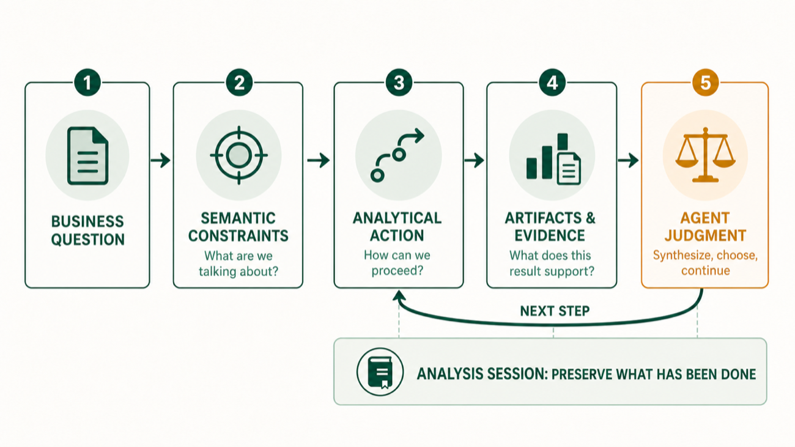
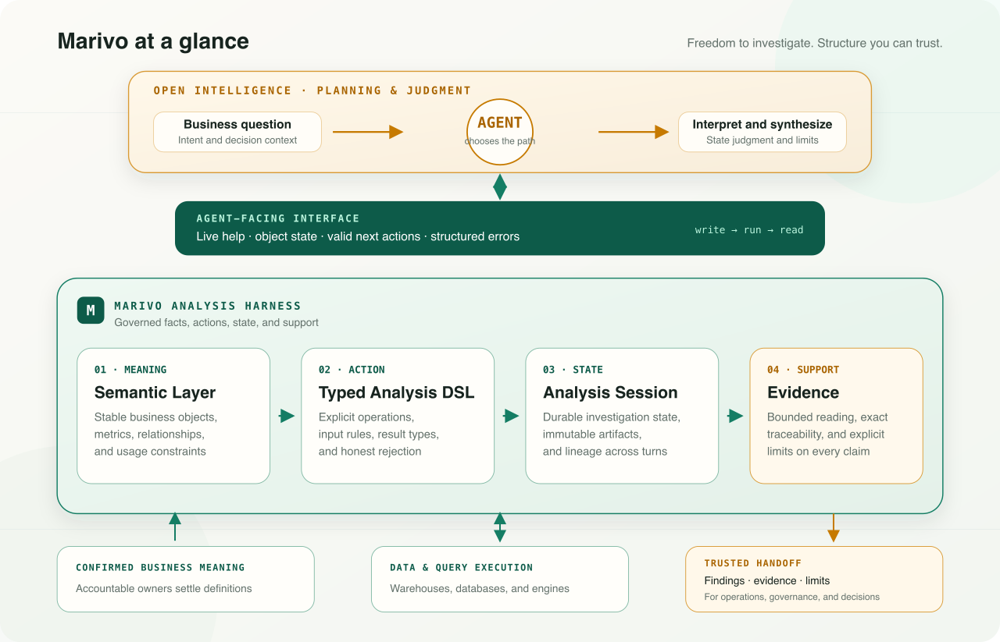

SQL generation makes for an impressive demo. Give a language model a database schema, ask why revenue declined last quarter, and watch it find the relevant tables, write a query, draw a chart, and offer an explanation. The sequence feels complete.

Then the result has to support a real decision.

What does “revenue” mean: cash collected, revenue recognized, or sales net of refunds? Does “last quarter” follow the calendar, the fiscal calendar, or the operating timezone? How should orders and refunds be joined? Is a year-over-year comparison aligned by date or by working day? If one region accounts for most of the decline, does that establish cause? A week later, can anyone recover the definitions, analytical steps, and unresolved judgments behind the answer?

These are not SQL syntax problems. A database can execute a perfectly valid query that answers the wrong business question.

Marivo starts where intent-to-SQL stops. It treats analysis as a continuing investigation with durable structure: business meaning is explicit, analytical actions have defined contracts, state survives beyond the conversation, and material findings remain connected to evidence. The agent chooses where to investigate next. It does not get to move the boundaries without saying so.

## When analysis becomes operational

A mistake in personal exploration may cost an hour. Enterprise analysis can determine which customers enter a campaign, whether a governance rule is tightened, where a regional team receives more budget, or how management reallocates targets and resources. Once a finding enters one of those processes, it is no longer conversational output. It is an input to action.

“Plausible” is not a sufficient standard. The people relying on the analysis need to know which definitions were used, what data was in scope, which operations were performed, which results support the finding, where agent judgment begins, and whether a disputed claim can be reopened from the original analytical state.

Without that record, an organization has not accelerated analysis. It has accelerated the distribution of assumptions.

Trust does not mean promising that every conclusion is correct, and traceability is not the same as retaining more logs. A trustworthy handoff keeps consequential choices visible, distinguishes computed facts from interpretation, connects findings to their source results, and carries limitations forward. Operators can then decide whether to act, governance teams can inspect the applicable rules, and decision-makers can judge whether the evidence is strong enough for the decision at hand.

This is where a harness becomes necessary. When agent analysis moves from a chat into operations, governance, or decision-making, the result needs a form that can be inspected, resumed, and traced. Marivo is designed for that handoff.

## Analysis is an investigation, not a query

Natural-language-to-SQL solves a useful but limited problem: expressing query intent in a language the database can execute. Most analysis extends well beyond that translation.

A credible investigation has to settle several distinct questions:

- Which business object and metric are in question, and which records are in scope?
- What period should be observed, and how should it be aligned with the baseline?
- Does the current result justify comparison, segmentation, or attribution—or only a narrower statement?
- Which intermediate results must be retained, resumed, or recomputed?
- Which claims follow from computation, and which require interpretation by an agent or a person?

When those choices live only in temporary SQL and the prose around it, the system may preserve an answer, but it has not preserved the analysis. The next question either depends on chat history or starts the work again. A reviewer may also be unable to tell whether a claim came from source data, a defined analytical operation, or the model’s interpretation of the output.

Marivo therefore treats a stateful analytical step—not a query or a message—as the basic unit of work. Governed semantic inputs enter a typed operation and produce an immutable result. The result, its lineage, and its evidence remain in an Analysis Session. The agent reads that state and decides what to do next.

This is a loop, not a one-shot pipeline. After reviewing an artifact and its evidence, the agent may continue the investigation from the recorded state. It does not have to reconstruct completed work from conversation.

The added structure is not ceremony. It makes visible the decisions that analysis already contains.

## Autonomy needs boundaries

Data analysis agents are often designed around one of two failure modes.

The first offers maximum freedom: let the agent inspect every table, write arbitrary SQL, and interpret any result. This is flexible, but correctness now depends on each prompt and each model judgment. The same question can acquire different definitions when it is rephrased or sent to another model.

The second replaces exploration with a fixed workflow: prescribe the first query, the next breakdown, and the final report. This is easier to control, but it cannot handle genuinely open questions. In an investigation, the right next step often depends on the result of the current one.

Marivo draws the boundary elsewhere: **the runtime constrains facts and actions; the agent retains planning and judgment.**

The runtime verifies that references exist, inputs match the operation, comparison semantics are explicit, artifacts retain lineage, and evidence follows deterministic rules. The agent interprets intent, chooses an analytical path, combines results, and decides when the investigation is sufficient. The business owner settles questions that data cannot answer, such as which definition of revenue is authoritative and whether the resulting evidence is appropriate for a particular decision.

None of these roles can stand in for another. Technical validation does not approve business meaning. A convincing explanation does not establish causality. An approved metric does not guarantee that every future request is executable.

Taken together, the architecture separates three kinds of authority. Accountable people confirm business meaning, the agent plans and interprets, and the Marivo runtime governs the analytical work that was actually executed. Its agent-facing interface keeps that boundary visible while the four foundations carry definitions, actions, state, and evidence into a handoff that operations, governance, and decision-makers can inspect.

## Four foundations, one analytical loop

Marivo supports this division of responsibility through four connected foundations: the Semantic Layer, Typed Analysis DSL, Analysis Session, and Evidence. They are not a list of independent features. Each answers a different question in the same investigation:

1. What are we talking about?
2. What analytical action is valid here?
3. What has already been done?
4. What does the current result actually support?

### Semantic Layer: stabilize business meaning

A database schema can tell us that a column is numeric. It cannot tell us whether the values include tax, exclude cancellations, follow a particular business timestamp, or remain additive across entities. Sample data may suggest an interpretation, but it cannot authorize one.

The Semantic Layer keeps business meaning outside any individual prompt. A metric should not change because the wording changed or the model was upgraded. Its definition must be durable, reviewable by a team, and verifiable when used.

Marivo represents that meaning as code-managed contracts. This does not require business owners to become Python developers. It means definitions can be versioned, reviewed, and validated. An agent may inspect datasource evidence and draft a definition, but it cannot turn patterns in sample data into business truth. An accountable owner confirms the meaning; the runtime verifies the technical contract.

The result is more than metadata attached to a query. Metrics, relationships, dimensions, and guardrails no longer have to be reconstructed inside every SQL statement. “What are we analyzing?” has a shared, reviewable answer across models and sessions.

### Typed Analysis DSL: make analytical actions explicit

Stable semantics do not determine what to do next. An open business question still requires the agent to adapt as evidence emerges. That freedom does not require every step to collapse into arbitrary SQL.

Observation, comparison, and attribution have different prerequisites and support different kinds of claims. A typed analysis language preserves those distinctions. Each operation defines what it accepts, which alignment or comparison rules apply, what kind of result it returns, and which continuations are valid. If a requested combination has no trustworthy meaning, rejecting it is more useful than producing a plausible query.

Types do not turn the investigation into a fixed workflow. Marivo constrains executed actions, not the plan. The runtime describes the current result and its valid continuations; the agent decides which path is worth pursuing and when business confirmation is required.

Autonomy lives in the path. Constraints define what each step may honestly claim to have done.

### Analysis Session: preserve what actually happened

Analysis rarely finishes in one pass. It may cross scripts and processes, branch after an unexpected result, or resume days later. A final table cannot explain how it was produced, and chat history cannot reliably restore the computational objects behind it.

The Analysis Session moves investigative state out of model context. The question, executed operations, intermediate results, artifacts, and lineage become project-local runtime state. An investigation can continue across turns, models, and processes without replaying completed work from prose.

This is not conversational memory under another name. A conversation records what participants said. The Analysis Session records what the system did. Interpretations can change and the investigation can branch without rewriting established analytical facts. The work remains resumable and reviewable, while the model remains replaceable.

### Evidence: stop where computation stops

Evidence must work at two different scales. An agent needs bounded material it can read without flooding its context. An audit needs the precise result and lineage behind a disputed claim.

Marivo supports both. It produces bounded, operator-specific evidence for routine reading while retaining exact results and lineage for verification. The concise representation does not replace the underlying record.

The critical design choice is restraint. Algebraic contribution remains contribution; it does not become cause. Correlation is not causation. An anomaly is a reason to investigate, not an explanation. Statistical significance does not establish business importance. Evidence records what the runtime can determine and makes the limit of that support explicit.

This boundary matters more than automatic summarization. Some claims follow directly from computation. Others require the agent to combine several results. A final business conclusion may still require accountable human judgment. An analysis is not auditable until a reviewer can see where one category ends and the next begins.

### Agent-facing interfaces: make the boundaries usable

Architectural boundaries have little value if an agent cannot see them while working. At runtime, it needs to know what object it holds, what state that object represents, which next actions are valid, and how to recover from failure.

Marivo’s state-bearing result objects identify themselves, expose bounded views of their state, and describe mechanically valid continuations. Structured errors explain what was expected, what was received, and what can be done next. Live help describes the interface in the installed version rather than relying on documentation that may have drifted from the runtime.

Workflow guidance, static contracts, live state, and error repair each answer a different question. Keeping those responsibilities separate prevents prompts or prose from inventing capabilities the runtime does not have.

## Let intelligence explore. Let constraints keep it grounded.

Marivo is a Python library, not an agent orchestrator. It provides runtime support that connects semantics, analytical operations, session state, and evidence. The relationship is similar to a wiring harness in laboratory equipment: the harness does not decide what experiment to run, but it connects signals, measurement points, and safety boundaries in known, inspectable ways.

For a data analysis agent, that means:

- It can choose the investigation path while working with confirmed business objects.
- It can revise the plan after each result while preserving typed analytical state.
- It can synthesize evidence and offer a judgment without presenting interpretation as a runtime fact.
- It can recover from failure because objects and errors expose real, bounded next actions.
- Models, chat interfaces, and agent frameworks can change without discarding semantic contracts or the analytical record.

This infrastructure does not make every answer correct. It provides something more practical: when a finding may influence a decision, a reviewer can see what it depends on, what was done, and where computed fact gave way to judgment.

That is the value of a harness in enterprise analysis. It allows agent-generated findings to leave the conversation with their definitions, evidence, and limitations intact—ready to be evaluated before they enter operations, governance, or decision-making.

## What Marivo deliberately does not do

Clear responsibility matters more than a long feature list.

Marivo does not call a language model or prescribe an orchestration framework. It does not approve metric meaning on behalf of a business owner, and technical readiness is not treated as business approval. Raw SQL remains useful for ad hoc exploration, but a raw result does not inherit typed semantic lineage. Marivo also does not synthesize multiple artifacts into a business conclusion; synthesis depends on context, evidence weighting, and judgment.

These are design boundaries, not unfinished items on a roadmap. A system that claims responsibility for every layer will eventually hide choices that should remain explicit.

## Where the series goes next

This article has outlined the system as a whole. The rest of the series will examine the difficult parts individually: why business semantics cannot be inferred from metadata, how a typed analysis language balances freedom with correctness, how an Analysis Session preserves the real state of an investigation, why Evidence must stop before judgment, and how live help, result objects, structured errors, and workflow guidance form an interface that agents can use without drifting from the runtime.

The next article begins with the Semantic Layer. Before asking why revenue declined, we need an honest answer to a more basic question: what, exactly, counts as revenue?

Marivo source code and current development are available on [GitHub](https://github.com/chengxianglibra/marivo). To see these ideas in a real investigation, start with [your first agent-guided analysis](/docs/latest/first-analysis/).

---

[Back to the Marivo Blog](/blog/) · [Read the current documentation](/docs/latest/)
