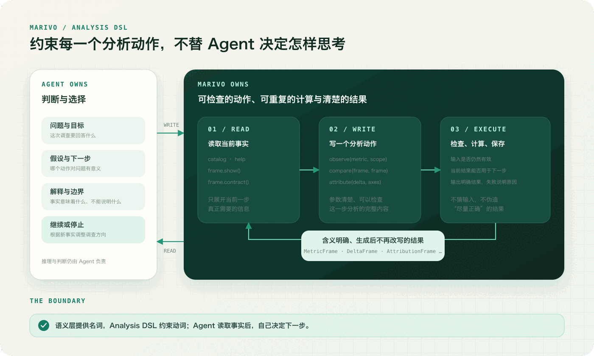

语义层定义了收入、客户、地区和业务时间这些可以被依赖的对象，但它还没有回答一个更现实的问题：
当 Agent 真正开始分析时，怎样确保它使用这些定义完成计算，而不是读完定义之后，仍然凭自己的理解
重新写一套查询？

这道边界很重要。语义层如果只出现在上下文里，它仍然是一份参考资料。Agent 可能正确复述“收入”的
业务定义，却在执行时换了一列金额、漏掉一个状态，或者沿一条未声明的关系做连接。查询可以成功，
答案也可能看起来合理，但语义契约并没有真正参与计算。

Marivo 在语义层之上设计 Analysis DSL，就是为了让业务定义从“被 Agent 看见”变成“每个可检查的分析
动作的实际输入”。它约束的是动作是否合法、怎样执行、产出什么；至于为什么先比较、接下来检查
哪个维度、何时停止以及怎样解释结果，仍然由 Agent 决定。

## 语义层之后，还有一道执行边界

先看一个很容易发生的偏差。Agent 从语义层读到：`sales.revenue` 代表已完成订单的净收入，默认使用
完成时间，可以按销售地区拆分。接着它根据这段说明自行生成查询，从订单表选择一个金额列，补上状态
过滤，再按地区聚合。

这段查询可能与定义完全一致，也可能只有九成一致。问题在于，系统无法仅凭最终结果证明：这次计算
确实使用了当前的 `sales.revenue` 定义，包括默认时间、排除范围、单位、能否跨时间和地区直接相加，
以及允许使用的关联关系。语义层被阅读了，却没有成为执行前提。

Marivo 因此区分两件事：

- **参考语义定义**：Agent 读取文字，然后自行把含义翻译成底层计算；
- **以语义对象为输入**：Agent 把当前目录中类别明确的业务对象交给 Analysis DSL，由运行时解析并执行定义。

第二种方式里，Agent 不能只传一个看起来正确的名字。`observe` 接受当前语义目录中的 metric 条目或
稳定 ref，也就是这个业务对象的唯一引用；维度同样从对应目录中取得。已经过期、来自其他目录、类别
不符的对象和裸字符串都会在执行前被拒绝。运行时随后沿语义定义解析计算、时间轴、实体与关系，而
不是让 Agent 再实现一次。

```python
import marivo.analysis as mv

session = mv.session.get_or_create(
    name="revenue-investigation",
    question="为什么第三季度收入低于去年同期？",
)

revenue = session.catalog.metrics.get("sales.revenue")
region = session.catalog.dimensions.get("sales.orders.region")

current = session.observe(
    revenue,
    time_scope=mv.time_scope(start="2026-07-01", end="2026-10-01"),
    grain=mv.grain("month"),
    dimensions=[region],
    analysis_purpose="确认第三季度各地区收入",
)
```

这并不意味着 Marivo 能阻止 Agent 在系统之外运行任意代码。真正能保证的是一条更清楚、也更可验证
的边界：**只有从语义对象出发，经过 Marivo 检查和执行得到的结果，才会留在同一条可追踪的分析链里。**
如果 Agent 为了特殊问题导出数据做自定义处理，就意味着明确离开了这条链；自定义结果不能作为 Marivo
的 frame 重新接回去，也不能冒充由同一套业务定义产生的事实。

约束的价值不在于封住所有可能路径，而在于让“仍然使用已确认的业务定义”和“已经离开这条分析链”
变得清楚。企业要基于 Agent 的结果做运营、治理或决策时，这种边界比“Agent 应该遵守定义”的提示
更可靠。

## 为什么 Analysis DSL 能降低认知成本

让 Agent 直接生成底层查询，表面上少了一层接口，实际上把许多责任同时塞进了一次生成：

- 从业务问题找到正确的 metric；
- 把 metric 展开成字段、过滤和聚合；
- 选择时间轴并处理开始、结束日期的边界；
- 判断这个指标能否按某个维度拆分、数据连接会不会放大数值；
- 判断两个结果是否采用相同的时间粒度和业务口径，能不能公平比较；
- 为下一步重新识别结果列、范围与计算来历。

这些步骤里，真正属于 Agent 推理的只有一部分。其余大多是已经写在语义层里的明确规则，或者可以
由运行时直接检查的条件。如果每一步分析都要求 Agent 把这些事实重新翻译到底层实现，语义层
只是帮助生成查询，而不是减少分析本身的复杂度。

Marivo 的 Analysis DSL 直接沿用语义层的业务语言：语义层提供稳定的业务“名词”，DSL 提供作用于
这些名词和分析结果的“动词”。

```text
语义对象：revenue · region · completed_at
分析动作：observe · compare · attribute · forecast
分析结果：MetricFrame · DeltaFrame · AttributionFrame · ForecastFrame
```

Agent 想观察收入，就把 `revenue` 交给 `observe`；想量化两个范围之间的变化，就比较两个
`MetricFrame`；想检查变化在地区上的贡献，就把 `DeltaFrame` 与 `region` 交给 `attribute`。它不必
反复降到表、列和连接，再努力把结果恢复成“收入变化”这样的业务概念。

这种设计降低了三类认知成本。

第一是**翻译成本**。Agent 表达“观察什么、在哪个范围、按什么粒度和维度”，而不是重写 metric 的
实现。第二是**记忆负担**。每个动作返回一种含义明确、生成后不再被改写的结果，下一轮可以直接读取其
范围、输出结构、来自哪些输入和动作，以及质量信息，不必从一段自由代码中重建上下文。第三是
**纠错成本**。输入类别、结果形式或使用条件不符合要求时，Marivo 会明确指出问题和修复方向，Agent
面对的是一个局部、明确的问题，而不是从一条数据库错误里猜测是哪层含义出了偏差。

但 DSL 不应该为了降低成本，把分析变成一套固定流程。`compare` 之后可以做归因、候选发现、质量检查，
也可以直接停止；当前结果还能接哪些动作，由结果自身的说明给出，哪个动作对当前问题有意义，仍由
Agent 判断。**可执行不等于值得执行，候选也不等于结论。**

## Analysis DSL 约束的究竟是什么

一套面向 Agent 的 DSL，如果只是给常用查询换几个短名字，价值很有限。它需要把容易影响业务含义、
又适合由程序直接检查的部分写进每个动作的规则。

在 Marivo 中，一次分析动作至少会受到以下几层约束：

1. **用的是哪个业务对象**：metric、dimension、Event、StateModel 必须是当前目录中类别正确的对象；
   分析结果必须属于当前 session，不能把相似名字或其他调查中的 frame 悄悄混进来。
2. **这次看什么范围，结果长什么样**：时间范围、粒度、分组维度和筛选共同决定结果是单个数、时间
   序列、分组数据还是同时包含时间与分组的数据；后续动作只能接收自己明确支持的结果形式。
3. **两份数据的含义是否一致**：时间轴、单位、计算方式、包含哪些数据，以及两边使用的业务定义都必须
   满足当前动作的要求。两个结果都是数值，不代表它们可以比较；有一列地区，也不代表变化可以沿地区
   安全归因。
4. **哪些关键选择必须说清楚**：两个时间段怎样对应、按哪些维度拆解、怎样抽样以及预测多远，都只能
   使用明确列出的选项。这些选择会留在调用中，而不是让运行时暗中猜测。
5. **成功之后能承诺什么**：每个核心操作只产生一种含义明确的结果。成功就意味着结果符合这项操作的
   要求；不满足时就明确失败，而不是返回一份“尽量像”正确答案的数据。

这些约束都针对可执行动作，而不是 Agent 的思考过程。Marivo 不规定问题必须先同比还是先环比，不替
Agent 选择最重要的地区，不把相关性升级成原因，也不会自动生成业务结论。它负责让相同输入遵循相同
规则完成计算，并守住每项操作的边界；Agent 负责提出假设、选择下一步、综合多份结果并承担解释。



图里有意把 Agent 放在循环外层。Analysis DSL 不是一个替它自动规划的流程引擎，而是一组可以被自由
组合、但不能随意改写含义的动作。Agent 每走一步都获得新的事实，再根据问题决定是否修正假设、选择
另一个动作，或者停止。

## 围绕 Agent 的 read-write-execute loop 设计

Agent 分析不是一次调用，而是连续的小循环。从 Agent 的视角看，它通常经历
**read → write → execute → read again**；从脚本运行的视角看，中间又是一次
**write → run → read**。两种说法指向同一件事：每一轮只需要写清楚当前动作，执行后读取确定结果，
再决定下一轮。

### Read：先读取当前事实，不背诵整个接口

Agent 开始时读取业务问题和语义目录，需要时用 `marivo.help("analysis")` 发现当前环境真实提供的能力。
拿到结果后，读取也有成本层次：`repr(frame)` 只给出身份提示，`frame.show()` 展示有限但最重要的
信息，`frame.contract()` 在下一步不明确时说明这个结果还能用于哪些动作。只有问题确实需要逐行查看
或自定义计算时，才调用 `frame.to_pandas()`，并明确离开 Marivo 可继续追踪的分析链。

这套渐进读取很重要。Agent 不应该为了决定一个局部动作，每轮都把全部文档、历史结果和完整数据塞进
上下文。运行时先展示最常用、数量有限的事实；需要更多信息时，再到对应的结果或帮助页面继续查看。

### Write：一次调用把这一步分析写清楚

Agent 写的是普通 Python 脚本。metric、范围、粒度、维度、两个时间段怎样对应，以及
`analysis_purpose` 都明确出现在调用里。脚本可以进入 Git，可以被人审查，也可以在下一轮重新执行。

```python
baseline = session.observe(
    revenue,
    time_scope=mv.time_scope(start="2025-07-01", end="2025-10-01"),
    grain=mv.grain("month"),
    dimensions=[region],
    analysis_purpose="建立去年同期基线",
)

delta = session.compare(
    current,
    baseline,
    alignment=mv.window_bucket(),
    analysis_purpose="量化第三季度收入同比变化",
)
```

这里没有隐藏的“帮我找原因”总开关。Agent 先明确要比较什么，并选择两个窗口怎样对齐。执行成功后，
它得到 `DeltaFrame`，而不是一段混合了事实、解释和建议的文字。

### Execute：先确认这一步成立，再执行计算

运行时先检查输入类别、是否属于当前 session、语义对象是否仍然有效，以及当前结果是否适合下一步，
再规划并执行计算。失败时会保留前面已经算好并保存的结果，同时明确说明哪里不符合要求；Agent 可以
只修改当前一步，而不必重做整场调查。每个成功结果都有稳定的 `frame.ref` 并保存在项目本地，后续
脚本可以用这个 ref 找回它。

这让脚本具备两个适合 Agent 的性质：**可以在新一轮任务中恢复，也可以安全重跑。** 上下文被压缩或
进程结束后，已经保存的分析进度不依赖 Agent 是否还记得某个 Python 变量；相同输入与定义也不会因为
重新执行就悄悄换一套含义。

### Read again：读取事实，再由 Agent 作判断

```python
delta.show()

# 只有当还不清楚这个结果能接哪些动作时再读取：
contract = delta.contract()
contract.show()
```

`contract()` 列出输出列、使用过的语义对象、已知问题，以及可以接收当前结果的后续动作，但这些只是
**可用能力**，不是推荐。它可以说明 `DeltaFrame` 能否进入 `attribute`，不能说明归因是否值得做。
Agent 需要把当前结果放回业务问题中，决定继续检查 `region`、转向另一个假设，还是证据已经足够。

这也解释了为什么 Marivo 不把整个调查自动编译成一张固定流程图。分析过程中最有价值的部分，恰恰是
根据新事实改变方向。DSL 应该让每一步更可靠，而不是提前消灭这种判断空间。

## Analysis DSL 具体提供哪些能力

Marivo 没有按照数据库操作来组织 DSL，而是按照分析问题与结果类型组织能力。

### 从观察某个指标开始

`session.observe(...)` 按明确的范围、粒度和维度计算 metric，并把结果保存为 `MetricFrame`，是指标
分析的入口。事件路径从 `session.events.match(...)` 进入，生命周期问题从
`session.lifecycle.replay(...)` 进入。三者都要求类别明确的语义对象，不从字段名临时猜测业务过程。

最常见的用法，是观察一个 metric 在一段时间内的变化：

```python
revenue_by_region = session.observe(
    revenue,
    time_scope=mv.time_scope(start="2026-07-01", end="2026-10-01"),
    grain=mv.grain("month"),
    dimensions=[region],
    analysis_purpose="查看第三季度各地区收入",
)
revenue_by_region.show()
```

这里的 `revenue` 和 `region` 都来自语义层。Agent 只表达这次要看的范围与拆分方式，不需要重新实现
收入怎样计算。

### 量化变化，并检查变化由什么组成

`session.compare(...)` 接收两个含义一致的 `MetricFrame`，产生 `DeltaFrame`。它会明确两个时间段怎样
一一对应，并先检查它们能不能公平比较，而不是简单地把两列数相减。`session.attribute(...)` 再按
明确的业务维度计算贡献，并要求各部分能够与总变化核对。归因给出的是数值上的贡献，不是因果解释；
这条边界会保留给 Agent。

```python
delta = session.compare(
    current,
    baseline,
    alignment=mv.window_bucket(),
    analysis_purpose="量化第三季度收入同比变化",
)
attribution = session.attribute(
    delta,
    axes=[region],
    analysis_purpose="检查地区对收入变化的贡献",
)
delta.show()
attribution.show()
```

`compare` 先回答“变化了多少”，`attribute` 再回答“哪些地区贡献了这次变化”。第二个结果仍然只是
数值贡献，不能直接写成“这个地区导致了收入下降”。

### 发现值得继续调查的候选

`session.discover.*` 不是一个含糊的“自动洞察”接口，而是一组目标明确的候选发现动作：时间序列中的
异常点、区间变化、可能的影响维度、值得查看的分组或时间段，以及同一时点下明显偏离其他对象的结果。
它们返回 `CandidateSet`，
其中的分数只用于当前集合内排序。候选是一条线索，不是已经确认的异常，更不是业务原因。

例如，可以从已经按地区计算的收入中，找出最值得继续查看的地区：

```python
candidates = session.discover.interesting_slices(
    current,
    search_space=[region],
    limit=5,
    analysis_purpose="寻找值得继续调查的地区",
)
candidates.show()
```

这个调用只缩小调查范围。最终选择哪个候选继续分析，以及它是否具有业务意义，仍由 Agent 判断。

### 做统计判断、预测和质量检查

`correlate` 计算两个 `MetricFrame` 的统计关联，`hypothesis_test` 按明确方法做统计检验，`forecast` 从历史
frame 产生未来区间，`assess_quality` 对受支持的结果运行固定质量检查。这些动作分别返回
`AssociationResult`、`HypothesisTestResult`、`ForecastFrame` 和 `QualityReport`，不会被压成一种
通用“分析结果”。每种结果都保留自己的含义：关联不是因果，预测不是观察值，统计显著也不等于
业务重要。这样可以避免 Agent 在解释时把一个结果说成它没有证明的事情。

下面把几种动作放在一起看。`order_count_frame` 与 `current` 使用相同的时间范围、粒度和地区维度：

```python
order_count = session.catalog.metrics.get("sales.order_count")
order_count_frame = session.observe(
    order_count,
    time_scope=mv.time_scope(start="2026-07-01", end="2026-10-01"),
    grain=mv.grain("month"),
    dimensions=[region],
)

association = session.correlate(current, order_count_frame)
test = session.hypothesis_test(current, baseline)
projection = session.forecast(current, horizon=3, model="drift")
quality = session.assess_quality(current)

association.show()
test.show()
projection.show()
quality.show()
```

四个结果回答的是不同问题：收入与订单量是否一起变化、当前与基线的差异是否通过统计检验、未来三个
周期可能怎样变化，以及当前数据是否存在已知质量问题。它们不能互相替代。

### 处理事件路径与生命周期

对于漏斗、到达耗时、状态分布、状态变化、停留时长和不允许出现的状态变化，Marivo 提供 `events.*` 与
`lifecycle.*` 专项动作。它们使用语义层中定义的 Event、模式和 StateModel，并产出含义明确的
`EventFrame` 或 `LifecycleFrame`。业务过程因此不必先被压扁成几个临时指标，再丢失事件顺序和状态含义。

假设 `checkout_pattern` 已经由语义层中的“创建购物车”和“支付成功”两个 Event 组成，一次漏斗分析
可以这样开始：

```python
journeys = session.events.match(
    pattern=checkout_pattern,
    cohort_window=mv.time_scope(
        start="2026-07-01T00:00:00Z",
        end="2026-07-08T00:00:00Z",
    ),
    completion_through="2026-07-15T00:00:00Z",
    matching=mv.first_per_subject(),
)
funnel = session.events.funnel(journeys)
funnel.show()
```

生命周期分析使用相同思路，只是输入变成已经定义好的 StateModel：

```python
order_lifecycle = session.catalog.state_models.get(
    "commerce.order_lifecycle"
)
history = session.lifecycle.replay(
    order_lifecycle,
    window=mv.time_scope(
        start="2026-07-01T00:00:00Z",
        end="2026-08-01T00:00:00Z",
    ),
    seed=mv.from_inception(),
)
state_counts = session.lifecycle.distribution(
    history,
    at=("2026-07-31T00:00:00Z",),
)
state_counts.show()
```

第一段保留用户经过各步骤的顺序，第二段保留订单在不同状态之间的变化。Agent 不需要先把过程压成
几列临时数字，之后再猜每个数字代表什么。

这些能力不是越多越好。一个操作只有在能够说清输入是什么、输出是什么、失败时怎样说明，以及会留下
什么证据时，才值得成为核心 DSL。仅仅节省几行代码，或者把一套常见步骤藏进一个大函数，并不足以
形成稳定的分析动作。

## Analysis DSL 应该产出什么

DSL 最不应该产出的是一段看似完整的最终结论。结论需要综合业务背景、多个分析步骤和程序无法直接
判断的限制；如果运行时替 Agent 写完，事实与判断会再次混在一起。

Marivo 的核心操作产出含义明确、生成后不再被改写的分析结果。每份结果至少保留：

- 它是哪一种分析结果，以及数据是单个数、时间序列、分组数据还是同时包含时间与分组；
- 使用了哪些语义对象、范围、粒度和分析参数；
- 由哪个动作和哪些前序结果得到；
- 输出列、数据质量和是否已经完整保存；
- 它还能接哪些后续动作，以及有哪些使用限制。

每种操作都有明确的结果，这让一次成功执行成为可依赖的承诺。`compare` 成功就得到可以检查的
`DeltaFrame`；两份数据不能公平比较时就停止，而不是返回一张结构相近的表。Agent 可以在不同轮次
恢复同一结果，人也能查看当时究竟比较了什么。

但这些含义明确的分析结果还不是企业可以直接依赖的最终证据。一次调查往往有多份 frame，最终陈述
则会说“收入下降主要来自北区”或“这个变化与渠道结构有关”。系统还需要回答：这句话由哪几个结果
支持？引用的是哪一项事实？贡献有没有被说成原因？有限摘要省略了什么？后来的人能否从结论回到原始
结果核查？

这正是下一篇要讨论的 **Evidence Engine**。Analysis DSL 负责把每一步计算变成含义和范围都清楚的
分析结果；Evidence Engine 要进一步把结果中的事实变成可定位、可追溯、不会被悄悄扩大含义的证据。
前者约束“这一步做了什么”，后者回答“最终这句话凭什么成立”。

Marivo 的源码与最新进展可以在 [GitHub](https://github.com/chengxianglibra/marivo) 查看；如果你想先
看看这些动作怎样进入一次真实调查，可以从[让 Agent 完成第一次分析](/zh-cn/docs/latest/first-analysis/)
开始，也可以回看上一篇[语义层：把业务含义变成 Agent 可以依赖的代码契约](/zh-cn/blog/semantic-layer-as-an-agent-contract/)。

---

[返回 Marivo Blog](/zh-cn/blog/) · [阅读当前文档](/zh-cn/docs/latest/)
