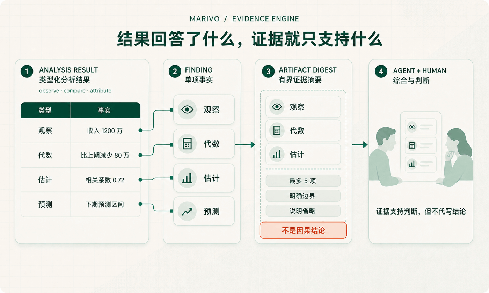

上一篇谈 Analysis DSL 时，我们停在了一份类型明确的分析结果上：`compare` 得到变化，`attribute`
得到数值贡献，`correlate` 得到统计关联。每一步做了什么、使用什么范围、产出什么，都已经说清楚。

但从这里到一句可以写进报告的话，中间还有一段很容易被忽略的距离。

假设一份归因结果显示，北区贡献了这次收入下降的大部分。Agent 很容易顺手写成：“收入下滑主要是
北区造成的。”这句话听起来自然，却比计算结果多走了一步。`attribute` 回答的是变化在各部分之间怎样分解，
并没有证明北区发生了什么，更没有证明某个业务动作导致收入下降。

结果没有错，错的是结果在转述时被悄悄扩大了含义。

Marivo 的 Evidence Engine（证据引擎）要守住的，就是这段距离。它不替 Agent 写结论，也不判断业务上
该采取什么行动。它做一件更基础的事：把分析结果里真正成立的事实提取出来，保留它们的身份、范围、
来路和使用边界，让 Agent 引用时知道“这份结果究竟支持到哪里”。

## 结果为什么还不等于证据

一张结果表当然可以作为依据，但如果直接把整张表交给 Agent，它仍然要临时回答几个问题：

- 最值得引用的是哪一行、哪个值；
- 这个值是观察到的、计算出来的，还是模型估计的；
- 它属于哪个 metric、时间范围和分组；
- 它由哪些输入、哪条计算规则得到；
- 当前展示是否省略了其他同样存在的结果；
- 这项结果明确不能证明什么。

这些问题如果只靠提示词提醒，约束会很脆弱。Agent 可能在这一轮记得“相关不等于因果”，下一轮却把
贡献写成原因；可能从表格里摘对了数字，却忘了数字只覆盖一个地区或一个月；也可能看到摘要中没有
某个分组，就误以为完整结果里也没有。

问题不在于 Agent 不会读表，而在于一张表同时装着数值、结构和许多没有直接写出来的使用条件。
Evidence Engine 把这些条件从阅读习惯变成运行时产出的明确对象。

它的主路径很短：

```text
分析结果 → 类型化事实（Finding）→ 有界证据摘要（ArtifactDigest）
```

`Finding` 是从某一份结果中提取出的单项事实，尽量保留原本的含义；`ArtifactDigest` 是面向当前阅读的
小型摘要，从这些事实中选择少量内容，同时说明边界和省略。至于怎样把多份证据串起来、是否足以形成
业务结论、接下来还要查什么，仍由 Agent 和业务负责人决定。



## 先分清：这个数是怎样知道的

很多分析误读，并不是数字抄错了，而是数字的性质被换掉了。

“收入是 1200 万”“比上期减少 80 万”“北区贡献了其中 50 万”“收入与折扣率的相关系数是 0.72”
都可以写成一行数值，但它们不是同一种事实。前者是观察，第二、第三个是按规则计算出的代数关系，
最后一个是统计估计。它们能够支持的句子不同。

Evidence Engine 因此不会把所有结果压成一个通用的“洞察”结构，而是沿用 Analysis DSL 的结果含义：

- `observe` 提取的是观察事实；
- `compare` 提取的是变化事实；
- `attribute` 和 `decompose` 提取的是数值贡献，不是原因；
- `correlate` 提取的是统计关联，不是影响；
- `hypothesis_test` 保留的是在指定检验下得到的统计判断，不是业务重要性；
- `forecast` 保留的是预测结果，不是已经发生的事实；
- `discover.*` 给出的是值得继续调查的候选，不是已经确认的异常。

这种区分看起来克制，实际很重要。只要证据仍带着“观察”“代数”“估计”“预测”或“候选”这样的
认识类型，Agent 就更难在转述时把它升级成另一种更强的说法。一个贡献值仍然可以进入结论，但结论
必须诚实地说“数值上主要来自北区”，而不能凭这一步直接写成“北区导致了下降”。

## 一份好摘要，必须承认自己没有展示全部

把整张表原样塞进上下文，不是可靠的证据设计。结果可能有几百行，Agent 真正需要先看到的通常只是
少量关键事实。可如果摘要只挑出“最重要的五条”，又不说选择规则和被省略的内容，它就会制造另一种
错觉：眼前这些就是全部。

Marivo 的 `ArtifactDigest` 是有界的。当前一份摘要最多保留五项事实和三条明确的推断边界。这个限制
不是为了假装问题简单，而是为了让一次读取的成本稳定。与普通摘要不同，它还会同时记录：保留了多少、
省略了多少、按什么规则选择，以及什么时候应该回到完整 Finding 或原始结果。

因此，“摘要里没有”与“结果里不存在”是两回事。假设一次按地区观察产生了二十个分组，摘要展示前
五个，同时明确还有十五个被省略。Agent 可以先用五项内容决定阅读方向；当问题涉及第六个地区，或者
需要核对完整分布时，再沿摘要给出的路径读取精确事实或完整 frame。

每份成功提交的分析结果都提供同一条读取路径：

```python
attribution.show()

print(attribution.evidence_status)
digest = attribution.evidence_digest
if digest is not None:
    digest.show()
```

`artifact.show()` 会先展示同一份有界证据摘要，再展示数据预览。它不是根据表格临时生成的一段说明；
代码读取的 `evidence_digest` 与人看到的是同一个对象。这样，Agent 和审阅者不会各自面对一套不同的
“摘要事实”。

## 边界不是免责声明，而是证据的一部分

技术报告常在结尾写一句“相关不代表因果”。这句话没有错，但它离具体数字太远，很容易在复制、压缩
或二次转述时丢失。

Evidence Engine 把边界放回每份证据旁边。不同操作有不同的禁止升级：

- 数值贡献不能直接升级为因果解释；
- 统计关联不能直接升级为影响关系；
- 候选不能直接升级为已确认异常；
- 统计检验不能直接升级为业务上重要；
- 预测不能当作观察到的结果。

这些边界并不阻止 Agent 继续调查因果。它们只是要求新的说法必须有新的证据。要从“北区贡献了主要
降幅”走到“北区的价格调整导致收入下降”，Agent 还需要检查价格变化、时间顺序、其他同时发生的因素，
并采用能够支持因果判断的方法。前一份归因结果仍然有价值，但它只能承担自己那一段论证。

这也是 Marivo 对“可追溯”的理解：不只是能找到数字来自哪张表，还要能看见数字在认识上属于什么，
以及它没有越过哪条线。

## 能追溯，不等于把所有细节都堆在眼前

真正的追溯发生在需要核查的时候。

每个 Finding 都带着稳定身份，指向自己的 session、源结果、业务对象和分析范围，并记录它是由哪条
规则、哪些源字段得到的。需要核对时，可以从摘要回到这一份精确事实，再回到生成它的结果：

```python
page = session.evidence.findings(
    artifact_ref=attribution.ref,
    limit=50,
)

finding = page.items[0]
trace = session.evidence.trace(finding.finding_id)
source = session.get_frame(attribution.ref)
```

这里有三种不同粒度的读取。摘要适合刚执行完一步分析时快速理解结果；Finding 适合精确引用一项事实；
trace 和源 frame 适合审阅推导规则、字段和完整数据。它们不是三套互相独立的记录，而是同一条链上的
不同入口。

证据也不会因为两个 metric 名字相同就跨调查自动合并。每项事实保留所属 session 和 artifact 的身份。
这是一个看似琐碎但必要的约束：一次促销复盘中的“收入下降”，不能因为名称相同，就与另一段时间、
另一套输入或另一次调查中的结果混成同一项事实。

## 证据不完整时，系统应该明确变得“不方便”

分析执行成功，不代表证据链一定完整。事实提取可能失败，摘要可能无法生成，持久化存储也可能出现
问题。如果系统仍返回一段看起来正常的说明，Agent 很难知道自己拿到的是完整证据还是降级结果。

Marivo 因此让每份分析结果明确给出三种状态：

- `complete`：当前证据提取与摘要完整提交；
- `partial`：只保留了部分证据，缺口会作为结构化 issue 暴露；
- `unavailable`：当前没有可用的证据摘要。

`partial` 不是“差不多可以用”，`unavailable` 也不是“没有发现问题”。它们都要求 Agent 缩小说法、
读取原始结果，或者先修复证据路径。相应地，查询得到一个空的 Finding 页面只表示健康的证据库中没有
匹配记录；如果证据库本身不可读，运行时会明确报错，不会用空列表掩盖故障。

这会让某些流程变得不那么顺滑，但可信分析需要这种不方便。证据链断了，就应该让断点可见，而不是
为了继续生成一段完整回答，把“无法核查”伪装成“没有异常”。

## Evidence Engine 不替 Agent 思考

如果证据引擎开始自动把多份结果拼成主张、给结论打置信分、安排后续步骤，它很快就会成为另一套隐藏
的分析 Agent。届时，系统又需要回答：这段综合依据什么业务背景，为什么选择这几份结果，哪些冲突被
忽略，又是谁决定调查已经足够？

Marivo 不把这些判断塞进 Evidence Engine。它只把单次分析动作的结果投影为可读取、可追溯、有边界的
事实。跨结果综合、因果解释、业务判断和下一步选择，仍然属于 Agent；结论是否符合组织的业务知识与
决策标准，最终仍需要业务负责人确认。

这不是把最难的问题留给用户，而是在划分两类完全不同的责任：

- 可以由运行时稳定重现的事实提取、身份、范围、推导和省略规则，应该由 Evidence Engine 负责；
- 依赖问题目的、业务背景和多份材料权衡的解释，应该留给 Agent 与人。

前者越确定，后者越有条件保持开放。Agent 不需要把精力花在重新辨认每个数字来自哪里，可以专注于
提出假设、发现证据冲突和决定下一步；人也不必接受一段无法拆开的“智能洞察”，而能回到具体事实核查。

## 证据守住了一步分析，但整条调查还没有闭合

回看这个系列，语义层先回答“我们谈论的收入、客户和业务时间究竟是什么”；Analysis DSL 回答“这一步
允许怎样观察、比较和归因”；Evidence Engine 则回答“这一步得到的每项事实究竟支持什么，又明确
不支持什么”。

这三层让一次分析动作有了清楚的起点、执行边界和证据边界。它不再只是从问题生成一段查询，再从查询
生成一段回答，而是先形成一条可以核查的局部路径：

```text
业务问题
  → 已确认的业务对象
  → 受约束的分析动作
  → 类型明确的结果
  → 有身份、有范围、有边界的证据
```

Evidence Engine 不是在分析结束后补一份日志。分析结果、Finding、digest 和 issue 会作为同一次分析
动作的产物共同提交；如果其中一部分失败，状态会留在结果上。证据因此不是事后根据结论寻找的佐证，
而是这一步分析自然留下的产物。

一套可信的分析系统，不应该让结论听起来尽可能强，而应该让每句话都准确停在证据能够支持的位置。
这份克制不会削弱 Agent。相反，它让 Agent 可以大胆探索，因为每一步探索都知道自己站在哪里、依据
什么，以及还没有证明什么。

但局部路径可以核查，还不等于整条调查已经闭合。证据能够被再次找到，还有一个前提：这次调查不能
随着一轮对话结束而散掉。真实分析很少一次完成。Agent 可能明天才继续，也可能在中途更换执行脚本；
对话上下文会缩短，分析结果却不能因此失去顺序、身份和彼此之间的关系。后来接手的 Agent 还需要知道
哪些动作已经做过、哪些结果仍然可用，以及应该
从哪里继续，而不是重新猜测整段过程。

这正是下一篇要讨论的 **Analysis Session**。Evidence Engine 让单份结果留下可以核查的事实，Analysis
Session 则让这些动作、结果和证据在多轮调查中保持同一条脉络。分析怎样跨越一次对话继续存在，又
怎样在恢复时只带回必要的上下文，是可信分析链上的下一道问题。

Marivo 的源码与最新进展可以在 [GitHub](https://github.com/chengxianglibra/marivo) 查看。想了解证据之前
的分析动作，可以回看上一篇 [Analysis DSL：约束分析动作，而不是约束 Agent 推理](/zh-cn/blog/analysis-dsl-constrains-actions-not-agent-reasoning/)；
想从一次实际运行开始，可以阅读[让 Agent 完成第一次分析](/zh-cn/docs/latest/first-analysis/)。

---

[返回 Marivo Blog](/zh-cn/blog/) · [阅读当前文档](/zh-cn/docs/latest/)
