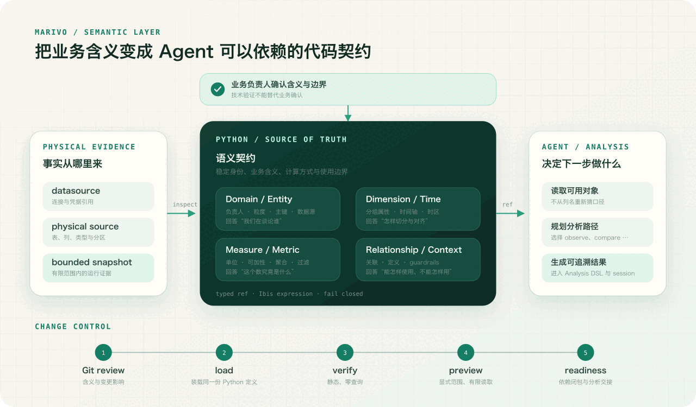

让 Agent 读取数据库结构并不难。真正困难的是：当它看到 `amount`、`status` 和 `created_at`
这些列时，凭什么知道“收入”该取哪一列、包含哪些状态、按什么时间归属，又能沿哪些维度拆分？

人也会面对同样的问题。区别在于，人通常知道自己不确定，会去找报表负责人或历史口径；Agent
擅长把零散线索迅速补成一个完整答案。它越聪明，越容易把“看起来像”变成“应该就是”。如果没有
一道稳定的边界，这种能力会同时放大分析效率和口径漂移。

所以，数据分析 Agent 需要的不是一份更长的提示词，而是一套可以被实际执行、检查和共同维护的
业务契约。Marivo 把这套契约放在语义层里。

## 问题不是 Agent 不懂表，而是表不懂业务

假设一家企业的订单表里同时有 `created_amount`、`paid_amount` 和 `settled_amount`。Agent 想回答
“上季度收入为什么下降”，至少要先做出这些选择：

- 收入在下单、支付还是结算时确认；
- 取消、部分退款和全额退款分别怎样处理；
- 时间归属使用创建时间、支付时间还是结算时间；
- 多币种金额在行级换算还是汇总后换算；
- 地区来自下单地址、履约仓还是销售组织；
- 这个指标能否跨天、跨地区直接相加。

这些答案可能出现在字段注释、旧 SQL、报表说明、财务制度和某位同事的经验里。数据库结构
能告诉 Agent 字段类型，样本能让它观察到常见取值，但两者都无法证明哪套规则获得了业务认可。
`paid_amount` 的值看起来最像收入，不代表它就是公司的收入。

更麻烦的是，很多错误不会让查询失败。两段 SQL 都能执行，也都能得到走势平滑的结果，只是采用了
不同口径。对一次演示来说，它们都像答案；对运营、治理或管理决策来说，它们不能同时成立。

### 提示词不能承担组织记忆

把定义写进 Agent 的提示词，可以改善一次对话，却解决不了长期一致性。

提示词会随入口、团队和模型变化；对话会结束；长上下文中的规则会被压缩；同一项定义可能被复制到
多个 skill 和 script，随后各自演进。更重要的是，提示词中的一句“收入排除退款”很难直接回答：
对应哪个实体、使用什么表达式、退款如何关联、采用哪条时间轴、这个定义是否仍能在当前数据源上执行。

知识库比提示词更适合沉淀长期信息，但它仍然不能独自承担这份责任。知识库保存的是供 Agent 检索和
解释的文字：相关内容可能没有被检索出来，互相冲突的多个版本也可能同时出现，而文档本身无法判断
某条规则是否适用于当前问题。即使“收入排除退款”被准确检索出来，文字也不会把收入绑定到特定的
entity、metric、表达式和时间轴，更无法在底层字段或计算已经失效时阻止分析继续。

这并不是说知识库没有价值。政策背景、定义理由、特殊情况和业务示例都很适合放在知识库里；但稳定
口径需要进入可执行的语义契约，由代码、版本和运行验证共同约束。知识库负责补充语境，语义层负责
提供能够被分析引用和检查的业务身份。

语义层的第一价值，不是让 Agent 知道更多，而是让它不能在不知不觉中换一套定义。Agent 可以决定
怎样调查收入下降，却必须通过同一个稳定身份引用收入；如果这份定义不存在或已经失效，系统应该停下，
而不是在当前对话里临时补一个看似合理的版本。

### 可以读取，不等于可以依赖

对 Agent 来说，“发现了一列”与“获得了一个可分析对象”是两件不同的事。

前者是物理观察：列存在、属于数值类型、样本里大多为正数。后者是一份承诺：它代表什么业务事实，
单位是什么，怎样聚合，适用什么时间轴，允许怎样拆分，以及谁对这份含义负责。只有后者才能成为分析
过程中稳定的输入。

这也是为什么语义层不是数据库目录的另一种展示方式。目录帮助 Agent 找到数据，语义层决定哪些业务
对象已经具备可复用的身份和边界。它把“这次大概这样算”变成“团队明确同意这样定义，并且运行时能
验证这份定义”。

## 语义层应该怎样抽象

一种常见做法是从字段出发：给每一列补充名称、说明和标签。这样能改善搜索，但很容易把语义层做成
一份更漂亮的数据字典。Marivo 的出发点不同：**先问下游分析需要依赖哪些稳定承诺，再决定应该抽象
哪些对象。**

一次分析至少需要回答六类问题：

1. 我们在谈论哪个业务领域、哪类业务实体；
2. 一行数据代表什么，实体如何识别、是否带有版本；
3. 可以按什么属性和时间轴观察；
4. 数值代表什么、怎样聚合、单位和可加性是什么；
5. 多个实体如何关联，怎样避免连接放大；
6. 这份定义适用于什么问题，又有哪些明确限制。

Marivo 因此没有把语义压缩进一个巨大的“指标”对象，而是让不同对象承担不同责任。



图中最重要的不是中间有多少种对象，而是三条边界：datasource 提供物理事实，业务负责人确认业务
含义，语义层把两者组织成可执行契约；Agent 拿到稳定 ref 后规划分析，但不再从列名重新发明口径。

### 第一层约束：身份、责任与分析总体

`Domain` 是业务命名空间，也是责任边界。Marivo 要求 domain 有明确的 `owner`，因为“技术上能够
计算”不能回答“谁有权确认这项定义”。owner 不是装饰性元数据；它提醒团队，语义正确性最终有明确
的业务责任人。

`Entity` 则说明分析对象怎样落到物理数据上：它来自哪个 datasource、对应哪张表或文件、一行代表
什么、主键是什么，以及是否采用 snapshot 或有效期版本。主键不能因为样本里暂时唯一就被自动认定；
一行的业务粒度也不能只靠表名猜测。这些都是后续关联、去重和指标计算的基础承诺。

这层约束首先防止 Agent 分析错对象。例如，同样名为 `orders` 的表可能分别代表订单、订单行和订单
状态快照。如果没有明确 entity，Agent 即使选对金额列，也可能因为一笔订单出现多行而把收入放大。
稳定 ref 让它引用的是已确认的业务对象，而不是“当前最像订单的表”。

### 第二层约束：范围、维度与时间

普通 dimension 表示可以分组或过滤的业务属性。time dimension 不是一个名字里带有 `date` 的普通
字段，而是一条明确的时间轴：它有最细粒度、解析方式、时区和是否为默认轴。把时间单独建模，是因为
绝大多数“看起来差不多”的分析错误，都发生在时间边界上——自然日与财务日、事件时间与写入时间、
UTC 与业务时区并不等价。

维度约束的不是 Agent 能否写出 `GROUP BY`，而是哪些切分具有业务含义。地区究竟来自客户归属、订单
地址还是履约仓，需要在语义层中成为不同对象；完成时间、支付时间和写入时间也不能因为类型相同就
互换。Agent 可以选择当前问题需要的轴，但不能把未声明字段临时提升成受治理维度。

业务总体也属于这层边界。哪些状态被纳入、测试数据是否排除、snapshot 读取哪个版本，应当进入
entity、字段或 metric 的定义，而不是藏在一次查询的临时过滤里。这样，同一 ref 在不同分析中仍然
指向同一总体。

### 第三层约束：数值含义与计算规则

Measure 是行级数值事实，它拥有单位与可加性。一个金额字段是否能跨时间或实体直接相加，不应留给
每次查询临时判断。Marivo 先声明 measure，再由 metric 聚合它，使“原始数值是什么”和“业务指标
怎样计算”保持分离。

Metric 组合 measure、聚合、过滤条件和业务上下文，形成下游可以稳定引用的数值。它可以是求和、
计数、加权均值，也可以由已有 metric 组成比率或线性关系。只有现有构建器无法表达时，才使用自定义
Ibis 表达式。

这种分层看起来比在 SQL 中写一个 `SUM(...)` 更繁琐，但它保留了 SQL 经常抹平的信息：这个总和从
哪个行级事实而来、单位是什么、能否继续聚合、过滤规则属于业务定义还是本次分析、派生指标依赖了
哪些已确认指标。下游拿到的不只是一个数，而是一条仍然带着结构的定义。

Ibis 给这层契约保留了必要的计算弹性。简单指标使用 `ms.aggregate(...)` 等构建器；需要行级条件、
空值处理、类型转换或多列计算时，可以用受限的装饰器函数返回 Ibis 表达式。Marivo 再把表达式编译到
具体 backend。Agent 因而不必在“只能使用预置指标”和“任意生成 SQL”之间二选一：复杂业务计算可以
进入语义层，但它仍然带有明确实体、依赖、单位、可加性和稳定身份。

### 第四层约束：关联、基数与时间结构

只定义单表指标还不够。跨实体分析需要 relationship 明确关联键和基数，否则 Agent 很容易在
一对多连接中放大指标。Metric 的 root entity 与 fanout policy 进一步说明哪一侧是保留总体、遇到
不安全连接时应该拒绝还是先聚合。Agent 可以沿已声明关系扩展调查，却不能为了得到结果随意拼接表。

对于财务周期、活动窗口、工作日、业务事件和状态变化，Marivo 也倾向于把稳定、可复用的业务结构
显式建模，而不是让每次分析重新解释日期或事件顺序。这些对象约束的是业务时间与业务过程，不只是
某一列怎样解析。

### 第五层约束：使用边界与运行验证

并非所有业务约束都能变成机械规则。`ai_context.business_definition` 解释对象真正代表什么，
`guardrails` 说明它不适合怎样使用。它们不会神奇地证明业务口径正确，也不替业务负责人审批；它们
让 Agent 在选择对象和解释结果时能够看见这些限制，而不是只看到一个容易误用的名字。

机械上可以证明的部分，则交给运行时：带种类的 ref 限制依赖类型，loader 检查对象结构和依赖图，
`verify` 检查静态契约，`preview` 用有界数据确认表达式能够物化，`readiness` 检查依赖闭包并给出可进入
分析的对象。任何一层无法证明成立时，Marivo 都应该明确停止，而不是让 Agent 静默换列、改口径或
绕过约束。

因此，语义层约束 Agent 的方式不是“告诉它一份正确答案”，而是逐层缩小它可以合理声称的范围：
只能从已确认身份开始，只能使用有业务含义的轴，只能按声明的计算与关联规则执行，并且必须把无法
机械判断的业务限制保留给 Agent 和负责人。语义层不能自动保证分析符合业务需求，但它能让偏离需求
的关键选择暴露出来，并在可以验证的地方拒绝偏离。

判断一个东西是否应该进入语义层，可以用一个简单标准：**它是否代表已经确认、会被不同分析反复依赖
的业务含义？** 如果答案是肯定的，就不应该只存在于某段 SQL 或某次对话中。

反过来，一次调查的假设、临时比较区间、图表选择、当前异常点和最终解释，不属于语义层。它们属于
分析计划、analysis session 和 evidence。语义层定义可依赖的“名词”和计算边界，Data Analysis DSL
负责对这些对象采取“动作”。把两者混在一起，会让稳定定义被一次性问题污染，也会让分析动作躲进
无法审查的指标代码里。

## Marivo 的语义契约是什么样子

下面是一份刻意简化的定义。它没有试图展示所有 API，而是展示几种责任怎样连接起来：

```python
# models/semantic/sales/_domain.py
import marivo.datasource as md
import marivo.semantic as ms

ms.domain(
    name="sales",
    owner="Mina Zhang",
    ai_context=ms.ai_context(
        business_definition="已完成订单的销售分析域。",
        guardrails=["收入定义变更必须由财务负责人确认。"],
    ),
)

orders = ms.entity(
    name="orders",
    datasource=ms.ref.datasource("warehouse"),
    source=md.table("orders"),
    primary_key=["order_id"],
    ai_context=ms.ai_context(
        business_definition="每行代表一笔订单。",
        guardrails=["不要把订单行表直接关联进来放大金额。"],
    ),
)

region = ms.dimension_column(
    name="region",
    entity=orders,
    column="sales_region",
    ai_context=ms.ai_context(
        business_definition="订单确认时所属的销售区域。",
        guardrails=["未知区域不是一个真实业务区域。"],
    ),
)

completed_at = ms.time_dimension_column(
    name="completed_at",
    entity=orders,
    column="completed_at",
    granularity="day",
    is_default=True,
    ai_context=ms.ai_context(
        business_definition="订单完成收入的默认归属时间。",
    ),
)

gross_amount = ms.measure_column(
    name="gross_amount",
    entity=orders,
    column="gross_amount_cny",
    additivity="additive",
    unit="CNY",
    ai_context=ms.ai_context(
        business_definition="订单完成时确认的含退款前金额。",
    ),
)

refund_amount = ms.measure_column(
    name="refund_amount",
    entity=orders,
    column="refund_amount_cny",
    additivity="additive",
    unit="CNY",
    ai_context=ms.ai_context(
        business_definition="已确认应从收入中扣除的退款金额。",
    ),
)

gross_revenue = ms.aggregate(
    name="gross_revenue",
    measure=gross_amount,
    agg="sum",
    ai_context=ms.ai_context(
        business_definition="按订单完成时间确认的退款前收入。",
        guardrails=["不能作为净收入使用。"],
    ),
)

@ms.metric(
    name="revenue",
    entities=[orders],
    additivity="additive",
    unit="CNY",
    ai_context=ms.ai_context(
        business_definition="按订单完成时间确认、扣除退款后的净收入。",
        guardrails=["不用于衡量支付流水或下单金额。"],
    ),
)
def revenue(order_rows):
    return (
        ms.bind(gross_amount, order_rows)
        - ms.bind(refund_amount, order_rows).fill_null(0)
    ).sum()
```

这里有几个刻意的选择。

首先，语义身份来自显式 `name`，对象之间通过带种类的 ref 连接。分析层引用的是
`metric:sales.revenue` 这样的稳定身份，而不是 Python 文件路径，也不是 Agent 当时记住的变量名。

其次，业务说明集中在固定结构的 `ai_context` 中。`business_definition` 解释它是什么，
`guardrails` 说明不能怎样使用。自由文本仍然重要，但它被附着在明确对象上，不再是一段与执行定义
分离的知识库文字。

再次，`unit`、`additivity`、默认时间轴和主键都必须显式表达。Marivo 不从字段名或样本推断这些
承诺。推断可以帮助 Agent 提出问题，不能直接成为项目定义。

最后，`gross_revenue` 展示了常见聚合可以怎样直接组合，装饰器形式的 `revenue` 则展示了 Ibis
表达式带来的弹性：它在行级把退款空值处理为零、计算净额，再进行聚合。实际定义还可以使用 Ibis
完成条件、类型转换和其他多列表达式，由 Marivo 编译到目标 backend，不必为每一种计算新增专用
构建器。

这种弹性仍在契约之内。`@ms.metric` 必须显式声明所依赖的 entity、结果单位和可加性；字段通过
`ms.bind(...)` 绑定到 entity 参数；函数体只能包含一个返回 Ibis expression 的 `return`。Marivo
保留的是表达业务计算所需的自由，而不是让任意 Python 逻辑逃过审查。

## 应该如何管理语义层定义

语义层不是生成一次就结束的元数据，而是一项会随业务规则、数据结构和系统版本持续变化的协作资产。
管理它的关键不是选择一种看起来简洁的配置格式，而是始终回答三个问题：当前定义以什么为准，变更
怎样被审查，定义与真实运行环境不一致时怎样被及时发现。

### Python 是唯一事实来源

Marivo 把 `models/` 下的 Python 文件作为语义定义的唯一事实来源。这样做并不是因为 YAML 无法描述
指标，而是因为 Python 同时适合人和 coding Agent 维护：对象有明确类型，ref 可以在加载时解析，
Ibis 可以表达跨 backend 的计算，普通代码工具也能展示依赖和 diff。

Python 的开放性由 Marivo 的对象形状、受限表达式函数体和失败即停止的 loader 收紧。团队维护的是
一组声明式业务对象，不是散落在项目里的任意业务脚本。一个典型项目可以保持这样的结构：

```text
marivo.toml
models/
  datasources/
    warehouse.py
  semantic/
    sales/
      _domain.py
      orders.py
      customers.py
scripts/
  check_semantics.py
```

凭据是明确的例外。项目只保存 `*_env` 引用，不把密码写进模型；`.marivo/` 中的运行状态、preview
证据和本地缓存也不是定义本身。Python 定义可以跨环境共享，当前环境的认证需要在当前环境重新建立。

### Git 让业务变化成为可审查的 diff

语义定义应该和应用代码一样进入 Git，通过分支和合并请求修改。审查者需要看到的不只是 Python 能否
运行，还包括：业务定义和 guardrails 改了什么，负责人是否确认，计算、时间轴与总体是否变化，哪些
下游 metric 会受影响。

Git 不替代业务审批，也不证明数据仍然符合定义。它的价值是让一次审批、一次 CI 结果和一次线上分析
都能指向同一版代码。出现争议时，团队可以回到精确版本检查当时的含义，而不是比较几份已经分叉的
文档和提示词。

### 语义模型与 skill、script 如何保持一致

定义漂移往往不是语义模型内部出现了两种说法，而是同一条业务规则被复制到了不同载体中：语义模型
定义一份，skill 为了指导 Agent 又描述一份，检查 script 为了方便再实现一份。几份内容在创建时可能
完全一致，但只要其中一处单独变化，Agent 的工作方式、自动检查和实际运行的语义契约就会开始分叉。

Marivo 的做法，是让语义模型成为业务含义的唯一事实来源：entity、field、metric、关系、时间语义和
guardrails 都只在 `models/` 下的 Python 对象中定义。skill 不复制这些定义，而是告诉 Agent 应该按照
什么顺序发现、验证和使用语义对象，并通过 `marivo.help(...)`、`.show()`、`.contract()` 和公开 ref
读取当前版本的契约。script 同样加载这组语义模型，只负责执行可重复的机械检查，不另写一套指标公式、
字段映射或构造参数。

这也决定了三者应该怎样一起维护。业务口径变化时，先修改语义模型；如果变化影响 Agent 的工作流程，
再同步调整 skill；如果需要增加自动验证范围，再调整 script。三类修改放在同一个 Git 变更中审查，
skill 和 script 引用的 ref 也应由 CI 对当前语义模型进行验证。这样，skill 可以要求“先 verify，再
preview”，script 可以检查 `sales.revenue` 是否仍然可用，但它们都不会各自保存一份可能过期的
revenue 定义。一致性不再依赖维护者手工同步几段相似文字，而来自它们共同读取并验证同一份语义模型。

### 用 CI 阻止定义悄悄漂移

CI 的重点不是证明业务含义永远正确，而是阻止已经批准的定义在变化中失去一致性。这里至少有两类
漂移需要防范。第一类是契约漂移：ref 或依赖丢失、表达式与类型变化、物理字段变化，或者对象已经
无法完成分析交接。每个合并请求都应 load 项目、verify 受影响对象，并对关键 ref 运行 readiness。

第二类更隐蔽：语义模型仍然能够正常加载和执行，但指标口径已经改变。比如收入从“实付金额减退款”
退化成了“实付金额”，结构检查未必会失败。对这类变化，CI 应使用受控的实际数据 snapshot 或经过业务
确认的代表性测试数据执行 preview，并断言关键指标的结果。测试数据要覆盖退款为空、订单取消、时间
边界等会改变业务含义的情况；预期结果则应由业务规则独立确认，不能根据当前指标表达式临时生成。

```python
import marivo.semantic as ms


def test_critical_semantics(orders_snapshot):
    catalog = ms.load()
    revenue = ms.ref.metric("sales.revenue")

    assert catalog.verify(revenue).status == "passed"
    assert not catalog.readiness(refs=(revenue,)).blockers

    preview = catalog.preview(revenue, using=orders_snapshot)
    assert preview.status == "passed"
    assert preview.rows == ({"value": 751.5},)
```

这里的 `orders_snapshot` 可以来自 CI 有权访问的实际 datasource，也可以是从实际业务场景中固化下来的
小型数据集。关键不在于数据量，而在于输入稳定、边界情况明确、预期结果经过审查。这段测试只引用
`sales.revenue`，没有复制收入公式，却能在公式变化导致结果偏离时直接失败。

业务负责人修改 Python 定义后，Git 保留变化，CI 同时验证新的依赖闭包和关键指标结果。如果确实要
改变口径，就应连同测试预期一起提交并解释原因；如果只是无意中改坏了计算，合并会明确失败。CI 由此
成为防止定义漂移的持续反馈，而不是另一套语义来源。

## 语义层应该怎样构建

如果语义不能从元数据自动推导，是否只能靠人从头手写？也不是。Marivo semantic authoring 的设计，
是让 Agent 处理证据收集、技术起草和验证，把真正无法由数据回答的判断留给业务负责人。

它采用一个有意保持简短的写入—运行—读取循环：

```text
确认目标与负责人
  → inspect 与有界 snapshot
  → 一次定义一个对象
  → load / verify / preview
  → readiness
```

开始之前，Agent 先确认 domain owner、目标业务概念和数据无法回答的政策规则；之后才 inspect 物理
结构，并在明确 scope、行数与超时下取得一份可复用 snapshot。观察到的类型、取值和唯一性只是起草
证据，不能自动升级为单位、主键、时区或业务总体。

定义按依赖顺序一次完成一个对象。每次保存后重新 load 精确对象，先做零查询 verify，再用同一份
snapshot 做 preview，最后通过 readiness 检查依赖闭包。失败就修复当前对象，不批量生成一整套
“看起来合理”的模型后再统一处理问题。

这里仍要保留三种不同判断：load 成功只说明项目能装载；readiness 说明技术依赖可以交给分析；业务
含义是否正确，仍由负责人确认。Marivo authoring 的价值不是自动发明语义，而是让 Agent 高效完成
可观察、可重复的技术工作，并在真正需要业务判断时诚实停下来。

## 从语义对象进入 Data Analysis DSL

语义层解决了“收入是什么”，下一步才是“对收入做什么”。Agent 从 session catalog 取得当前 metric
与 dimension，把它们直接交给 Marivo Data Analysis DSL：

```python
import marivo.analysis as mv

session = mv.session.get_or_create(
    "revenue-review",
    question="2026 年第二季度收入为什么下降？",
)
revenue = session.catalog.metrics.get("sales.revenue")
region = session.catalog.dimensions.get("sales.orders.region")

frame = session.observe(
    revenue,
    time_scope=mv.time_scope(start="2026-04-01", end="2026-07-01"),
    grain=mv.grain("month"),
    dimensions=[region],
    analysis_purpose="先确认收入走势与地区分布",
)
frame.show()
```

这个调用看起来很短，但 DSL 不只拿到两个列名。它会沿 ref 解析 revenue 的计算和依赖，确认 region
是否属于可达实体，使用声明的时间轴、单位、可加性和 relationship 约束当前动作；不安全的 grain、
维度或连接不会因为 Agent 能写出 SQL 就被接受。

语义层保存稳定业务含义，Data Analysis DSL 表达当前调查动作。二者通过 typed ref 相连，让 Agent
仍然可以自由决定先观察、比较还是拆分，同时保证每一步都没有脱离已经确认的业务契约。

下一篇会继续讨论 Data Analysis DSL：为什么 Agent 不应该把所有分析动作重新降级为自由 SQL，类型化
操作又怎样在不规定固定工作流的前提下，保留比较、拆分、归因与证据之间真正重要的差异。

Marivo 的源码与最新进展可以在 [GitHub](https://github.com/chengxianglibra/marivo) 查看；如果你想看
这份语义契约如何进入一次真实分析，可以从[让 Agent 完成第一次分析](/zh-cn/docs/latest/first-analysis/)开始。

---

[返回 Marivo Blog](/zh-cn/blog/) · [阅读当前文档](/zh-cn/docs/latest/)
