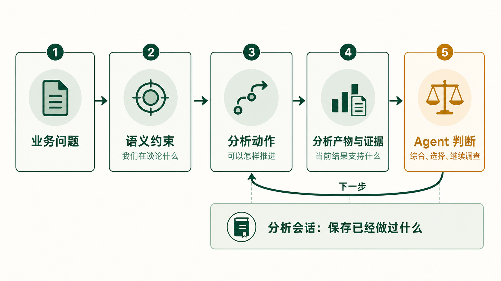
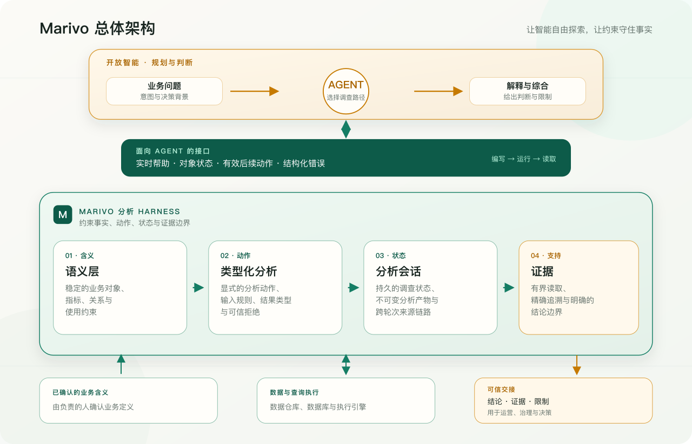

把数据库结构交给一个语言模型，让它把问题翻译成 SQL，已经可以完成不少令人印象深刻的演示。
用户问“上季度收入为什么下降”，Agent 找表、写查询、画图，再给出一段解释。整个过程看起来
很完整，甚至像是分析已经结束了。

但只要这段结果真的要进入一次业务决策，问题就会变得麻烦。

这里的“收入”究竟指支付金额、确认收入，还是扣除退款后的净收入？“上季度”按自然日、财务日历，
还是业务所在时区计算？订单和退款如何关联？同比比较是否对齐工作日？某个地区贡献了大部分降幅，
能不能因此说它是下降的原因？几天后继续追问时，Agent 是否还知道当时用了哪套定义、执行过哪些
步骤，又留下了哪些没有验证的判断？

这些并不是 SQL 语法问题。SQL 可以完全正确地执行，同时回答了一个定义不清的问题。

Marivo 就是从这里开始的。它不试图发明另一种让模型更容易写 SQL 的方式，而是把数据分析看作一项
持续的调查：问题会被逐步澄清，结果会成为下一步的输入，重要选择需要显式留下来，结论必须能回到
产生它的证据。Agent 可以决定往哪里走，但不能悄悄改变路标。

## 当分析开始产生业务后果

如果一次分析只用于个人探索，结果有偏差，代价可能只是多花一点时间。企业里的分析通常不是这样。
它可能决定下一轮运营活动投向哪些用户，某项治理规则是否收紧，一个地区是否追加预算，或者管理层
是否调整资源和目标。一旦分析结果进入这些流程，它就不再是一段供人参考的回答，而是后续行动的依据。

这时，“听起来合理”远远不够。接收分析的人需要知道：使用了什么业务口径，数据范围是什么，经过了
哪些分析步骤，结论由哪些结果支持，哪些部分只是 Agent 的判断，出现争议时能否回到当时的分析状态
重新检查。否则，组织看似获得了更快的分析能力，实际上只是更快地把未经验证的假设传递给更多人和
更多系统。

可信并不意味着系统替人保证结论永远正确，可追溯也不等于多保存几份日志。真正重要的是，分析中的
关键选择没有被隐藏，计算事实和解释判断能够区分，结果可以回到来源，限制能够被看见。只有这样，
运营人员才能据此行动，治理人员才能检查规则，决策者也才能判断这份结论是否足以承担相应后果。

这正是 Marivo 在企业场景中的必要性。当 Agent 的分析结果要从对话走向运营、治理和决策时，中间需要
一道可信的分析交接。Marivo 要提供的不是更多答案，而是让答案以可检查、可恢复、可追溯的方式进入
业务流程。

## 分析不是一次查询

把自然语言转换成 SQL，解决的是一个重要但局部的问题：如何让数据库执行用户表达的查询意图。
真正的分析通常比这条链路长得多。

一次可信的分析至少包含几类不同的选择：

- 业务对象是什么，指标代表什么，哪些记录应当纳入；
- 应该观察哪个时间范围，怎样与基准期对齐；
- 当前结果适合继续比较、拆分、归因，还是只能停下来披露限制；
- 中间结果如何保存，稍后如何恢复，哪些步骤需要重新执行；
- 数据支持了什么事实，又有哪些判断仍然来自 Agent 或业务人员。

如果这些选择都埋在一段临时 SQL 和随后的自然语言里，系统最多保存了“答案”，却没有保存这次分析。
下一次追问只能依赖对话上下文，或者从头再做一遍。更棘手的是，用户往往看不出哪些内容来自数据库，
哪些来自统计操作，哪些只是模型读数据后给出的解释。

因此，Marivo 的基本单位不是查询，也不是消息，而是一个有状态的分析步骤：它从经过治理的
语义输入开始，通过类型明确的操作产生不可变结果，结果连同来源链路和证据保存在分析会话中。
Agent 读完结果，再决定下一步。

这不是一条只能执行一次的流水线。Agent 读取分析产物和证据后，可以回到分析动作继续调查；分析会话
则保存已经完成的步骤，使下一轮不必依赖对话重新推测此前发生了什么。

这条循环看起来比“提问—回答”多了一些结构。多出来的部分不是为了让分析显得复杂，而是为了把原本
就存在、却经常被隐藏的选择放到可以检查的位置。

## 自主性与约束并不矛盾

设计数据分析 Agent 时，很容易在两个方向之间摇摆。

一个方向是尽量开放：允许 Agent 读取所有表、自由写 SQL、自由解释结果。这种方式适应性很强，
却把正确性寄托在每一次提示词和每一次模型判断上。同一个问题换一种问法、换一个模型，甚至只换
一次上下文，都可能得到口径不同的答案。

另一个方向是把分析做成固定工作流：预先规定先查询什么，再拆哪个维度，最后套用一份报告模板。
这样容易控制，却很难覆盖真正开放的问题。调查之所以是调查，正是因为下一步往往要等当前结果出来
以后才能决定。

Marivo 选择在两者之间划一条更具体的边界：**运行时约束事实和动作，Agent 保留规划与判断。**

运行时负责确保指标引用存在、输入类型匹配、比较方式明确、分析产物可以追溯、证据按确定规则生成；
Agent 负责理解用户意图、选择分析路径、综合多个结果，并判断什么时候已经足以回答问题。业务负责人
则负责确认数据本身无法回答的事情，例如“收入”应该采用哪种业务口径，以及这个结论能否用于当前
决策。

这三种责任不能互相代替。技术验证通过，不等于业务含义已经获批；Agent 给出了合理解释，不等于
运行时已经证明因果；用户批准了指标定义，也不保证每一种未来查询都一定能够执行。

合起来看，Marivo 的总体架构分开了三种责任：由负责的人确认业务含义，Agent 负责规划和解释，
Marivo 运行时约束真正执行过的分析。面向 Agent 的接口让这条边界在工作过程中始终可见；四块基础
则把定义、动作、状态和证据连接起来，使分析能够带着依据和限制，交给后续运营、治理与决策流程。

## 四块基础，以及把它们连起来的接口

Marivo 目前把这套分工落实在四个相互衔接的部分中：语义层、类型化分析语言、分析会话和证据引擎。
它们不是四项平行功能，而是一条分析路径上的四种责任。更准确地说，它们分别回答四个问题：我们在
谈论什么，可以怎样推进，已经做过什么，以及当前结果究竟支持什么。

### 语义层：先确定在谈论什么

数据库表结构告诉我们列名和类型，却无法单独说明一个字段的业务含义。即使样本数据看起来很像
订单金额，也不能由此推导它是否含税、是否包含取消订单、采用哪个业务时间，以及能否跨实体直接求和。

语义层首先要解决的，不是如何让模型获得更多背景，而是如何让业务含义不再依赖某一次对话。一个
已经确认的指标，不应该因为提示词换了写法、模型换了版本，就在下一次分析中获得另一种解释。它需要
存在于对话之外，能够被团队共同维护，也能够在真正执行分析时接受检查。

Marivo 因此把业务语义作为由代码管理的契约。这里使用代码，不是要求业务人员学习 Python，而是为了
让定义可以被版本管理、审查和验证。Agent 可以根据数据源证据起草定义，却不能把样本中的表面规律
自动升级成业务事实；由负责的业务人员确认含义，运行时检查这份定义在技术上是否成立。

语义层的价值不是替查询增加一份注释，而是让后续分析不必在每段 SQL 中重新猜测指标、关联和使用
约束。它把“我们正在分析什么”从上下文里的临时约定，变成一份跨模型、跨会话仍然有效的公共契约。
它追求的不是自动理解一切，而是让真正影响结论的含义不再被悄悄改写。

### 类型化分析语言：让重要动作显式出现

有了稳定的语义，仍然需要回答“接下来做什么”。开放式业务问题没有固定解法，Agent 必须保留根据
当前结果改变方向的自由；但这并不意味着每一步都应该退回自由编写的 SQL。比较两个时期、寻找异常、
计算代数贡献，本身具有不同的前提，也支持不同强度的结论。

类型化分析语言的目标，是把这些重要差异保留下来。一次分析动作应当清楚说明它接收什么、采用什么
比较规则、产生哪一类结果，以及这种结果还能进入哪些后续分析。假如某种组合没有可信的含义，系统
应当明确拒绝，而不是为了让流程继续，临时拼出一段看似合理的查询。

这里的类型不是为了把分析变成固定流程。恰恰相反，Marivo 希望 Agent 能够自由规划，但每个真正执行
的动作都有明确边界。运行时说明当前结果是什么、还能够接到哪里；Agent 决定哪一步值得做，什么时候
应该停下来确认问题。自由存在于调查路径中，约束存在于每一步实际声称完成的事情中。

### 分析会话：保存调查，而不只是保存输出

分析很少一次完成。它可能跨越多个脚本和进程，也可能在看到结果后改变方向。只保存最后一张表，
无法解释这张表如何产生；只保存聊天历史，又无法可靠恢复真实的计算对象。

分析会话的设计目标，是把调查记忆从模型上下文中拿出来。问题、已经执行的步骤、中间结果和它们的
来源关系，都应该成为独立于对话的运行时事实。这样，无论一次分析跨越多少轮对话，甚至换了模型或
进程，后来者都可以从已经确认的状态继续，而不是根据聊天记录重演整段分析。

因此，分析会话不是对话记忆的另一种叫法。对话保存“我们说过什么”，分析会话保存“系统实际做过
什么”。Agent 对结果的解释可以修正，调查方向可以改变，但已经产生的分析事实不应随叙述一起变化。
这使分析能够恢复、复查和继续，也使模型本身成为可以替换的参与者，而不是唯一的记忆载体。

### 证据引擎：停在判断之前

一个分析系统如果只保存完整结果表，Agent 每次都需要重新读取和概括；如果直接替 Agent 生成结论，
又很容易越过计算真正支持的范围。

证据引擎试图同时解决两个看似矛盾的问题。Agent 的上下文有限，需要快速读懂当前结果；审计和复核
却要求保留精确、完整的依据。Marivo 不在两者之间二选一，而是把日常读取和精确追溯分开：平时提供
有界的证据摘要，出现争议或需要核实时，再回到完整结果和来源链路。

这里最重要的设计不是“自动总结”，而是克制。代数贡献仍然只是贡献，不能自动升级成原因；相关关系
不是因果；异常检测得到的是等待复核的候选；统计显著也不等于业务重要。证据引擎记录运行时能够
确定的事实，同时明确它没有支持的推断。

它追求的也不是替 Agent 写一份更快的报告，而是建立一条清楚的认识边界：哪些话可以由计算直接说，
哪些话必须由 Agent 结合多个结果判断，哪些话最终需要业务人员承担。只有先把这条边界守住，所谓
“可审计”才不只是能够找到一张旧表。

### 面向 Agent 的接口：让边界在运行时可见

上面的设计如果只存在于文档里，对 Agent 的帮助十分有限。它需要在实际运行时知道：手里的对象是什么，
应该怎样读取，接下来能做什么，失败后如何修复。

因此，Marivo 希望公开对象能够说明自己的身份和状态，也能够指出机械上成立的后续动作；错误不只
报告失败，还应该说明系统期待什么、实际收到了什么，以及可以怎样修复；`marivo.help(...)` 则必须
反映当前安装版本的真实接口，而不是一份可能已经过期的说明。

工作流程指引、静态接口说明、对象的当前状态和错误修复分别由不同层负责。这样做的目标不是增加更多
帮助入口，而是让每一层只回答自己真正知道的事，避免文档、提示词和运行时逐渐分叉。至于这些接口
如何组织，会在后面的实时帮助与接口设计文章中详细讨论。

## 让智能自由探索，让约束守住事实

从实现上来说，Marivo 是一个 Python 库。它不负责编排 Agent，而是一套连接语义、分析、状态与证据的
运行支撑。它与 Agent 的关系更接近试验设备中的线束和夹具：不替操作者决定实验目的，却把电源、信号、
测量点和安全边界连接到确定的位置。

对数据分析 Agent 来说，这意味着几件事：

- 它可以自由决定调查方向，但使用的是经过确认的业务对象；
- 它可以根据结果改变计划，但每一步都产生可恢复的类型化分析产物；
- 它可以综合证据并给出判断，但不能把运行时没有证明的内容伪装成系统事实；
- 它可以在错误后继续工作，因为错误和对象都提供真实、有限的后续动作；
- 模型、对话界面和 Agent 框架可以更换，语义契约与分析记录不必随之重建。

这种基础设施不会让每个答案自动正确。它做的是一件更朴素的事：当答案可能影响决策时，让我们能够
看见它依赖了什么、做过什么，以及在哪一步从计算事实进入了人的判断。对企业而言，Harness 的价值
也正在这里：它让 Agent 的分析不只停留在一次对话中，而是能够作为一份有依据、有边界的分析结果，
安全地交给后续运营、治理和决策流程。

## Marivo 不打算替代什么

把边界说清楚，比罗列能力更重要。

Marivo 不调用语言模型，也不规定 Agent 应该使用哪种模型或编排框架。它不替业务负责人批准指标含义，
不把就绪检查当作审批系统，不保证一次技术检查能够覆盖所有未来查询。它不禁止 SQL；在需要临时
探索时，直接编写 SQL 仍然有价值，只是这种结果不能假装拥有类型化语义链路。它也不自动把多个分析产物
综合成一个业务结论，因为综合必然涉及问题背景、证据权重和判断。

这些限制并不是尚未实现的功能列表，而是有意保留的责任边界。一个系统承担得越多，就越容易让本来
应该显式确认的选择变得不可见。

## 接下来

这篇文章只画出了整体轮廓。后面的文章会分别展开其中最难的几个问题：语义为什么不能从元数据自动
推导；类型化分析语言怎样在灵活性和约束之间取得平衡；分析会话如何保存一项调查的真实状态；
证据为什么必须停在 Agent 判断之前；以及实时帮助、结果对象、结构化错误和工作指引如何组成一套
不容易失真的 Agent 接口。

下一篇从语义层开始。因为在分析“为什么收入下降”之前，我们首先得诚实地回答：这里所说的收入，
究竟是什么。

Marivo 的源码与最新进展可以在 [GitHub](https://github.com/chengxianglibra/marivo) 查看；如果你想了解
这些设计如何落到一次实际分析中，可以从[让 Agent 完成第一次分析](/zh-cn/docs/latest/first-analysis/)开始。

---

[返回 Marivo Blog](/zh-cn/blog/) · [阅读当前文档](/zh-cn/docs/latest/)
